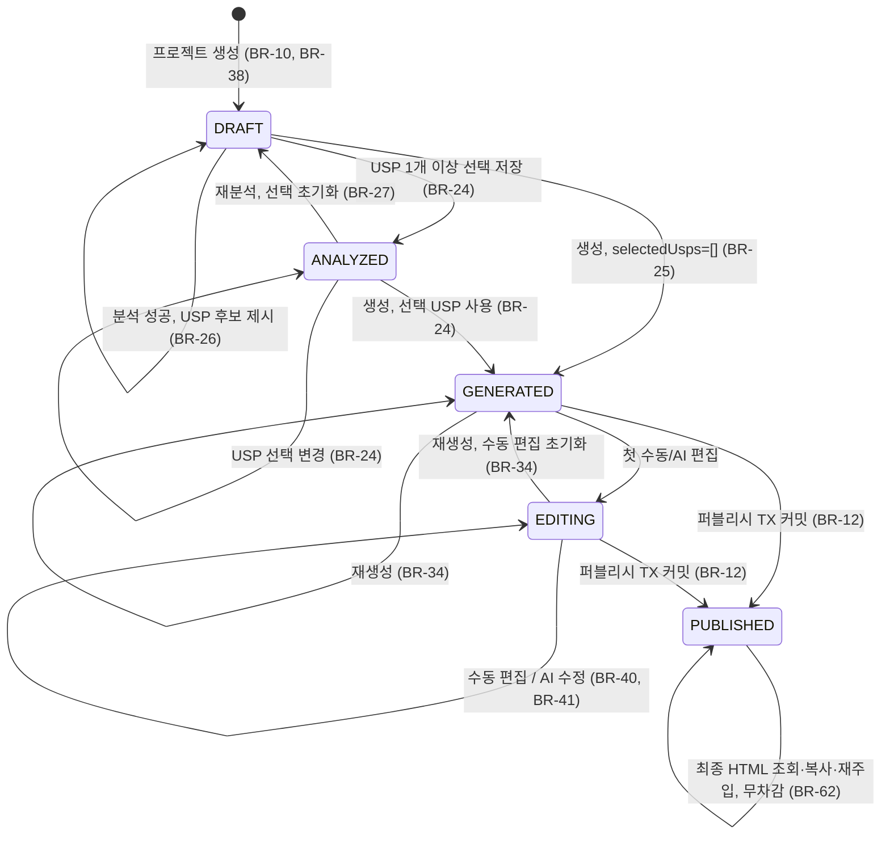
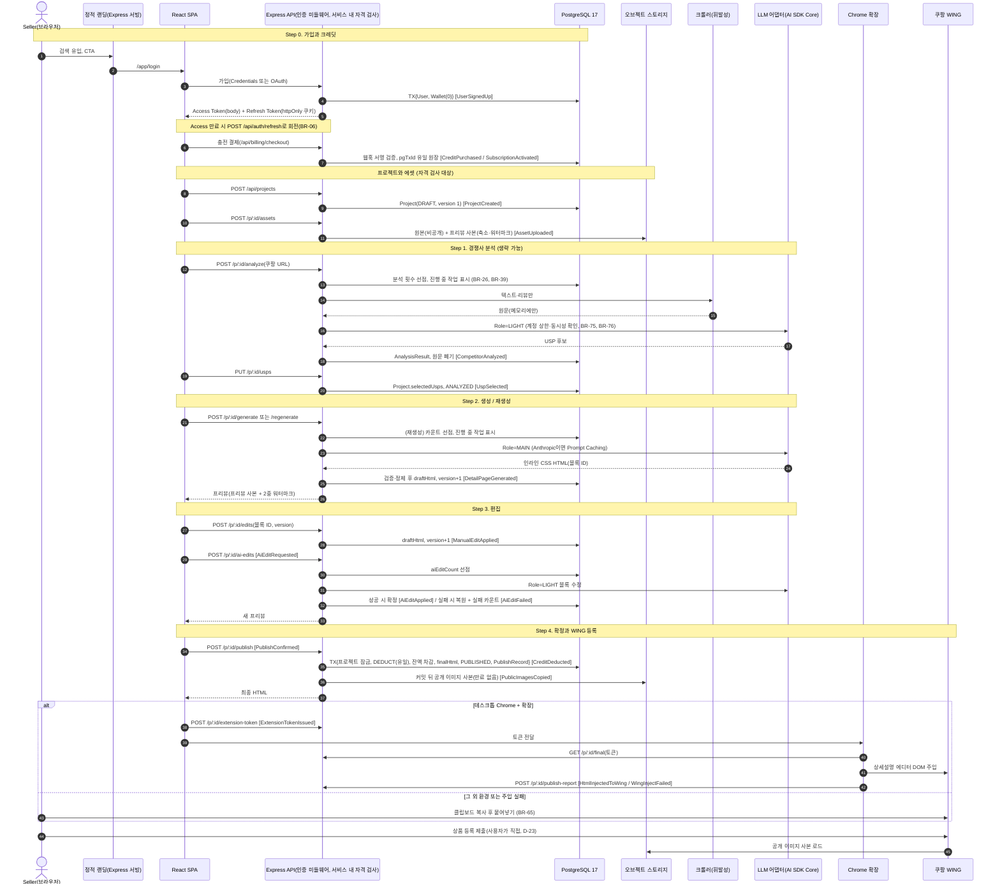
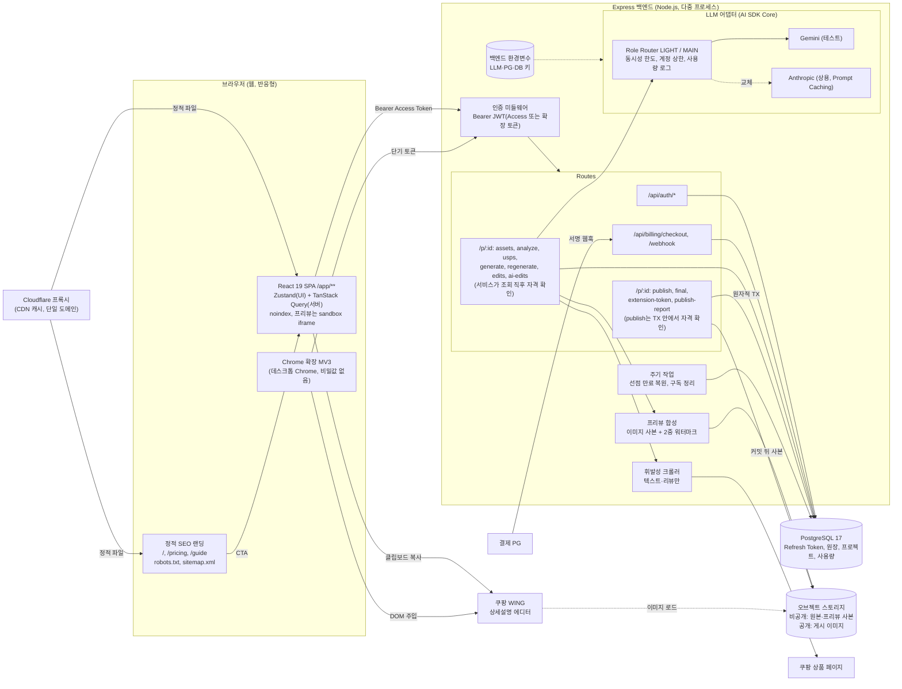

# Coupang AI Detail Maker - 도메인 정의서 (v0.3.10 초안)

> 범위: 핵심 비즈니스 규칙과 도메인 간 데이터 흐름. 구현 메커니즘은 파이프라인 원칙(P-ID)에 요약만 두고 상세는 PRD(`docs/2-PRD.md`)의 기술 아키텍처를 따른다. MVP 범위, 우선순위, 일정은 PRD가 관리한다.

## 문서 변경 이력

> 변경할 때마다 표 맨 위에 새 행을 추가한다. 기존 행은 수정하거나 삭제하지 않는다.

| 버전 | 일자 | 변경자 | 변경내용 |
|---|---|---|---|
| v0.3.10 | 2026-10-01 | hyunboee (Claude 작성) | 백엔드 구현 [가정] 반영: 기준 PRD 버전 갱신만(규칙 변경 없음). 9장 머리말의 PRD 참조 버전. 구현에서 나온 한계는 PRD 11.1 PRD-R-12~14에 기록. 기준 PRD 버전: v0.3.9 |
| v0.3.9 | 2026-09-30 | hyunboee (Claude 작성) | DB-01~03 구현 후속 정합화: AC-BR63, AC-BR71(비밀값 스캔 패턴 `DATABASE_URL` → `postgresql://`), 9장 머리말의 PRD 참조 버전. 기준 PRD 버전: v0.3.8 |
| v0.3.8 | 2026-09-30 | hyunboee (Claude 작성) | 권장안 반영: 자격 검사 서비스 내 판정, 퍼블리시 TX 잔액 선검사, PG Should 근거. P-3, 6장 시퀀스 참가자 API, 7장 다이어그램(DG-3)의 자격 미들웨어 노드, 9장 머리말의 PRD 참조 버전. 기준 PRD 버전: v0.3.7 |
| v0.3.7 | 2026-09-30 | hyunboee (Claude 작성) | 문서 간 정합성 재점검 반영: 용어집(자격 검사 대상 API에 폼 저장 추가, DEC-05·PRD FR-10 근거), 9장 머리말의 PRD 참조 버전. 기준 PRD 버전: v0.3.6 |
| v0.3.6 | 2026-09-30 | hyunboee (Claude 작성) | MVP 일정·범위 2단계(P1 2일 핵심 슬라이스, P2 MVP 완성) 재조정(Claude 위임 결정)에 따른 기준 PRD 버전 갱신만. 9장 머리말의 PRD 참조 버전(본문·규칙 변경 없음, 일정은 PRD 관할). 기준 PRD 버전: v0.3.5 |
| v0.3.5 | 2026-09-30 | hyunboee (Claude 작성) | 권장안 반영: 폼 저장 version+1, 최종 HTML 편집 속성 제거. 용어집(프로젝트 버전, 최종 HTML), BR-48, BR-52, 9장 머리말의 PRD 참조 버전. 기준 PRD 버전: v0.3.4 |
| v0.3.4 | 2026-09-30 | hyunboee (Claude 작성) | 미결 결정 DEC-01~10 반영(Claude 위임 결정): D-12, D-16(현재 규격 확정), D-21(프리뷰 이미지 data URI), D-28(Asia/Seoul 자정 기준), D-31(단일 출처 배포, R2), BR-10(403 우선), P-1, 6장 시퀀스 참가자 L, 7장 다이어그램(DG-3)의 CDN 노드, 9장 머리말의 PRD 참조 버전. 기준 PRD 버전: v0.3.3 |
| v0.3.3 | 2026-09-30 | hyunboee (Claude 작성) | 문서 간 정합성 점검 반영: BR-04(OAuth 가입자 emailVerified), BR-10(PUBLISHED 대상 요청은 자격 검사 전 처리, AC 추가), BR-26(BR-20 불통과는 시도 제외), BR-47(분석 복원 범위), 3.1·3.4·3.7 엔티티(RefreshToken·Project에 createdAt, ExtensionToken의 tokenHash → jti), 5장 공통 조건, 9장 머리말의 PRD 참조 버전. 기준 PRD 버전: v0.3.2 |
| v0.3.2 | 2026-09-30 | hyunboee (Claude 작성) | 인증 방식을 세션에서 JWT + Access Token + Refresh Token으로 변경(사용자 결정, PRD v0.3 5.8절과 일치). D-1 확정, BR-06 신설(토큰 수명·회전·재사용 탐지·폐기), 변경: 용어집(Access/Refresh Token, 확장 토큰), 3.1 엔티티(Session → RefreshToken), BR-03, BR-60, REQ-16 매트릭스, 6장 시퀀스, 데이터 소유 표, 7장 다이어그램, P-2, P-3. 기준 PRD 버전: v0.3 |
| v0.3.1 | 2026-09-30 | hyunboee (Claude 작성) | PRD v0.2 역방향 대조 반영. BR-48에 PUBLISHED 퍼블리시 재요청 version 검사 예외 추가(BR-13과 충돌 해소, PRD FR-34와 일치)와 AC 추가, 5장 공통 조건 문구 갱신, 9장 머리말의 PRD 참조 버전을 v0.2로 수정. 기준 PRD 버전: v0.2 |
| v0.3 | 2026-09-30 | hyunboee (Claude 작성) | PRD v0.1 정합화(PRD 10장 22건) + v0.2 평가(38/50) 반영. 스택을 React 19 SPA + Express/pg + PostgreSQL 17로 교체하고 PRD 지침을 REQ-21~26으로 신설, REQ-07·13·14·16·17·18 대체 표시. 인증과 자격 검사 분리(BR-03, BR-10), 인라인 CSS 출력(BR-30, D-16), 만료 없는 공개 이미지 사본(BR-66, D-12), 보호 목표 재정의(BR-32, BR-53, BR-54, D-21, R-1), ANALYZED·selectedUsps 단일화(BR-24, BR-27), 구독 상태 전이(BR-18), Wallet 생성 시점(BR-05), 분석·계정 원가 상한과 과부하 보호(BR-26, BR-75, BR-76), 카운트 선점·누수 복구·작업 중복 방지·버전(BR-39, BR-47, BR-48), AC-BR74 단계별 AC 집합 분리, 출처 태그 재분류(`[지침]` 추가, BR-12·17·32·51·52·72), 파이프라인 원칙·다이어그램 ID(P-1~8, DG-1~3). D-1·2·9·10·12·16·17·21·24 갱신, 신규 D-27~34, R-8~10. 폐기: BR-33 |
| v0.2 | 2026-09-30 | hyunboee (Claude 작성) | 평가(31/50) 반영. 원문 REQ-ID와 추적 매트릭스 신설(4장), 전 BR에 출처 태그와 AC 부여, 워터마크 보호 재설계(D-21, R-1), 에디터 자격을 크레딧 잔액 기준으로 통일하고 구독 만료 규칙 추가(D-4), 분석 생략·재생성 전이 추가(D-5, D-6), 멱등 키를 원장 유니크 제약으로 통일, AI 수정 원자적 카운트와 실패 상한(D-20), 확장 프로그램 단기 토큰과 주입 결과 보고 API(D-22), 이벤트 표를 트랜잭션 규칙과 일치, 9장을 결정 로그(9장), 리스크 레지스터(10장), KPI(11장)로 분리 |
| v0.1 | 2026-09-30 | hyunboee (Claude 작성) | 최초 초안 작성 (1~9장) |

---

## 1. 개요

| 항목 | 내용 |
|---|---|
| 목적 | 경쟁사 분석, 상세페이지 생성, 쿠팡 WING 등록으로 나뉘어 있던 상품 등록 과정을 한 번에 이어지는 자동화 흐름으로 묶는 웹 B2B SaaS |
| 문제 정의 | (1) 상세페이지 기획·디자인에 시간과 외주비가 많이 든다 (2) 벤치마킹, 렌더링, WING 업로드 단계가 따로 논다 (3) 결제 전 AI 결과물의 무단 사용을 억제할 수단이 없다 (4) 마진이 높은 웹 결제 구조와 SEO 기반 자연 유입 채널이 필요하다 |
| 대상 사용자 | 부업·N잡으로 쿠팡 판매를 시작하는 학생과 20~50대 직장인 셀러(1인, 입점 초기). 디자인 역량과 시간이 부족하고 외주비에 민감하다 (D-33) |
| 플랫폼 | 웹 우선, 모바일은 반응형 UI만. WING 자동 주입은 데스크톱 Chrome 확장에서만 된다 (D-33) |
| 규모 | 동시 접속 1,000명(REQ-22). 병목인 LLM 호출은 동시성·계정 상한으로 보호한다(BR-75, BR-76) |
| 수익 모델 | 웹 결제(플랜 구독 또는 크레딧 충전). 최종 확정 1건마다 크레딧 1개 소모 |
| 기술 스택 | React 19 + TypeScript + Zustand + TanStack Query SPA, Node.js + JavaScript + Express + `pg`(Prisma 금지), PostgreSQL 17 (REQ-24~26, D-2). 배포는 D-31 |

**표기 규약**
- 출처 태그: `[원문]` 도메인 요구사항 원문에 명시, `[지침]` PRD 작성 지침(`prompts/PRD생성.md`)에 명시(원문과 충돌하면 지침 우선), `[파생]` 원문·지침의 목적을 달성하려고 도출, `[가정]` 사업 판단이 필요한 기본값. `[가정]` 규칙은 반드시 D-ID를 단다.
- 수치(횟수, 크기, 시간)는 D 항목이 단일 원천이다. BR 본문은 D-ID로 참조하고, 원문이 수치를 직접 정한 경우만 BR에 적는다.
- 규칙 참조는 장 번호가 아니라 BR/D/R/KPI/P/DG ID로 한다. ID는 삭제·재사용하지 않고, 폐기 시 "폐기"로 남긴다. PRD 항목은 PRD의 ID(FR, NFR, PRD-D, PRD-R, PRD-V)로 참조한다.
- AC ID는 `AC-{BR번호}`로 한다(예: BR-13 → AC-BR13). API 경로의 `/p/:id`는 `/api/projects/:id`의 줄임이다.

---

## 2. 유비쿼터스 언어 (용어집)

| 용어 | 정의 |
|---|---|
| 사용자(Seller) | 소셜(Google/Kakao/Naver) 또는 이메일/비밀번호로 가입한 셀러 계정 |
| 플랜 / 구독 | 주기마다 일정량의 크레딧을 지급하는 유료 요금제. 사용 자격을 직접 주지 않는다(BR-10) |
| 크레딧(슬롯) | 상세페이지 1건을 최종 확정할 수 있는 권리 단위. 1회 확정 = 1크레딧. 구독 크레딧과 충전 크레딧으로 나뉜다(BR-16) |
| 사용 자격 | 계정 요건(BR-04)과 크레딧 요건(BR-10)을 모두 충족한 상태. 자격 검사 대상 API에서만 확인한다 |
| 자격 검사 대상 API | 프로젝트 생성, 폼 저장, 에셋 업로드, 분석, USP 선택, 생성·재생성, 수동 편집, AI 수정, 퍼블리시(BR-10) |
| 프로젝트 | 상세페이지 1건을 만드는 작업 단위. 입력, 선택 USP, 생성 HTML, 편집 이력, 상태, 버전을 담는다 |
| 프로젝트 버전(version) | draftHtml·상태·폼(form)이 바뀔 때마다 증가하는 번호. 동시 변경 충돌을 막는다(BR-48) |
| 진행 중 작업 | 프로젝트에서 실행 중인 LLM 작업(분석, 생성, 재생성, AI 수정). 프로젝트당 1건만 허용한다(BR-39) |
| 선점 | 사용 한도 카운트를 LLM 호출 전에 미리 1 올려 두는 것. 결과에 따라 확정하거나 복원한다(BR-47) |
| 경쟁사 URL | 벤치마킹용 쿠팡 상위 상품 URL. 분석 1회당 1건 |
| 휘발성 크롤링 | 텍스트와 리뷰만 한 번 수집해 분석에 쓰고 원문은 저장하지 않는 수집 방식 |
| USP 후보 / 선택 USP | AI가 경쟁사 데이터에서 뽑은 마케팅 포인트(AnalysisResult) / 사용자가 체크해 저장한 것(Project.selectedUsps, 단일 원천) |
| 분석 생략 경로 | 분석이나 USP 선택 없이 DRAFT에서 바로 생성하는 경로. selectedUsps는 빈 배열(BR-25) |
| 입력 폼 | 제품명, 카테고리, 소개글, 디자인/톤앤매너 지침, 이미지 에셋 |
| 원본 이미지 | 사용자가 올린 이미지. 사용자가 이미 가진 파일이므로 과금 보호 대상이 아니며, 사용자 데이터로서 비공개 보관한다(BR-32) |
| 프리뷰 이미지 사본 | 서버가 축소하고 워터마크를 합성한 프리뷰용 사본(D-21) |
| 공개 이미지 사본 | 퍼블리시 TX 커밋 뒤 만드는, 만료 없고 추측할 수 없는 공개 URL의 게시용 이미지(BR-66) |
| 블록(Block) | 생성 HTML의 섹션 단위. 서버가 블록 ID를 부여하며 편집·워터마크·AI 수정의 단위다 |
| 초안 HTML(draftHtml) | MAIN 모델이 생성하고 편집이 반영된 HTML(BR-30 규격). 서버에만 보관 |
| 프리뷰 | 서버가 draftHtml의 이미지를 프리뷰 사본으로 바꾸고 워터마크를 넣은 HTML. 확정 전 클라이언트가 받는 유일한 형태 |
| 워터마크 | 캔버스 최상단 사선 반투명 오버레이(BR-51)와 블록별 반복 워터마크(BR-54) |
| 수동 편집 | 텍스트 직접 수정, 요소 드래그·리사이즈. 무료, 횟수 제한 없음 |
| AI 부분 수정 | 특정 블록의 색상·문구를 채팅으로 지시해 바꾸는 기능. LIGHT 모델, 성공 상한 BR-41 |
| 재생성 | 같은 입력으로 MAIN 생성을 다시 실행. 상한 D-5 |
| 최종 HTML | 퍼블리시 TX에서 확정한, 워터마크와 편집기 전용 속성(`data-edit-id`, `data-block-id`)이 없고 공개 이미지 사본을 참조하는 HTML |
| 퍼블리시(확정) | "워터마크 제거 및 쿠팡 등록"(= 원문 "최종 저장 및 쿠팡 전송"). 차감과 최종 HTML 확정이 한 TX로 묶인다 |
| Access Token | 로그인 사용자를 증명하는 단기 JWT. 요청마다 Authorization 헤더로 보내며 서버는 저장하지 않는다(BR-06) |
| Refresh Token | Access Token을 다시 받기 위한 장기 JWT. httpOnly 쿠키로만 오가며 서버가 해시를 저장하고, 쓸 때마다 새것으로 교체(회전)한다(BR-06) |
| 확장 토큰 | PUBLISHED 프로젝트 1건 범위의 단기 JWT. 확장 프로그램 전용이며 Refresh Token이 없다(BR-60) |
| WING 주입 | 크롬 확장 프로그램이 WING 상품등록 페이지의 상세설명 에디터 DOM에 최종 HTML을 넣는 동작 |
| LLM 어댑터 | 백엔드에서 AI SDK Core 위에 올린 모델 어댑터. 역할(Role)을 Provider·모델 ID에 매핑한다 |
| 모델 역할(Role) | `LIGHT`(분석·부분 수정), `MAIN`(렌더링) |

---

## 3. 바운디드 컨텍스트

### 3.1 인증/회원 (Identity)
- **책임**: 가입, 로그인, 인증 토큰 발급·갱신·폐기, 계정 식별
- **엔티티**: `User(id, email, emailVerified, name, providers[google|kakao|naver|credentials], createdAt, status)`, `RefreshToken(jti, userId, familyId, tokenHash, expiresAt, revokedAt?, replacedBy?, createdAt)`
- **규칙**
  - BR-01 [원문] 가입·로그인 수단은 Google, Kakao, Naver OAuth와 이메일/비밀번호(Credentials) 네 가지다.
    - AC: Given 미가입자 / When 네 수단 중 하나로 가입 / Then User 1건, providers에 해당 수단 기록
  - BR-02 [가정] 검증된 같은 이메일로 다른 Provider에 로그인하면 기존 User에 Provider를 연결한다. 미검증 이메일이면 자동 연결하지 않고 새 계정도 만들지 않으며 기존 수단 로그인을 안내한다. Provider가 이메일을 주지 않으면 이메일 입력을 추가로 요구한다. (D-13)
    - AC: Given Google로 가입한 a@x.com / When 검증된 a@x.com Kakao 로그인 / Then User 1개, providers=[google, kakao]
    - AC: Given 같은 조건 / When 미검증 a@x.com 또는 이메일 미제공 Kakao 로그인 / Then 신규 User 0건, 자동 연결 0건
  - BR-03 [파생] `/api/*`는 인증 미들웨어가 Bearer JWT(Access Token 또는 확장 토큰, BR-06, BR-60)를 서명과 만료로만 검증한다(DB 조회 없음). 인증만 하고 잔액은 보지 않는다(BR-10). 예외는 `/api/auth/*`와 서명을 검증하는 `/api/billing/webhook`뿐이다.
    - AC: Given 토큰 없음, 만료, 서명 오류, 또는 웹 API에 확장 토큰 사용 / When `POST /p/:id/generate` 또는 `POST /p/:id/publish-report` / Then 401, 도메인 로직 미실행
  - BR-04 [가정] Credentials 가입자는 이메일 인증 전에는 자격 검사 대상 API를 쓸 수 없다(사용 자격의 계정 요건). OAuth 가입자는 Provider가 검증한 이메일로만 가입되므로(BR-02) 가입 시 emailVerified=true다. (D-14)
    - AC: Given emailVerified=false, 잔액 1 / When `POST /api/projects` / Then 403, 인증 메일 재발송 안내
  - BR-05 [파생] User 생성과 같은 TX에서 잔액 0인 CreditWallet을 만들고 UserSignedUp을 발생시킨다. 가입 수단, 이메일 인증 여부와 무관하며 이메일 인증은 가입 뒤의 별도 단계(EmailVerified)다.
    - AC: Given Credentials 가입 직후(미인증) / When 조회 / Then User 1건, Wallet 1건(잔액 0), UserSignedUp 1건
  - BR-06 [지침] 웹 인증은 JWT 기반 Access Token과 Refresh Token 두 가지로 한다(사용자 결정, D-1). Access Token은 수명이 짧고 서버가 저장하지 않으며, 자격 정보(이메일 인증 여부, 잔액)를 담지 않는다. Refresh Token은 httpOnly 쿠키로만 전달하고 서버가 해시로 보관한다. 갱신할 때마다 새 Refresh Token으로 교체(회전)하고, 이미 교체된 토큰이 다시 제출되면 탈취로 보고 같은 로그인에서 이어진 토큰(패밀리) 전체를 폐기한다. 로그아웃은 해당 패밀리를, 비밀번호 변경·계정 정지는 사용자의 모든 패밀리를 폐기한다. 폐기 후 남은 Access Token은 만료까지만 유효함을 수용한다. 수명 값은 D-1을 따른다. (D-1)
    - AC: Given 로그인 후 갱신 1회 / When 갱신 전 Refresh Token 재제출 / Then 401, 해당 패밀리 전 행 폐기, 최신 Refresh Token으로도 갱신 401
    - AC: Given 로그아웃 / When 같은 Refresh Token으로 갱신 / Then 401

### 3.2 결제·크레딧 (Billing & Credit)
- **책임**: 플랜 구독, 크레딧 충전·지급·소멸, 잔액 관리, 차감 원장
- **엔티티**: `Plan(id, name, price, creditsPerCycle)`, `Subscription(userId, planId, status[ACTIVE|CANCELED|PAST_DUE|ENDED], periodStart, periodEnd)`, `CreditWallet(userId, subscriptionBalance, topupBalance)`, `CreditLedger(id, userId, delta, reason[PURCHASE|GRANT|EXPIRE|DEDUCT|REFUND], source[SUBSCRIPTION|TOPUP], projectId?, pgTxId?, createdAt)`, `Payment(id, userId, pgTxId, amount, status)`
- **규칙**
  - BR-10 [가정] 크레딧 요건은 잔액 합계 1 이상이다. 구독 여부는 자격에 영향을 주지 않는다. 사용 자격(BR-04 + 크레딧 요건)은 자격 검사 대상 API에서만 확인한다. 조회(프로젝트·프리뷰·최종 HTML), 확장 토큰 발급, 주입 결과 보고는 잔액과 무관하게 허용한다. PUBLISHED 프로젝트 대상 요청은 자격 검사 전에 처리한다: 퍼블리시 재요청은 기존 결과를 반환하고(BR-13, BR-48), 편집·재생성·AI 수정·분석은 409로 거절한다(BR-46). 계정 요건(이메일 미인증)과 크레딧 요건(잔액 0)이 동시에 미충족이면 403을 우선한다. (D-4)
    - AC: Given 구독 ACTIVE, 잔액 0 / When `POST /api/projects` / Then 402, 충전 안내
    - AC: Given 잔액 1로 퍼블리시해 잔액 0 / When `GET /p/:id/final`, `POST /p/:id/extension-token` / Then 둘 다 200
    - AC: Given 잔액 0인 PUBLISHED P / When P 퍼블리시 재요청, `POST /p/:id/edits` / Then 재요청은 200(기존 최종 HTML, 차감 0건), 편집은 409
  - BR-11 [원문] 크레딧은 퍼블리시를 확정할 때만 차감된다. 작업 시작, 분석, 생성, 재생성, 편집, AI 수정은 차감하지 않는다.
    - AC: Given 잔액 3 / When 분석→생성→재생성→AI 수정 / Then 잔액 3, DEDUCT 0건
  - BR-12 [원문] 퍼블리시 확정은 원자적이다. 잔액 확인, 1크레딧 차감(DEDUCT), 최종 HTML 확정, PUBLISHED 전이, PublishRecord 생성은 모두 성공하거나 모두 롤백된다. (P-5)
    - AC: Given 잔액 1 / When TX 중 PublishRecord 저장 실패 / Then 잔액 1, 상태 불변, DEDUCT 0건, PublishFailed 발생
  - BR-13 [파생] 프로젝트당 DEDUCT 원장은 최대 1건이며 DB 유일성으로 강제한다. 이미 차감된 프로젝트의 재요청은 새 차감 없이 기존 확정 결과를 반환한다. (P-5)
    - AC: Given 잔액 5, P는 EDITING / When P 퍼블리시 2건 동시 / Then 잔액 4, DEDUCT 1건, 두 응답의 최종 HTML 해시 동일
  - BR-14 [파생] subscriptionBalance와 topupBalance는 각각 음수가 될 수 없으며 DB 제약으로 강제한다. (P-5)
    - AC: Given 잔액 0 / When 차감 시도 / Then TX 롤백, 402
  - BR-15 [파생] 각 잔액은 해당 source의 원장 delta 합계와 항상 같다.
    - AC: Given 퍼블리시·지급·소멸 TX 커밋 / When 직후 해당 사용자 대사 / Then 잔액 = 원장 합계. 일 1회 전수 대사 불일치 0건
  - BR-16 [가정] 구독 크레딧은 주기 종료 시 남은 만큼 소멸(EXPIRE)하고 충전 크레딧은 기한 없이 이월한다. 차감은 구독 크레딧부터 한다. (D-4)
    - AC: Given 구독 크레딧 2, 충전 1 / When 주기 종료 / Then 구독 0(EXPIRE -2), 충전 1
    - AC: Given 구독 크레딧 1, 충전 1 / When 퍼블리시 / Then 구독 0, 충전 1, DEDUCT.source=SUBSCRIPTION
  - BR-17 [가정] 크레딧 유입은 구독 결제 성공(GRANT, creditsPerCycle), 충전 결제 성공(PURCHASE), 운영자 수동 지급(PURCHASE, pgTxId 없음) 세 가지다. 결제는 웹 PG로만 받고, 서명을 검증한 PG 웹훅을 기준으로 pgTxId당 1회만 반영한다(DB 유일성). 갱신 시 이전 주기 잔여 EXPIRE와 새 GRANT는 같은 TX에서 처리한다. 경로별 도입 시점은 PRD(FR-07~09)를 따른다. (D-3, D-4)
    - AC: Given 같은 pgTxId 웹훅 2회 / When 처리 / Then 원장 1건
    - AC: Given 구독 크레딧 1 남은 갱신 / When 갱신 웹훅 / Then 같은 TX에 EXPIRE -1과 GRANT +creditsPerCycle
  - BR-18 [가정] 구독 상태 전이는 다음과 같다. 웹훅 누락에 대비해 주기 정리 작업이 periodEnd·유예 경과 건을 처리한다. (D-4, D-34)
    - ACTIVE → CANCELED: 사용자가 해지. 이번 주기 크레딧은 periodEnd까지 유지하고 갱신·GRANT는 없다.
    - ACTIVE → PAST_DUE: 갱신 결제 실패. GRANT 없음. 이전 주기 잔여는 BR-16대로 EXPIRE한다.
    - PAST_DUE → ACTIVE: 유예 기간 안에 결제 성공. 새 주기로 GRANT한다.
    - CANCELED → ENDED(periodEnd 경과), PAST_DUE → ENDED(유예 종료): 잔여 구독 크레딧 EXPIRE.
    - AC: Given CANCELED, 구독 크레딧 2 / When periodEnd 경과 / Then ENDED, EXPIRE -2, GRANT 0건
    - AC: Given PAST_DUE / When 유예 안에 결제 성공 웹훅 / Then ACTIVE, GRANT 1건

### 3.3 경쟁사 분석 (Competitor Analysis / RAG)
- **책임**: 경쟁사 URL을 휘발성으로 크롤링하고 LIGHT 모델로 USP 후보를 추출해 제안, 사용자 선택 저장
- **엔티티**: `AnalysisResult(projectId, sourceUrl, uspCandidates[], analyzedAt)`. 선택 USP는 Project.selectedUsps에만 둔다. 크롤링 원문은 엔티티로 두지 않는다.
- **규칙**
  - BR-20 [가정] 분석 입력은 쿠팡 상품 URL 1건이며 D-15 패턴만 허용한다. 단축 URL은 거절한다. (D-15)
    - AC: Given `https://www.coupang.com/vp/products/123?itemId=1` / When 분석 / Then 허용(쿼리 제거 후 사용)
    - AC: Given `https://naver.com/x` 또는 `https://link.coupang.com/a/b` / When 분석 / Then 400, 크롤링 미실행
  - BR-21 [원문] 수집 대상은 텍스트와 리뷰뿐이다. 이미지와 미디어는 요청하지 않는다.
    - AC: Given 유효 URL / When 크롤링 / Then 이미지·미디어 요청 0건
  - BR-22 [원문] 크롤링 원문은 요청 처리 중 메모리에서만 쓰고 저장·로깅하지 않는다. 저장하는 것은 AI가 만든 USP 후보뿐이다.
    - AC: Given 알려진 리뷰 문장이 있는 상품 분석 완료 / When DB 전 테이블, 스토리지, 요청·오류 로그에서 해당 문장 검색 / Then 0건
  - BR-23 [원문] 분석에는 `LIGHT` 역할 모델을 쓴다.
    - AC: Given 분석 / When 완료 / Then LlmUsageLog.role=LIGHT
  - BR-24 [원문] USP는 체크박스 후보로 제시하고, 사용자가 선택해 저장한 것만 생성에 쓴다. 선택은 Project.selectedUsps에 저장하며, 1개 이상 저장하면 ANALYZED가 된다.
    - AC: Given 후보 5개 중 2개 저장 / When 생성 / Then 상태 ANALYZED→GENERATED, MAIN 입력의 USP는 2개뿐
  - BR-25 [가정] 분석 생략 경로를 허용한다. DRAFT에서 생성하면 후보가 있어도 selectedUsps=[]로 생성한다. (D-6)
    - AC: Given DRAFT, 분석 미실행 / When 생성 / Then selectedUsps=[]로 성공, GENERATED
  - BR-26 [가정] 분석은 프로젝트당 D-27 횟수까지 실행할 수 있다. 실패한 시도도 횟수에 포함하고(BR-47), BR-20을 통과하지 못한 요청(400)은 세지 않는다. (D-27)
    - AC: Given 분석 시도가 D-27 횟수에 도달 / When 분석 / Then 429, 크롤링·LLM 호출 0회
  - BR-27 [파생] 분석과 USP 선택은 첫 생성 전(DRAFT, ANALYZED)에만 할 수 있다. ANALYZED에서 재분석하면 후보를 교체하고 selectedUsps를 비우며 DRAFT로 돌아간다.
    - AC: Given GENERATED / When 분석 또는 USP 저장 / Then 409
    - AC: Given ANALYZED / When 재분석 성공 / Then DRAFT, selectedUsps=[], 후보 교체

### 3.4 상세페이지 생성 (Detail Page Generation)
- **책임**: 프로젝트 생성, 입력 폼과 에셋 수집, MAIN 모델로 초안 HTML 생성·재생성
- **엔티티**: `Project(id, userId, status, version, form{productName, category, intro, toneGuide?}, selectedUsps[], draftHtml, finalHtml?, analyzeCount, regenCount, aiEditCount, aiEditFailCount, activeJob?{type, startedAt}, publishedAt?, createdAt)`, `Asset(id, projectId, originalPath, previewPath, publicPath?, mime, size)`
- **규칙**
  - BR-30 [가정] 생성 HTML은 WING 상세설명에 그대로 붙여도 스타일이 유지되는 자급식 HTML이다. 루트는 고정 폭이고, 스타일은 인라인 CSS로만 준다. 외부 스타일시트·`<style>`·class 기반 스타일·스크립트·이벤트 핸들러·`javascript:` URL은 넣지 않으며, 최상위 섹션마다 블록 ID를 둔다. 서버가 검증하고 금지 요소를 제거한다. 원문의 Tailwind 규격(REQ-07)을 대체한다. (D-16)
    - AC: Given 생성 성공 / When 결과 검사 / Then 루트 폭 = D-16 값, script·link·style 0개, class 속성 0개, on* 속성 0개, 모든 최상위 섹션에 블록 ID
  - BR-31 [원문] 생성과 재생성에는 `MAIN` 역할 모델을 쓴다.
    - AC: Given 생성 / When 완료 / Then LlmUsageLog.role=MAIN
  - BR-32 [파생] 원본 이미지, draftHtml, 최종 HTML은 서버(DB·비공개 저장소)에만 둔다. 확정 전 클라이언트에는 프리뷰(BR-50)만 보낸다. 원본을 비공개로 두는 목적은 사용자 데이터(미출시 상품 정보) 보호이며 과금 보호가 아니다(BR-53).
    - AC: Given 퍼블리시 전 / When 모든 API 응답 본문 수집 / Then 원본 경로, 원본·공개 이미지 URL 0건
  - BR-33 폐기 (v0.3): BR-11과 중복되어 BR-11로 통합.
  - BR-34 [가정] 재생성은 최초 생성과 별도로 D-5 횟수까지다. 재생성하면 수동 편집 내용은 초기화하고 AI 수정 카운트는 유지한다. 카운트는 BR-47로 선점한다. (D-5)
    - AC: Given regenCount가 D-5 값 / When 재생성 / Then 429, MAIN 호출 0회
    - AC: Given MAIN 실패(mock) / When 재생성 / Then regenCount·draftHtml·상태 불변
  - BR-35 [가정] 생성 필수값은 D-18을 따른다. 톤앤매너 지침은 선택이며 없으면 기본 톤을 쓴다. (D-18)
    - AC: Given 소개글 비어 있음 / When 생성 / Then 400, MAIN 호출 0회, 상태 유지
  - BR-36 [가정] 이미지는 D-19 제한 안에서만 받는다. 서버에서 검증하고, 통과하면 원본 저장과 프리뷰 사본 생성(BR-50)을 함께 한다. (D-19)
    - AC: Given 제한 초과 개수·용량 또는 허용 외 형식 / When 업로드 / Then 400, 저장 0건
  - BR-37 [가정] "즉시 렌더링"은 생성 요청부터 프리뷰 응답까지(대기열 포함) p90이 D-17 이내인 것으로 정의한다. (D-17)
    - AC: Given 출시 전 테스트 10회 또는 출시 후 7일 로그 / When latencyMs p90 산출 / Then D-17 이하
  - BR-38 [파생] 프로젝트는 `POST /api/projects`로 만들며 사용 자격을 확인하고 DRAFT, version 1로 둔다.
    - AC: Given 잔액 1 / When 생성 / Then 201, DRAFT, ProjectCreated
  - BR-39 [파생] 프로젝트당 진행 중 작업은 1건만 허용한다. 진행 중 작업이 있으면 새 LLM 작업, 편집, 퍼블리시 요청은 409로 거절한다.
    - AC: Given 생성 요청 2건 동시 / When 처리 / Then 1건만 MAIN 호출, 나머지 409
    - AC: Given 재생성 진행 중 / When 퍼블리시 / Then 409, 차감 0건

### 3.5 편집 (Editing: 수동 / AI)
- **책임**: 프리뷰에서 수동 편집한 결과를 서버 초안에 반영, AI 부분 수정 처리, 사용 한도 카운트 관리
- **엔티티**: `EditOperation(projectId, type[MANUAL|AI], blockId, payload, createdAt)`
- **규칙**
  - BR-40 [원문] 수동 편집(텍스트, 드래그, 리사이즈)은 무료이며 횟수 제한이 없다. 결과는 서버의 draftHtml에 반영된다.
    - AC: Given 수동 편집 100회 / When 각 저장 / Then 모두 성공, 잔액·aiEditCount 불변
  - BR-41 [원문] AI 부분 수정은 프로젝트당 성공 최대 3회다. 카운트는 BR-47로 선점한다.
    - AC: Given aiEditCount=2, LLM mock / When AI 수정 2건 동시 / Then LLM 호출 1회, 나머지 409(BR-39), 최종 aiEditCount=3
  - BR-42 [원문] AI 부분 수정에는 `LIGHT` 역할 모델만 쓴다.
    - AC: Given AI 수정 / When 완료 / Then LlmUsageLog.role=LIGHT
  - BR-43 [파생] AI 부분 수정은 지정한 블록만 바꾸고 다른 블록의 HTML은 바이트 단위로 그대로 둔다.
    - AC: Given 블록 A 지정 / When 성공 / Then A 외 모든 블록 해시 불변
  - BR-44 [파생] 클라이언트는 편집을 블록 ID 기준 작업(EditOperation)으로 보내고, 서버가 draftHtml에 적용한 뒤 새 프리뷰를 돌려준다. 클라이언트가 보낸 HTML로 draftHtml을 덮어쓰지 않는다.
    - AC: Given 텍스트 payload에 HTML 태그 포함 / When 저장 / Then 400, draftHtml 불변
  - BR-45 [가정] AI 수정 실패 시도는 성공 한도와 별도로 프로젝트당 D-20 횟수로 제한한다. 초과하면 LLM을 호출하지 않는다. (D-20)
    - AC: Given aiEditFailCount가 D-20 값, aiEditCount=1 / When AI 수정 / Then 429, LLM 호출 0회
    - AC: Given LLM 실패(mock) / When AI 수정 / Then aiEditCount 복원, aiEditFailCount +1
  - BR-46 [파생] PUBLISHED 프로젝트는 편집·재생성·AI 수정·분석이 불가하다(읽기 전용). 새로 작업하려면 새 프로젝트를 만든다.
    - AC: Given PUBLISHED / When `POST /p/:id/edits` / Then 409
  - BR-47 [파생] 사용 한도 카운트(분석 BR-26, 재생성 BR-34, AI 성공 BR-41, AI 실패 BR-45)의 상한 확인과 증가는 원자적이어서 동시 요청도 상한을 넘지 못한다. LLM 호출 전에 선점하고, 성공하면 확정, 실패하면 복원한다. 단 분석은 크롤링·LLM이 실행된 시도 자체를 세므로 실패해도 복원하지 않고(LLM 미호출 거절인 BR-75·BR-76은 복원), AI 수정 실패는 성공 카운트를 복원하면서 실패 카운트를 원자적으로 올린다. 선점 뒤 D-30 시간 안에 확정·복원되지 않으면(서버 중단 등) 선점을 복원하고 진행 중 작업 표시를 해제한다. (P-5, D-30)
    - AC: Given 재생성 선점 직후 프로세스 중단 / When D-30 경과 / Then regenCount 복원, activeJob 해제, 새 요청 가능
  - BR-48 [파생] draftHtml·상태·폼(form)을 바꾸는 요청은 기준으로 삼은 version을 함께 보낸다. 현재 version과 다르면 409로 거절하고, 변경이 성공할 때마다 version을 올린다. 늦게 도착한 LLM 결과의 기준 version이 현재와 다르면 결과를 버리고 선점을 복원한다. 예외: 이미 PUBLISHED인 프로젝트의 퍼블리시 재요청은 version을 검사하지 않고 BR-13에 따라 기존 확정 결과를 반환한다.
    - AC: Given version 3을 연 두 탭 / When 각각 수동 편집 저장 / Then 하나는 성공(version 4), 하나는 409
    - AC: Given version 3인 P / When version 3으로 퍼블리시 요청 2건 동시 / Then 둘 다 성공 응답, 최종 HTML 해시 동일, DEDUCT 1건

### 3.6 콘텐츠 보호 (Watermark / Content Protection)
- **책임**: 결제 전 "그대로 게시 가능한 완성본"의 유출 차단과 AI 결과물 무단 사용 억제
- **규칙**
  - BR-50 [가정] 확정 전 클라이언트로 가는 HTML은 모두 서버가 만든 프리뷰다. 프리뷰 이미지는 D-21의 축소·워터마크 합성 사본이며, 원본 경로나 공개 사본 URL은 넣지 않는다. (D-21)
    - AC: Given 생성·편집 응답 / When img src 전수 검사 / Then 모두 프리뷰 사본, 폭 D-21 이하, 워터마크 합성
  - BR-51 [원문] 프리뷰 캔버스 최상단에 사선 반투명 "PREVIEW ONLY / 무단 복제 금지" 워터마크를 서버가 강제로 넣는다. 클라이언트에 끄는 설정은 없다.
    - AC: Given 프리뷰 / When DOM 검사 / Then 최상단 오버레이 1개, 워터마크 해제 파라미터 없음
  - BR-52 [원문] 워터마크 없는 최종 HTML은 퍼블리시 TX가 커밋된 뒤에만 반환한다. 최종 HTML을 만들 때 편집기 전용 속성 `data-edit-id`와 `data-block-id`는 제거한다(draftHtml에는 유지).
    - AC: Given GENERATED(미퍼블리시) / When `GET /p/:id/final` / Then 403
  - BR-53 [가정] 보호 목표는 결제 전에 "WING에 그대로 게시할 수 있는 완성본"(워터마크 없는 최종 HTML + 공개 이미지 사본)을 얻지 못하게 하는 것이다. 원본 이미지는 사용자가 이미 가진 파일이라 보호 대상이 아니다. 핵심 가치 자산인 AI 생성 문구·레이아웃은 프리뷰에 노출되므로 워터마크는 억지력일 뿐 완전 차단은 목표가 아니며, 이는 R-1로 관리한다. (D-21)
    - AC: Given 미퍼블리시 프로젝트 / When 모든 API 응답 검사 / Then 최종 HTML 0건, 공개 이미지 URL 0건, 프리뷰 이미지 전부 워터마크 합성 사본
  - BR-54 [가정] 오버레이 외에 모든 블록에 반복 배경 워터마크를 서버가 넣는다. (D-21)
    - AC: Given 프리뷰 / When DOM 검사 / Then 블록마다 반복 워터마크 존재

### 3.7 퍼블리싱 (Publishing: WING 연동 / Chrome Extension)
- **책임**: 최종 HTML과 게시용 이미지를 WING에 전달하고 주입 결과를 기록
- **엔티티**: `PublishRecord(projectId, finalHtmlHash, publishedAt, injectStatus[PENDING|INJECTED|FAILED], lastReportedAt?)`, `ExtensionToken(jti, userId, projectId, expiresAt)`
- **규칙**
  - BR-60 [가정] 확장 프로그램은 웹 사용자가 Access Token으로 발급받은 단기 JWT(별도 서명 키, PUBLISHED 프로젝트 1건 범위, 만료 D-22)으로 인증한다. 토큰으로는 해당 프로젝트의 최종 HTML 조회와 결과 보고만 할 수 있다. (D-22)
    - AC: Given 프로젝트 A 토큰 / When B 조회, 만료 뒤 A 조회, 또는 다른 API 호출 / Then 401
  - BR-61 [가정] 확장 프로그램은 WING 상품등록 페이지의 상세설명 에디터 DOM에만 주입한다. 등록 제출은 사용자가 직접 한다. (D-23)
    - AC: Given WING 상품등록 페이지 / When 주입 / Then 상세설명 내용만 바뀌고 제출 요청 0건
  - BR-62 [파생] 주입에 실패해도 다시 차감하지 않는다. PUBLISHED 프로젝트는 최종 HTML을 몇 번이든 다시 조회·복사·주입할 수 있다.
    - AC: Given PUBLISHED, 주입 FAILED / When 토큰 재발급 후 재주입 / Then 성공, 잔액 불변
  - BR-63 [파생] 확장 프로그램에는 LLM API 키나 서버 비밀값을 넣지 않는다.
    - AC: Given 확장 패키지 / When `sk-`, `AIza`, `postgresql://` 등 비밀값 패턴 스캔 / Then 0건
  - BR-64 [파생] 확장 프로그램은 주입 결과를 `POST /p/:id/publish-report`로 보고하고, 서버는 injectStatus를 갱신한다. 보고는 과금에 영향을 주지 않는다.
    - AC: Given 주입 성공 / When 보고 / Then INJECTED, HtmlInjectedToWing, 원장 변화 없음
  - BR-65 [가정] 주입이 실패하거나 주입할 수 없는 환경(데스크톱 Chrome 확장 외)이면 최종 HTML 클립보드 복사를 제공한다. WING 셀렉터는 서버 설정으로 원격 관리한다. (D-7, D-33)
    - AC: Given 셀렉터 불일치 / When 주입 / Then FAILED 보고, 복사 버튼 노출
  - BR-66 [가정] 최종 HTML의 이미지는 퍼블리시 TX 커밋 뒤 만든 공개 이미지 사본(만료 없음, 추측할 수 없는 URL)을 참조한다. 사본 생성이 실패하면 재시도하며 이미 차감한 크레딧은 유지한다. 서명 URL은 쓰지 않는다. (D-12)
    - AC: Given 퍼블리시 전 / When 공개 저장소 검사 / Then 해당 프로젝트 사본 0건
    - AC: Given 퍼블리시 30일 뒤 / When 최종 HTML의 모든 img src 요청 / Then 200

### 3.8 LLM 게이트웨이 (Adapter)
- **책임**: 모델 역할을 Provider에 매핑, Provider 교체, 프롬프트 캐싱, 사용량 기록, 원가·부하 보호
- **엔티티**: `ModelRoute(role, provider, modelId)`, `LlmUsageLog(userId, projectId, role, provider, modelId, tokensIn, tokensOut, cached, latencyMs, costEstimate, success, createdAt)`
- **매핑** (모델 ID는 ModelRoute 설정값이며 착수 시 현행 모델로 정한다. 원문 모델인 Gemini 1.5 Flash, Claude 3.5 Haiku/Sonnet은 지원 종료 가능성이 높다. D-10)

| Role | 용도 | 테스트 단계 | 상용 단계 |
|---|---|---|---|
| LIGHT | USP 분석, AI 부분 수정 | Gemini Flash 계열 현행 모델 | Claude Haiku 계열 현행 모델 |
| MAIN | 상세페이지 렌더링 | Gemini Flash 계열 현행 모델 | Claude Sonnet 계열 현행 모델 |

- **단계별 AC 집합**: G단계(Gemini) = 모든 AC-BR 중 AC-BR70, AC-BR72, AC-BR74를 뺀 것. C단계(Claude) = AC-BR70, AC-BR72 + G단계 회귀.
- **규칙**
  - BR-70 [원문] 도메인 로직은 Role만 호출하고 Provider나 모델명은 알지 못한다. Provider 교체는 서버 환경변수와 ModelRoute 설정만 바꿔서 한다.
    - AC: Given MAIN을 Gemini에서 Claude로 설정 변경 / When 생성 / Then LLM 어댑터 모듈 밖 코드 변경 0줄, LlmUsageLog.provider=anthropic
  - BR-71 [원문] 모든 LLM 호출은 백엔드 서버에서만 하고 API 키는 백엔드 환경변수에만 둔다. (P-2)
    - AC: Given 프론트 번들 / When `sk-`, `AIza`, `postgresql://` 패턴 스캔 / Then 0건
  - BR-72 [파생] Provider가 Prompt Caching을 지원하면(Anthropic) 고정 시스템 프롬프트(디자인 규칙, BR-30 규격)에 적용한다.
    - AC: Given Claude MAIN, 캐시 최소 길이 이상의 같은 시스템 프롬프트 / When 캐시 TTL 안에서 연속 2회 호출 / Then 두 번째 cached=true
  - BR-73 [파생] 모든 LLM 호출(실패 포함)의 사용량과 지연 시간을 사용자·프로젝트 단위로 기록한다(KPI-4, KPI-7, BR-75 근거).
    - AC: Given LLM 호출 N회 / When 로그 집계 / Then LlmUsageLog N건
  - BR-74 [가정] G단계 AC 집합이 모두 통과하고 E2E(가입→생성→편집→퍼블리시→최종 HTML 확보)가 D-24 기준을 충족하면 Claude로 전환하고, 전환 뒤 C단계 AC 집합을 확인한다. (D-24)
    - AC: Given G단계 AC 전부 통과, E2E 결과가 D-24 충족 / When 전환 검토 / Then 전환 승인, LlmProviderSwitched 기록
  - BR-75 [가정] 사용자별 1일 LLM 호출은 Role마다 D-28 상한을 넘을 수 없다(실패 포함, LlmUsageLog 기준). 초과하면 LLM을 호출하지 않고 429를 반환한다. 프로젝트 단위 상한(BR-26, 34, 41, 45)과 별개다. (D-28)
    - AC: Given 오늘 MAIN 호출이 D-28 상한 / When 새 프로젝트에서 생성 / Then 429, LLM 호출 0회
  - BR-76 [가정] LLM 동시 처리 수와 대기열은 D-29 한도로 제한한다. 한도를 넘거나 대기 시간이 초과되면 LLM을 호출하지 않고 503과 재시도 시점을 반환하며 선점을 복원한다. (D-29)
    - AC: Given LLM mock, 동시 생성 요청 200건 / When 처리 / Then 초과분 503 + Retry-After, 서버 다운 0회, 선점 누수 0건

### 3.9 마케팅/SEO 랜딩 (Marketing)
- **책임**: 검색 유입, 플랜 안내, 가입 전환
- **규칙**
  - BR-80 [파생] 랜딩, 가격, 가이드 페이지는 빌드 시 생성한 정적 HTML이며 JS 없이 본문, title, meta description을 갖는다. sitemap.xml, robots.txt를 제공하고 에디터 SPA와 분리한다. (P-1)
    - AC: Given JS 비실행 요청 / When `/` 조회 / Then HTML에 본문·title·description, sitemap.xml·robots.txt 200
  - BR-81 [파생] 에디터 SPA(`/app/**`)는 인증 영역이며 검색 색인에서 제외한다.
    - AC: Given `/app` 응답과 robots.txt / When 검사 / Then noindex 메타, `Disallow: /app`
  - BR-82 [파생] 랜딩은 인증을 요구하지 않고, CTA는 SPA 로그인 화면으로 연결한다.
    - AC: Given 비로그인 / When `/` 접근 후 CTA 클릭 / Then 200, `/app/login` 이동

---

## 4. 요구사항 추적 매트릭스

### 4.1 원문·지침 요구사항 (REQ)

| REQ | 요구사항 요약 | 출처 | 상태 |
|---|---|---|---|
| REQ-01 | 소셜(Google/Kakao/Naver) + 이메일/비밀번호 가입 | 원문 Step 0 | 유효 |
| REQ-02 | 로그인 + 구독/충전 후에만 에디터 사용 | 원문 Step 0 | 유효 |
| REQ-03 | '최종 저장 및 쿠팡 전송' 확정 시에만 원자적 1회 차감 | 원문 Step 0 | 유효 |
| REQ-04 | 쿠팡 1위 상품 URL, 텍스트·리뷰만 단건·휘발성 크롤링 | 원문 Step 1 | 유효 |
| REQ-05 | 가벼운 AI(Gemini Flash → Haiku)로 USP를 체크박스로 제안 | 원문 Step 1 | 유효(모델 ID는 D-10) |
| REQ-06 | 폼(제품명, 카테고리, 소개글, 톤앤매너) 작성과 로컬 이미지 업로드 | 원문 Step 2 | 유효 |
| REQ-07 | 메인 모델(Gemini Flash → Sonnet)로 780px Tailwind HTML 즉시 렌더링, Prompt Caching 고려 | 원문 Step 2 | 부분 대체(Tailwind → 인라인 CSS, D-16) |
| REQ-08 | 프리뷰 최상단 사선 반투명 워터마크 강제, 캡처 무력화 | 원문 Step 3 | 유효(보호 목표는 BR-53) |
| REQ-09 | 수동 편집(텍스트, D&D, 리사이즈) 무료 | 원문 Step 3 | 유효 |
| REQ-10 | AI 부분 수정: 저비용 모델, 프로젝트당 최대 3회 | 원문 Step 3 | 유효 |
| REQ-11 | '워터마크 제거 및 쿠팡 등록' 시 차감 + 순수 HTML 반환 | 원문 Step 4 | 유효 |
| REQ-12 | 크롬 확장이 WING 상세설명 에디터 DOM에 자동 주입 | 원문 Step 4 | 유효 |
| REQ-13 | 1인 Vibe 코딩, 데스크톱 웹, Vercel 배포 | 원문 NFR | 부분 대체(→ REQ-23, D-31) |
| REQ-14 | Next.js 단일 레포 + Tailwind CSS | 원문 NFR | 대체(→ REQ-24, REQ-25) |
| REQ-15 | Vercel AI SDK 어댑터, Gemini 테스트 → Claude 교체, 코드 변경 최소화 | 원문 NFR | 유효(AI SDK Core를 Express에서 사용) |
| REQ-16 | NextAuth/Supabase Auth로 소셜+Credentials 통합, 서버리스 DB | 원문 NFR | 대체(→ REQ-25, REQ-26, D-1) |
| REQ-17 | API Key는 Vercel 환경변수와 Serverless API Routes로만 | 원문 NFR | 부분 대체(백엔드 환경변수·서버만) |
| REQ-18 | SEO용 SSR 랜딩과 에디터 SPA 분리 | 원문 NFR | 부분 대체(SSR → 빌드 시 정적 HTML) |
| REQ-19 | B2B 고마진 웹 결제 구조 | 원문 문제 정의 | 유효 |
| REQ-20 | 규칙·데이터 흐름 중심, 스택 간 상호작용 파이프라인 표현 | 원문 필수 사항 | 유효 |
| REQ-21 | 목표 사용자: 학생 및 20~50대 직장인 | 지침 | 유효 |
| REQ-22 | 1,000명 동시 접속 | 지침 | 유효 |
| REQ-23 | 웹 우선, 모바일은 반응형 UI만 | 지침 | 유효 |
| REQ-24 | 프론트엔드 React 19 + TypeScript + Zustand + TanStack Query | 지침 | 유효 |
| REQ-25 | 백엔드 Node.js + JavaScript + Express + pg(Prisma 금지) | 지침 | 유효 |
| REQ-26 | PostgreSQL 17 | 지침 | 유효 |

### 4.2 REQ → BR → API/이벤트 → AC

| REQ | BR / D / P | API / 강제 위치 | 이벤트 | AC |
|---|---|---|---|---|
| REQ-01 | BR-01, BR-02, BR-04, BR-05 | `/api/auth/*` | UserSignedUp, EmailVerified | AC-BR01, AC-BR02, AC-BR04, AC-BR05 |
| REQ-02 | BR-03, BR-10, BR-38 | 인증 미들웨어, 자격 검사 대상 API | ProjectCreated | AC-BR03, AC-BR10, AC-BR38 |
| REQ-03 | BR-11, BR-12, BR-13, BR-14, BR-15, P-5 | `POST /p/:id/publish` | PublishConfirmed, CreditDeducted, PublishFailed | AC-BR11, AC-BR12, AC-BR13, AC-BR14, AC-BR15 |
| REQ-04 | BR-20, BR-21, BR-22, BR-26 | `POST /p/:id/analyze` | CompetitorAnalyzed | AC-BR20, AC-BR21, AC-BR22, AC-BR26 |
| REQ-05 | BR-23, BR-24, BR-25, BR-27 | `POST /p/:id/analyze`, `PUT /p/:id/usps` | CompetitorAnalyzed, UspSelected | AC-BR23, AC-BR24, AC-BR25, AC-BR27 |
| REQ-06 | BR-35, BR-36 | `POST /p/:id/assets` | AssetUploaded | AC-BR35, AC-BR36 |
| REQ-07 | BR-30, BR-31, BR-34, BR-37, BR-39, BR-72 | `POST /p/:id/generate`, `POST /p/:id/regenerate` | DetailPageGenerated | AC-BR30, AC-BR31, AC-BR34, AC-BR37, AC-BR39, AC-BR72 |
| REQ-08 | BR-32, BR-50, BR-51, BR-53, BR-54 | 프리뷰 합성(서버), `GET /p/:id/preview` | AssetUploaded | AC-BR32, AC-BR50, AC-BR51, AC-BR53, AC-BR54 |
| REQ-09 | BR-40, BR-44, BR-46, BR-48 | `POST /p/:id/edits` | ManualEditApplied | AC-BR40, AC-BR44, AC-BR46, AC-BR48 |
| REQ-10 | BR-41, BR-42, BR-43, BR-45, BR-47 | `POST /p/:id/ai-edits` | AiEditRequested, AiEditApplied, AiEditFailed, AiEditRejected | AC-BR41, AC-BR42, AC-BR43, AC-BR45, AC-BR47 |
| REQ-11 | BR-12, BR-52, BR-66 | `POST /p/:id/publish`, `GET /p/:id/final` | CreditDeducted, PublicImagesCopied | AC-BR12, AC-BR52, AC-BR66 |
| REQ-12 | BR-60, BR-61, BR-62, BR-63, BR-64, BR-65 | `POST /p/:id/extension-token`, `GET /p/:id/final`, `POST /p/:id/publish-report` | ExtensionTokenIssued, HtmlInjectedToWing, WingInjectFailed | AC-BR60, AC-BR61, AC-BR62, AC-BR63, AC-BR64, AC-BR65 |
| REQ-13 | BR-71, D-31, P-2 | 백엔드 서버 | - | AC-BR71 |
| REQ-14 | 대체(REQ-24, REQ-25) | - | - | - |
| REQ-15 | BR-70, BR-72, BR-74, P-4 | LLM 어댑터, ModelRoute | LlmProviderSwitched | AC-BR70, AC-BR72, AC-BR74 |
| REQ-16 | BR-01, BR-03, BR-06, D-1, D-2 | JWT 인증(Access/Refresh Token), PostgreSQL 17 | UserSignedUp | AC-BR01, AC-BR03 |
| REQ-17 | BR-63, BR-71, P-2 | 백엔드 환경변수 | - | AC-BR63, AC-BR71 |
| REQ-18 | BR-80, BR-81, BR-82, P-1 | 정적 랜딩, `/app/**` | - | AC-BR80, AC-BR81, AC-BR82 |
| REQ-19 | BR-16, BR-17, BR-18, BR-75, KPI-4 | `/api/billing/checkout`, `/api/billing/webhook`, 주기 정리 작업 | SubscriptionActivated, SubscriptionRenewed, SubscriptionCanceled, SubscriptionPastDue, SubscriptionEnded, CreditPurchased | AC-BR16, AC-BR17, AC-BR18, AC-BR75 |
| REQ-20 | P-1~P-8 | DG-1, DG-2, DG-3 | - | 문서 리뷰 |
| REQ-21 | D-33 | - | - | KPI-1(대상 사용자 전환) |
| REQ-22 | BR-75, BR-76, D-29, P-7 | LLM 어댑터, DB 커넥션 풀 | LlmCallRejected | AC-BR76, PRD-V-5 |
| REQ-23 | BR-65, D-33 | 반응형 SPA, 클립보드 폴백 | - | AC-BR65 |
| REQ-24 | P-1 | React SPA | - | 문서 리뷰 |
| REQ-25 | BR-71, P-3, P-5 | Express, `pg` | - | AC-BR71 |
| REQ-26 | BR-13, BR-14, D-2, P-5 | PostgreSQL 17 제약 | - | AC-BR13, AC-BR14 |

---

## 5. 프로젝트 상태 전이 (DG-1)

공통 조건: PUBLISHED 조회를 뺀 모든 전이는 사용 자격(BR-10), 진행 중 작업 없음(BR-39), version 일치(BR-48)를 요구한다. PUBLISHED 퍼블리시 재요청은 자격·version 검사 예외다(BR-10, BR-13, BR-48).

| 전이 | 조건 | 실패 시 |
|---|---|---|
| DRAFT → DRAFT(분석) | BR-20 통과, 분석 횟수 남음(BR-26), 크롤링·LIGHT 성공 | 상태 유지, 시도 횟수는 소모 |
| DRAFT/ANALYZED → ANALYZED | 후보 중 1개 이상 선택 저장(BR-24) | 상태 유지 |
| ANALYZED → DRAFT | 재분석 성공(BR-27) | 상태·선택 유지 |
| DRAFT/ANALYZED → GENERATED | BR-35 충족, MAIN 성공 | 이전 상태 유지 |
| GENERATED/EDITING → GENERATED(재생성) | 재생성 선점 성공(BR-34, BR-47), MAIN 성공 | 선점 복원, 상태·draftHtml 유지 |
| GENERATED/EDITING → PUBLISHED | 잔액 1 이상, 해당 프로젝트 DEDUCT 없음(BR-13) | 전체 롤백, 이전 상태 유지 |
| PUBLISHED 이후 | 읽기 전용(BR-46). 조회·재주입만(BR-62) | - |

---

## 6. 도메인 간 데이터 흐름 (DG-2, Step 0~4)

**데이터 소유 요약**

| 데이터 | 생산 영역 | 소비 영역 | 저장 |
|---|---|---|---|
| 크롤링 원문 | 분석 | LLM 어댑터 | 저장 안 함 |
| USP 후보 | 분석 | 에디터 SPA | DB(AnalysisResult) |
| 선택 USP | 에디터 SPA(사용자) | 생성 | DB(Project, 단일 원천) |
| 원본 이미지 | 사용자 업로드 | 생성(참조), 공개 사본 생성 | 비공개 저장소 |
| 프리뷰 이미지 사본 | 보호 | 에디터 SPA | 비공개 저장소(서버가 data URI로 프리뷰 HTML에 인라인, D-21) |
| 공개 이미지 사본 | 퍼블리싱(커밋 뒤) | WING 상품 페이지 | 공개 저장소(만료 없음) |
| draftHtml | 생성/편집 | 보호(프리뷰 변환) | DB(서버 전용) |
| 프리뷰 HTML | 보호 | 에디터 SPA | 저장 안 함(응답 시 생성) |
| 최종 HTML | 퍼블리싱(TX 안에서 확정) | 에디터 SPA, 확장 프로그램 | DB(PUBLISHED에 한함) |
| Refresh Token | 인증 | 에디터 SPA(쿠키), 토큰 갱신 | DB(해시, 회전·폐기 기록) |
| 확장 토큰 | 퍼블리싱 | 확장 프로그램, 인증 미들웨어 | DB(발급 기록, 만료 후 폐기) |
| 크레딧 원장 | 결제·크레딧 | 자격 검사, 퍼블리시 TX | DB |
| LLM 사용량 | LLM 어댑터 | 계정 상한, KPI | DB |

---

## 7. 시스템 아키텍처 파이프라인 (DG-3)

**파이프라인 원칙**
- **P-1 렌더링 분리**: 랜딩은 빌드 시 생성한 정적 HTML로 SEO를 맡고, 에디터는 React SPA로 인증 뒤에서 동작한다. 둘 다 Express가 `frontend/dist`로 서빙하고 앞단 Cloudflare 프록시가 캐시한다(D-31, BR-80, BR-81, REQ-24).
- **P-2 신뢰 경계**: 비밀값(LLM, PG, DB)은 백엔드 환경변수에만 둔다. SPA는 메모리의 Access Token과 httpOnly 쿠키의 Refresh Token, 확장 프로그램은 단기 확장 토큰만 가진다. JWT 서명 키도 백엔드 환경변수에만 둔다(BR-06, BR-60, BR-63, BR-71).
- **P-3 인증과 자격 분리**: 인증 미들웨어는 `/api/*` 전체에서 인증만 한다. 자격은 미들웨어가 아니라 서비스가 프로젝트를 조회한 직후(소유·PUBLISHED 확인 뒤) 판정하고, 프로젝트가 아직 없는 `POST /api/projects`만 라우트 단계에서 판정한다. 판정 로직은 한 함수를 두 곳에서 호출한다(BR-03, BR-04, BR-10). 인증 미들웨어는 JWT를 무상태로 검증하고, DB 조회는 Refresh Token 갱신과 자격 검사에서만 한다(BR-06, D-1).
- **P-4 Provider 교체**: 도메인 로직 → Role → Provider 순서로 호출한다. 교체는 ModelRoute·환경변수만 바꾼다(BR-70, BR-74, D-10).
- **P-5 원자성**: `pg` 트랜잭션(BEGIN~COMMIT/ROLLBACK)으로 처리한다. 퍼블리시는 프로젝트 행을 `FOR UPDATE`로 잠그고, DEDUCT 유일성은 부분 유니크 인덱스, 잔액 비음수는 CHECK 제약, 결제 멱등은 pgTxId 유니크로 강제한다. 사용 한도는 조건부 원자 UPDATE, 동시 변경은 version 비교로 막는다. 상세 SQL은 PRD(FR-21)를 따른다(BR-12~15, BR-17, BR-47, BR-48).
- **P-6 보호 위치**: 프리뷰와 워터마크는 서버에서만 합성하고, 최종 HTML과 공개 이미지 사본은 TX 커밋 뒤에만 만든다(BR-50~54, BR-66).
- **P-7 부하 격리**: LLM 호출 동안 DB 트랜잭션과 커넥션을 잡지 않는다. LLM은 동시성 한도·대기열(BR-76)과 계정 상한(BR-75)으로, 일반 API는 레이트 리밋과 커넥션 풀로 보호한다(D-29, PRD NFR-01~05).
- **P-8 확장 프로그램 역할 최소화**: 확장 프로그램은 조회, 주입, 결과 보고만 한다. 과금·생성 로직은 두지 않는다(BR-63, BR-64).

---

## 8. 도메인 이벤트

| 이벤트 | 발생 영역 | 트리거 | 주요 페이로드 | 후속 처리 | BR |
|---|---|---|---|---|---|
| UserSignedUp | 인증 | User 생성(가입 수단 무관) | userId, provider | 같은 TX에서 Wallet(0) 생성 | BR-01, 05 |
| EmailVerified | 인증 | Credentials 이메일 인증 완료 | userId | 계정 요건 충족 | BR-04 |
| SubscriptionActivated | 결제 | 최초 구독 결제 웹훅 | userId, planId, periodEnd, pgTxId | GRANT(SUBSCRIPTION) | BR-17, 18 |
| SubscriptionRenewed | 결제 | 갱신 결제 웹훅(PAST_DUE 회복 포함) | userId, planId, periodEnd, pgTxId | 같은 TX에서 잔여 EXPIRE 후 GRANT | BR-16, 17, 18 |
| SubscriptionCanceled | 결제 | 사용자 해지 | userId, periodEnd | CANCELED, 다음 GRANT 중단 | BR-18 |
| SubscriptionPastDue | 결제 | 갱신 결제 실패 | userId, reason | PAST_DUE, GRANT 없음 | BR-18 |
| SubscriptionEnded | 결제 | CANCELED의 periodEnd 경과 또는 PAST_DUE 유예 종료 | userId, planId | 잔여 구독 크레딧 EXPIRE, ENDED | BR-16, 18 |
| CreditPurchased | 결제 | 충전 결제 웹훅 또는 운영자 지급 | userId, amount, pgTxId? | PURCHASE(TOPUP) | BR-17 |
| ProjectCreated | 생성 | `POST /api/projects` | projectId, userId | DRAFT, version 1 | BR-38 |
| AssetUploaded | 생성 | 업로드 검증 통과 | projectId, assetId | 원본 저장 + 프리뷰 사본 생성 | BR-36, 50 |
| CompetitorAnalyzed | 분석 | USP 후보 추출 완료 | projectId, uspCandidates | 후보 저장. 상태는 DRAFT(재분석이면 선택 초기화) | BR-22, 26, 27 |
| UspSelected | 분석 | USP 선택 저장(1개 이상) | projectId, selectedUsps | ANALYZED | BR-24 |
| DetailPageGenerated | 생성 | MAIN 생성 성공(최초/재생성) | projectId, isRegen, version | GENERATED. 재생성이면 수동 편집 초기화 | BR-31, 34 |
| ManualEditApplied | 편집 | 수동 편집 저장 | projectId, blockId, version | EDITING | BR-40, 44, 48 |
| AiEditRequested | 편집 | AI 수정 요청 | projectId, blockId, prompt | 카운트 선점 | BR-41, 47 |
| AiEditApplied | 편집 | LLM 수정·적용 성공 | projectId, aiEditCount | 선점 확정 | BR-41, 43 |
| AiEditFailed | 편집 | LLM 오류·적용 실패 | projectId, reason | 선점 복원, 실패 카운트 +1 | BR-45, 47 |
| AiEditRejected | 편집 | 성공 또는 실패 상한 도달 | projectId, reason | LLM 미호출 | BR-41, 45 |
| LlmCallRejected | 게이트웨이 | 계정 일일 상한 또는 동시성 한도 초과 | userId, role, reason | 429 또는 503, 선점 복원 | BR-75, 76 |
| ReservationExpired | 편집 | 선점 뒤 D-30 경과 | projectId, counter | 선점 복원, 진행 중 작업 해제 | BR-47 |
| PublishConfirmed | 퍼블리싱 | 확정 요청 | projectId | 퍼블리시 TX 시작 | BR-12 |
| CreditDeducted | 결제 | 퍼블리시 TX 커밋 | userId, projectId, source | TX 결과. 후속은 공개 사본 생성과 최종 HTML 응답 | BR-12, 13, 52 |
| PublishFailed | 퍼블리싱 | TX 롤백 | projectId, reason | 미차감, 이전 상태 유지 | BR-12 |
| PublicImagesCopied | 퍼블리싱 | 커밋 뒤 공개 사본 생성 완료 | projectId, assetIds | 실패 시 재시도 | BR-66 |
| ExtensionTokenIssued | 퍼블리싱 | `POST /p/:id/extension-token` | projectId, expiresAt | - | BR-60 |
| HtmlInjectedToWing / WingInjectFailed | 퍼블리싱 | `POST /p/:id/publish-report` | projectId, status, reason? | injectStatus 갱신. 실패 시 클립보드·재주입 | BR-62, 64, 65 |
| LlmProviderSwitched | 게이트웨이 | ModelRoute 변경 | role, from, to | 사용량·품질 비교, C단계 AC 확인 | BR-70, 74 |

---

## 9. 결정 로그 (D)

> 상태: `미결` 결정 전 / `가정` 기본값을 적용 중이며 뒤집을 수 있음 / `확정` 합의 완료 / `폐기`. 담당은 모두 hyunboee(1인 개발). 관련 열의 PRD ID는 PRD v0.3.9 항목이다.

| ID | 항목 | 선택지 | 결과(현재) | 상태 | 담당 | 기한 | 관련 |
|---|---|---|---|---|---|---|---|
| D-1 | 인증 방식 | 세션 vs JWT(v0.2: NextAuth vs Supabase Auth) | JWT + Access Token(15분) + Refresh Token(14일 회전, 패밀리 최대 30일) + bcrypt, OAuth는 Passport 전략(`session: false`). v0.3.1까지의 세션 권고는 사용자 결정으로 대체. 수명 값은 [가정] | 확정 | hyunboee | 인증 개발 전 | BR-01~06, P-2, P-3, PRD-D-1, PRD FR-36~40 |
| D-2 | DB | v0.2: Supabase vs Firebase | PostgreSQL 17 + `pg`(Prisma 금지). 지침으로 종결 | 확정 | hyunboee | - | BR-12~15, REQ-26 |
| D-3 | 결제 PG | 토스페이먼츠, 포트원 등 | 국내 카드·정기결제, 세금계산서 지원 PG. 도입 시점은 PRD | 미결 | hyunboee | 결제 개발 전 | BR-17, 18, PRD FR-08 |
| D-4 | 자격·크레딧 정책 | 구독의 자격 부여 여부, 이월·소멸, 차감 순서, 검사 대상 API | 크레딧 요건 = 잔액 1 이상, 검사는 자격 검사 대상 API만. 구독 크레딧 주기 종료 시 소멸, 충전 크레딧 이월, 구독 크레딧부터 차감. 환불은 D-32 | 가정 | hyunboee | 유료 출시 전 | BR-10, 16, 17, 18, PRD FR-06 |
| D-5 | 재생성 상한 | 무제한 vs N회 | 프로젝트당 3회. 재생성 시 수동 편집 초기화, AI 수정 카운트 유지 | 가정 | hyunboee | 베타 원가 검토 후 | BR-34 |
| D-6 | 분석 생략 경로 | 허용 / 불허 | 허용. DRAFT에서 생성하면 selectedUsps=[] | 가정 | hyunboee | 사용자 테스트 후 | BR-25 |
| D-7 | WING 셀렉터 관리 | 하드코딩 vs 원격 설정 | 서버 설정으로 원격 제공 + 실패 시 클립보드 폴백 | 가정 | hyunboee | 확장 개발 전 | BR-65, R-2, PRD FR-26 |
| D-8 | 크롤링 법적 조건 | 쿠팡 약관, 저작권, robots | 단건, 텍스트·리뷰만, 미저장, 요약만 활용. 법률 검토 필요 | 미결 | hyunboee | 유료 출시 전 | BR-20~22, R-3, PRD-R-11 |
| D-9 | 크롤링 방식 | 직접 fetch vs 헤드리스 vs 외부 API | 백엔드에서 직접 fetch 우선, 서버 IP 차단 시 대안 | 가정 | hyunboee | 분석 개발 중 | R-4, PRD-R-5 |
| D-10 | 모델 버전 | 원문 모델(Gemini 1.5 Flash, Claude 3.5 계열) 유지 vs 현행 모델 | 모델 ID는 ModelRoute 설정값. 원문 모델은 지원 종료 가능성이 높아 착수 시 현행 동급 모델로 설정 | 확정(원칙). 모델 ID는 착수 시 설정 | hyunboee | 착수 시 | BR-70, R-5, PRD-R-9 |
| D-11 | 이미지 에셋 전달 방식 | 멀티모달 입력 vs URL 참조 | URL 참조 + 필요 시 멀티모달 | 가정 | hyunboee | 생성 개발 중 | BR-31 |
| D-12 | 최종 이미지 호스팅 | 서명 URL / 공개 사본 / 쿠팡 업로드 | 퍼블리시 TX 커밋 뒤 만료 없고 추측 불가한 공개 URL로 사본 생성. 서명 URL 폐기. 현재 규격 확정(2026-09-30 Claude 위임 결정, 실측 PRD-V-7은 검증 Task이며 외부 이미지가 막히면 재결정) | 확정 | hyunboee | 확정(PRD-V-7 실측 시 재검토) | BR-66, R-7, PRD FR-22, PRD-R-2 |
| D-13 | 계정 연결 정책 | 자동 / 수동 / 별도 계정 | 검증된 동일 이메일만 자동 연결. 이메일 미제공 Provider는 이메일 입력 요구 | 가정 | hyunboee | 인증 개발 전 | BR-02, PRD FR-03 |
| D-14 | Credentials 이메일 인증 | 필수 / 선택 | 필수(인증 전 자격 검사 대상 API 불가) | 가정 | hyunboee | 인증 개발 전 | BR-04 |
| D-15 | 허용 URL 패턴 | 상품 URL만 / 단축 URL 포함 | `https://(www.\|m.)coupang.com/vp/products/{숫자}`만. 쿼리스트링은 제거 후 허용 | 가정 | hyunboee | 분석 개발 전 | BR-20 |
| D-16 | 출력 규격 | Tailwind vs 인라인 CSS, 고정 폭 vs max-width | 루트 780px 고정, 인라인 CSS 전용, script·link·style·class·이벤트 핸들러 금지, 블록 ID 필수. 현재 규격 확정(2026-09-30 Claude 위임 결정, 실측 PRD-V-7은 검증 Task이며 인라인 style이 막히면 재결정) | 확정 | hyunboee | 확정(PRD-V-7 실측 시 재검토) | BR-30, R-7, PRD-D-4, PRD-R-2 |
| D-17 | 생성 응답 시간 | - | 대기열 포함 p90 60초 이내. 서버 LLM 타임아웃은 PRD NFR-02 | 가정 | hyunboee | 베타 실측 후 | BR-37, KPI-7, PRD NFR-02 |
| D-18 | 폼 필수값 | - | 제품명(1~100자), 카테고리, 소개글(10~1,000자), 이미지 1장 이상. 톤앤매너 선택 | 가정 | hyunboee | 생성 개발 전 | BR-35 |
| D-19 | 이미지 제한 | - | 최대 10장, 장당 10MB, jpg/png/webp | 가정 | hyunboee | 생성 개발 전 | BR-36 |
| D-20 | AI 수정 실패 시도 상한 | 무제한 / N회 | 프로젝트당 6회 | 가정 | hyunboee | 베타 원가 검토 후 | BR-45 |
| D-21 | 보호 목표·방식 | 오버레이만 / 래스터 프리뷰 / HTML + 이미지 사본 | 목표는 "그대로 게시 가능한 완성본" 차단(BR-53). 원본 이미지는 보호 대상 아님. HTML 프리뷰 유지, 이미지는 폭 390px 이하 워터마크 합성 사본, 오버레이 + 블록 반복 워터마크. 문구·레이아웃 노출은 억지력으로만 대응(R-1). 프리뷰 이미지 전달은 서버가 390px 사본을 `data:image/webp;base64,...`로 프리뷰 HTML에 인라인(확정, 2026-09-30 Claude 위임 결정: sandbox iframe은 인증 헤더를 못 보내고 서명 URL은 비공개 버킷 URL을 노출). 강화 방식(래스터 프리뷰 등) 채택 여부는 사용자 결정 필요 | 가정(이미지 전달 방식은 확정) | hyunboee | 베타 전 | BR-32, 50~54, R-1, PRD-R-8 |
| D-22 | 확장 프로그램 인증 | 웹 세션 공유 / 단기 토큰 | 서버 발급 단기 JWT(별도 서명 키, 프로젝트 1건 범위, 만료 10분, Refresh Token 없음), 웹 페이지가 확장에 직접 전달 | 가정 | hyunboee | 확장 개발 전 | BR-60, PRD FR-24 |
| D-23 | WING 등록 범위 | DOM 주입만 / 제출까지 자동화 | 주입만, 제출은 사용자. 원문 "원클릭 자동 등록"과 범위 차이 합의 필요 | 미결 | hyunboee | 확장 개발 전 | BR-61 |
| D-24 | Gemini 테스트 단계 종료 조건 | - | G단계 AC 집합 전부 통과 + E2E(가입→생성→편집→퍼블리시→최종 HTML 확보) 20회 중 19회 이상 성공 | 가정 | hyunboee | 상용 전환 전 | BR-74 |
| D-25 | 마진 목표 | - | 퍼블리시 1건당 마진율 80% 이상(미퍼블리시 원가 포함) | 가정 | hyunboee | 가격 확정 전 | KPI-4, PRD NFR-16 |
| D-26 | KPI 목표값 | - | KPI-1~7 목표값 전체. 출시 후 30일 실측으로 재설정 | 가정 | hyunboee | 출시 후 30일 | KPI-1~7 |
| D-27 | 분석 시도 상한 | 무제한 / N회 | 프로젝트당 3회(실패 포함) | 가정 | hyunboee | 베타 원가 검토 후 | BR-26, PRD FR-12 |
| D-28 | 계정 일일 LLM 상한 | 없음 / Role별 N회 | 사용자당 1일 MAIN 20회, LIGHT 50회(실패 포함). "1일"은 Asia/Seoul 자정 기준(확정, 2026-09-30 Claude 위임 결정: "오늘 N회, 내일 0시 초기화"로 설명하기 쉬움) | 가정(기준 시각은 확정) | hyunboee | 베타 원가 측정 후 | BR-75, R-6, PRD FR-29, PRD-D-5 |
| D-29 | LLM 동시성·과부하 한도 | - | 프로세스별 동시 MAIN 20, LIGHT 40, 대기열 100건, 최대 대기 30초, 초과 시 503 + Retry-After. 동시 접속 1,000명 기준 | 가정 | hyunboee | 부하 테스트 후 | BR-76, R-8, PRD NFR-03, PRD-R-3, PRD-R-4 |
| D-30 | 선점 만료 시간 | - | 5분 | 가정 | hyunboee | 생성 개발 전 | BR-47, R-10, PRD-R-10 |
| D-31 | 배포·호스팅 | v0.2: Vercel | 단일 도메인·동일 출처: Express가 `frontend/dist`(정적 랜딩 + SPA)를 서빙하고 `/api/*`를 처리, 앞단 Cloudflare 프록시(무료 CDN 캐시). 백엔드는 VM 또는 PaaS 상시 프로세스(짧은 타임아웃의 서버리스 회피), 관리형 PostgreSQL 17, 스토리지는 Cloudflare R2(S3 호환, 비공개·공개 버킷 분리). 확정(2026-09-30 Claude 위임 결정): 같은 출처라 CORS 불필요·SameSite=Strict 쿠키 동작, 이그레스 무료 | 확정 | hyunboee | 배포 전 | P-1, P-7, PRD-D-2, PRD-D-3 |
| D-32 | 환불 정책 | 불가 / 미사용 크레딧 환불 / 기간 한정 | 미정 | 미결 | hyunboee | 유료 출시 전 | BR-16 |
| D-33 | 대상 사용자·플랫폼 | - | 학생·20~50대 직장인 셀러(지침과 원문 조화). 웹 우선 + 반응형, WING 주입은 데스크톱 Chrome만 | 가정 | hyunboee | 베타 후 | REQ-21, REQ-23, BR-65 |
| D-34 | 구독 PAST_DUE 유예 기간 | PG 재시도 기간 / N일 | PG 재시도 정책에 맞춘다(D-3 결정 시 확정) | 미결 | hyunboee | 구독 도입 전 | BR-18 |

---

## 10. 리스크 레지스터 (R)

| ID | 리스크 | 영향 | 가능성 | 대응 | 관련 |
|---|---|---|---|---|---|
| R-1 | 프리뷰 마크업을 복사해 워터마크를 지우고 이미지를 자기 원본으로 바꾸면 결제 없이 핵심 가치(AI 문구·레이아웃)를 얻음 | 높음(핵심 가치 자산) | 중(개발자도구와 수작업 필요, 대상 사용자는 비개발자) | 수용 + 억지력. 게시용 완성본(최종 HTML, 공개 사본)은 서버에서 차단. 전환율(KPI-3)과 이탈을 보고 D-21 강화 방식 결정 | D-21, BR-53, PRD-R-8 |
| R-2 | WING DOM 구조 변경으로 주입 실패 | 높음(핵심 흐름 중단) | 중 | 완화. 원격 셀렉터, 클립보드 폴백, 주입 성공률 모니터링 | D-7, BR-65, KPI-5 |
| R-3 | 크롤링의 쿠팡 약관·저작권 위반 소지 | 높음 | 중 | 완화. 단건·텍스트·미저장·요약만. 법률 검토 | D-8, BR-20~22, PRD-R-11 |
| R-4 | 서버 IP 크롤링 차단·타임아웃 | 중 | 높음 | 완화. 직접 fetch 후 대안 전환, 실패 시 분석 생략 경로 안내 | D-9, BR-25, PRD-R-5 |
| R-5 | 지정 모델 지원 종료 | 중 | 높음 | 완화. ModelRoute로 현행 모델 설정 | D-10, BR-70, PRD-R-9 |
| R-6 | LLM 원가 초과(무료 분석·생성·재생성·편집 남용, 프로젝트 다수 생성) | 높음(마진 훼손) | 중 | 완화. 프로젝트 상한(BR-26, 34, 41, 45) + 계정 일일 상한(BR-75), 미퍼블리시 원가 포함 KPI-4 | D-27, D-28, BR-73, KPI-4 |
| R-7 | WING이 외부 이미지 URL이나 인라인 스타일·특정 태그를 제한 | 높음(최종 산출물 사용 불가) | 미상 | 확인 필요. WING 수동 붙여넣기 실측 후 D-12, D-16 확정 | D-12, D-16, BR-30, BR-66, PRD-R-2 |
| R-8 | 동시 1,000명 부하에서 LLM Provider 레이트 리밋 초과, 수평 확장 시 프로세스별 한도 합산 증가 | 높음 | 중 | 완화. 동시성 한도·대기열·503, 계정 상한, 유료 티어 한도 사전 확인. 인스턴스가 늘면 공유 작업 큐 검토 | D-29, BR-75, BR-76, PRD-R-3, PRD-R-4 |
| R-9 | 무료 Gemini API 약관상 셀러의 미출시 상품 정보·이미지가 학습에 쓰일 수 있음 | 중 | 중 | 완화. 테스트 단계에서도 유료 티어 사용 또는 약관 고지 | D-10, PRD-R-7 |
| R-10 | 선점 카운트·진행 중 작업 표시가 서버 재시작으로 남음 | 중 | 중 | 완화. D-30 경과 시 자동 복원(BR-47) | D-30, BR-47, PRD-R-10 |

---

## 11. KPI (성공 지표)

> 목표값은 모두 [가정]이다(D-26, 마진은 D-25). 출시 전 검증 지표는 PRD(PRD-V-1~7)가 관리한다.

| ID | 지표 | 정의 | 목표 | 데이터 출처 |
|---|---|---|---|---|
| KPI-1 | 가입 → 첫 퍼블리시 전환율 | 가입 후 14일 내 첫 퍼블리시한 사용자 비율 | 20% 이상 | User, CreditLedger(DEDUCT) |
| KPI-2 | 프로젝트 소요 시간 | ProjectCreated → CreditDeducted 중앙값 | 10분 이내 | Project.createdAt, publishedAt |
| KPI-3 | 프리뷰 → 퍼블리시 전환율 | GENERATED 도달 프로젝트 중 PUBLISHED 비율 | 30% 이상 | Project.status |
| KPI-4 | 퍼블리시당 마진율 | (기간 매출 − 기간 전체 LLM 원가, 미퍼블리시 프로젝트 포함) / 기간 매출 | 80% 이상 | LlmUsageLog, CreditLedger, Plan |
| KPI-5 | WING 주입 성공률 | 주입 보고 시도 중 INJECTED 비율(시도 단위) | 95% 이상 | 주입 보고 이벤트(HtmlInjectedToWing, WingInjectFailed) |
| KPI-6 | 자연 검색 유입 비중 | 신규 가입 중 검색 자연 유입 비율(출시 6개월 시점) | 40% 이상 | 랜딩 분석 도구 |
| KPI-7 | 생성 응답 시간 | 생성 요청 → 프리뷰 응답 p90(대기열 포함) | 60초 이내 | LlmUsageLog.latencyMs |
