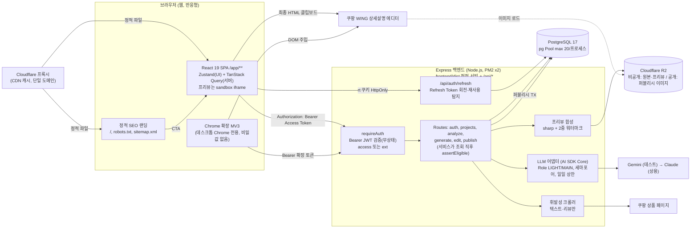

# Coupang AI Detail Maker - PRD (v0.3.12 초안)

## 1. 문서 정보

| 항목 | 내용 |
|---|---|
| 문서 | Coupang AI Detail Maker 제품 요구사항 정의서(PRD) |
| 버전 | v0.3.12 (초안) |
| 작성일 | 2026-09-30 |
| 작성자 | hyunboee (Claude 작성) |
| 기준 도메인 정의서 버전 | v0.3.13 |
| 참조 문서 | `prompts/PRD생성.md` (PRD 작성 지침, 우선 적용), `docs/1-domain-definition.md` (도메인 정의서 v0.3.13), `valuate/1-domain-definition-v0.2-evaluation.md` (도메인 평가 38/50) |
| 우선순위 원칙 | PRD 지침과 도메인 정의서가 충돌하면 PRD 지침을 따른다. v0.1의 충돌 목록(10장)은 도메인 v0.3에서 모두 반영됐다 |

**표기 규약**
- `[가정]`: 이해관계자 확인이 필요한 PRD 작성자 판단. BR/D/R/KPI/P ID는 도메인 정의서의 ID다. PRD에서 새로 만든 항목에는 `PRD-` 접두어를 붙인다.
- 우선순위: M(Must, MVP. P1 2일 핵심 슬라이스 + P2 MVP 완성, 4.1), S(Should, MVP 직후), C(Could), W(Won't, 이번 범위 아님)

### 문서 변경 이력

> 새 행은 표 맨 위에 추가한다.
> 도메인 정의서가 갱신되면 PRD도 갱신하고 기준 도메인 버전을 기록한다.

| 버전 | 일자 | 변경자 | 기준 도메인 버전 | 변경내용 |
|---|---|---|---|---|
| v0.3.12 | 2026-10-01 | hyunboee (Claude 작성) | v0.3.13 | 의존 예외(require-auth)·일일 상한 안내 방식 정리: FR-29(429 초기화 시각은 프론트 고정 문구로 안내, DEC-10), 7.2 표 머리말의 도메인 버전 |
| v0.3.11 | 2026-10-01 | hyunboee (Claude 작성) | v0.3.12 | 백엔드 구현 기준 최신화: 7.2 표(Routes에 `me`, `requireAuth` 구현 범위, 머리말의 도메인 버전), 8장(표의 미구현 S 경로 표시, 구현 확정 응답 문단에 응답 형태·400 판정 시점). 규칙 변경 없음 |
| v0.3.10 | 2026-10-01 | hyunboee (Claude 작성) | v0.3.11 | 개발용 CORS·Swagger UI 반영: NFR-09, 7.2 표 머리말의 도메인 버전, 8장(개발용 경로 문단), 11.2 PRD-D-2(7.1·7.6 본문은 변경 없음) |
| v0.3.9 | 2026-10-01 | hyunboee (Claude 작성) | v0.3.10 | 백엔드 구현 [가정] 반영: FR-14, FR-22(이미지 참조·공개 키·재시도 시점), 5.8 클레임(`iss`·`aud`), 7.2 표(`assertEligible(userId, db)`, 머리말의 도메인 버전), 7.3 문구, 8장(구현 확정 응답 문단), 11.1 PRD-R-12·PRD-R-13·PRD-R-14 신설 |
| v0.3.8 | 2026-09-30 | hyunboee (Claude 작성) | v0.3.9 | DB-01~03 구현 후속 정합화: NFR-07(비밀값 스캔 패턴 `DATABASE_URL` → `postgresql://`), 7.2 표 머리말의 도메인 버전 |
| v0.3.7 | 2026-09-30 | hyunboee (Claude 작성) | v0.3.8 | 권장안 반영: 자격 검사 서비스 내 판정, 퍼블리시 TX 잔액 선검사, PG Should 근거. FR-06, FR-10, FR-21, 4.2 PG 결제 행, 5.8 클레임 문구, 7.2 표, 7.3 SQL, 7.5 다이어그램, 9장 P2 1~2일 차, 10장 #7 |
| v0.3.6 | 2026-09-30 | hyunboee (Claude 작성) | v0.3.7 | 문서 간 정합성 재점검 반영: FR-06(자격 검사 대상에 폼 저장 추가, DEC-05·FR-10), 4.2 제목·PG 결제 행, 7.2 표 머리말의 도메인 버전, PRD-R-6(M3 → M4), 11.2 PRD-D-6·PRD-D-7 기한(P1 1일 차 명시) |
| v0.3.5 | 2026-09-30 | hyunboee (Claude 작성) | v0.3.6 | MVP 일정·범위 2단계(P1 2일 핵심 슬라이스, P2 MVP 완성) 재조정(Claude 위임 결정). 1장 표기 규약, G-1, 2.3 검증 시점, 4.1 Must, 4.2 근거(2단계 행, Chrome 확장 행), 9장 일정·마일스톤(M1~M3 재정의, 기존 M3·M4 → M4·M5), PRD-R-1, PRD-R-2, 11.2 도메인 D-3 기한(M3 → M4). 세부 Task는 `docs/8-pan.md` v0.1.3 |
| v0.3.4 | 2026-09-30 | hyunboee (Claude 작성) | v0.3.5 | 권장안 반영: 폼 저장 version+1, 최종 HTML 편집 속성 제거. FR-10, FR-14, FR-22, FR-34 |
| v0.3.3 | 2026-09-30 | hyunboee (Claude 작성) | v0.3.4 | 미결 결정 DEC-01~10 반영(Claude 위임 결정): FR-06(403 우선), FR-10(폼 저장 `PUT /form`), FR-14·FR-17(`data-edit-id`, editId), FR-16(data URI), FR-29(Asia/Seoul 자정), FR-40(`TOKEN_INVALID`), NFR-06·NFR-09·NFR-15(단일 출처, Cloudflare), 7.1 랜딩·저장소 행, 7.4 projects 카운트 CHECK(하한만), 7.5 다이어그램, 7.6 배포, 8장(form API, preview `blocks`, edits body, 오류 코드·판정 순서), 11.2 PRD-D-2·D-3·D-4·도메인 D-12 |
| v0.3.2 | 2026-09-30 | hyunboee (Claude 작성) | v0.3.3 | 문서 간 정합성 점검 반영: FR-02(OAuth 가입자 email_verified, BR-04), FR-06(PUBLISHED 대상 요청은 자격 검사 전 처리, BR-13·BR-46), FR-12(분석 선점 복원 범위, BR-26·BR-47), FR-16(C-1 교차 참조), 1장 참조 도메인 버전, 7.2 표 머리말, 7.3 주석, 7.4 projects(created_at, 제약 참조), 8장(projects 응답 필드, publish 행, 오류 코드 문구), PRD-D-2(C-3 교차 참조) |
| v0.3.1 | 2026-09-30 | hyunboee (Claude 작성) | v0.3.2 | 도메인 v0.3.2(JWT 인증 반영, BR-06 신설) 기준으로 갱신. 10장 #23을 반영됨으로 변경, FR-36~40의 BR 열에 BR-06 추가 |
| v0.3 | 2026-09-30 | hyunboee (Claude 작성) | v0.3.1 | 인증 방식을 세션에서 JWT(Access Token + Refresh Token)로 확정(PRD-D-1 확정). 5.8절 인증 토큰 명세 신설(FR-36~40). 변경: FR-01, FR-02, FR-05, FR-24, NFR-04, NFR-09, 4.1 Must, 7.1 인증 행, 7.2 requireAuth 행, 7.4 sessions → refresh_tokens, 7.5 다이어그램, 8장 API(`/api/auth/refresh` 추가), 9장 1일 차 오전, 10장 #6, 11.2 PRD-D-1. 도메인 D-1(세션 방식)과 불일치하므로 도메인 갱신 필요(10장 #23) |
| v0.2.1 | 2026-09-30 | hyunboee (Claude 작성) | v0.3.1 | 기준 도메인 버전 갱신만 반영(도메인 v0.3.1의 BR-48 예외는 FR-34에 이미 반영되어 있어 본문 변경 없음) |
| v0.2 | 2026-09-30 | hyunboee (Claude 작성) | v0.3 | 도메인 v0.3 정합화. 자격 미들웨어를 `requireEligible`로 바꾸고 USP 선택 저장과 이메일 인증(BR-04) 검사를 포함, version 낙관적 잠금(BR-48)·진행 중 작업 1건 제한(BR-39)·선점 만료 복원(BR-47, D-30) 추가, 분석 시도 상한에 실패 포함(BR-26, D-27), 운영자 지급 원장 표기(PURCHASE/TOPUP, pgTxId 없음) 명시, BR 참조 갱신(BR-33 → BR-11, BR-05·18·27·54·66·75·76 추가), 10장 22건 반영됨 표시. 추가: FR-34, FR-35, PRD-D-7. 변경: FR-01, FR-04, FR-06, FR-07, FR-09, FR-10, FR-12, FR-15, FR-16, FR-19, FR-21, FR-22, FR-29, NFR-03, NFR-08, API 표(자격 열, `*` version·409 규칙, usps/analyze/generate/regenerate/edits/ai-edits/publish에 FR-34·35), PRD-V-6, PRD-R-2·3·4·7·8·10, 7.2~7.4 |
| v0.1 | 2026-09-30 | hyunboee (Claude 작성) | v0.2 | 최초 초안. PRD 지침 기준으로 기술 스택(React 19 SPA + Express/pg + PostgreSQL 17)과 2일 MVP 범위를 정의. 도메인 평가의 치명적 결함 4건(WING 스타일 깨짐, 서명 URL 만료, 계정 단위 원가 상한 부재, Middleware 잔액 검사 충돌)을 FR-21, FR-22, FR-29, FR-06에 반영 |

---

## 2. 개요

### 2.1 배경과 문제
- 상세페이지를 기획하고 디자인하는 데 시간과 외주비가 많이 든다.
- 경쟁사 벤치마킹, 상세페이지 제작, WING 업로드가 각각 따로 이루어진다.
- 결제 전에 AI 결과물을 무단으로 가져가는 것을 막을 수단이 필요하다.
- 웹 결제 기반의 고마진 수익 구조와 검색 유입 채널이 필요하다.

### 2.2 목표
| ID | 목표 |
|---|---|
| G-1 | 1인 개발로 2일(P1) 안에 "가입·로그인 → 폼 입력 → 생성 → 워터마크 프리뷰 → 확정(크레딧 차감) → WING용 HTML 복사" 핵심 슬라이스를 끝까지 동작시키고, P2에서 "분석(선택) → 생성 → 편집 → 확정 → WING용 HTML 확보" 전체 MVP를 완성해 공개 출시한다(4.1, 9장) |
| G-2 | 동시 접속 1,000명을 견디는 구조로 만든다(NFR-01~06) |
| G-3 | 퍼블리시 전에는 게시 가능한 완성본(워터마크 없는 최종 HTML, 공개 이미지 사본)과 원본 이미지가 클라이언트에 나가지 않게 한다(BR-53) |
| G-4 | LLM 원가를 계정 단위로 제한해 마진을 지킨다(KPI-4) |

### 2.3 성공 지표

**MVP 검증 지표 (P2 종료 시점, 공개 출시 전 확인. P1 종료 시점의 검증 대상 아님)**

| ID | 지표 | 기준 |
|---|---|---|
| PRD-V-1 | E2E 성공률(가입 → 생성 → 편집 → 퍼블리시 → HTML 복사) | 10회 중 9회 이상 |
| PRD-V-2 | 생성 응답 시간(BR-37, KPI-7) | 테스트 10회 p90 60초 이하 |
| PRD-V-3 | 동시 퍼블리시 요청 2건 | DEDUCT 1건, 잔액 1 감소(AC-BR13) |
| PRD-V-4 | 퍼블리시 전 모든 API 응답의 원본 이미지 URL | 0건(AC-BR32) |
| PRD-V-5 | 부하 테스트(비 LLM API, 가상 사용자 1,000명) | p95 300ms 이하, 오류율 1% 미만 |
| PRD-V-6 | LLM mock 부하 테스트(동시 생성 요청 200건) | 큐 초과분은 503 + Retry-After, 서버 다운 0회, 선점 누수 0건(AC-BR76) |
| PRD-V-7 | 최종 HTML을 WING 상세설명에 수동 붙여넣기 | 스타일과 이미지가 깨지지 않음(1회 이상 실측) |

**출시 후 KPI**: 도메인 KPI-1~7을 그대로 쓴다. 목표값은 모두 가정(D-26)이다. KPI-4 원가는 퍼블리시하지 않은 프로젝트의 원가까지 포함해 계산한다(평가 지적 반영).

---

## 3. 목표 사용자 `[가정]`

| 항목 | 내용 |
|---|---|
| 주 사용자 | 부업이나 N잡으로 쿠팡 판매를 시작하는 학생과 20~50대 직장인 셀러(1인, 쿠팡 입점 초기 단계) |
| 조화 근거 | PRD 지침의 "학생·20~50대 직장인"과 도메인의 "쿠팡 초보·소규모 셀러"를 합친 것이다(도메인 D-33). 디자인 역량과 시간이 부족하고 외주 비용에 민감하다 |
| 사용 환경 | 작업(생성·편집·확정)은 웹 어디서나 가능하다. WING 자동 주입은 데스크톱 Chrome에서만 된다 |
| 페르소나별 상세 시나리오 | 범위 외(PRD 지침) |

---

## 4. 범위

### 4.1 MoSCoW

| 구분 | 항목 |
|---|---|
| Must (MVP) | 이메일/비밀번호 가입·로그인, JWT 인증(Access Token + Refresh Token 회전), 사용 자격 검사(이메일 인증 + 잔액), 관리자 스크립트로 크레딧 수동 지급, 프로젝트 생성, 이미지 업로드와 워터마크 프리뷰 사본, 경쟁사 분석(LIGHT)과 분석 생략, 생성·재생성(MAIN), 서버 프리뷰 합성(2중 워터마크), 블록 텍스트 수동 편집, 프로젝트 version 잠금, 진행 중 작업 1건 제한과 선점 만료 복원, 퍼블리시 TX, WING 호환 최종 HTML(인라인 CSS, 영구 이미지 URL), 클립보드 복사, LLM Role 어댑터, 사용량 로그, 계정 단위 LLM 상한, LLM 동시성 제한, 정적 SEO 랜딩 1장, 반응형 레이아웃 |
| Should (MVP 직후) | Google OAuth, 이메일 인증 메일 발송(BR-04), PG 충전 결제와 웹훅, AI 부분 수정, 확장 토큰 발급, Chrome 확장 주입과 결과 보고 |
| Could | Kakao·Naver OAuth, 드래그·리사이즈 편집, 원격 WING 셀렉터, Prompt Caching(Claude 전환 뒤), 가격·가이드 정적 페이지, PG 기반 작업 큐 |
| Won't (이번 범위 아님) | 구독 플랜과 주기별 크레딧 소멸·상태 전이(BR-16, 17 중 구독 부분, BR-18), 환불(D-32), WING 등록 제출 자동화(D-23), 네이티브 모바일 앱 |

M은 P1(2일 핵심 슬라이스)과 P2(MVP 완성)로 나눠 진행한다(`docs/8-plan.md` 참조). 우선순위 라벨(M/S/C)은 바뀌지 않는다.

### 4.2 MVP 범위 결정 근거

| 제외·축소 항목 | 근거 |
|---|---|
| M 일정 2단계: P1 2일 핵심 슬라이스(14h + 예비 2h) → P2 MVP 완성(35.5h, 5일), 전체 7일 (2026-09-30 Claude 위임 결정) | M 추정 합계 49.5h가 2일(16h)을 넘는다. PRD 지침의 "2일 내 핵심 기능 완성"은 핵심 흐름 완성으로 해석한다. 1인·저예산이라 인원 추가는 불가하고, 품질·보안 불변식(키 서버 보관, 퍼블리시 전 콘텐츠 비노출, 서버 워터마크, 퍼블리시 TX 원자성·멱등, Access Token 검증, LLM Role 어댑터)을 깎아 16h에 맞추는 것보다 범위를 나누는 것이 안전하다. 추정치는 줄이지 않았다. P1은 이미지 없이 텍스트 중심으로 생성하고 로컬(또는 단일 서버)에서만 동작하며, 공개 출시와 PRD-V 검증은 P2 끝이다 |
| PG 결제 → S | PG 가맹 심사·사업자 서류는 외부 일정이라 개발 일수(P1 2일 + P2 5일)와 무관하게 MVP 안 완료를 보장할 수 없다. MVP는 관리자 스크립트로 크레딧을 지급한다(FR-07). 원장 구조는 그대로 두어 이후 PG 웹훅이 같은 원장에 기록하게 한다 |
| 구독 → W | 주기 관리, 소멸, Cron, 상태 전이까지 필요해 규칙 중 가장 복잡하다. 충전 크레딧만으로도 과금 모델을 검증할 수 있다 |
| 소셜 로그인 3종 → Google만 S | 앱마다 OAuth 앱 등록과 검수가 필요하다. Kakao는 비즈 앱 전환 전에는 이메일을 받지 못할 수 있다. 가입은 Credentials 하나로도 E2E가 된다 |
| 이메일 인증 메일 → S | 메일 발송 서비스 연동이 필요하다. 계정 요건 검사(BR-04)는 MVP에도 두고, MVP는 운영자가 크레딧 지급 시 `email_verified`를 함께 설정한다(PRD-D-7) |
| AI 부분 수정 → S | 재생성과 수동 편집으로 핵심 흐름이 완성된다. 조건부 카운트 로직은 스키마에 먼저 넣어 둔다 |
| Chrome 확장 → S | 클립보드 복사 폴백(BR-65)으로 WING 등록 흐름이 끝까지 이어진다. P2 마지막 날에 시간이 남으면 착수한다 |

### 4.3 범위 외
- 페르소나별 상세 시나리오: 범위 외
- 접근성: 범위 외
- 모바일 전용 UX: 범위 외(반응형만 적용)

---

## 5. 기능 요구사항

> 수용 기준은 핵심만 적는다. 도메인 AC가 있으면 AC ID로 대신한다.

### 5.1 인증·자격

| FR | 우선 | 설명 | BR | 수용 기준 |
|---|---|---|---|---|
| FR-01 | M | 이메일/비밀번호 가입·로그인·로그아웃. 비밀번호는 bcrypt 해시로 저장. User 생성과 같은 TX에서 Wallet(0) 생성(UserSignedUp). 가입 직후 `email_verified=false`. 로그인 성공 시 Access Token과 Refresh Token을 발급하고(FR-36), 로그아웃 시 Refresh Token을 폐기한다(FR-39) | BR-01, BR-05 | AC-BR05. 틀린 비밀번호는 401, 토큰 발급 0건 |
| FR-02 | S | Google OAuth 로그인(Passport는 OAuth 처리에만 쓰고 `session: false`). 검증된 같은 이메일이면 기존 계정에 연결. 콜백에서 Refresh Token 쿠키만 설정하고 SPA로 리다이렉트한다. 토큰을 URL 쿼리에 넣지 않는다. SPA는 FR-37로 Access Token을 받는다. Google 가입자는 가입 시 `email_verified=true`(BR-04) | BR-01, BR-02, BR-04 | AC-BR02. 콜백 리다이렉트 URL에 토큰 문자열 0건 |
| FR-03 | C | Kakao·Naver OAuth. 이메일을 받지 못하면 이메일 입력을 추가로 요구 | BR-01, BR-02 | 이메일 미제공 시 계정 자동 연결 0건 |
| FR-04 | S | Credentials 가입자 이메일 인증 메일 발송과 확인. 완료 시 `email_verified=true`(EmailVerified). 인증 전에는 자격 검사 대상 API 불가(FR-06) | BR-04 | AC-BR04 |
| FR-05 | M | Express 인증 미들웨어 `requireAuth`. `/api/*` 전체에서 `Authorization: Bearer <JWT>`를 검증한다. 웹 요청은 Access Token(`typ=access`), 확장 요청은 확장 토큰(`typ=ext`, FR-24)이며 `typ`별로 허용 라우트를 나눈다. 검증은 서명·`exp`·`iss`·`aud`·`typ`만 보고 DB를 조회하지 않는다(무상태). 예외는 `/api/auth/*`, 서명을 검증하는 `/api/billing/webhook`. **인증만 하고 잔액은 보지 않는다** | BR-03, P-3 | AC-BR03. 만료 토큰은 401 `TOKEN_EXPIRED`, 서명 오류·`typ` 불일치는 401 `TOKEN_INVALID` |
| FR-06 | M | 자격 판정 함수 `assertEligible(user)` 하나를 자격 검사 대상 API에서만 호출한다(미들웨어로 먼저 실행하지 않는다): 프로젝트 생성, 폼 저장, 에셋 업로드, 분석, USP 선택 저장, 생성·재생성, 수동 편집, AI 수정, 퍼블리시. 사용 자격 = 계정 요건(`email_verified=true`, 미충족 403) + 크레딧 요건(잔액 합계 1 이상, 미충족 402). 구독 여부는 무관. 두 요건이 모두 미충족이면 403을 우선한다. 조회(프로젝트·프리뷰·최종 HTML), 확장 토큰 발급, 주입 결과 보고에는 호출하지 않는다. MVP는 FR-07이 `email_verified`를 설정한다(PRD-D-7). 프로젝트 대상 API(분석, USP 저장, 폼 저장, 생성, 재생성, 수동 편집, AI 수정, 퍼블리시, 에셋 업로드)는 미들웨어 대신 서비스가 프로젝트를 조회한 직후 소유 확인(404) → PUBLISHED 확인 → `assertEligible` 순으로 판정하고, 프로젝트가 아직 없는 `POST /api/projects`만 라우트 단계에서 `assertEligible`을 호출한다. PUBLISHED 프로젝트 대상 요청은 자격 검사 전에 처리한다: 퍼블리시 재요청은 기존 결과를 반환하고(BR-13, 퍼블리시는 FR-21 TX 안에서 PUBLISHED 확인 뒤 자격 확인), 그 밖의 변경 요청은 잔액이 0이어도 409(BR-46) | BR-03, BR-04, BR-10, BR-13, BR-46, P-3 | AC-BR04, AC-BR10. 잔액 1에서 퍼블리시 후 잔액 0이어도 최종 HTML 조회와 토큰 발급이 200, 퍼블리시 재요청은 200, 편집은 409 |

### 5.2 크레딧·결제

| FR | 우선 | 설명 | BR | 수용 기준 |
|---|---|---|---|---|
| FR-07 | M | 관리자 CLI 스크립트(`node scripts/grant.js <email> <n>`)로 충전 크레딧 지급. 운영자 수동 지급 원장은 `reason=PURCHASE, source=TOPUP, pg_tx_id=NULL`(CreditPurchased). Wallet과 원장을 한 TX에서 갱신하고 같은 TX에서 `email_verified=true` 설정(PRD-D-7) | BR-14, BR-15, BR-17 | 지급 후 잔액 = 원장 합계, 원장 reason=PURCHASE |
| FR-08 | S | PG 충전 결제(checkout)와 서명 검증 웹훅. `pgTxId` 유니크 제약으로 멱등 처리 | BR-17 | 같은 웹훅 2회 수신 시 PURCHASE 1건 |
| FR-09 | W | 구독 플랜, 주기별 GRANT·EXPIRE, 구독 크레딧 우선 차감, 구독 상태 전이(SubscriptionCanceled, SubscriptionPastDue, 유예 D-34) | BR-16, BR-17, BR-18 | - |

### 5.3 프로젝트·에셋·분석

| FR | 우선 | 설명 | BR | 수용 기준 |
|---|---|---|---|---|
| FR-10 | M | 프로젝트 생성(DRAFT, version 1)과 폼 저장, 내 프로젝트 목록·상세 조회. `POST /api/projects`는 `form`을 선택적으로 받고, 이후 `PUT /api/projects/:id/form`(body `{form, version}`, 자격 FR-06, version 확인 FR-34)으로 저장하며, 성공하면 version+1 한다. DRAFT·ANALYZED에서만 허용하고 그 외 상태는 409. 필수값 검증(BR-35)은 저장 시가 아니라 생성 요청(FR-14) 시점에 한다 | BR-38 | AC-BR38. GENERATED에서 폼 저장은 409 |
| FR-11 | M | 이미지 업로드(최대 10장, 장당 10MB, jpg/png/webp). 원본은 비공개 저장소에, 폭 390px 이하로 줄이고 워터마크를 합성한 프리뷰 사본은 별도 경로에 저장 | BR-36, BR-50 | AC-BR36, 프리뷰 사본 폭 390px 이하 |
| FR-12 | M | 경쟁사 분석: 쿠팡 상품 URL 형식 검증, 텍스트·리뷰만 휘발성으로 수집, LIGHT 모델로 USP 후보 추출, 사용자가 선택한 USP를 Project.selectedUsps에 저장(단일 원천, UspSelected) 후 ANALYZED로 전이. 분석·USP 저장은 DRAFT·ANALYZED에서만 가능, ANALYZED에서 재분석하면 선택을 비우고 DRAFT. **분석 시도는 프로젝트당 3회(D-27)이며 실패한 시도도 포함한다**: LLM 호출 전 `analyze_count`를 선점하고 실패해도 복원하지 않는다(URL 검증 400과 LLM 미호출 거절 429·503은 시도로 세지 않고 복원, BR-26, BR-47) | BR-20~27, BR-47 | AC-BR20~27. 실패 포함 4번째 분석 요청은 429(크롤링·LLM 0회). GENERATED에서 분석·USP 저장은 409 |
| FR-13 | M | 분석 생략 경로(selectedUsps = []) | BR-25 | AC-BR25 |

### 5.4 생성·편집

| FR | 우선 | 설명 | BR | 수용 기준 |
|---|---|---|---|---|
| FR-14 | M | MAIN 모델로 상세페이지 생성. 폼 필수값 검증. 출력은 루트 폭 780px, **인라인 CSS 전용**(class 스타일 의존 금지), `<script>`·`<link>`·`<style>` 금지, 최상위 섹션마다 `data-block-id`, 편집 대상 텍스트 요소마다 블록 내 고유 `data-edit-id`(FR-17). 서버가 출력을 검증하고 금지 요소를 제거하며 `data-edit-id`를 부여. 이미지는 `` 참조만 허용하고(그 외 `src`의 img는 제거, 원본 키·URL은 draftHtml에 넣지 않음), 서버가 프리뷰·최종 HTML에서 실제 URL로 바꾼다. 이 속성들은 draftHtml용이며 최종 HTML에서는 제거(FR-22) | BR-30, 31, 35, 37 | AC-BR35. 결과에 script·link·style 0개, class 속성 0개, 모든 섹션에 data-block-id |
| FR-15 | M | 재생성(프로젝트당 3회, 조건부 원자 UPDATE로 선점하고 실패하면 복원). 재생성은 차감하지 않는다. 진행 중 작업 제한은 FR-35 | BR-11, BR-34, BR-47 | AC-BR34 |
| FR-16 | M | 서버 프리뷰 합성: draftHtml의 이미지를 프리뷰 사본으로 바꾸고, 최상단 사선 오버레이와 블록별 반복 워터마크를 넣는다. 클라이언트는 프리뷰를 `sandbox` iframe(스크립트 불가)으로 렌더링. 프리뷰 이미지는 서버가 비공개 버킷의 390px 사본(`preview_key`)을 읽어 `data:image/webp;base64,...`로 프리뷰 HTML에 인라인한다(sandbox iframe은 인증 헤더를 못 보내고, 서명 URL은 비공개 버킷 URL을 응답에 노출하므로 쓰지 않는다. D-21). 프리뷰 응답에는 편집용 `blocks`도 포함한다(FR-17) | BR-32, 50, 51, 53, 54 | AC-BR50, AC-BR51, AC-BR54, PRD-V-4 |
| FR-17 | M | 블록 텍스트 수동 편집. 서버가 생성 결과 정제 시 편집 대상 텍스트 요소에 블록 내 고유 `data-edit-id`를 부여하고, 프리뷰 응답에 `blocks: [{blockId, fields: [{editId, text}]}]`를 함께 반환한다. 에디터는 우측 패널 목록에서 블록·필드를 골라 편집한다(iframe 안 클릭 선택 없음). 클라이언트는 `{blockId, editId, text, version}`만 보내고 서버가 해당 요소의 텍스트 노드만 바꿔 draftHtml에 적용한 뒤 새 프리뷰를 반환. HTML 전체 덮어쓰기는 거절 | BR-40, 44 | AC-BR40. payload에 HTML 태그가 있으면 400 |
| FR-18 | C | 요소 드래그·리사이즈(인라인 style의 위치·크기 값만 변경) | BR-40, 44 | 변경은 style 속성에만 반영 |
| FR-19 | S | AI 부분 수정: LIGHT 모델, 지정 블록만 변경, 성공 3회·실패 6회 상한(둘 다 조건부 원자 UPDATE) | BR-41, 42, 43, 45, 47 | AC-BR41, 43, 45 |
| FR-20 | M | PUBLISHED 프로젝트는 읽기 전용 | BR-46 | AC-BR46 |
| FR-34 | M | 프로젝트 version 낙관적 잠금: draftHtml·상태·폼(form)을 바꾸는 요청(8장 `*` API)은 클라이언트가 기준 version을 body로 보낸다. 현재 version과 다르면 409, 성공할 때마다 version+1. 늦게 도착한 LLM 결과의 기준 version이 현재와 다르면 결과를 버리고 선점을 복원. 이미 PUBLISHED인 프로젝트의 퍼블리시 재요청은 version 검사 없이 기존 결과를 반환(BR-13) | BR-48, BR-13 | AC-BR48 |
| FR-35 | M | 진행 중 작업 1건 제한: LLM 작업(분석, 생성, 재생성, AI 수정) 시작 시 `active_job_type`을 조건부 UPDATE로 설정하고 끝나면 해제. 진행 중이면 새 LLM 작업(중복 생성 포함)·편집·USP 저장·퍼블리시는 409. 선점 뒤 5분(D-30) 안에 확정·복원되지 않으면 주기 작업이 선점을 복원하고 작업 표시를 해제(ReservationExpired) | BR-39, BR-47 | AC-BR39, AC-BR47. 동시 생성 요청 2건 중 1건은 409, 재생성 중 퍼블리시는 409·차감 0건 |

### 5.5 퍼블리시·WING

| FR | 우선 | 설명 | BR | 수용 기준 |
|---|---|---|---|---|
| FR-21 | M | 퍼블리시 TX(pg `BEGIN`~`COMMIT`): 프로젝트 행 `FOR UPDATE` 잠금 → 이미 PUBLISHED면 기존 결과 반환, 아니면 이메일 인증(403)·잔액(402) 선검사 → version·진행 중 작업 확인(FR-34, FR-35) → DEDUCT 원장 INSERT(부분 유니크 인덱스, `ON CONFLICT DO NOTHING`) → 잔액 차감(CHECK ≥ 0) → finalHtml 저장·PUBLISHED 전이 → PublishRecord 생성. 하나라도 실패하면 `ROLLBACK` | BR-11~15, 39, 48, 52, P-5 | AC-BR11, 12, 13, 14. 잔액 0이면 402(version 불일치여도 402) |
| FR-22 | M | WING 호환 최종 HTML: 워터마크와 편집기 전용 속성(`data-edit-id`, `data-block-id`)을 제거하고(draftHtml에는 유지), 원본 이미지를 **만료되지 않는 공개 URL**(추측할 수 없는 UUID 경로)로 복사해 참조한다. 공개 키는 `{assetId}.{ext}`(ext: jpg·png·webp), 최종 HTML의 img는 `PUBLIC_IMAGE_BASE_URL/{assetId}.{ext}`다. 서명 URL은 쓰지 않는다. 퍼블리시 TX가 커밋된 뒤에만 공개 사본을 만들고(PublicImagesCopied), 실패하면 3회까지 시도한 뒤 로그만 남기고 크레딧은 유지한다. 실패한 사본은 퍼블리시 재요청(PUBLISHED 포함)과 `GET /final`이 응답 전에 다시 시도하며, 응답은 사본 준비 여부와 무관하게 최종 HTML이다 | BR-52, BR-66, D-12, R-7 | AC-BR52, AC-BR66(퍼블리시 전 공개 사본 0건, 30일 뒤 이미지 200) |
| FR-23 | M | 최종 HTML 클립보드 복사 버튼과 WING 붙여넣기 안내 | BR-62, 65 | 복사 후 잔액 불변, 재복사 무제한 |
| FR-24 | S | 확장 토큰 발급(PUBLISHED 1건 범위, 10분 만료). 확장 토큰은 별도 비밀키로 서명한 JWT(`typ=ext`, `sub`=userId, `prj`=projectId)이며 최종 HTML 조회와 결과 보고에만 쓸 수 있다. Refresh Token은 발급하지 않는다. 웹 페이지가 `chrome.runtime.sendMessage`(externally_connectable)로 확장에 전달 | BR-60 | AC-BR60 |
| FR-25 | S | Chrome 확장(MV3): WING 상품등록 페이지의 상세설명 에디터 DOM에만 주입, 결과를 `/api/projects/:id/publish-report`로 보고, 실패하면 클립보드 폴백. 비밀값 없음. 등록 제출은 사용자가 직접 | BR-61, 62, 63, 64, 65 | AC-BR61, 63, 64, 65 |
| FR-26 | C | WING 셀렉터를 서버 설정 API로 원격 제공 | BR-65, D-7 | 서버 값 변경 후 확장 재배포 없이 반영 |

### 5.6 LLM·원가 방어

| FR | 우선 | 설명 | BR | 수용 기준 |
|---|---|---|---|---|
| FR-27 | M | LLM 어댑터: 도메인 코드는 `callRole('LIGHT' \| 'MAIN', input)`만 호출. Provider와 모델 ID는 서버 환경변수로 매핑 | BR-70, 71 | 환경변수만 바꿔 Gemini에서 Claude로 전환, 서비스 코드 수정 0줄 |
| FR-28 | M | 모든 LLM 호출(실패 포함)을 LlmUsageLog에 기록(role, provider, model, tokens, latency, costEstimate, success, userId) | BR-73 | 호출 N회 = 로그 N건 |
| FR-29 | M | **계정 단위 LLM 상한**: 사용자별 1일 MAIN 호출 20회, LIGHT 호출 50회(실패 포함, LlmUsageLog 집계 기준, D-28). "1일"은 Asia/Seoul 자정 기준이며 집계는 `created_at >= date_trunc('day', now() AT TIME ZONE 'Asia/Seoul') AT TIME ZONE 'Asia/Seoul'`, 초기화 시각은 고정이라 429 응답에 별도 필드를 두지 않고(`{error:{code,message}}` 유지) 프론트엔드가 고정 문구("내일 0시(한국 시간)에 초기화")로 안내한다(DEC-10). 초과 시 LLM을 호출하지 않고 429(LlmCallRejected) `[가정]` | BR-75, D-28, R-6 | AC-BR75. 21번째 MAIN 요청은 429, LLM 호출 0회 |
| FR-30 | C | Provider가 Anthropic이면 고정 시스템 프롬프트에 Prompt Caching 적용 | BR-72 | 캐시 TTL 안에서 두 번째 호출의 cached=true |

### 5.7 SEO 랜딩

| FR | 우선 | 설명 | BR | 수용 기준 |
|---|---|---|---|---|
| FR-31 | M | 정적 HTML 랜딩 `/`(빌드 시 생성, JS 없이 본문·title·description 포함), `robots.txt`, `sitemap.xml`. CTA는 `/app/login`으로 연결 | BR-80, 82 | AC-BR80(`/`만), AC-BR82 |
| FR-32 | M | SPA `/app/**`는 noindex 메타, robots.txt Disallow | BR-81 | AC-BR81 |
| FR-33 | C | `/pricing`, `/guide` 정적 페이지 | BR-80 | AC-BR80 |

### 5.8 인증 토큰 (JWT + Access Token + Refresh Token)

**토큰 명세**

| 항목 | Access Token | Refresh Token |
|---|---|---|
| 형식 | JWT, `HS256`, 라이브러리 `jsonwebtoken` | JWT, `HS256`, 라이브러리 `jsonwebtoken` |
| 서명 키 | `JWT_ACCESS_SECRET` (백엔드 환경변수, 32바이트 이상 난수) | `JWT_REFRESH_SECRET` (Access용과 다른 키) |
| 클레임 | `sub`(userId), `typ=access`, `iss`, `aud`, `iat`, `exp` | `sub`(userId), `typ=refresh`, `jti`, `fam`(토큰 패밀리 ID), `iss`, `aud`, `iat`, `exp` (`iss`·`aud`는 둘 다 `cal-todo`, 구현이 정한 값) |
| 만료 `[가정]` | 15분 | 14일(회전할 때마다 새 14일. 패밀리 최초 발급 후 최대 30일) |
| 전달 | 응답 body `{accessToken, expiresIn}` → 요청마다 `Authorization: Bearer` 헤더 | `Set-Cookie: rt=<JWT>; HttpOnly; Secure; SameSite=Strict; Path=/api/auth` |
| 클라이언트 보관 | 메모리(Zustand 인증 슬라이스)만. localStorage·sessionStorage 금지 | httpOnly 쿠키라 JS가 읽을 수 없음 |
| 서버 저장 | 저장하지 않음(무상태 검증) | `refresh_tokens` 테이블에 `jti`, `token_hash`(SHA-256), `family_id`, `expires_at`, `revoked_at`, `replaced_by` |
| 폐기 | 만료까지 유효(최대 15분, 수용) | 로그아웃·재사용 탐지·비밀번호 변경 시 DB에서 폐기 |

- 서명 검증 시 알고리즘을 `['HS256']`로 고정하고 `alg: none`과 다른 알고리즘은 거절한다.
- 클레임에 이메일 인증 여부·잔액 같은 자격 정보는 넣지 않는다. 자격은 `assertEligible`이 DB에서 매번 확인한다(FR-06). 토큰이 살아 있는 동안 자격이 바뀌어도 즉시 반영된다.

| FR | 우선 | 설명 | BR | 수용 기준 |
|---|---|---|---|---|
| FR-36 | M | 토큰 발급: 로그인·가입·OAuth 콜백 성공 시 새 패밀리(`family_id`)로 Refresh Token을 만들어 `refresh_tokens`에 저장하고 쿠키로 설정한다. Access Token은 로그인 응답 body로 준다(OAuth는 FR-37로 받음) | BR-01, BR-03, BR-06 | 로그인 응답에 accessToken 존재, `rt` 쿠키에 HttpOnly·Secure·SameSite=Strict, DB에 refresh 행 1건 |
| FR-37 | M | 토큰 갱신 `POST /api/auth/refresh`: `rt` 쿠키를 검증하고 DB 행이 유효(미폐기·미만료)하면 **회전**한다. 한 pg TX에서 기존 행에 `revoked_at`과 `replaced_by`를 기록하고, 같은 패밀리로 새 Refresh Token을 만들고, 새 Access Token을 반환한다. `Origin` 헤더가 프론트 도메인이 아니면 403 | BR-03, BR-06 | 갱신 후 이전 `rt`로 다시 갱신하면 401. 응답의 새 `rt`는 이전 값과 다름 |
| FR-38 | M | 재사용 탐지: 이미 회전·폐기된 Refresh Token이 다시 제출되면 탈취로 보고 **해당 패밀리 전체를 폐기**하고 401을 반환한다. 사용자는 다시 로그인해야 한다 | BR-03, BR-06 | 회전 전 토큰 재제출 → 같은 family의 모든 행 revoked, 최신 토큰으로 갱신해도 401 |
| FR-39 | M | 로그아웃 `POST /api/auth/logout`: 현재 Refresh Token 패밀리를 폐기하고 `rt` 쿠키를 삭제한다(`Max-Age=0`). 클라이언트는 메모리의 Access Token을 지운다. 비밀번호 변경·계정 정지 시에는 해당 사용자의 모든 패밀리를 폐기한다 | BR-03, BR-06 | 로그아웃 후 갱신 401. 남은 Access Token은 `exp`까지만 유효 |
| FR-40 | M | 프론트 갱신 흐름: 앱 시작 시 `POST /api/auth/refresh`를 1회 호출해 Access Token을 받는다(실패하면 로그인 화면). API 공통 fetch 래퍼는 401 `TOKEN_EXPIRED`를 받으면 갱신을 **한 번만** 실행하고(동시 요청은 같은 갱신 Promise를 기다림) 원 요청을 1회 재시도한다. 갱신이 실패하면 인증 상태를 비우고 TanStack Query 캐시를 초기화한 뒤 로그인 화면으로 보낸다. 401 `TOKEN_INVALID`는 갱신 시도 없이 같은 방식으로 인증 상태를 비우고 로그인 화면으로 보낸다. 만료 1분 전 선제 갱신은 선택 | BR-03, BR-06 | 동시 요청 5건이 모두 만료 → refresh 호출 1회, 5건 모두 재시도 성공 |

---

## 6. 비기능 요구사항

**부하 모델 `[가정]`**: 동시 접속 1,000명 = 유효한 Refresh Token을 가진 동시 로그인 사용자 1,000명. 평균 요청 간격을 20초로 보면 약 50 RPS(최대 150 RPS)다. 동시 LLM 요청은 활성 사용자의 10%인 약 100건이다. 병목은 LLM이므로 Express와 DB는 LLM 대기 중에 자원을 잡고 있으면 안 된다.

| NFR | 분류 | 요구사항 | 기준 |
|---|---|---|---|
| NFR-01 | 성능 | 비 LLM API 응답 시간 | 동시 사용자 1,000명 부하에서 p95 300ms 이하, 오류율 1% 미만 |
| NFR-02 | 성능 | 생성 응답 시간(큐 대기 포함) | p90 60초 이하(BR-37). 서버 LLM 호출 타임아웃 90초 |
| NFR-03 | 성능 | LLM 동시성 제한(BR-76, D-29, R-8) | 프로세스별 세마포어: MAIN 동시 20, LIGHT 동시 40. 대기열은 프로세스당 최대 100건, 최대 대기 30초. 넘으면 LLM 미호출, 선점 복원, 503 + `Retry-After`(LlmCallRejected). 프로세스 2개 기준 전체 MAIN 동시 40 `[가정]` |
| NFR-04 | 성능 | 레이트 리밋 | 일반 API는 사용자당 60 req/min, 로그인은 IP당 10 req/min, 토큰 갱신(`/api/auth/refresh`)은 IP당 30 req/min. LLM은 FR-29 일일 상한 |
| NFR-05 | 성능 | DB 커넥션 풀 | pg Pool `max=20`/프로세스(2개 합계 40, PG `max_connections` 100 이하). LLM 호출 동안 커넥션과 트랜잭션을 잡지 않는다(P-7). 쿼리 타임아웃 5초 |
| NFR-06 | 성능 | 정적 자원 | 랜딩과 SPA 번들은 Express가 서빙하고 앞단 Cloudflare 프록시(무료 CDN 캐시)가 캐시한다. 랜딩 LCP 2.5초 이하 |
| NFR-07 | 보안 | 비밀값 위치 | LLM·DB·PG 키는 백엔드 환경변수에만 둔다. 프론트 번들과 확장 패키지에서 `sk-`, `AIza`, `postgresql://` 패턴 0건(BR-63, 71) |
| NFR-08 | 보안 | 콘텐츠 보호 | 퍼블리시 전 모든 API 응답에 원본 이미지 경로, 최종 HTML, 공개 URL 0건. 워터마크 해제 파라미터 없음(BR-32, 50~54, 66) |
| NFR-09 | 보안 | 토큰 | Access Token은 헤더로만 전송하므로 일반 API는 쿠키 기반 CSRF 대상이 아니다. Refresh Token 쿠키는 HttpOnly·Secure·SameSite=Strict·`Path=/api/auth`로 제한하고, `/api/auth/refresh`·`/logout`은 Origin 헤더를 검사한다. 프론트와 API가 운영에서 단일 도메인·동일 출처라 CORS가 필요 없고, 개발 편의를 위해 `FRONTEND_ORIGIN` 하나만 CORS로 허용한다(`*` 미허용, Origin 검사는 유지). 토큰 문자열은 로그·URL에 남기지 않는다. JWT 비밀키는 NFR-07과 같이 백엔드 환경변수에만 둔다 |
| NFR-10 | 보안 | LLM 출력 안전성 | 서버에서 script, 이벤트 핸들러 속성, `javascript:` URL을 제거. 프리뷰는 sandbox iframe으로 렌더링 |
| NFR-11 | 보안 | 크롤링 원문 | DB, 저장소, 로그에 저장하지 않는다(BR-22). 요청 로그에 본문을 남기지 않는다 |
| NFR-12 | 가용성 | 가동률 | 월 99.5%(MVP). 헬스체크 `/healthz`, 프로세스 자동 재시작(PM2) |
| NFR-13 | 가용성 | 데이터 | PostgreSQL 일 1회 자동 백업, 보존 7일 |
| NFR-14 | 정합성 | 원장 불변식 | 매 퍼블리시·지급 TX 뒤 잔액 = 원장 합계(BR-15). 일 1회 대사 쿼리 결과 불일치 0건 |
| NFR-15 | 비용 | 인프라 | 월 5만원 이하(VM 1대 + 관리형 PG + Cloudflare R2·프록시 무료 구간) `[가정]` |
| NFR-16 | 비용 | LLM 원가 | 퍼블리시 1건 기준 원가(해당 사용자의 미퍼블리시 프로젝트 원가 포함) ≤ 크레딧 단가의 20%(KPI-4, D-25) |
| NFR-17 | 호환성 | 브라우저 | 최신 Chrome, Edge, Safari. 반응형 기준 폭 360px 이상. 780px 프리뷰는 좁은 화면에서 비율 축소. WING 주입은 데스크톱 Chrome만 |
| NFR-18 | 운영 | 로깅 | 요청 ID 포함 JSON 로그. LLM 오류율과 대기열 길이를 로그로 확인할 수 있어야 함 |

---

## 7. 기술 아키텍처와 스택

### 7.1 스택과 역할

| 계층 | 선택 | 역할 |
|---|---|---|
| 프론트엔드 | React 19 + TypeScript + Vite | `/app/**` SPA. 에디터, 프로젝트 목록, 로그인 |
| 클라이언트 상태 | Zustand | UI 전용 상태만(선택된 blockId, 편집 모드, 모달). 서버 데이터는 넣지 않는다 |
| 서버 상태 | TanStack Query | 프로젝트·프리뷰·잔액 조회와 캐시, mutation 후 무효화. 503 응답 시 `Retry-After` 기준 재시도. 409(version 충돌)면 프로젝트를 다시 조회 |
| SEO 랜딩 | 빌드 시 생성한 정적 HTML(Vite 멀티 페이지 입력, React 없이 HTML/CSS) | `/`, `robots.txt`, `sitemap.xml`. SPA와 함께 Express가 `frontend/dist`로 서빙(7.6) |
| 백엔드 | Node.js(LTS) + JavaScript + Express | REST API, 인증, 프리뷰 합성, LLM 호출, 퍼블리시 TX |
| DB 접근 | `pg`(Pool, 파라미터 바인딩 SQL). Prisma 금지 | 트랜잭션은 `client.query('BEGIN')` ~ `COMMIT`/`ROLLBACK` |
| DB | PostgreSQL 17 | 유니크·CHECK·부분 인덱스로 정합성 보장. Refresh Token 저장소 겸용 |
| 인증 | **JWT(`jsonwebtoken`) + Access Token(15분) + Refresh Token(14일, 회전)** + `bcrypt` + `cookie-parser`. OAuth는 Passport 전략(`passport-google-oauth20`, 이후 Kakao/Naver)을 `session: false`로 사용 | 명세는 5.8절(FR-36~40). Access 검증이 무상태라 1,000 동시 접속에서 인증용 DB 조회가 없다. 즉시 폐기는 Refresh Token 폐기로 처리하고 Access는 최대 15분 유효를 수용한다(PRD-D-1 확정) |
| 이미지 | `sharp` | 축소, 워터마크 합성 |
| 저장소 | Cloudflare R2(S3 호환, `@aws-sdk/client-s3`로 접근). 비공개 버킷: 원본, 프리뷰 사본 / 공개 버킷(R2 공개 도메인): 퍼블리시 이미지 | PRD-D-3 확정 |
| LLM | Vercel AI SDK Core(`ai`, `@ai-sdk/google`, `@ai-sdk/anthropic`) | **Express에서 그대로 쓸 수 있다.** AI SDK Core는 프레임워크에 묶이지 않는 Node 라이브러리이며 `generateText`는 일반 Node 프로세스에서 동작한다. Vercel 배포는 필요 없다 |
| 확장 | Chrome Extension MV3(content script + service worker) | WING 주입, 결과 보고 |

### 7.2 백엔드 구조 (도메인 개념 대응)

| 도메인 정의서 v0.3.13 | PRD(Express) |
|---|---|
| 인증 미들웨어 / 자격 검사(P-3) | `requireAuth`(Bearer JWT: Access Token 또는 확장 토큰, 인증만. 현재 구현은 Access Token만, 확장 토큰은 BE-20) + 자격 판정 함수 `assertEligible(userId, db)`(FR-06, DB 조회형, 퍼블리시 TX 안에서는 같은 client로 재사용). 프로젝트 대상 API는 서비스가 프로젝트 조회 직후, `POST /api/projects`는 라우트에서 호출한다 |
| Routes(DG-3) | Express Router: `routes/auth`, `me`, `projects`, `analyze`, `generate`, `edit`, `publish` |
| pg 트랜잭션(P-5) | `pg` 트랜잭션 함수(`withTx(fn)` 하나) |
| 사용 한도 선점·진행 중 작업(BR-39, BR-47) | `UPDATE projects SET regen_count = regen_count + 1, active_job_type='REGEN', active_job_started_at=now() WHERE id=$1 AND version=$2 AND active_job_type IS NULL AND regen_count < 3 RETURNING *` (0행이면 원인에 따라 409 또는 429) |
| 백엔드 환경변수(P-2) | 서버 환경변수(`.env`는 배포 시크릿으로 주입) |
| 주기 작업(DG-3) | MVP는 프로세스 안 1분 주기 `setInterval`로 선점 만료 복원(FR-35, D-30). 구독 정리는 구독 도입 때 `node-cron` 또는 호스팅 스케줄러 |
| LLM 어댑터(P-4, P-7) | `llm/index.js`: Role → `{provider, modelId}` 매핑(환경변수 `LLM_MAIN=anthropic:<model>`), 세마포어(NFR-03), 사용량 로그(FR-28), 일일 상한(FR-29) |

**모델 버전**: 도메인의 Gemini 1.5 Flash, Claude 3.5 Haiku/Sonnet은 지원이 종료됐을 가능성이 높다(D-10, R-5). 착수 시 현행 동급 모델(예: Gemini Flash 최신판, Claude Haiku·Sonnet 최신판)로 환경변수를 설정한다.

### 7.3 퍼블리시 TX 개요

```sql
BEGIN;
SELECT status, version, active_job_type FROM projects WHERE id=$1 AND user_id=$2 FOR UPDATE;
  -- PUBLISHED면 기존 결과 반환 후 COMMIT(BR-13). 아니면 아래 선검사로 간다
SELECT u.email_verified, w.topup_balance + w.subscription_balance AS balance
  FROM users u JOIN credit_wallets w ON w.user_id = u.id WHERE u.id=$2;
  -- 미인증이면 ROLLBACK → 403, balance < 1이면 ROLLBACK → 402(FR-06). 그 다음 version ≠ $5 또는 active_job_type IS NOT NULL이면 ROLLBACK → 409
INSERT INTO credit_ledger(user_id, project_id, delta, reason, source)
  VALUES ($2, $1, -1, 'DEDUCT', 'TOPUP') ON CONFLICT DO NOTHING RETURNING id;  -- 0행이면 기존 결과 반환 후 COMMIT
UPDATE credit_wallets SET topup_balance = topup_balance - 1 WHERE user_id=$2;  -- CHECK(topup_balance >= 0) 위반 시 ROLLBACK → 402(선검사를 통과한 뒤의 최후 방어선)
UPDATE projects SET status='PUBLISHED', final_html=$3, version=version+1, published_at=now() WHERE id=$1;
INSERT INTO publish_records(project_id, final_html_hash, inject_status) VALUES ($1, $4, 'PENDING');
COMMIT;
```
공개 이미지 복사(FR-22, BR-66)는 COMMIT 뒤에 실행한다. 복사가 실패하면(3회 시도 뒤 로그만) 이미 차감한 크레딧은 유지하고 퍼블리시 재요청·`GET /final`이 재시도한다. 구현은 선검사 뒤 status가 GENERATED·EDITING이 아니면 409 `INVALID_STATE`(DRAFT·ANALYZED 퍼블리시)를 준다. 구독 크레딧 우선 차감(BR-16)은 구독 도입 때 추가한다.

### 7.4 핵심 테이블 (PostgreSQL 17)

| 테이블 | 주요 컬럼 | 핵심 제약 |
|---|---|---|
| users | id, email, password_hash, email_verified, name, status, created_at | email UNIQUE |
| user_providers | user_id, provider, provider_user_id | (provider, provider_user_id) UNIQUE |
| refresh_tokens | jti, user_id, family_id, token_hash, expires_at, revoked_at, replaced_by, created_at | jti PK, token_hash UNIQUE, (user_id), (family_id) 인덱스. 만료 행은 일 1회 삭제 |
| credit_wallets | user_id, subscription_balance, topup_balance | 두 잔액 CHECK ≥ 0 |
| credit_ledger | id, user_id, project_id, delta, reason, source, pg_tx_id, created_at | `UNIQUE(project_id) WHERE reason='DEDUCT'`, `UNIQUE(pg_tx_id)` |
| projects | id, user_id, status, version, form(jsonb), selected_usps(jsonb), draft_html, final_html, regen_count, ai_edit_count, ai_edit_fail_count, analyze_count, active_job_type, active_job_started_at, published_at, created_at | 카운트 CHECK(≥ 0 하한만, 상한은 config 값으로 조건부 UPDATE가 강제, ERD 5.2), status CHECK, active_job_type은 ANALYZE·GENERATE·REGEN·AI_EDIT(ERD 6장) |
| assets | id, project_id, original_key, preview_key, public_key, mime, size | 프로젝트당 10개(앱 검증) |
| analysis_results | project_id, source_url, usp_candidates(jsonb), analyzed_at | 원문 컬럼 없음(BR-22) |
| edit_operations | id, project_id, type, block_id, payload(jsonb), created_at | - |
| publish_records | project_id, final_html_hash, inject_status, last_reported_at | project_id PK |
| extension_tokens | jti, user_id, project_id, expires_at | jti PK. 발급 기록용(확장 토큰은 JWT로 무상태 검증) (S) |
| llm_usage_logs | id, user_id, project_id, role, provider, model_id, tokens_in, tokens_out, cached, latency_ms, cost_estimate, success, created_at | (user_id, created_at) 인덱스(FR-29 집계) |
| plans, subscriptions, payments | 도메인 정의 그대로 | S/W 단계에서 생성 |

### 7.5 아키텍처 다이어그램



### 7.6 배포 (PRD-D-2, D-31 확정)
- 단일 도메인·동일 출처: Express가 `frontend/dist`(정적 랜딩 + SPA, `/app/*` → `app/index.html` 폴백)를 직접 서빙하고 `/api/*`를 처리한다. 앞단에 Cloudflare 프록시(무료 CDN 캐시)를 둔다. 별도 정적 호스팅은 쓰지 않는다.
- 백엔드: Docker 이미지 1개를 VM 1대(2 vCPU / 4GB)에 올리고 PM2 클러스터 2프로세스로 운영. Render, Fly.io 같은 PaaS도 가능하다. LLM 호출이 최대 90초이므로 요청 타임아웃이 짧은 서버리스는 피한다.
- DB: PostgreSQL 17을 지원하는 관리형 서비스(자동 백업 포함).
- 스토리지: Cloudflare R2(PRD-D-3 확정). 비공개 버킷 1개(원본·프리뷰 사본), 공개 버킷 1개(퍼블리시 이미지, R2 공개 도메인).
- 확장: Chrome 웹 스토어 비공개(unlisted) 배포. 심사 기간을 고려해 S 단계에 둔다.

---

## 8. 주요 API

> `*` 표시 API는 body에 기준 `version`을 보낸다. version 불일치(FR-34)나 진행 중 작업(FR-35)이면 409. "자격"은 FR-06(이메일 인증 403, 잔액 0이면 402). 오류 응답은 `{error:{code,message}}`이며 FR-05의 `TOKEN_EXPIRED`·`TOKEN_INVALID` 외 코드는 구조 원칙 4.2절의 코드를 그대로 쓴다(502 `UPSTREAM_FAILED` 포함, C-2 해소). 판정 우선순위: 401(인증) → 409(PUBLISHED 대상, BR-10·BR-46) → 403(이메일 미인증) → 402(잔액 부족) → 409(version·진행 중 작업) → 429(상한) → 503(대기열).

| 메서드 · 경로 | 목적 | 인증 / 자격 | FR |
|---|---|---|---|
| POST /api/auth/signup, /login | Credentials 인증, Access Token(body) + Refresh Token(쿠키) 발급 | - | FR-01, FR-36 |
| POST /api/auth/refresh | Refresh Token 회전, 새 Access Token 발급, 재사용 탐지 | `rt` 쿠키 + Origin 검사 | FR-37, FR-38, FR-40 |
| POST /api/auth/logout | Refresh Token 패밀리 폐기, 쿠키 삭제 | `rt` 쿠키 + Origin 검사 | FR-39 |
| GET /api/auth/google, /google/callback | 미구현(S, BE-16). Google OAuth(콜백은 `rt` 쿠키만 설정) | - | FR-02, FR-36 |
| POST /api/auth/verify-email | 미구현(S, BE-17). 이메일 인증 확인(EmailVerified) | - | FR-04 |
| GET /api/me | 사용자·잔액·이메일 인증 여부 조회 | Access Token | FR-01, FR-06 |
| POST /api/projects | 프로젝트 생성(body `form` 선택) | Access Token + 자격 | FR-10 |
| PUT /api/projects/:id/form | 폼 저장 `{form, version}`. DRAFT·ANALYZED만, 그 외 409 `*` | Access Token + 자격 | FR-10, FR-34, FR-35 |
| GET /api/projects, /api/projects/:id | 목록·상세(PUBLISHED 포함). 응답에 status, version, analyzeCount, regenCount, aiEditCount, aiEditFailCount, activeJobType 포함(C-8, N-5) | Access Token | FR-10, FR-20 |
| POST /api/projects/:id/assets | 이미지 업로드 | Access Token + 자격 | FR-11 |
| POST /api/projects/:id/analyze | 경쟁사 분석 `*` | Access Token + 자격 | FR-12, FR-34, FR-35 |
| PUT /api/projects/:id/usps | USP 선택 저장 → ANALYZED `*` | Access Token + 자격 | FR-12, FR-34, FR-35 |
| POST /api/projects/:id/generate | 최초 생성(분석 생략 포함) `*` | Access Token + 자격 | FR-13, FR-14, FR-34, FR-35 |
| POST /api/projects/:id/regenerate | 재생성 `*` | Access Token + 자격 | FR-15, FR-34, FR-35 |
| GET /api/projects/:id/preview | 워터마크 프리뷰 HTML(이미지는 data URI)과 편집용 `blocks` | Access Token | FR-16, FR-17 |
| POST /api/projects/:id/edits | 수동 편집 `{blockId, editId, text, version}` `*` | Access Token + 자격 | FR-17, FR-34, FR-35 |
| POST /api/projects/:id/ai-edits | 미구현(S, BE-19). AI 부분 수정 `*` | Access Token + 자격 | FR-19, FR-34, FR-35 |
| POST /api/projects/:id/publish | 퍼블리시 TX `*` | Access Token + 자격(PUBLISHED 재요청은 자격 전 처리, FR-06) | FR-21, FR-22, FR-34, FR-35 |
| GET /api/projects/:id/final | 최종 HTML(PUBLISHED만) | Access Token(확장 토큰 허용은 미구현, S, BE-20) | FR-22, FR-23 |
| POST /api/projects/:id/extension-token | 미구현(S, BE-20). 확장 토큰 발급 | Access Token(자격 무관) | FR-24 |
| POST /api/projects/:id/publish-report | 미구현(S, BE-20). 주입 결과 보고 | 확장 토큰 | FR-25 |
| POST /api/billing/checkout, /webhook | 미구현(S, BE-18). 충전 결제, PG 웹훅(서명 검증) | Access Token / 서명 | FR-08 |
| GET /healthz | 헬스체크 | - | NFR-12 |

**구현 확정 응답(백엔드 BE-01b~BE-15)**: `signup` 201, `login`·`refresh` 200(둘 다 body `{accessToken, expiresIn}`), `logout` 204(`rt`가 없거나 무효여도 204). 중복 이메일 가입과 USP 0개 저장은 400 `VALIDATION_FAILED`. 업로드는 multipart 필드 `file` 1장, 성공 201 `{id}`. 분석 body `{url, version}`, 편집 body는 키가 정확히 `blockId, editId, text, version` 4개. `GET /preview`는 `{version, html, blocks}`, 생성 전(draft 없음) 요청과 GENERATED·EDITING이 아닌 상태의 퍼블리시는 409 `INVALID_STATE`. uuid 형식이 아닌 프로젝트 id는 404(인증보다 먼저 판정). `GET /healthz`는 200 `{status:'ok'}` / 503 `{status:'unavailable'}`.

**구현 확정 응답 형태**: `GET /api/me`는 `{email, emailVerified, balance}`. 프로젝트 생성(201)·목록·상세·폼 저장·USP 저장은 `toProject`(`id, status, version, form, selectedUsps, analyzeCount, regenCount, aiEditCount, aiEditFailCount, activeJobType, publishedAt, createdAt`, 목록은 최신순 배열). `generate`·`regenerate`·`edits`·`GET /preview`는 `{version, html, blocks}`. `analyze`는 `{sourceUrl, uspCandidates, analyzedAt}`이며 새 version을 담지 않으므로 클라이언트가 프로젝트를 다시 조회한다. `publish`·`GET /final`은 `{finalHtml}`. 오류는 `{error:{code,message}}`. 입력 형식 400(`version`이 1 이상 정수가 아님, form 값 타입·길이, 분석 URL 패턴, 편집 body 형식, 업로드 크기·MIME)은 DB 조회 전에 판정해 404·409·403·402보다 먼저이고, 잘못된 JSON·1MB 초과 400은 인증보다도 먼저다. 생성 필수값·이미지 1장 이상·USP 후보 대조·편집 대상 `editId`·업로드 실제 이미지 판독과 10장 상한 400은 소유·상태·자격·version 검사 뒤다.

**개발용 경로**: `NODE_ENV`가 production이 아닐 때만 `GET /api-docs`(Swagger UI)와 `GET /api-docs/swagger.yaml`(명세 파일)을 제공한다. 인증은 필요 없고 운영에서는 등록하지 않는다. 같은 개발 환경에서 Vite(5173)가 백엔드(3000)를 직접 호출할 수 있도록 CORS는 `FRONTEND_ORIGIN` 하나만 허용한다(허용 출처에만 `Access-Control-Allow-Origin`·`Allow-Credentials: true`, preflight는 204, 항상 `Vary: Origin`).

---

## 9. 일정 (1인, P1 2일 + P2 5일)

M은 P1(2일 핵심 슬라이스)과 P2(MVP 완성)로 나눈다(4.1, 4.2). Task 단위 배치·추정·선행은 `docs/8-plan.md` 7장을 따른다.

| 단계·구간 | 작업 | 완료 기준 |
|---|---|---|
| P1 1일 차 오전 | 레포 구성, PG 17 스키마 SQL 마이그레이션, Express 골격, Access Token 검증(FR-05), 가입·로그인(FR-01, 36), 크레딧 지급 스크립트(FR-07). WING 샘플 실측(PRD-R-2) | 로그인 후 `/api/me`에 잔액 표시 |
| P1 1일 차 오후 | 프로젝트 생성(form 포함, FR-10), HTML 정제·워터마크, LLM Role 어댑터·mock(FR-27), 텍스트 중심 생성(FR-13, 14), 서버 프리뷰 합성(FR-16) | API로 폼 → 생성 → 워터마크 프리뷰 |
| P1 2일 차 | 퍼블리시 TX·최종 HTML(FR-21, 22 중 이미지 제외), 로그인·폼·에디터 프리뷰·퍼블리시·최종 HTML 복사 화면(FR-23) | 화면에서 핵심 슬라이스 끝까지 동작(로컬 또는 단일 서버) |
| P2 1~2일 차 | Refresh 회전·로그아웃(FR-37~40), `assertEligible`(FR-06), 레이트 리밋, 폼 저장·목록(FR-10), 이미지 업로드·프리뷰 사본(FR-11), 사용량 로그·상한·세마포어(FR-28, 29), 진행 중 작업 제한(FR-35), 프리뷰 data URI, 재생성(FR-15), 공개 이미지(FR-22), 인증 갱신·헤더·목록 화면 | 이미지 포함 생성 → 프리뷰 → 퍼블리시 공개 이미지 |
| P2 3~4일 차 | 블록 텍스트 편집(FR-17), version 잠금(FR-34), 읽기 전용(FR-20), 경쟁사 분석(FR-12), 주기 작업, 에디터 상태·편집·분석 화면, 정적 랜딩(FR-31, 32), 반응형 레이아웃, 유출 통합 테스트 | 분석 → USP 선택 → 생성 → 편집 흐름 동작 |
| P2 5일 차 | 배포, PRD-V-1~7 검증(k6 부하, 동시 퍼블리시 테스트). 시간이 남으면 확장(FR-24, 25) | MVP 검증 지표 통과, 운영 URL 공개 |

| 마일스톤 | 시점 | 내용 |
|---|---|---|
| M1 | P1 1일 차 종료 | 로그인 → 생성 → 워터마크 프리뷰가 API로 로컬에서 동작 |
| M2 | P1 종료(2일 차 종료) | 2일 핵심 슬라이스 완료: 가입·로그인 → 폼 입력 → 생성 → 워터마크 프리뷰 → 퍼블리시(크레딧 1 원자 차감) → 최종 HTML 복사가 화면에서 1회 끝까지 동작. 공개 출시 아님 |
| M3 | P2 종료(P2 5일 차 종료, 전체 7일) | MVP 완성·배포·공개 출시, PRD-V-1~7 통과 |
| M4 | MVP 이후 1주 `[가정]` | Should 항목(Google OAuth, 이메일 인증, PG 충전, AI 수정, Chrome 확장) |
| M5 | M4 이후 | Gemini 테스트 종료 조건(D-24) 충족 뒤 Claude 전환 |

---

## 10. 도메인 정의서와의 차이

> 모든 항목에서 PRD 지침을 우선했다. v0.1에서 기록한 22건은 **모두 도메인 v0.3에서 반영됐다**. PRD v0.3에서 생긴 #23도 도메인 v0.3.2에서 반영됐다. 미해소 항목은 없다. 괄호 안은 도메인 v0.3의 반영 ID다.

| # | 항목 | 도메인 정의서 v0.2 | PRD 결정 | 영향 ID | 상태 |
|---|---|---|---|---|---|
| 1 | 레포·프레임워크 | Next.js 단일 레포 | 프론트(React 19 + TS + Vite)와 백엔드(Express) 분리 | REQ-14 | 도메인 v0.3에서 반영됨(REQ-24, REQ-25) |
| 2 | 프론트 상태 | 명시 없음 | Zustand(UI 상태) + TanStack Query(서버 상태) | - | 도메인 v0.3에서 반영됨(REQ-24) |
| 3 | 백엔드 | Vercel Serverless API Routes | Node.js + JavaScript + Express 상시 프로세스 | REQ-13, 17, BR-71 | 도메인 v0.3에서 반영됨(REQ-25, D-31) |
| 4 | DB | Supabase 또는 Firebase(D-2) | PostgreSQL 17 + `pg`, Prisma 금지. D-2 종결 | REQ-16, D-2 | 도메인 v0.3에서 반영됨(REQ-26, D-2 확정) |
| 5 | 원자적 차감 | DB RPC/TX | pg 트랜잭션(`BEGIN`/`COMMIT`) + 부분 유니크 인덱스 + CHECK + 프로젝트 행 `FOR UPDATE` | BR-12, 13, 14 | 도메인 v0.3에서 반영됨(P-5) |
| 6 | 인증 | NextAuth 또는 Supabase Auth(D-1) | v0.1~v0.2: express-session 권고. **v0.3에서 JWT + Access/Refresh Token으로 변경**(#23) | REQ-16, D-1 | 도메인 v0.3에서 반영됨(D-1). v0.3 변경분은 #23 |
| 7 | Middleware | Next.js Middleware에서 인증과 잔액 확인 | `requireAuth`는 인증만, 자격 판정(`assertEligible`)은 자격 검사 대상 API에서만 서비스 안에서 수행(평가 모순 1 해소) | BR-03, BR-10 | 도메인 v0.3에서 반영됨(BR-03, BR-04, BR-10, P-3) |
| 8 | LLM 어댑터 | Vercel AI SDK, Vercel 환경변수 | AI SDK Core를 Express에서 그대로 사용. 키는 백엔드 환경변수 | REQ-15, 17, BR-71 | 도메인 v0.3에서 반영됨(REQ-15, REQ-17, P-2) |
| 9 | 배포 | Vercel | Express 정적 서빙 + Cloudflare 프록시 + 백엔드 VM/PaaS + 관리형 PG 17(PRD-D-2 확정) | REQ-13 | 도메인 v0.3에서 반영됨(D-31) |
| 10 | SEO | Next.js SSR/SSG 랜딩 | 빌드 시 생성한 정적 HTML 랜딩 + SPA 분리 | REQ-18, BR-80 | 도메인 v0.3에서 반영됨(BR-80, P-1) |
| 11 | 목표 사용자 | 쿠팡 초보·소규모 셀러 | 부업·N잡으로 쿠팡 판매를 시작하는 학생·20~50대 직장인 셀러 `[가정]` | 1장 대상 사용자 | 도메인 v0.3에서 반영됨(REQ-21, D-33) |
| 12 | 플랫폼 | 데스크톱 전용 | 웹 우선 + 반응형. WING 주입만 데스크톱 Chrome | REQ-13 | 도메인 v0.3에서 반영됨(REQ-23, D-33) |
| 13 | 규모 | 정량 기준 없음 | 동시 1,000 세션, NFR-01~05 | 신규 | 도메인 v0.3에서 반영됨(REQ-22, BR-76, D-29) |
| 14 | 출력 스타일 | Tailwind 클래스 HTML | 인라인 CSS 전용(WING에 Tailwind가 로드되지 않을 위험, 평가 결함) | BR-30, D-16 | 도메인 v0.3에서 반영됨(BR-30, D-16) |
| 15 | 최종 이미지 | 원본 서명 URL(유효기간 미정) | 퍼블리시 후 만료 없는 공개 URL로 복사(평가 결함) | BR-52, D-12 | 도메인 v0.3에서 반영됨(BR-66, D-12) |
| 16 | 원가 상한 | 프로젝트 단위만 | 계정 단위 일일 상한 + 분석 재시도 3회 추가 | R-6, 신규 | 도메인 v0.3에서 반영됨(BR-26, BR-75, D-27, D-28) |
| 17 | 결제·구독 | 구독 + 충전, PG 웹훅, Cron | MVP는 관리자 수동 지급, 충전 PG는 S, 구독은 W | BR-16, 17, REQ-19 | 도메인 v0.3에서 반영됨(BR-17, 도입 시점은 PRD) |
| 18 | 소셜 로그인 | Google·Kakao·Naver 필수 | MVP는 Credentials만, Google은 S, Kakao·Naver는 C | BR-01, REQ-01 | 도메인 v0.3에서 반영됨(범위는 PRD 관할) |
| 19 | 이메일 인증 | 에디터 사용 전 필수 | 메일 발송은 S. 검사는 MVP부터 FR-06에 포함, MVP는 운영자가 설정(PRD-D-7) | BR-04 | 도메인 v0.3에서 반영됨(BR-04, BR-10) |
| 20 | 확장 프로그램 | 핵심 흐름 | S. MVP는 클립보드 복사로 대체 | REQ-12, BR-60~64 | 도메인 v0.3에서 반영됨(BR-65, D-33, 범위는 PRD 관할) |
| 21 | USP 선택 저장 | AnalysisResult·Project 양쪽 정의, API 없음 | Project.selected_usps가 단일 원천, `PUT /usps`로 저장 | BR-24 | 도메인 v0.3에서 반영됨(BR-24, BR-27) |
| 22 | UX 범위 | 명시 없음 | 페르소나 시나리오·접근성은 범위 외, 모바일은 반응형만 | - | 도메인 v0.3에서 반영됨(REQ-23) |
| 23 | 인증 방식(PRD v0.3) | 도메인 v0.3.1 D-1: express-session + connect-pg-simple 세션 | JWT + Access Token(15분) + Refresh Token(14일, 회전·재사용 탐지), `refresh_tokens` 테이블, sessions 테이블 제거(5.8절, FR-36~40) | D-1, BR-03, P-3 | 도메인 v0.3.2에서 반영됨(BR-06, D-1 확정, P-2, P-3) |

---

## 11. 리스크와 미결정 사항

### 11.1 리스크

| ID | 리스크 | 영향 | 대응 | 관련 |
|---|---|---|---|---|
| PRD-R-1 | 2일 일정 초과(M 추정 합계 49.5h > 16h) | 높음 | M을 P1(2일 핵심 슬라이스, 14h + 예비 2h)과 P2(MVP 완성, 5일)로 나눴다(4.2). P1은 반나절, P2는 하루 단위로 점검한다. P1이 밀리면 예비 시간 → 화면을 P2로 넘기고 API 스모크로 M2 판정 → M2 연기 순이며 불변식은 빼지 않는다. P2가 밀리면 분석(FR-12)을 먼저 뺀다(분석 생략 경로로 E2E 유지). 세부는 `docs/8-plan.md` 9.2 | 9장 |
| PRD-R-2 | WING 상세설명이 인라인 style, 특정 태그, 외부 이미지 URL을 제한 | 높음(최종 산출물 사용 불가) | P1 1일 차에 WING에 샘플 HTML을 수동으로 붙여 확인(PRD-V-7). 불가하면 출력 규격을 변경 | R-7, D-12, D-16, BR-30, BR-66, FR-14, FR-22 |
| PRD-R-3 | LLM Provider 레이트 리밋이 1,000명 부하를 못 버팀 | 높음 | 세마포어·대기열·503, 계정 일일 상한. 유료 티어 한도를 사전에 확인 | R-8, BR-75, BR-76, NFR-03, FR-29 |
| PRD-R-4 | 세마포어가 프로세스 단위라 수평 확장 시 전체 동시성이 늘어남 | 중 | 프로세스 수 × 한도로 설정. 인스턴스가 3대를 넘으면 PG 기반 작업 큐로 전환(C) | R-8, D-29, NFR-03 |
| PRD-R-5 | 서버 IP 크롤링 차단 | 중 | 실패 시 분석 생략 경로 안내 | R-4, D-9 |
| PRD-R-6 | 결제 없이 출시해 과금 모델 검증이 늦어짐 | 중 | M4에서 충전 PG를 최우선으로 연동 | FR-08 |
| PRD-R-7 | 무료 Gemini API 약관상 입력 데이터(미출시 상품 정보·이미지)가 학습에 쓰일 수 있음 | 중 | 테스트 단계에서도 유료 티어를 쓰거나 이용 약관을 고지 | R-9 |
| PRD-R-8 | 워터마크 보호의 한계: 마크업 복사 후 워터마크를 지우고 이미지를 자기 원본으로 바꾸면 무결제로 AI 문구·레이아웃을 얻음 | 중~높음 | MVP는 수용(R-1). 보호 목표는 게시 가능한 완성본 차단(BR-53)이며 문구·레이아웃은 억지력만. 강화 방식(래스터 프리뷰 등)은 D-21에서 결정 | R-1, D-21, BR-53 |
| PRD-R-9 | 지정 모델 지원 종료 | 중 | 착수 시 현행 모델 ID로 설정 | R-5, D-10 |
| PRD-R-10 | 생성 중 서버 재시작으로 선점 카운트·진행 중 작업 표시가 남음 | 중 | D-30(5분) 경과한 선점을 주기 작업이 복원하고 작업 표시 해제(FR-35) | R-10, D-30, BR-47 |
| PRD-R-11 | 크롤링의 쿠팡 약관·저작권 문제 | 높음 | 도메인 대응 유지(단건, 미저장, 요약만). 유료 출시 전 법률 검토 | R-3, D-8 |
| PRD-R-12 | Refresh 패밀리 30일 상한을 가장 오래된 행의 `created_at`으로 판정해, 일 1회 정리 job이 그 행을 지우면 상한이 늘어날 수 있음(`ponytail:` 주석) | 낮음 | MVP는 수용(코드 주석의 개선안: 회전 시 패밀리 시작 시각 상속) | FR-37, FR-38, ERD 4.3 |
| PRD-R-13 | 계정 일일 LLM 상한(D-28)을 `llm_usage_logs` 건수 조회 뒤 호출하는 비원자 방식으로 판정해, 동시 요청이면 상한을 소폭 넘을 수 있음(`ponytail:` 주석). 프로젝트 선점이 프로젝트당 1건으로 묶어 폭이 제한됨 | 낮음 | MVP는 수용(코드 주석의 한계 그대로) | FR-29, D-28, BR-75 |
| PRD-R-14 | 업로드 중 400·실패·동시 업로드 경쟁이면 이미 올린 스토리지 객체가 DB 행 없이 남음(고아 객체, `ponytail:` 주석) | 낮음 | MVP는 수용(코드 주석: 정리 job은 필요해지면) | FR-11, D-19 |

### 11.2 미결정 사항

| ID | 항목 | 현재 제안 | 기한 |
|---|---|---|---|
| PRD-D-1 | 인증 방식 | **확정(v0.3)**: JWT + Access Token(15분, 메모리) + Refresh Token(14일, httpOnly 쿠키, 회전·재사용 탐지). 명세는 5.8절. 만료 시간은 `[가정]`. 도메인 D-1 확정(v0.3.2) | 확정 |
| PRD-D-2 | 백엔드·프론트 호스팅 | **확정(2026-09-30 Claude 위임 결정)**: 단일 도메인·동일 출처. Express가 `frontend/dist`를 서빙하고 `/api/*`를 처리, 앞단 Cloudflare 프록시(CDN 캐시). 운영은 CORS 없이 `SameSite=Strict` 쿠키 동작(구조 원칙 C-3, D-31). 개발용 CORS는 `FRONTEND_ORIGIN` 하나만 허용. Cloudflare Pages 등 별도 정적 호스팅은 쓰지 않음 | 확정 |
| PRD-D-3 | 오브젝트 스토리지 | **확정(2026-09-30 Claude 위임 결정)**: Cloudflare R2(S3 호환). 비공개·공개 버킷 2개. 이그레스 무료, PRD-D-2의 Cloudflare와 일치(D-31) | 확정 |
| PRD-D-4 | 출력 스타일 | **확정(2026-09-30 Claude 위임 결정)**: 인라인 CSS 전용(D-16). PRD-V-7 실측은 검증 Task이며 막히면 재결정 | 확정(PRD-V-7 실측 시 재검토) |
| PRD-D-5 | 계정 일일 LLM 상한값 | MAIN 20회, LIGHT 50회(값의 원천은 D-28). "1일"은 Asia/Seoul 자정 기준으로 확정 | 베타 원가 측정 후 |
| PRD-D-6 | MVP 크레딧 배포 방식 | 관리자 수동 지급만(가입 보너스 없음) | P1 1일 차 착수 전 |
| PRD-D-7 | MVP 이메일 인증 대체 `[가정]` | 메일 발송(FR-04) 전까지 운영자가 FR-07 지급 시 `email_verified=true` 설정. FR-04 도입 뒤 메일 인증으로 대체 | P1 1일 차 착수 전 |
| 도메인 D-12 | 최종 이미지 호스팅 | **확정(2026-09-30 Claude 위임 결정)**: FR-22(만료 없는 공개 URL). PRD-R-2 실측은 검증 Task이며 외부 이미지가 막히면 재결정 | 확정(PRD-V-7 실측 시 재검토) |
| 도메인 D-23 | WING 등록 범위 | 주입만, 제출은 사용자 | 확장 개발 전 |
| 도메인 D-3 | 결제 PG | M4에서 결정 | M4 착수 전 |
| 도메인 D-32, D-34 | 환불 정책, 구독 PAST_DUE 유예 | 미결. 환불·구독이 W라 이번 범위에서 결정하지 않음 | 도메인 기한 따름 |
| 도메인 D-4, D-5, D-20, D-24~30 | 크레딧 정책, 상한(재생성·AI 실패·분석·계정), 전환 조건, KPI·마진 목표, 동시성, 선점 만료 | 도메인 가정 유지. PRD 수치(FR-12, FR-15, FR-19, FR-29, FR-35, NFR-03)는 해당 D 값을 따른다 | 도메인 기한 따름 |
