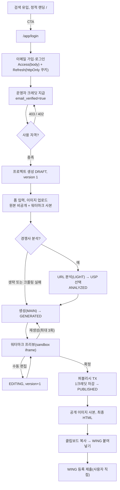

# Coupang AI Detail Maker - 사용자 시나리오 (v0.1.8 초안)

## 1. 문서 정보

| 항목 | 내용 |
|---|---|
| 문서 | Coupang AI Detail Maker 사용자 시나리오 |
| 버전 | v0.1.8 (초안) |
| 작성일 | 2026-09-30 |
| 작성자 | hyunboee (Claude 작성) |
| 기준 도메인 정의서 버전 | v0.3.10 (`docs/1-domain-definition.md`) |
| 기준 PRD 버전 | v0.3.9 (`docs/2-PRD.md`) |
| 범위 | 주 사용자 한 유형 기준의 기능 흐름별 시나리오. 페르소나별 상세 시나리오와 접근성은 범위 외(PRD 3장, 4.3절) |

**표기 규약**
- 우선순위는 PRD MoSCoW를 따른다: M(Must, MVP: P1 2일 핵심 슬라이스 + P2), S(MVP 직후), C(Could).
- ID는 두 문서의 ID(FR, BR, AC, D, NFR, 이벤트)를 그대로 쓴다. `/p/:id`는 `/api/projects/:id`의 줄임이다.
- `확인 필요`: 두 문서에 근거가 없거나 서로 달라 이해관계자 결정이 필요한 곳. 번호(I-n)는 9장 목록과 대응한다.
- 기본 흐름 표기: `사용자 행동 → 시스템 반응`.

### 문서 변경 이력

> 새 행은 표 맨 위에 추가한다.
> 기준 문서(도메인 정의서, PRD)가 갱신되면 이 문서도 갱신하고 기준 버전을 기록한다.

| 버전 | 일자 | 변경자 | 기준 도메인 버전 | 기준 PRD 버전 | 변경내용 |
|---|---|---|---|---|---|
| v0.1.8 | 2026-10-01 | hyunboee (Claude 작성) | v0.3.10 | v0.3.9 | 백엔드 구현 [가정] 반영: US-01 E1, US-09 A3, US-14 E6, 9장 I-10, I-12, I-16(해소 표시) |
| v0.1.7 | 2026-09-30 | hyunboee (Claude 작성) | v0.3.9 | v0.3.8 | DB-01~03 구현 후속 정합화: 기준 문서 버전 갱신만(시나리오 본문 변경 없음) |
| v0.1.6 | 2026-09-30 | hyunboee (Claude 작성) | v0.3.8 | v0.3.7 | 권장안 반영: 자격 검사 서비스 내 판정, 퍼블리시 TX 잔액 선검사, PG Should 근거. US-07, US-09 |
| v0.1.5 | 2026-09-30 | hyunboee (Claude 작성) | v0.3.7 | v0.3.6 | 문서 간 정합성 재점검 반영: 1장 표기 규약(M 정의), 6장 제목(2일 MVP → MVP), US-07(자격 검사 대상에 폼 저장) |
| v0.1.4 | 2026-09-30 | hyunboee (Claude 작성) | v0.3.6 | v0.3.5 | MVP 일정·범위 2단계(P1 2일 핵심 슬라이스, P2 MVP 완성) 재조정(Claude 위임 결정). 기준 문서 버전 갱신만(시나리오 본문 변경 없음) |
| v0.1.3 | 2026-09-30 | hyunboee (Claude 작성) | v0.3.5 | v0.3.4 | 권장안 반영: 폼 저장 version+1, 최종 HTML 편집 속성 제거. US-08 |
| v0.1.2 | 2026-09-30 | hyunboee (Claude 작성) | v0.3.4 | v0.3.3 | 미결 결정 DEC-01~10 반영(Claude 위임 결정): 3장 공통 응답 표, US-03 E2, US-07 E3, US-08, US-09 E2, US-10 E5, US-12, US-13, 9장 I-2·I-4·I-7·I-8·I-20(해소) |
| v0.1.1 | 2026-09-30 | hyunboee (Claude 작성) | v0.3.3 | v0.3.2 | 문서 간 정합성 점검 반영: US-09, US-14, US-16, US-17, US-19, 9장 I-1, I-5, I-6, I-17, I-21(해소 표시), I-4, I-7, I-8, I-9, I-14, I-20(구조 원칙 C-n·ERD E-n 교차 참조) |
| v0.1 | 2026-09-30 | hyunboee (Claude 작성) | v0.3.2 | v0.3.1 | 최초 작성. 기능 흐름별 시나리오 22건(M 16, S 5, C 1), E2E 여정 다이어그램, 추적 표, 불일치·모호점 목록 |

---

## 2. 주 사용자 요약

| 항목 | 내용 (PRD 3장, 도메인 D-33) |
|---|---|
| 사용자 | 부업·N잡으로 쿠팡 판매를 시작하는 학생과 20~50대 직장인 셀러(1인, 입점 초기) |
| 특성 | 디자인 역량과 시간이 부족하고 외주비에 민감하다. 비개발자(R-1) |
| 목표 | 경쟁사 분석 → 상세페이지 생성·편집 → 확정 → WING 등록을 한 흐름으로 끝낸다 |
| 환경 | 작업은 웹 어디서나(반응형, 폭 360px 이상). WING 자동 주입은 데스크톱 Chrome 확장만 |
| 보조 행위자 | 운영자(MVP 크레딧 수동 지급, FR-07) |

---

## 3. 공통 응답 처리

개별 시나리오에서 반복하지 않고 이 표를 참조한다.

| 응답 | 조건 | 화면 반응 | 근거 |
|---|---|---|---|
| 401 `TOKEN_EXPIRED` | Access Token 만료 | 갱신 1회 후 원 요청 재시도(US-03) | FR-05, FR-40 |
| 401 `TOKEN_INVALID` | 서명 오류, `typ` 불일치 | 갱신 시도 없이 인증 상태를 비우고 로그인 화면(I-7 해소) | FR-05, FR-40 |
| 403 | 이메일 미인증(자격 검사 대상 API). 402와 동시에 해당하면 403 우선 | 인증 메일 재발송 안내(US-07) | FR-06, AC-BR04 |
| 402 | 잔액 합계 0 | 충전 안내(US-07) | FR-06, AC-BR10 |
| 409 | version 불일치, 진행 중 작업, 허용되지 않는 상태 | 프로젝트를 다시 조회 | FR-34, FR-35, BR-27, BR-46, PRD 7.1 |
| 429 | 프로젝트 사용 한도 또는 계정 일일 LLM 상한 초과(1일은 Asia/Seoul 자정 기준). LLM 미호출 | 오류 코드(`ANALYZE_LIMIT`, `REGEN_LIMIT`, `AI_EDIT_LIMIT`, `DAILY_LLM_LIMIT`, `RATE_LIMITED`)로 원인 구분. 일일 상한이면 초기화 시각 안내 가능 | BR-26, 34, 41, 45, FR-29 |
| 503 + `Retry-After` | LLM 동시성·대기열 한도 초과. LLM 미호출 | `Retry-After` 기준 재시도 | NFR-03, PRD 7.1 |

---

## 4. 시나리오 목록

| ID | 제목 | 우선순위 | 관련 FR |
|---|---|---|---|
| US-01 | 랜딩 유입과 이메일 가입 | M | FR-31, FR-32, FR-01, FR-36 |
| US-02 | 로그인과 앱 시작 시 토큰 갱신 | M | FR-01, FR-36, FR-37, FR-40 |
| US-03 | Access Token 만료 시 자동 갱신 | M | FR-05, FR-37, FR-40 |
| US-04 | Refresh Token 재사용 탐지로 강제 로그아웃 | M | FR-38, FR-40 |
| US-05 | 로그아웃 | M | FR-39 |
| US-06 | 운영자 크레딧 지급 | M | FR-07 |
| US-07 | 사용 자격 거절(이메일 미인증, 잔액 0) | M | FR-06 |
| US-08 | 프로젝트 생성과 이미지 업로드 | M | FR-10, FR-11 |
| US-09 | 경쟁사 분석과 USP 선택 | M | FR-12, FR-29, FR-34, FR-35 |
| US-10 | 상세페이지 생성(분석 경로 / 분석 생략 경로) | M | FR-13, FR-14, FR-27, FR-28, FR-29, FR-35 |
| US-11 | 재생성 | M | FR-15, FR-34, FR-35 |
| US-12 | 워터마크 프리뷰 확인 | M | FR-16 |
| US-13 | 수동 블록 텍스트 편집 | M | FR-17, FR-34, FR-35 |
| US-14 | 퍼블리시(크레딧 차감) | M | FR-21, FR-22, FR-34, FR-35 |
| US-15 | 최종 HTML 클립보드 복사와 WING 붙여넣기 | M | FR-23, FR-22 |
| US-16 | PUBLISHED 프로젝트 재방문(읽기 전용) | M | FR-20, FR-10 |
| US-17 | Google OAuth 로그인 | S | FR-02, FR-36, FR-37 (FR-03은 C) |
| US-18 | 이메일 인증 메일 확인 | S | FR-04 |
| US-19 | AI 부분 수정 | S | FR-19, FR-29, FR-35 |
| US-20 | Chrome 확장 주입과 결과 보고, 실패 시 폴백 | S | FR-24, FR-25 (FR-26은 C) |
| US-21 | 충전 결제 | S | FR-08 |
| US-22 | 드래그·리사이즈 편집 | C | FR-18 |

---

## 5. E2E 핵심 여정 (M 범위)

---

## 6. M 시나리오 (MVP)

### US-01 랜딩 유입과 이메일 가입 (M)
- **사전 조건**: 비로그인, 미가입.
- **기본 흐름**
  1. 검색 결과로 `/` 방문 → 정적 HTML 랜딩(JS 없이 본문·title·description) 응답. `/app/**`는 noindex·robots Disallow로 색인 제외(FR-31, FR-32)
  2. CTA 클릭 → `/app/login` 이동(BR-82)
  3. 이메일·비밀번호로 가입 → bcrypt 해시 저장, 한 TX에서 User + Wallet(잔액 0) 생성, `email_verified=false`(FR-01, BR-05)
  4. → 새 패밀리로 Refresh Token 발급·DB 저장, `rt` 쿠키(HttpOnly·Secure·SameSite=Strict, Path=/api/auth), Access Token은 응답 body(FR-36)
  5. → SPA가 Access Token을 메모리(Zustand)에만 보관, `GET /api/me`로 잔액 0·미인증 상태 표시
- **대안·예외**
  - E1 이미 가입된 이메일: 400 `VALIDATION_FAILED`, 사용자·지갑 생성 0건(I-12 해소, 구현)
- **사후 조건**: 로그인 상태, 잔액 0, 미인증. 자격 검사 대상 API 불가(US-07).
- **관련**: FR-31, FR-32, FR-01, FR-36 / BR-01, 05, 06, 80, 81, 82 / AC-BR05, AC-BR80, AC-BR81, AC-BR82 / UserSignedUp

### US-02 로그인과 앱 시작 시 토큰 갱신 (M)
- **사전 조건**: 가입 완료.
- **기본 흐름**
  1. 이메일·비밀번호로 로그인 → 검증 성공, 새 패밀리 Refresh Token 쿠키 + Access Token body(FR-36)
  2. 다음 날 새로고침·재방문으로 `/app` 진입 → 앱 시작 시 `POST /api/auth/refresh` 1회(FR-40)
  3. → `rt` 검증 후 회전: 한 TX에서 기존 행 `revoked_at`·`replaced_by` 기록, 같은 패밀리로 새 `rt` 발급, 새 Access Token 반환(FR-37)
  4. → 프로젝트 목록 표시(FR-10)
- **대안·예외**
  - E1 틀린 비밀번호: 401, 토큰 발급 0건. 화면 문구 확인 필요
  - E2 앱 시작 갱신 실패(쿠키 없음, 만료, 폐기, 패밀리 최초 발급 후 30일 경과): 401 → 로그인 화면(FR-40, PRD 5.8)
  - E3 `Origin`이 프론트 도메인이 아님: 403(FR-37)
  - E4 로그인 IP당 10 req/min 초과: 429(NFR-04)
- **사후 조건**: 메모리에 Access Token(15분), 쿠키에 회전된 `rt`(14일).
- **관련**: FR-01, FR-36, FR-37, FR-40 / BR-06 / AC(FR-37 수용 기준) / -

### US-03 Access Token 만료 시 자동 갱신 (M)
- **사전 조건**: 로그인, Access Token 발급 후 15분 경과, 에디터 작업 중.
- **기본 흐름**
  1. 편집 저장 등 API 호출 → `requireAuth`가 401 `TOKEN_EXPIRED`(FR-05)
  2. → fetch 래퍼가 갱신을 한 번만 실행. 동시 요청은 같은 갱신 Promise를 기다림(FR-40)
  3. → 회전 성공(FR-37) 후 원 요청 1회 재시도 → 정상 응답. 사용자 작업은 끊기지 않음
- **대안·예외**
  - A1 만료 1분 전 선제 갱신(선택 구현, FR-40)
  - E1 갱신 실패: 인증 상태 비움, TanStack Query 캐시 초기화, 로그인 화면(FR-40)
  - E2 401 `TOKEN_INVALID`: 갱신 시도 없이 인증 상태를 비우고 로그인 화면(I-7 해소)
- **사후 조건**: 새 Access Token과 `rt`. 동시 만료 요청 5건이어도 refresh 호출 1회.
- **관련**: FR-05, FR-37, FR-40 / BR-03, BR-06 / AC-BR03, FR-40 수용 기준 / -

### US-04 Refresh Token 재사용 탐지로 강제 로그아웃 (M)
- **사전 조건**: 로그인 후 1회 이상 회전됨. 회전 전 `rt`가 유출됨.
- **기본 흐름**
  1. (유출자) 회전 전 `rt`로 `POST /api/auth/refresh` → 탈취로 판단, 해당 패밀리 전 행 폐기, 401(FR-38)
  2. 정상 사용자의 다음 갱신(최신 `rt`) → 401 → 인증 상태·캐시 초기화, 로그인 화면(FR-40)
  3. 사용자 재로그인 → 새 패밀리 발급(FR-36)
- **대안·예외**
  - E1 이미 발급된 Access Token은 `exp`(최대 15분)까지 유효. 수용된 동작(BR-06)
- **사후 조건**: 이전 패밀리 전 행 revoked.
- **관련**: FR-38, FR-40 / BR-06 / AC-BR06(첫 번째) / -

### US-05 로그아웃 (M)
- **사전 조건**: 로그인.
- **기본 흐름**
  1. 로그아웃 클릭 → `POST /api/auth/logout`(Origin 검사), 현재 패밀리 폐기, `rt` 쿠키 삭제(`Max-Age=0`)(FR-39)
  2. → 클라이언트가 메모리의 Access Token 삭제. 이후 화면(로그인 화면 이동, 캐시 초기화)은 확인 필요(I-13)
- **대안·예외**
  - A1 비밀번호 변경·계정 정지: 사용자의 모든 패밀리 폐기(FR-39). 비밀번호 변경 화면·API는 문서에 없음, 확인 필요(I-13)
- **사후 조건**: 같은 `rt`로 갱신 시 401. 남은 Access Token은 `exp`까지만 유효.
- **관련**: FR-39 / BR-06 / AC-BR06(두 번째) / -

### US-06 운영자 크레딧 지급 (M)
- **행위자**: 운영자(MVP 대체 수단, PRD 4.2)
- **사전 조건**: 사용자 가입 완료.
- **기본 흐름**
  1. 사용자가 크레딧을 요청 → 요청 경로 미정의, 확인 필요(I-11)
  2. 운영자가 `node scripts/grant.js <email> <n>` 실행 → 한 TX에서 원장 `reason=PURCHASE, source=TOPUP, pg_tx_id=NULL` 기록, `topup_balance +n`, `email_verified=true`(FR-07, PRD-D-7)
  3. 사용자가 화면을 다시 조회 → `GET /api/me`에 잔액 n, 인증됨. 자격은 토큰이 아니라 DB에서 매번 확인하므로 즉시 반영(PRD 5.8)
- **대안·예외**
  - E1 없는 이메일 지정: 동작 미정의, 확인 필요
- **사후 조건**: 잔액 = 원장 합계(BR-15). 사용 자격 충족.
- **관련**: FR-07 / BR-14, 15, 17 / AC-BR15, FR-07 수용 기준 / CreditPurchased

### US-07 사용 자격 거절 (M)
- **사전 조건**: 로그인. 이메일 미인증 또는 잔액 0.
- **기본 흐름**
  1. 자격 검사 대상 API(프로젝트 생성, 폼 저장, 에셋 업로드, 분석, USP 저장, 생성·재생성, 수동 편집, AI 수정, 퍼블리시) 호출 → `assertEligible`이 DB로 확인(프로젝트 대상 API는 서비스가 프로젝트 조회 직후, FR-06)
  2. → 미충족이면 도메인 로직 미실행, 상태 불변으로 거절
- **대안·예외**
  - E1 `email_verified=false`: 403, 인증 메일 재발송 안내(AC-BR04). MVP는 메일 발송이 없어(FR-04는 S) 안내 내용 확인 필요(I-3)
  - E2 잔액 0(구독 여부 무관): 402, 충전 안내(AC-BR10). MVP는 충전 결제가 없어(FR-08은 S) 안내 내용 확인 필요(I-3)
  - E3 둘 다 미충족: 403 우선(I-2 해소)
  - A1 조회(프로젝트·프리뷰·최종 HTML)와 확장 토큰 발급은 잔액 0이어도 200(FR-06, AC-BR10)
- **사후 조건**: 변화 없음. 운영자 지급(US-06) 뒤 재시도.
- **관련**: FR-06 / BR-03, 04, 10 / AC-BR04, AC-BR10 / -

### US-08 프로젝트 생성과 이미지 업로드 (M)
- **사전 조건**: 사용 자격 충족.
- **기본 흐름**
  1. 새 프로젝트 → `POST /api/projects` → 201, DRAFT, version 1(FR-10, BR-38)
  2. 제품명·카테고리·소개글·톤앤매너(선택) 입력 → `PUT /api/projects/:id/form`(version)으로 저장 → 성공하면 version+1. DRAFT·ANALYZED에서만 허용, 필수값 검증은 생성 요청 시점(I-8 해소)
  3. 이미지 선택 → `POST /p/:id/assets` → 서버 검증(최대 10장, 장당 10MB, jpg/png/webp) → 원본은 비공개 저장소, 폭 390px 이하 워터마크 합성 사본은 별도 경로 저장(FR-11)
  4. → 응답에 원본 경로·URL 없음(BR-32)
- **대안·예외**
  - E1 11장째, 10MB 초과, 허용 외 형식: 400, 저장 0건(AC-BR36). 이미 올린 이미지 삭제·교체 API가 없음, 확인 필요(I-9)
  - E2 403/402: US-07
- **사후 조건**: DRAFT, 에셋 저장.
- **관련**: FR-10, FR-11 / BR-32, 36, 38, 50 / AC-BR36, AC-BR38 / ProjectCreated, AssetUploaded

### US-09 경쟁사 분석과 USP 선택 (M)
- **사전 조건**: DRAFT 또는 ANALYZED, 분석 시도 3회 미만, 진행 중 작업 없음, 자격 충족.
- **기본 흐름**
  1. 쿠팡 상위 상품 URL 입력 후 분석(version 포함) → D-15 패턴 검증, 쿼리 제거(BR-20)
  2. → `analyze_count` 선점(실패해도 복원 안 함), 진행 중 작업 표시, 텍스트·리뷰만 휘발성 수집, LIGHT로 USP 후보 추출, AnalysisResult 저장, 원문 폐기(FR-12, BR-21~23)
  3. → 후보를 체크박스로 표시. 상태는 DRAFT
  4. 후보 1개 이상 체크 후 저장 → `PUT /p/:id/usps`(version) → `selectedUsps` 저장, ANALYZED(BR-24)
- **대안·예외**
  - A1 ANALYZED에서 선택 변경: ANALYZED 유지
  - A2 ANALYZED에서 재분석 성공: 후보 교체, `selectedUsps=[]`, DRAFT(BR-27)
  - A3 선택 0개로 저장: 400 `VALIDATION_FAILED`, 상태 불변(I-10 해소, 구현)
  - E1 쿠팡 상품 URL 패턴 외, 단축 URL: 400, 크롤링 미실행(AC-BR20). 시도로 세지 않음(BR-26)
  - E2 크롤링 실패(차단·타임아웃): 상태 유지, 시도 소모, 분석 생략 경로 안내(도메인 5장, R-4, PRD-R-5) → US-10 A1. 502 `UPSTREAM_FAILED`(I-4 해소)
  - E3 4번째 시도(실패 포함): 429, 크롤링·LLM 0회(AC-BR26)
  - E4 계정 LIGHT 일일 50회 초과: 429(FR-29). LIGHT 대기열 초과: 503 + Retry-After(NFR-03). 두 경우 LLM 미호출이므로 분석 선점 복원(BR-47, BR-75, BR-76)
  - E5 진행 중 작업, version 불일치: 409(FR-34, FR-35)
  - E6 GENERATED 이후 분석·USP 저장: 409(AC-BR27)
- **사후 조건**: ANALYZED, `selectedUsps` 저장. 크롤링 원문은 DB·저장소·로그에 없음(AC-BR22). 차감 0건.
- **관련**: FR-12, FR-29, FR-34, FR-35 / BR-20~27, 47, 75, 76 / AC-BR20~27 / CompetitorAnalyzed, UspSelected, LlmCallRejected

### US-10 상세페이지 생성 (M)
- **사전 조건**: ANALYZED(분석 경로) 또는 DRAFT(생략 경로). 필수값 충족(제품명 1~100자, 카테고리, 소개글 10~1,000자, 이미지 1장 이상, D-18). 진행 중 작업 없음, 자격 충족.
- **기본 흐름**
  1. 생성 클릭(version) → `POST /p/:id/generate`, 필수값 검증, 진행 중 작업 표시(FR-35)
  2. → `callRole('MAIN')`(FR-27). 계정 상한·동시성 확인 후 호출, 결과는 LlmUsageLog에 기록(FR-28)
  3. → 출력 검증·정제: 루트 780px, 인라인 CSS 전용, script·link·style·class·on* 제거, 최상위 섹션마다 `data-block-id`(FR-14)
  4. → draftHtml 저장, version+1, GENERATED. 선택 USP만 MAIN 입력에 사용(AC-BR24)
  5. → 워터마크 프리뷰 반환(US-12)
- **대안·예외**
  - A1 분석 생략 경로: DRAFT에서 생성하면 후보가 있어도 `selectedUsps=[]`로 생성(FR-13, BR-25). 분석을 건너뛰거나 크롤링 실패 안내(US-09 E2) 뒤 진입
  - E1 필수값 누락: 400, MAIN 0회, 상태 유지(AC-BR35)
  - E2 중복 클릭·동시 요청: 1건만 MAIN 호출, 나머지 409(AC-BR39)
  - E3 MAIN 대기열 초과: 503 + Retry-After, LLM 미호출 → 화면이 Retry-After 기준 재시도(NFR-03)
  - E4 계정 MAIN 일일 20회 초과: 429, LLM 0회(FR-29, AC-BR75)
  - E5 MAIN 실패·타임아웃(90초, NFR-02): 이전 상태 유지(도메인 5장). 502 `UPSTREAM_FAILED`(I-4 해소)
  - E6 version 불일치: 409
- **사후 조건**: GENERATED. draftHtml은 서버에만. 차감 0건(BR-11). 목표 p90 60초 이하(NFR-02).
- **관련**: FR-13, FR-14, FR-27, FR-28, FR-29, FR-35 / BR-11, 24, 25, 30, 31, 35, 37, 39, 73, 75, 76 / AC-BR24, 25, 30, 31, 35, 39, 75, 76 / DetailPageGenerated, LlmCallRejected

### US-11 재생성 (M)
- **사전 조건**: GENERATED 또는 EDITING, `regenCount < 3`, 진행 중 작업 없음, 자격 충족.
- **기본 흐름**
  1. 재생성 클릭(version) → 조건부 원자 UPDATE로 `regen_count` 선점 + 진행 중 작업 표시(FR-15)
  2. → MAIN 호출 성공 → 선점 확정, draftHtml 교체, 수동 편집 초기화, AI 수정 카운트 유지, GENERATED, version+1(BR-34)
  3. → 새 프리뷰 표시
- **대안·예외**
  - E1 `regenCount = 3`: 429, MAIN 0회(AC-BR34)
  - E2 진행 중 작업, version 불일치: 409
  - E3 503(대기열), 429(계정 상한): LLM 미호출, 선점 복원(BR-76, FR-29)
  - E4 MAIN 실패: 선점 복원, regenCount·draftHtml·상태 불변(AC-BR34)
  - E5 늦게 도착한 결과의 기준 version이 현재와 다름: 결과 폐기, 선점 복원(FR-34)
  - E6 선점 뒤 서버 중단: 5분(D-30) 뒤 주기 작업이 선점 복원·작업 표시 해제, 이후 재요청 가능(FR-35, AC-BR47)
- **사후 조건**: GENERATED, 차감 0건. AI 수정 결과도 초기화되는지는 확인 필요(I-14).
- **관련**: FR-15, FR-34, FR-35 / BR-11, 34, 39, 47, 48, 76 / AC-BR34, AC-BR47 / DetailPageGenerated(isRegen), ReservationExpired

### US-12 워터마크 프리뷰 확인 (M)
- **사전 조건**: GENERATED 또는 EDITING.
- **기본 흐름**
  1. 생성·편집 직후 또는 `GET /p/:id/preview` → 서버가 draftHtml의 이미지를 프리뷰 사본(data URI 인라인)으로 바꾸고, 최상단 사선 반투명 "PREVIEW ONLY / 무단 복제 금지" 오버레이와 블록별 반복 워터마크 합성(FR-16)
  2. → 클라이언트는 `sandbox` iframe(스크립트 불가)으로 렌더링. 좁은 화면에서는 780px을 비율 축소(NFR-17)
  3. 워터마크를 끄려 함 → 해제 설정·파라미터 없음(BR-51)
- **대안·예외**
  - E1 프리뷰 마크업을 복사해 워터마크를 지우는 시도: 완전 차단은 목표가 아니며 수용(R-1, BR-53). 게시용 완성본(최종 HTML, 공개 사본)은 얻을 수 없음
- **사후 조건**: 퍼블리시 전 모든 응답에 원본 경로, 최종 HTML, 공개 URL 0건(PRD-V-4, NFR-08).
- **관련**: FR-16 / BR-32, 50, 51, 53, 54 / AC-BR50, 51, 53, 54 / -

### US-13 수동 블록 텍스트 편집 (M)
- **사전 조건**: GENERATED 또는 EDITING, 진행 중 작업 없음, 자격 충족.
- **기본 흐름**
  1. 우측 패널 목록에서 블록·필드를 골라 텍스트 수정 후 저장 → `POST /p/:id/edits`로 `{blockId, editId, text, version}`만 전송(FR-17). 블록·필드 목록은 프리뷰 응답의 `blocks`
  2. → 서버가 draftHtml에 적용, EditOperation 기록, version+1, 첫 편집이면 EDITING
  3. → 새 프리뷰 반환. 무료, 횟수 제한 없음(BR-40)
- **대안·예외**
  - E1 다른 탭에서 먼저 저장해 version 불일치: 409 → 프로젝트 재조회(AC-BR48, PRD 7.1). 입력 중이던 텍스트 보존 여부 확인 필요(I-15)
  - E2 text에 HTML 태그: 400, draftHtml 불변(AC-BR44)
  - E3 LLM 작업 진행 중: 409(FR-35)
  - E4 PUBLISHED: 409(US-16)
- **사후 조건**: EDITING. 잔액·aiEditCount 불변.
- **관련**: FR-17, FR-34, FR-35 / BR-39, 40, 44, 48 / AC-BR40, 44, 48 / ManualEditApplied

### US-14 퍼블리시 (M)
- **사전 조건**: GENERATED 또는 EDITING, 잔액 1 이상, 진행 중 작업 없음, 자격 충족.
- **기본 흐름**
  1. "워터마크 제거 및 쿠팡 등록" 클릭(version) → `POST /p/:id/publish`, 퍼블리시 TX 시작(FR-21)
  2. → TX: 프로젝트 행 `FOR UPDATE` → 이메일 인증·잔액 선검사 → version·진행 중 작업 확인 → DEDUCT 원장 INSERT(프로젝트당 1건) → `topup_balance -1` → finalHtml 저장, PUBLISHED, version+1 → PublishRecord(PENDING) → COMMIT
  3. → 커밋 뒤 원본을 만료 없는 공개 URL(추측 불가 UUID 경로)로 복사, 최종 HTML이 이를 참조(FR-22)
  4. → 최종 HTML 응답, 복사 버튼 표시(US-15)
- **대안·예외**
  - E1 잔액 0: 402, 차감 0건, 상태 유지(FR-21, AC-BR14)
  - E2 더블클릭·두 탭 동시 퍼블리시: 두 응답 모두 성공, DEDUCT 1건, 최종 HTML 해시 동일(AC-BR13, AC-BR48, PRD-V-3)
  - E3 재생성 등 진행 중: 409, 차감 0건(AC-BR39)
  - E4 version 불일치(미퍼블리시): 409
  - E5 TX 중 실패: 전체 ROLLBACK, 잔액·상태 불변(AC-BR12). 화면 반응 확인 필요
  - E6 공개 사본 생성 실패: 3회 시도 후 로그만 남기고 차감 유지, 응답은 사본 준비와 무관하게 최종 HTML(FR-22). 퍼블리시 재요청과 `GET /final`이 실패한 사본을 재시도한다(I-16 해소, 구현). 사본 준비 전 화면은 프론트 결정
  - E7 이미 PUBLISHED인 프로젝트 재요청: version 검사 없이 기존 결과 반환, 추가 차감 없음(FR-34). 잔액 0이어도 자격 검사 전에 처리(BR-10, FR-06)
- **사후 조건**: PUBLISHED, DEDUCT 1건, 잔액 = 원장 합계, 읽기 전용.
- **관련**: FR-21, FR-22, FR-34, FR-35 / BR-11~15, 39, 48, 52, 66 / AC-BR11~14, 52, 66 / PublishConfirmed, CreditDeducted, PublishFailed, PublicImagesCopied

### US-15 최종 HTML 클립보드 복사와 WING 붙여넣기 (M)
- **사전 조건**: PUBLISHED. 환경 무관(모바일 포함).
- **기본 흐름**
  1. 복사 버튼 클릭 → `GET /p/:id/final`(Access Token, 자격 무관) → 최종 HTML을 클립보드에 복사, WING 붙여넣기 안내 표시(FR-23)
  2. 사용자가 WING 상품등록 상세설명에 붙여넣기 → 인라인 CSS 유지, 이미지는 공개 사본에서 로드(PRD-V-7)
  3. 사용자가 WING 등록을 직접 제출(D-23)
- **대안·예외**
  - A1 재복사 무제한, 잔액 불변(BR-62)
  - E1 미퍼블리시 프로젝트의 `final` 요청: 403(AC-BR52)
  - E2 WING이 인라인 style·외부 이미지 URL을 제한: 실측 전이라 확인 필요(R-7, PRD-R-2)
- **사후 조건**: 잔액 불변.
- **관련**: FR-22, FR-23 / BR-52, 62, 65, 66 / AC-BR52, AC-BR65, AC-BR66 / -

### US-16 PUBLISHED 프로젝트 재방문 (M)
- **사전 조건**: PUBLISHED. 잔액 0일 수 있음.
- **기본 흐름**
  1. 프로젝트 목록에서 선택 → 상세·최종 HTML 조회 200(FR-10, AC-BR10)
  2. 편집·재생성·분석·AI 수정 시도 → 409(FR-20, AC-BR46)
  3. 다른 상품 작업 → 새 프로젝트 생성(US-08)
- **대안·예외**
  - E1 잔액 0에서 2번 시도: 402가 아니라 409(BR-10, BR-46, FR-06)
- **사후 조건**: 상태 불변.
- **관련**: FR-10, FR-20 / BR-10, 46, 62 / AC-BR46 / -

---

## 7. S·C 시나리오 (MVP 이후)

### US-17 Google OAuth 로그인 (S)
- **사전 조건**: 비로그인.
- **기본 흐름**
  1. Google 로그인 클릭 → `GET /api/auth/google` → Google 인증
  2. → 콜백: 검증된 같은 이메일이면 기존 User에 Provider 연결, 없으면 User + Wallet(0) 생성. `rt` 쿠키만 설정하고 SPA로 리다이렉트, URL에 토큰 없음(FR-02, FR-36)
  3. → SPA 시작 시 `POST /api/auth/refresh`로 Access Token 획득(FR-37, FR-40)
- **대안·예외**
  - E1 미검증 같은 이메일: 자동 연결·신규 생성 0건, 기존 수단 로그인 안내(BR-02)
  - A1 (C) Kakao·Naver: 이메일 미제공이면 이메일 입력 추가 요구(FR-03)
  - Google 가입자는 가입 시 `email_verified=true`(BR-04, FR-02). Kakao·Naver(C)의 직접 입력 이메일은 확인 필요(I-17)
- **사후 조건**: 로그인, providers에 google 기록.
- **관련**: FR-02, FR-03, FR-36, FR-37 / BR-01, 02, 05 / AC-BR01, AC-BR02 / UserSignedUp

### US-18 이메일 인증 메일 확인 (S)
- **사전 조건**: Credentials 가입, `email_verified=false`.
- **기본 흐름**
  1. 가입 후 인증 메일 수신, 링크 클릭 → `POST /api/auth/verify-email` → `email_verified=true`(FR-04)
  2. → 자격 검사에서 계정 요건 충족. PRD-D-7의 운영자 설정을 대체
- **대안·예외**
  - E1 403 화면의 재발송: 재발송 API·링크 만료 규칙 미정의, 확인 필요(I-3)
- **사후 조건**: 인증 완료.
- **관련**: FR-04 / BR-04 / AC-BR04 / EmailVerified

### US-19 AI 부분 수정 (S)
- **사전 조건**: GENERATED 또는 EDITING, `aiEditCount < 3`, `aiEditFailCount < 6`, 진행 중 작업 없음, 자격 충족.
- **기본 흐름**
  1. 블록 선택 후 채팅으로 색상·문구 지시(version) → `POST /p/:id/ai-edits`, 성공 카운트 선점, 진행 중 작업 표시
  2. → LIGHT 호출, 지정 블록만 교체(다른 블록 바이트 불변) → 확정, version+1, EDITING(FR-19, BR-43)
  3. → 새 프리뷰
- **대안·예외**
  - E1 성공 3회 또는 실패 6회 도달: 429, LLM 0회(AC-BR45, FR-19)
  - E2 LLM 실패: aiEditCount 복원, aiEditFailCount +1(AC-BR45)
  - E3 동시 2건: 1건만 LLM 호출, 나머지 409(AC-BR41)
  - E4 계정 LIGHT 상한 429, 대기열 503 + Retry-After: 선점 복원
- **사후 조건**: 차감 0건. 재생성 뒤에도 aiEditCount 유지(BR-34).
- **관련**: FR-19, FR-29, FR-35 / BR-41~45, 47 / AC-BR41, 42, 43, 45 / AiEditRequested, AiEditApplied, AiEditFailed, AiEditRejected

### US-20 Chrome 확장 주입과 결과 보고, 실패 시 폴백 (S)
- **사전 조건**: PUBLISHED, 데스크톱 Chrome, 확장 설치, WING 상품등록 페이지 열림.
- **기본 흐름**
  1. WING 주입 요청 → `POST /p/:id/extension-token`(Access Token, 자격 무관) → `typ=ext` JWT(프로젝트 1건 범위, 10분 만료, Refresh 없음)(FR-24)
  2. → 웹 페이지가 `chrome.runtime.sendMessage`로 확장에 토큰 전달
  3. → 확장이 `GET /p/:id/final`(확장 토큰) → WING 상세설명 에디터 DOM에만 주입, 제출 요청 0건(FR-25, BR-61)
  4. → 확장이 `POST /p/:id/publish-report` → injectStatus=INJECTED, 원장 변화 없음(BR-64)
  5. 사용자가 WING 등록 직접 제출
- **대안·예외**
  - E1 셀렉터 불일치: FAILED 보고, 복사 버튼 노출 → US-15(AC-BR65)
  - E2 토큰 만료, 다른 프로젝트, 다른 API 호출: 401(AC-BR60) → 재발급 후 재주입, 잔액 불변(AC-BR62)
  - E3 데스크톱 Chrome 아님, 확장 미설치: 클립보드 복사(BR-65). 감지 방법 미정의, 확인 필요(I-18)
  - A1 (C) WING 셀렉터를 서버 설정으로 원격 제공(FR-26)
- **사후 조건**: PublishRecord.injectStatus 갱신. 과금 영향 없음.
- **관련**: FR-24, FR-25, FR-26 / BR-60~65 / AC-BR60~65 / ExtensionTokenIssued, HtmlInjectedToWing, WingInjectFailed

### US-21 충전 결제 (S)
- **사전 조건**: 로그인. PG 미결(D-3).
- **기본 흐름**
  1. 충전 선택 → `POST /api/billing/checkout` → PG 결제
  2. PG 결제 성공 → 서명 검증 웹훅 → `pgTxId`당 1회 PURCHASE(TOPUP) 원장, 잔액 증가(FR-08)
  3. 사용자가 잔액 확인(`GET /api/me`)
- **대안·예외**
  - E1 같은 웹훅 2회: 원장 1건(AC-BR17)
  - E2 결제 실패·취소, 서명 검증 실패 시 응답·화면: 미정의, 확인 필요
  - 충전 상품(크레딧 수량·가격) 정의 없음, 확인 필요(I-19)
- **사후 조건**: 잔액 = 원장 합계.
- **관련**: FR-08 / BR-14, 15, 17 / AC-BR17 / CreditPurchased

### US-22 드래그·리사이즈 편집 (C)
- **사전 조건**: US-13과 같음.
- **기본 흐름**
  1. 요소를 드래그·리사이즈 → 인라인 style의 위치·크기 값만 변경하는 편집 작업 전송(FR-18)
  2. → 서버 적용, version+1, 새 프리뷰
- **대안·예외**: US-13 E1~E4와 같음.
- **사후 조건**: 변경은 style 속성에만 반영.
- **관련**: FR-18 / BR-40, 44 / AC-BR40, AC-BR44 / ManualEditApplied

---

## 8. 추적

### 8.1 시나리오 → FR

| 시나리오 | FR | BR | AC |
|---|---|---|---|
| US-01 | FR-01, 31, 32, 36 | BR-01, 05, 06, 80~82 | AC-BR05, 80, 81, 82 |
| US-02 | FR-01, 10, 36, 37, 40 | BR-06 | FR-37 수용 기준 |
| US-03 | FR-05, 37, 40 | BR-03, 06 | AC-BR03, FR-40 수용 기준 |
| US-04 | FR-36, 38, 40 | BR-06 | AC-BR06 |
| US-05 | FR-39 | BR-06 | AC-BR06 |
| US-06 | FR-07 | BR-14, 15, 17 | AC-BR15 |
| US-07 | FR-06 | BR-03, 04, 10 | AC-BR04, AC-BR10 |
| US-08 | FR-10, 11 | BR-32, 36, 38, 50 | AC-BR36, AC-BR38 |
| US-09 | FR-12, 29, 34, 35 | BR-20~27, 47, 75, 76 | AC-BR20~27 |
| US-10 | FR-13, 14, 27, 28, 29, 35 | BR-11, 24, 25, 30, 31, 35, 37, 39, 73, 75, 76 | AC-BR24, 25, 30, 31, 35, 39, 75, 76 |
| US-11 | FR-15, 34, 35 | BR-11, 34, 39, 47, 48, 76 | AC-BR34, AC-BR47 |
| US-12 | FR-16 | BR-32, 50, 51, 53, 54 | AC-BR50, 51, 53, 54 |
| US-13 | FR-17, 34, 35 | BR-39, 40, 44, 48 | AC-BR40, 44, 48 |
| US-14 | FR-21, 22, 34, 35 | BR-11~15, 39, 48, 52, 66 | AC-BR11~14, 52, 66 |
| US-15 | FR-22, 23 | BR-52, 62, 65, 66 | AC-BR52, 65, 66 |
| US-16 | FR-10, 20 | BR-10, 46, 62 | AC-BR46 |
| US-17 | FR-02, 03, 36, 37 | BR-01, 02, 05 | AC-BR01, AC-BR02 |
| US-18 | FR-04 | BR-04 | AC-BR04 |
| US-19 | FR-19, 29, 35 | BR-41~45, 47 | AC-BR41, 42, 43, 45 |
| US-20 | FR-24, 25, 26 | BR-60~65 | AC-BR60~65 |
| US-21 | FR-08 | BR-14, 15, 17 | AC-BR17 |
| US-22 | FR-18 | BR-40, 44 | AC-BR40, AC-BR44 |

### 8.2 시나리오에 등장하지 않는 M 우선순위 FR

없음. 단 FR-27(LLM 어댑터), FR-28(사용량 로그), FR-32(noindex)는 사용자가 관찰할 수 없는 내부 요구라 시스템 반응(US-01, US-10)에서만 참조한다. 검증은 해당 FR 수용 기준으로 한다. 시나리오에 없는 FR은 FR-09(W), FR-30(C, Prompt Caching), FR-33(C, 가격·가이드 페이지)이다.

---

## 9. 불일치·모호점 (확인 필요)

| # | 항목 | 내용 | 관련 |
|---|---|---|---|
| I-1 | 퍼블리시 재요청·PUBLISHED 편집 시 잔액 0 | 해소(도메인 v0.3.3 BR-10, PRD v0.3.2 FR-06). PUBLISHED 대상 요청은 자격 검사 전에 처리한다: 퍼블리시 재요청은 기존 결과 반환(BR-13), 편집은 409(BR-46). 구조 원칙 C-5와 같은 쟁점 | FR-06, FR-21, FR-34, BR-13, BR-46 |
| I-2 | 403·402 우선순위 | 해소(DEC-09). 이메일 미인증과 잔액 0이 동시에 해당하면 403을 준다. 판정 순서: 401 → 409(PUBLISHED 대상) → 403 → 402 → 409(version·진행 중 작업) → 429 → 503 | FR-06 |
| I-3 | MVP 안내 문구 | AC-BR04는 "인증 메일 재발송 안내", AC-BR10은 "충전 안내"를 요구한다. 그러나 MVP에는 메일 발송(FR-04)도 충전 결제(FR-08)도 없다(둘 다 S). 재발송 API도 8장에 없다 | BR-04, BR-10, PRD-D-7 |
| I-4 | LLM·크롤링 실패 응답 | 해소(DEC-09). 크롤링 실패와 MAIN·LIGHT 호출 실패·타임아웃(90초)은 502 `UPSTREAM_FAILED`. 분석 생략 경로 "안내"는 R-4·PRD-R-5 | FR-12, FR-14, NFR-02, C-2 |
| I-5 | URL 형식 오류와 시도 횟수 | 해소(도메인 v0.3.3 BR-26). BR-20 불통과 400은 시도로 세지 않는다 | BR-20, BR-26, FR-12 |
| I-6 | 분석 선점 복원 충돌 | 해소(도메인 v0.3.3 BR-47). LLM 미호출 거절(429 BR-75, 503 BR-76)은 선점 복원, 실행된 시도는 실패해도 복원하지 않는다. 구조 원칙 C-10과 같은 쟁점 | BR-47, BR-75, BR-76 |
| I-7 | 오류 코드 구분 | 해소(DEC-09). 구조 원칙 4.2절 코드를 전부 채택했다(C-2). 409(`VERSION_CONFLICT`, `JOB_IN_PROGRESS`, `INVALID_STATE`)와 429(`ANALYZE_LIMIT`, `REGEN_LIMIT`, `AI_EDIT_LIMIT`, `DAILY_LLM_LIMIT`, `RATE_LIMITED`)는 코드로 원인을 구분한다. `TOKEN_INVALID`는 갱신 시도 없이 인증 상태를 비우고 로그인 화면으로 간다 | FR-05, FR-40, PRD 8장, C-2 |
| I-8 | 입력 폼 저장 | 해소(DEC-05). `PUT /api/projects/:id/form`(body `{form, version}`, DRAFT·ANALYZED만)으로 저장한다. `POST /api/projects`는 form을 선택적으로 받는다. 필수값 검증(BR-35)은 생성 요청 시점 | FR-10, FR-14, BR-35, C-9, E-5 |
| I-9 | 이미지 삭제·교체 | 업로드 제한(10장)에 걸렸을 때 기존 이미지를 삭제·교체하는 API가 없다 | FR-11, BR-36, E-6 |
| I-10 | USP 0개 저장 | 해소(구현). 0개 저장은 400 `VALIDATION_FAILED`, 상태·version 불변. 문자열 배열·중복 없음·후보 안 값만 허용 | BR-24, FR-12 |
| I-11 | MVP 크레딧 요청 경로 | 사용자가 운영자에게 지급을 요청하는 경로(화면, 연락 수단)가 정의되어 있지 않다 | FR-07, PRD-D-6 |
| I-12 | 중복 이메일 가입 | 해소(구현). 400 `VALIDATION_FAILED`(새 오류 코드 없음). 이메일은 소문자로 정규화해 비교한다 | FR-01, BR-02 |
| I-13 | 로그아웃 뒤 화면·비밀번호 변경 | 로그아웃 뒤 이동 화면과 캐시 초기화가 정의되어 있지 않다(FR-40은 갱신 실패 시만 규정). FR-39가 말하는 비밀번호 변경 기능과 API는 FR·8장에 없다 | FR-39, FR-40 |
| I-14 | 재생성 시 AI 수정 결과 | BR-34는 "수동 편집 초기화, AI 수정 카운트 유지"라고만 한다. AI 수정으로 바뀐 내용도 초기화되는지 모호하다 | BR-34, D-5, E-13 |
| I-15 | 409 뒤 입력 보존 | version 충돌 409 뒤 프로젝트를 다시 조회할 때 사용자가 입력 중이던 텍스트를 보존할지 정의되어 있지 않다 | FR-34, PRD 7.1 |
| I-16 | 퍼블리시 응답과 공개 사본 | 해소(구현). 응답의 최종 HTML은 공개 URL(`PUBLIC_IMAGE_BASE_URL/{assetId}.{ext}`)을 담고 사본 준비 여부와 무관하다. 사본 복사 실패는 3회 시도 뒤 로그만 남기고, 퍼블리시 재요청과 `GET /final`이 재시도한다. 사본 준비 전 화면 반응은 프론트 결정 | FR-22, BR-66 |
| I-17 | 소셜 가입자 이메일 인증 | BR-04는 Credentials 가입자에만 적용되는데 FR-06은 모든 사용자에게 `email_verified=true`를 요구한다. 부분 해소(도메인 v0.3.3 BR-04, PRD v0.3.2 FR-02): OAuth 가입자는 가입 시 true. 남은 쟁점은 Provider가 이메일을 주지 않아 직접 입력한 이메일(Kakao·Naver, C)의 인증 경로다 | BR-04, FR-02, FR-06 |
| I-18 | 확장 미설치 감지 | 확장이 없거나 데스크톱 Chrome이 아닐 때 이를 감지해 복사로 안내하는 방법이 정의되어 있지 않다 | BR-65, FR-24 |
| I-19 | 충전 상품·도입 순서 | 충전 크레딧 수량·가격이 정의되어 있지 않다(Plan은 구독용이며 W). FR-08과 FR-04가 모두 S라서 FR-04보다 결제가 먼저 도입되면 결제 사용자가 미인증 403에 걸린다 | FR-04, FR-08, PRD-D-7 |
| I-20 | 계정 일일 상한 기준 시각 | 해소(DEC-10). Asia/Seoul 자정 기준("오늘 N회, 내일 0시 초기화"). 429 응답에서 초기화 시각을 안내할 수 있다 | FR-29, D-28, E-14 |
| I-21 | 문서 버전 참조 | 해소(도메인 v0.3.3, PRD v0.3.2). PRD 1장 참조 도메인 버전과 도메인 9장 머리말의 PRD 버전을 맞췄다. 도메인 v0.3.2 변경 이력 행의 기준 PRD 버전(v0.3)은 이력이라 수정하지 않는다 | 두 문서 1장·변경 이력·9장 |
