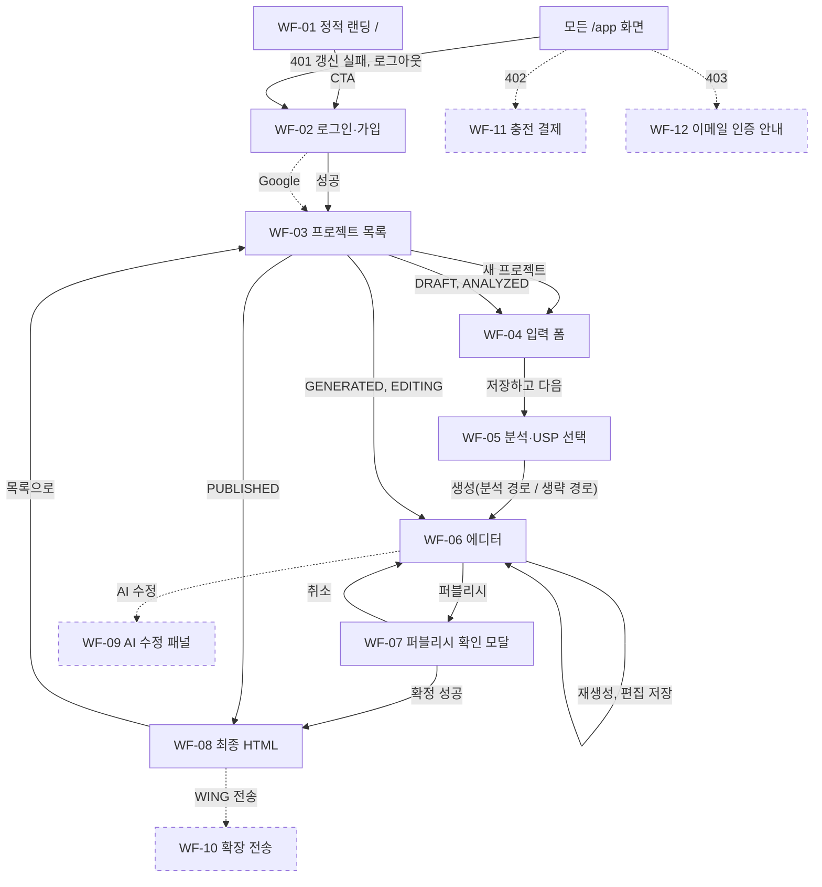

# Coupang AI Detail Maker - 와이어프레임 (v0.1.6 초안)

## 1. 문서 정보

| 항목 | 내용 |
|---|---|
| 문서 | Coupang AI Detail Maker 와이어프레임 |
| 버전 | v0.1.6 (초안) |
| 작성일 | 2026-09-30 |
| 작성자 | hyunboee (Claude 작성) |
| 기준 도메인 정의서 버전 | v0.3.8 (`docs/1-domain-definition.md`) |
| 기준 PRD 버전 | v0.3.7 (`docs/2-PRD.md`) |
| 기준 사용자 시나리오 버전 | v0.1.6 (`docs/3-user-scenario.md`, 화면 흐름의 1차 근거) |
| 범위 | 저충실도(lo-fi) 와이어프레임. 레이아웃, 영역, 주요 컴포넌트, 버튼·입력, 상태 표시만 다룬다. 색상·폰트·시각 스타일, 접근성(PRD 4.3)은 범위 외 |
| 모바일 | 반응형만 적용(PRD 4.3, NFR-17). 데스크톱 기준으로 그리고, 레이아웃이 크게 바뀌는 에디터(WF-06)만 360px 변형을 추가로 그린다 |

**표기 규약**
- 우선순위 M/S/C는 PRD MoSCoW를 따른다. ID(US, FR, BR, AC, I-n)는 각 기준 문서의 ID를 그대로 쓴다. `/p/:id`는 `/api/projects/:id`의 줄임이다.
- 와이어프레임의 `(n)`은 바로 아래 구성 요소 표의 번호다. `[ ]`는 버튼·선택 상자, `[____]`는 입력, `!`는 오류·안내 영역이다. 문구는 자리표시자다.
- `확인 필요`: 문서에 근거가 없거나 서로 달라 결정이 필요한 곳. 번호는 6.2절과 대응한다(I-n은 시나리오 9장, N-n은 이 문서에서 새로 찾은 항목).
- 화면 경로는 PRD가 `/`, `/app/login`, `/app/**`만 정의하므로 `/app` 아래 세부 경로는 이 문서의 제안(안)이다(N-2).

### 문서 변경 이력

> 새 행은 표 맨 위에 추가한다.
> 기준 문서(도메인 정의서, PRD, 사용자 시나리오)가 갱신되면 이 문서도 갱신하고 기준 버전을 기록한다.

| 버전 | 일자 | 변경자 | 기준 도메인 버전 | 기준 PRD 버전 | 기준 시나리오 버전 | 변경내용 |
|---|---|---|---|---|---|---|
| v0.1.6 | 2026-09-30 | hyunboee (Claude 작성) | v0.3.8 | v0.3.7 | v0.1.6 | 권장안 반영: 자격 검사 서비스 내 판정, 퍼블리시 TX 잔액 선검사, PG Should 근거. 기준 문서 버전 갱신만(화면 변경 없음) |
| v0.1.5 | 2026-09-30 | hyunboee (Claude 작성) | v0.3.7 | v0.3.6 | v0.1.5 | 문서 간 정합성 재점검 반영: 6.2 N-12(ERD E-11 교차 참조) |
| v0.1.4 | 2026-09-30 | hyunboee (Claude 작성) | v0.3.6 | v0.3.5 | v0.1.4 | MVP 일정·범위 2단계(P1 2일 핵심 슬라이스, P2 MVP 완성) 재조정(Claude 위임 결정). 기준 문서 버전 갱신만(화면 변경 없음) |
| v0.1.3 | 2026-09-30 | hyunboee (Claude 작성) | v0.3.5 | v0.3.4 | v0.1.3 | 권장안 반영: 폼 저장 version+1, 최종 HTML 편집 속성 제거. WF-04 |
| v0.1.2 | 2026-09-30 | hyunboee (Claude 작성) | v0.3.4 | v0.3.3 | v0.1.2 | 미결 결정 DEC-01~10 반영(Claude 위임 결정): WF-04(폼 저장 API), WF-05(오류 코드), WF-06(블록·필드 목록 `blocks`, editId, 429 초기화 시각, 실패 코드), 5.2 오류 표시 규칙(`TOKEN_INVALID`, 429 원인 구분, 403 우선), 6.2 I-2·I-4·I-7·I-8·I-20·N-6(해소) |
| v0.1.1 | 2026-09-30 | hyunboee (Claude 작성) | v0.3.3 | v0.3.2 | v0.1.1 | 문서 간 정합성 점검 반영: 표기 규약·2장 WF-02 경로(`/app/login` 확정), WF-02, WF-05, WF-06, WF-07, WF-09, 6.2 I-1, I-5, I-6, I-17(해소 표시), N-2, N-3, N-5(해소), N-7(교차 참조) |
| v0.1 | 2026-09-30 | hyunboee (Claude 작성) | v0.3.2 | v0.3.1 | v0.1 | 최초 작성. 화면 12건(M 8, S 4), 화면 흐름도, 공통 컴포넌트, US → WF 추적 표, 확인 필요 목록 |

---

## 2. 화면 목록

| 화면 ID | 화면명 | 경로 | 우선순위 | 관련 US | 관련 FR |
|---|---|---|---|---|---|
| WF-01 | 정적 랜딩 | `/` | M | US-01 | FR-31, FR-32 |
| WF-02 | 로그인·가입 | `/app/login` | M | US-01~05 | FR-01, FR-36~40 |
| WF-03 | 프로젝트 목록(대시보드) | `/app` | M | US-02, US-07, US-16 | FR-06, FR-10, FR-40 |
| WF-04 | 새 프로젝트 입력 폼 | `/app/projects/new`(안) | M | US-08 | FR-10, FR-11 |
| WF-05 | 경쟁사 분석·USP 선택 | `/app/projects/:id/analyze`(안) | M | US-09, US-10 | FR-12, FR-13, FR-29, FR-34, FR-35 |
| WF-06 | 에디터 | `/app/projects/:id/edit`(안) | M | US-10~13 | FR-14~17, FR-20, FR-34, FR-35 |
| WF-07 | 퍼블리시 확인 모달 | WF-06 위 모달 | M | US-14 | FR-21, FR-22, FR-34, FR-35 |
| WF-08 | 퍼블리시 완료·최종 HTML | `/app/projects/:id/final`(안) | M | US-14~16 | FR-20, FR-22, FR-23 |
| WF-09 | AI 부분 수정 채팅 패널 | WF-06 패널 | S | US-19 | FR-19, FR-29, FR-35 |
| WF-10 | Chrome 확장 전송 버튼·결과 | WF-08 영역 | S | US-20 | FR-24, FR-25 |
| WF-11 | 충전 결제 | `/app/billing`(안) | S | US-21 | FR-08 |
| WF-12 | 이메일 인증 안내 | `/app/verify-email`(안) | S | US-18 | FR-04 |

C 화면(메모): US-22 드래그·리사이즈 편집(FR-18)은 WF-06 프리뷰에 얹는 기능이라 이번에는 그리지 않는다. FR-33 가격·가이드 정적 페이지도 생략한다.

---

## 3. 화면 흐름도

실선은 M, 점선은 S다. 401 갱신 실패(FR-40)는 어느 `/app` 화면에서든 WF-02로 이동한다(노드 하나로 표현).



---

## 4. 화면별 와이어프레임

### WF-01 정적 랜딩 (M)

**목적**: 검색 유입 방문자에게 서비스를 소개하고 `/app/login`으로 보낸다. 빌드 시 생성한 정적 HTML이며 JS 없이 본문·title·description이 나온다(BR-80, BR-82).

```
+----------------------------------------------------------------------+
| [Logo] Coupang AI Detail Maker                          [로그인] (1) |
+----------------------------------------------------------------------+
|                                                                      |
|    [헤드라인: 서비스 한 줄 소개] (2)                                 |
|    [부제: 분석 -> 생성 -> 편집 -> 확정 -> WING 등록]                 |
|                                                                      |
|    [ 시작하기 ] (3)  -> /app/login                                   |
|                                                                      |
+----------------------------------------------------------------------+
|    작동 방식 (4)                                                     |
|    1. 경쟁사 분석(선택)   2. 상세페이지 생성   3. 편집               |
|    4. 확정(크레딧 1)      5. HTML 복사 -> WING 붙여넣기              |
|                                                                      |
+----------------------------------------------------------------------+
|    [시작하기] (3, 하단 반복)                                         |
|    (본문·title·description은 JS 없이 정적 HTML)                      |
+----------------------------------------------------------------------+
```

| # | 요소 | 설명 |
|---|---|---|
| 1 | 로그인 링크 | `/app/login` 이동 |
| 2 | 헤드라인·부제 | 문구는 확인 필요(N-1) |
| 3 | 시작하기 CTA | `/app/login` 이동(BR-82). 인증 불요 |
| 4 | 작동 방식 | 분석(선택) → 생성 → 편집 → 확정 → WING 등록의 5단계 요약(PRD 2.2 G-1) |

**상태 변형**: 로딩·오류 상태 없음(정적). 로그인 상태 방문자의 표시는 문서에 없음(N-1에 포함).
**관련**: US-01 / FR-31, FR-32 / API 없음(`robots.txt`, `sitemap.xml`은 정적 파일)

---

### WF-02 로그인·가입 (M)

**목적**: 이메일·비밀번호로 가입·로그인한다. 성공하면 Access Token은 메모리에, Refresh Token은 httpOnly 쿠키에 저장되고 WF-03으로 이동한다(FR-36).

```
+----------------------------------------------------------------------+
| [Logo] Detail Maker                                                  |
+----------------------------------------------------------------------+
|                                                                      |
|         [ 로그인 ] [ 가입 ]  (1)                                     |
|                                                                      |
|         이메일      [_______________________] (2)                    |
|         비밀번호    [_______________________] (3)                    |
|         ! (필드·인증 오류 문구 영역) (4)                             |
|                                                                      |
|         [ 로그인 / 가입하기 ] (5)                                    |
|                                                                      |
|         - - - - - - - - - - - - - - - - - -                          |
|         [ Google로 계속하기 ] (6, S)                                 |
|                                                                      |
+----------------------------------------------------------------------+
```

| # | 요소 | 설명 |
|---|---|---|
| 1 | 로그인/가입 탭 | 같은 화면에서 전환 |
| 2, 3 | 이메일·비밀번호 | 입력 규칙(형식, 최소 길이)은 문서에 없음(N-10) |
| 4 | 오류 영역 | 401(틀린 비밀번호), 429(IP당 10 req/min, NFR-04). 중복 이메일 가입 응답은 확인 필요(I-12) |
| 5 | 제출 버튼 | 처리 중 비활성 |
| 6 | Google 버튼 | S(FR-02). Google 가입자는 가입 시 인증됨(BR-04). Kakao·Naver 직접 입력 이메일은 확인 필요(I-17) |

**상태 변형**

| 상태 | 표시 |
|---|---|
| 처리 중 | 제출 버튼 비활성 + 진행 표시 |
| 401 | 4번 영역에 오류 문구(구체 문구는 확인 필요, US-02 E1) |
| 429 | 4번 영역에 안내 문구(원인 구분은 I-7) |
| 앱 시작 시 갱신 중 | `/app` 진입 시 `POST /api/auth/refresh` 1회(FR-40). 끝날 때까지 로딩 화면, 실패하면 이 화면 |
| 로그아웃·강제 로그아웃 | 이 화면으로 이동. 이동·캐시 초기화 규칙은 확인 필요(I-13) |

**관련**: US-01~05, US-17(S) / FR-01, FR-36~40 / API `POST /api/auth/signup`, `/login`, `/refresh`, `/logout`, `GET /api/me`

---

### WF-03 프로젝트 목록(대시보드) (M)

**목적**: 내 프로젝트를 보고 이어서 작업하거나 새로 시작한다. 잔액 0·이메일 미인증 안내를 배너로 보여준다(US-07).

```
+----------------------------------------------------------------------+
| [Logo] Detail Maker (1)                 잔액 3 | 인증됨 | [로그아웃] |
+----------------------------------------------------------------------+
| ! 이메일 인증이 필요합니다. ...                          (2, 배너)   |
| ! 크레딧이 없습니다. ...                                 (2, 배너)   |
+----------------------------------------------------------------------+
| 내 프로젝트 (3)                                [ + 새 프로젝트 ] (4) |
+----------------------------------------------------------------------+
|   캠핑 랜턴 세트            [PUBLISHED]                   [보기] (5) |
|   무선 청소기               [EDITING]                  [이어서 편집] |
|   (제목 없음)               [DRAFT]                    [이어서 작성] |
|   텀블러                    [ANALYZED]                 [이어서 작성] |
+----------------------------------------------------------------------+
|   (빈 목록: "아직 프로젝트가 없습니다" + [ + 새 프로젝트 ]) (6)      |
+----------------------------------------------------------------------+
```

| # | 요소 | 설명 |
|---|---|---|
| 1 | 공통 헤더 | 5장 참조 |
| 2 | 안내 배너 | `email_verified=false`면 인증 안내, 잔액 0이면 충전 안내. 조건이 맞을 때만 표시(둘 다 가능). 문구 내용은 확인 필요(I-3, I-11) |
| 3 | 목록 | 제품명과 상태. 정렬·필드는 확인 필요(N-3). 제품명이 아직 없으면 "(제목 없음)" |
| 4 | 새 프로젝트 | WF-04로 이동. 미인증·잔액 0이면 비활성(FR-06 사전 표시. N-11) |
| 5 | 행 동작 | 상태별 이동: DRAFT·ANALYZED → WF-04, GENERATED·EDITING → WF-06, PUBLISHED → WF-08 |
| 6 | 빈 상태 | 프로젝트 0건일 때 |

**상태 변형**

| 상태 | 표시 |
|---|---|
| 로딩 | 목록 자리에 스켈레톤·진행 표시 |
| 빈 상태 | 6번 |
| 미인증 | 2번 배너, 4번 비활성. 조회·PUBLISHED 열람은 가능(FR-06) |
| 잔액 0 | 2번 배너, 4번 비활성. 조회·PUBLISHED 열람은 가능(AC-BR10) |
| 401 갱신 실패 | WF-02 |

**관련**: US-02, US-07, US-16 / FR-06, FR-10, FR-40 / API `GET /api/projects`, `GET /api/me`

---

### WF-04 새 프로젝트 입력 폼 (M)

**목적**: 제품 정보와 이미지를 입력한다(D-18, D-19). 프로젝트를 만들고(DRAFT, version 1) 이미지를 업로드한 뒤 WF-05로 간다.

```
+----------------------------------------------------------------------+
| [Logo] Detail Maker                     잔액 3 | 인증됨 | [로그아웃] |
+----------------------------------------------------------------------+
| 새 프로젝트 - 1/2 상품 정보 (1)                                      |
+----------------------------------------------------------------------+
| 제품명 *      [______________________________]  0/100 (2)            |
| 카테고리 *    [ 선택 v ] (3)                                         |
| 소개글 *      [                              ]  0/1000 (4)           |
|               [                              ]  (최소 10자)          |
| 톤앤매너      [______________________________]  (선택) (5)           |
|                                                                      |
| 이미지 *  [ + 이미지 추가 ]  0/10장 (6)                              |
|           jpg/png/webp, 장당 10MB 이하                               |
|           [img1][img2][img3]...   (업로드 결과 썸네일) (7)           |
+----------------------------------------------------------------------+
| ! (필드 오류 문구 영역) (8)                    [ 저장하고 다음 ] (9) |
+----------------------------------------------------------------------+
```

| # | 요소 | 설명 |
|---|---|---|
| 1 | 단계 표시 | 1/2 상품 정보 |
| 2 | 제품명 | 필수, 1~100자, 글자 수 표시 |
| 3 | 카테고리 | 필수. 선택지 형식은 확인 필요(N-4) |
| 4 | 소개글 | 필수, 10~1,000자 |
| 5 | 톤앤매너 | 선택. 비우면 기본 톤(BR-35) |
| 6 | 이미지 추가 | 필수 1장 이상, 최대 10장, 장당 10MB, jpg/png/webp. 개수 표시 |
| 7 | 썸네일 | 업로드된 이미지. 원본 URL은 응답에 없으므로 프리뷰 사본 또는 로컬 미리보기 표시(BR-32). 삭제·교체 수단은 확인 필요(I-9) |
| 8 | 오류 영역 | 400(11장째, 10MB 초과, 허용 외 형식, 필수값 누락) |
| 9 | 저장하고 다음 | `PUT /api/projects/:id/form`(`form, version`)으로 저장하고(성공하면 version+1, 응답의 새 version을 이후 요청에 사용) WF-05로 이동(I-8 해소). 프로젝트가 없으면 먼저 `POST /api/projects`(form 선택). 필수값 검증은 생성 요청 시점 |

**상태 변형**

| 상태 | 표시 |
|---|---|
| 업로드 중 | 해당 썸네일에 진행 표시, 9번 비활성 |
| 400 | 8번에 원인 문구. 이미 올린 이미지는 유지(저장 0건은 실패한 파일만) |
| 403 / 402 | 5장 공통 규칙(배너). 프로젝트 생성이 거절되므로 입력값은 화면에 유지 |
| DRAFT 이어서 작성 | 저장된 값 채움. 폼 값 조회 필드는 확인 필요(N-3) |

**관련**: US-08 / FR-10, FR-11 / API `POST /api/projects`, `PUT /api/projects/:id/form`, `POST /p/:id/assets`

---

### WF-05 경쟁사 분석·USP 선택 (M)

**목적**: 쿠팡 상위 상품 URL을 분석해 USP 후보를 체크박스로 고르고 생성으로 넘어간다. 분석은 건너뛸 수 있다(FR-12, FR-13).

```
+----------------------------------------------------------------------+
| [Logo] Detail Maker                     잔액 3 | 인증됨 | [로그아웃] |
+----------------------------------------------------------------------+
| 새 프로젝트 - 2/2 경쟁사 분석 (선택) (1)                             |
+----------------------------------------------------------------------+
| 쿠팡 상위 상품 URL                                                   |
| [https://www.coupang.com/vp/products/...       ] (2)                 |
| 분석 시도 1/3 (실패 포함) (3)                      [ 분석 시작 ] (4) |
| ! (URL 형식 오류 등 문구 영역) (5)                                   |
+----------------------------------------------------------------------+
| 분석 중... (LIGHT) (6, 진행 상태)                                    |
+----------------------------------------------------------------------+
| USP 후보 - 사용할 항목을 선택하세요 (7)                              |
| [x] USP 후보 1 ...                                                   |
| [ ] USP 후보 2 ...                                                   |
| [x] USP 후보 3 ...                                                   |
| 선택 2개                                           [ 선택 저장 ] (8) |
+----------------------------------------------------------------------+
| [ 분석 생략하고 생성 ] (9)                [ 선택한 USP로 생성 ] (10) |
+----------------------------------------------------------------------+
```

| # | 요소 | 설명 |
|---|---|---|
| 1 | 단계 표시 | 2/2, 분석은 선택 |
| 2 | URL 입력 | `https://www.coupang.com/vp/products/{숫자}`(`m.`도 허용)만 허용(D-15). 쿼리는 서버가 제거 |
| 3 | 시도 횟수 | 프로젝트당 3회(D-27), 실패 포함. 값의 출처는 프로젝트 조회 응답의 analyzeCount(PRD 8장, N-5) |
| 4 | 분석 시작 | 시도 3/3 또는 진행 중 작업이 있으면 비활성. GENERATED 이후에는 이 화면으로 오지 않음(409, AC-BR27) |
| 5 | 오류 영역 | 400(URL 패턴 외·단축 URL), 크롤링 실패(502 `UPSTREAM_FAILED`, I-4 해소) |
| 6 | 분석 진행 | 분석 중(LIGHT) 표시. 진행 중 작업 1건 제한(FR-35) |
| 7 | USP 체크박스 | 후보 여러 개 중 선택. 후보가 없으면 영역 숨김 |
| 8 | 선택 저장 | 1개 이상 선택해야 활성. `PUT /p/:id/usps`, 성공하면 ANALYZED. 0개 저장은 확인 필요(I-10) |
| 9 | 분석 생략하고 생성 | DRAFT에서 selectedUsps=[]로 생성(FR-13). 분석이 실패해도 여기로 안내 |
| 10 | 선택한 USP로 생성 | ANALYZED(저장 완료)일 때만 활성. 클릭하면 WF-06으로 이동해 생성 진행 표시 |

**상태 변형**

| 상태 | 표시 |
|---|---|
| DRAFT(분석 전) | 2~4 활성, 7·10 숨김·비활성, 9 활성 |
| 분석 중 | 6 표시, 4·8·9·10 비활성(진행 중 작업, FR-35) |
| 분석 성공(DRAFT) | 7 표시, 8 활성. 선택을 저장하기 전에는 10 비활성 |
| ANALYZED | 7 선택 유지, 8로 변경 가능, 10 활성. 재분석 성공 시 선택 초기화·DRAFT(BR-27) |
| 크롤링 실패 | 5에 실패 안내 + 9 강조(분석 생략 경로, R-4). 시도 횟수는 소모됨(BR-26) |
| 429 | 시도 3/3이면 4 비활성. 그 외 429(계정 일일 LIGHT 50회 등)는 오류 코드로 구분(I-7 해소) |
| 503 | 5장 공통 규칙(`Retry-After` 재시도) |
| 409 | 프로젝트 재조회(진행 중 작업, version 불일치) |
| 403 / 402 | 5장 공통 규칙 |

**관련**: US-09, US-10(A1) / FR-12, FR-13, FR-29, FR-34, FR-35 / API `POST /p/:id/analyze`, `PUT /p/:id/usps`, `POST /p/:id/generate`

---

### WF-06 에디터 (M)

**목적**: 워터마크 프리뷰를 보며 블록 텍스트를 편집·저장하고, 재생성하거나 퍼블리시한다. 생성·재생성 진행 상태를 표시한다.

**데스크톱**

```
+----------------------------------------------------------------------+
| [Logo] Detail Maker                     잔액 3 | 인증됨 | [로그아웃] |
+----------------------------------------------------------------------+
| 무선 청소기  [EDITING]  v4 (1)                [퍼블리시 1크레딧] (3) |
| 재생성 남은 횟수 2/3  [재생성] (2)                                   |
+------------------------------------------+---------------------------+
| 프리뷰 780px 비율 축소 (4)               | 블록 선택 (5)             |
| (sandbox iframe)                         | (o) 블록 1 히어로         |
| +--------------------------------------+ | ( ) 블록 2 특징           |
| |   PREVIEW ONLY / 무단 복제 금지      | | ( ) 블록 3 ...            |
| +--------------------------------------+ |                           |
| |   [블록 1] 히어로   (반복 워터마크)  | | 텍스트 편집 (6)           |
| +--------------------------------------+ | [                     ]   |
| |   [블록 2] 특징     (반복 워터마크)  | | [                     ]   |
| +--------------------------------------+ | [ 저장 ] (7)              |
| |   [블록 3] ...      (반복 워터마크)  | |                           |
| +--------------------------------------+ | [AI 수정] 탭 (8, S)       |
+------------------------------------------+---------------------------+
```

**모바일 360px**: 프리뷰를 비율 축소(약 46%)하고 편집 패널을 프리뷰 아래로 내린다. 퍼블리시 버튼은 하단에 고정한다(NFR-17).

```
+--------------------------------------+
| [Logo]               잔액 3 | [메뉴] |
+--------------------------------------+
| 무선 청소기 [EDITING] v4             |
| 재생성 남은 2/3 [재생성]             |
+--------------------------------------+
| 프리뷰 (약 46% 축소)                 |
| +--------------------------+         |
| | PREVIEW ONLY             |         |
| | [블록 1] [블록 2] ...    |         |
| +--------------------------+         |
+--------------------------------------+
| [ 블록 편집 ] [ AI 수정 (S) ]        |
| 블록: [ 블록 1 히어로 v ]            |
| 텍스트: [                  ]         |
| [ 저장 ]                             |
+--------------------------------------+
| [ 퍼블리시 (1 크레딧) ]  (고정)      |
+--------------------------------------+
```

| # | 요소 | 설명 |
|---|---|---|
| 1 | 프로젝트 상태·version | 상태 배지(GENERATED/EDITING)와 현재 version. 편집·재생성 요청에 version을 실어 보냄(FR-34) |
| 2 | 재생성 | 남은 횟수 = 3 - regenCount(D-5). 0이면 비활성. 값의 출처는 프로젝트 조회 응답의 regenCount(PRD 8장, N-5) |
| 3 | 퍼블리시 | WF-07 모달 열기. 크레딧 1 차감 표시 |
| 4 | 워터마크 프리뷰 | 780px 루트를 `sandbox` iframe(스크립트 불가)으로 렌더링, 좁은 화면은 비율 축소. 최상단 사선 오버레이·블록별 워터마크는 서버가 합성(FR-16). 끄는 옵션 없음(BR-51) |
| 5 | 블록 선택 | 우측 패널 목록에서 블록(`data-block-id`)을 고른다. iframe 안 클릭 선택은 없다. 목록은 프리뷰 응답의 `blocks`(N-6 해소) |
| 6 | 텍스트 편집 | 선택 블록의 필드(`editId`)별 현재 텍스트(`blocks`의 `text`)를 입력란에 채워 편집. 태그를 넣으면 400(AC-BR44) |
| 7 | 저장 | `POST /p/:id/edits`(`blockId, editId, text, version`). 무료·횟수 제한 없음(BR-40) |
| 8 | AI 수정 탭 | S, WF-09 |

**생성 중 진행 상태(최초 생성, 재생성 공통)**

```
+----------------------------------------------------------------------+
| ! 생성 중입니다... (최대 90초, 경과 시간 표시)                       |
|   프리뷰: 이전 프리뷰 유지(재생성) 또는 빈 영역(최초 생성)            |
|   재생성·저장·퍼블리시·AI 수정 버튼 모두 비활성                      |
+----------------------------------------------------------------------+
```

**프로젝트 상태·조건별 버튼 활성/비활성**

| 조건 | 편집 저장 | 재생성 | 퍼블리시 | AI 수정(S) | 비고 |
|---|---|---|---|---|---|
| DRAFT, ANALYZED | - | - | - | - | 에디터 진입 불가(프리뷰 없음). WF-05 |
| GENERATED | 활성 | 활성(남은 횟수 > 0) | 활성 | 활성(성공 < 3, 실패 < 6) | 재생성 성공 후에도 GENERATED |
| EDITING | 활성 | 활성(남은 횟수 > 0) | 활성 | 활성(성공 < 3, 실패 < 6) | 첫 편집 뒤 상태 |
| PUBLISHED | 비활성 | 비활성 | 비활성 | 비활성 | WF-08(읽기 전용)로 이동(FR-20) |
| 진행 중 작업(생성·재생성·AI 수정) | 비활성 | 비활성 | 비활성 | 비활성 | 생성 중 배너. 409 예방(FR-35) |
| 재생성 남은 횟수 0 | 활성 | 비활성 | 활성 | 활성 | 429 예방 |
| 잔액 0 또는 미인증 | 비활성 | 비활성 | 비활성 | 비활성 | 배너. 조회는 가능. 사전 비활성 여부는 확인 필요(N-11) |

**상태 변형(오류·로딩)**

| 상태 | 표시 |
|---|---|
| 프리뷰 로딩 | 프리뷰 영역 진행 표시(`GET /p/:id/preview`) |
| 저장 중 | 7 비활성 + 진행 표시 |
| 409 | 프로젝트·프리뷰 재조회. 입력 중이던 텍스트 보존 여부는 확인 필요(I-15) |
| 429(재생성 3회 소진 등) | 안내 토스트. 오류 코드(`REGEN_LIMIT` 등)로 원인 구분(I-7 해소) |
| 429(계정 MAIN 20회) | `DAILY_LLM_LIMIT`. 다음 0시(Asia/Seoul) 초기화를 안내할 수 있다(I-20 해소) |
| 503 + `Retry-After` | 배너에 대기 안내, 표시한 시간 뒤 자동 재시도(NFR-03) |
| 생성 실패·타임아웃 | 이전 상태 유지, 버튼 재활성. 502 `UPSTREAM_FAILED`(I-4 해소), 문구는 자리표시자 |
| 재생성 성공 | 새 프리뷰. 수동 편집 초기화 안내는 표시. AI 수정 결과 초기화 여부는 확인 필요(I-14) |
| 진행 중 새로고침 | 프로젝트 조회 응답의 activeJobType으로 복원(PRD 8장, N-5) |

**관련**: US-10~13 / FR-14~17, FR-20, FR-34, FR-35 / API `GET /api/projects/:id`, `GET /p/:id/preview`, `POST /p/:id/generate`, `/regenerate`, `/edits`

---

### WF-07 퍼블리시 확인 모달 (M)

**목적**: 크레딧 1 차감과 읽기 전용 전환을 알리고 확정을 받는다(FR-21).

```
+----------------------------------------------------------------+
| 퍼블리시 확정 (1)                                              |
+----------------------------------------------------------------+
|                                                                |
|   이 프로젝트를 퍼블리시합니다.                                |
|   크레딧 1개가 차감됩니다. (2)  잔액 3 -> 2                    |
|   확정 후에는 편집·재생성·AI 수정이 불가하고                   |
|   읽기 전용이 됩니다. (3)                                      |
|                                                                |
|   ! (오류 문구 영역) (4)                 [ 취소 ] [ 확정 ] (5) |
+----------------------------------------------------------------+
```

| # | 요소 | 설명 |
|---|---|---|
| 1 | 제목 | 퍼블리시 확정. 버튼 문구는 확인 필요(N-8) |
| 2 | 차감 안내 | 크레딧 1개 차감, 잔액 변화(`GET /api/me` 값) |
| 3 | 확정 후 안내 | 편집·재생성·AI 수정 불가(BR-46). 최종 HTML은 이후에도 몇 번이든 복사 가능(BR-62) |
| 4 | 오류 영역 | 아래 상태 변형 |
| 5 | 취소 / 확정 | 확정 클릭 시 `POST /p/:id/publish`(version). 처리 중 두 버튼 비활성, 더블클릭 방지 |

**상태 변형**

| 상태 | 표시 |
|---|---|
| 처리 중 | 5 비활성 + 진행 표시. 공개 이미지 사본 생성은 커밋 뒤라 응답 전 대기 시간은 확인 필요(I-16) |
| 성공 | 모달 닫고 WF-08. 헤더 잔액 갱신 |
| 402 | 차감 0건. 모달에 충전 안내(5장). 이미 PUBLISHED인 프로젝트의 재요청은 잔액 0이어도 기존 결과 반환(BR-10, FR-06) |
| 403 | 5장 공통 규칙 |
| 409 | 모달 닫고 프로젝트 재조회(재생성 등 진행 중, version 불일치) |
| 503·기타 실패 | 롤백돼 잔액·상태 불변. 화면 문구는 확인 필요(US-14 E5) |

**관련**: US-14 / FR-21, FR-22, FR-34, FR-35 / API `POST /p/:id/publish`

---

### WF-08 퍼블리시 완료·최종 HTML (M)

**목적**: PUBLISHED 프로젝트의 최종 HTML을 읽기 전용으로 보여주고 클립보드 복사와 WING 붙여넣기 안내를 제공한다(FR-23). 목록에서 PUBLISHED 프로젝트를 다시 열 때도 이 화면이다(US-16).

```
+----------------------------------------------------------------------+
| [Logo] Detail Maker                     잔액 2 | 인증됨 | [로그아웃] |
+----------------------------------------------------------------------+
| 캠핑 랜턴 세트  [PUBLISHED] (1)                         [ 목록으로 ] |
+----------------------------------------------------------------------+
| 퍼블리시 완료. 크레딧 1개가 차감되었습니다. (2)                      |
+----------------------------------------------------------------------+
| 최종 HTML (읽기 전용) (3)                                            |
|  +----------------------------------------------------------------+  |
|  | <div style="width:780px"> ...                                  |  |
|  | ...                                                            |  |
|  +----------------------------------------------------------------+  |
| [ 클립보드에 복사 ] (4)      -> "복사되었습니다" 토스트              |
+----------------------------------------------------------------------+
| WING 붙여넣기 안내 (5)                                               |
| 1. [클립보드에 복사]를 누른다.                                       |
| 2. WING 상품등록의 상세설명 에디터에 붙여넣는다.                     |
| 3. 등록 제출은 WING에서 직접 한다.                                   |
+----------------------------------------------------------------------+
| Chrome 확장으로 WING에 바로 보내기 (S) (6)                           |
| [ WING로 보내기 ]  결과: (없음)                  (INJECTED / FAILED) |
+----------------------------------------------------------------------+
```

| # | 요소 | 설명 |
|---|---|---|
| 1 | 상태 | PUBLISHED. 편집·재생성·분석·AI 수정 버튼은 없다(FR-20) |
| 2 | 완료 안내 | 방금 퍼블리시한 경우만 차감 안내 표시. 재방문 시 생략 |
| 3 | 최종 HTML | 읽기 전용. 표현 방식(코드 보기, 렌더 미리보기)은 확인 필요(N-9) |
| 4 | 복사 버튼 | `GET /p/:id/final` 호출 뒤 클립보드에 복사. 재복사 무제한, 잔액 불변(BR-62). 복사 성공 토스트 |
| 5 | WING 붙여넣기 안내 | 3단계. 인라인 CSS 유지, 이미지는 공개 사본에서 로드(PRD-V-7). WING이 스타일·외부 이미지를 제한할 가능성은 실측 전(R-7) |
| 6 | 확장 전송 | S, WF-10 |

**상태 변형**

| 상태 | 표시 |
|---|---|
| 로딩 | 3번 진행 표시 |
| 잔액 0 | 정상 열람·복사 가능(AC-BR10). 헤더 잔액만 0 |
| 복사 실패(브라우저 권한 등) | 문서에 없음. 3번 텍스트 선택 후 수동 복사 안내는 확인 필요(N-9) |
| 공개 이미지 사본 준비 전 | 이미지 상태·화면은 확인 필요(I-16) |
| 403(미퍼블리시 프로젝트의 `final` 요청) | 직접 URL 접근 시. WF-06 또는 목록으로 이동(AC-BR52) |
| 편집 시도 | 편집 UI 없음. 직접 API 호출은 409(AC-BR46) |
| 모바일 | 단일 열이라 레이아웃 변경 없음. 복사·붙여넣기는 환경 무관(US-15) |

**관련**: US-14 사후, US-15, US-16 / FR-20, FR-22, FR-23 / API `GET /p/:id/final`, `GET /api/projects/:id`

---

### WF-09 AI 부분 수정 채팅 패널 (S)

**목적**: 블록을 지정하고 채팅으로 색상·문구를 바꾼다. WF-06 편집 패널의 "AI 수정" 탭이다(FR-19).

```
+----------------------------------------------------------+
| AI 수정 (S) (1)                                          |
| 성공 1/3  |  실패 0/6 (2)          대상 블록: 블록 2 (3) |
+----------------------------------------------------------+
|   나: "블록 2 배경을 파란색으로"   (4)                   |
|   AI: 적용되었습니다.                                    |
|   ! 실패: 수정하지 못했습니다. (실패 카운트 +1)          |
+----------------------------------------------------------+
| [ 지시를 입력하세요___________ ] (5)      [ 보내기 ] (6) |
+----------------------------------------------------------+
```

| # | 요소 | 설명 |
|---|---|---|
| 1 | 제목 | AI 수정 |
| 2 | 카운트 | 성공 n/3, 실패 n/6(D-20). 값의 출처는 프로젝트 조회 응답의 aiEditCount·aiEditFailCount(PRD 8장, N-5) |
| 3 | 대상 블록 | WF-06에서 선택한 블록. 미선택이면 입력 비활성 |
| 4 | 대화 내역 | 지시와 결과. 세션 내 표시만 가능한지, 서버 보관 여부는 문서에 없음(N-12) |
| 5 | 지시 입력 | 자유 텍스트 |
| 6 | 보내기 | `POST /p/:id/ai-edits`(version). 진행 중에는 비활성 |

**상태 변형**

| 상태 | 표시 |
|---|---|
| 진행 중 | 6 비활성, 대화에 진행 표시, WF-06 다른 버튼도 비활성(FR-35) |
| 성공 | 프리뷰 갱신, 성공 카운트 +1 |
| LLM 실패 | 실패 카운트 +1, 성공 카운트 유지(AC-BR45) |
| 성공 3회 또는 실패 6회 도달 | 5·6 비활성 + 안내(429, LLM 0회). 사전 표시 |
| 409 / 429 / 503 | 5장 공통 규칙 |
| 프로젝트 상태 | GENERATED·EDITING에서만 활성. PUBLISHED는 탭 없음 |

**관련**: US-19 / FR-19, FR-29, FR-35 / API `POST /p/:id/ai-edits`

---

### WF-10 Chrome 확장 전송 버튼·결과 (S)

**목적**: PUBLISHED 프로젝트의 최종 HTML을 확장이 WING 상세설명 에디터에 넣게 하고 결과를 보여준다. 실패하면 복사로 대체한다(BR-65). WF-08 하단 영역이다.

```
+----------------------------------------------------------------+
| Chrome 확장으로 WING에 바로 보내기 (S)                         |
+----------------------------------------------------------------+
| [ WING로 보내기 ] (1)     결과: (2)                            |
|   대기 / 전송 중 / INJECTED / FAILED                           |
| ! FAILED: 주입에 실패했습니다. 아래 복사 버튼을 사용하세요. (3)|
| [ 클립보드에 복사 ] (4)  (폴백, WF-08과 동일)                  |
+----------------------------------------------------------------+
```

| # | 요소 | 설명 |
|---|---|---|
| 1 | WING로 보내기 | `POST /p/:id/extension-token` 후 `chrome.runtime.sendMessage`로 확장에 토큰 전달. 데스크톱 Chrome + 확장 설치 시에만 표시 |
| 2 | 결과 | 확장이 `publish-report`로 보고한 INJECTED/FAILED. 웹 화면이 결과를 받는 방법은 확인 필요(N-13) |
| 3 | 실패 안내 | FAILED면 복사 버튼을 강조(AC-BR65). 토큰 만료(10분)·다른 프로젝트는 401 → 재발급 후 재시도 |
| 4 | 복사 버튼 | WF-08 4번과 같음 |

**상태 변형**: 확장 미설치·비데스크톱 Chrome이면 1번 숨기고 복사만 표시(감지 방법은 확인 필요, I-18). 주입 성공 후에도 재주입·복사 가능, 잔액 불변(BR-62). WING 등록 제출은 사용자가 직접 한다(BR-61).
**관련**: US-20 / FR-24, FR-25 / API `POST /p/:id/extension-token`, (확장) `GET /p/:id/final`, `POST /p/:id/publish-report`

---

### WF-11 충전 결제 (S)

**목적**: 크레딧을 PG로 충전한다. 402 안내에서 진입한다.

```
+----------------------------------------------------------------+
| [Logo] Detail Maker               잔액 0 | 인증됨 | [로그아웃] |
+----------------------------------------------------------------+
| 크레딧 충전 (S) (1)                                            |
+----------------------------------------------------------------+
| 현재 잔액: 0 크레딧 (2)                                        |
|                                                                |
| ( ) [충전 상품 - 수량·가격 미정] (3)                           |
| ( ) [충전 상품 - 수량·가격 미정]                               |
|                                                                |
| ! (결제 실패·취소 문구 영역) (5)              [ 결제하기 ] (4) |
+----------------------------------------------------------------+
```

| # | 요소 | 설명 |
|---|---|---|
| 1 | 제목 | 크레딧 충전 |
| 2 | 현재 잔액 | `GET /api/me` |
| 3 | 충전 상품 | 수량·가격 정의 없음(I-19) |
| 4 | 결제하기 | `POST /api/billing/checkout` 후 PG 결제. PG 미결(D-3) |
| 5 | 오류 영역 | 결제 실패·취소·서명 오류 화면은 미정의(US-21 E2) |

**상태 변형**: 결제 완료 후 잔액은 웹훅 반영 뒤 `GET /api/me`로 확인한다. 웹훅이 늦을 때의 화면(대기·재조회)은 문서에 없음(N-14). 같은 웹훅 2회는 원장 1건(AC-BR17)이라 화면 영향 없음.
**관련**: US-21 / FR-08 / API `POST /api/billing/checkout`(`/webhook`은 서버 간 호출)

---

### WF-12 이메일 인증 안내 (S)

**목적**: 미인증 사용자에게 인증 메일 안내와 재발송을 제공하고, 메일 링크 확인 결과를 보여준다. 403 안내에서 진입한다(FR-04).

```
+----------------------------------------------------------------+
| [Logo] Detail Maker               잔액 3 | 미인증 | [로그아웃] |
+----------------------------------------------------------------+
| 이메일 인증 (S) (1)                                            |
+----------------------------------------------------------------+
|   가입한 이메일로 인증 메일을 보냈습니다. (2)                  |
|   메일의 링크를 누르면 인증이 완료됩니다.                      |
|                                                                |
|   [ 인증 메일 재발송 ] (3)           [ 프로젝트 목록으로 ] (4) |
|   (링크 확인 결과: 인증 완료 / 실패 문구 영역) (5)             |
+----------------------------------------------------------------+
```

| # | 요소 | 설명 |
|---|---|---|
| 1 | 제목 | 이메일 인증 |
| 2 | 안내 | 메일 발송 안내 |
| 3 | 재발송 | 재발송 API·링크 만료 규칙이 없음(I-3) |
| 4 | 목록으로 | WF-03 |
| 5 | 확인 결과 | 링크 클릭 시 `POST /api/auth/verify-email` 결과(인증 완료/실패). 링크의 프론트 경로 형식은 확인 필요(N-2) |

**MVP 대체**: MVP에는 이 화면이 없다. 운영자가 크레딧 지급 시 `email_verified=true`를 함께 설정한다(PRD-D-7). MVP의 403·402 안내 문구는 WF-03 배너와 5장 규칙을 쓰며 내용은 확인 필요(I-3, I-11).
**관련**: US-18 / FR-04 / API `POST /api/auth/verify-email`

---

## 5. 공통 컴포넌트

### 5.1 헤더 (WF-03~WF-12 공통, WF-01은 별도)

```
+----------------------------------------------------------------------+
| [Logo] (1)  Detail Maker    잔액 3 (2) | 인증됨 (3) | [로그아웃] (4) |
+----------------------------------------------------------------------+
```

| # | 요소 | 설명 |
|---|---|---|
| 1 | 로고 | WF-03으로 이동 |
| 2 | 잔액 | `GET /api/me`의 잔액 합계. 퍼블리시·지급·충전 뒤 TanStack Query 무효화로 갱신. 0이면 충전 안내 링크(MVP는 링크 대상 없음, I-3) |
| 3 | 이메일 인증 표시 | 인증됨/미인증. 미인증이면 WF-12 링크(S), MVP는 안내 문구만 |
| 4 | 로그아웃 | `POST /api/auth/logout` 후 WF-02. 캐시 초기화 규칙은 확인 필요(I-13) |
| 모바일 | 축약 | 로고, 잔액, 메뉴(인증 표시·로그아웃은 메뉴 안) |

### 5.2 오류 표시 규칙

**표시 위치 규칙**: 지속되는 상태(402, 403, 503 대기, 진행 중 작업)는 배너, 한 번 알리고 사라지는 결과(409, 429, 복사 성공)는 토스트, 입력 검증 오류(400)는 해당 필드 옆 인라인. 401 `TOKEN_EXPIRED`는 사용자에게 보이지 않는다.

시나리오 3장 공통 응답 처리 표와 대응한다.

| 응답 | 화면 반응 | 표시 위치 | 근거 |
|---|---|---|---|
| 401 `TOKEN_EXPIRED` | 갱신 1회 후 원 요청 재시도. 동시 요청은 같은 갱신을 기다림. 갱신 실패면 인증 상태·캐시 초기화 후 WF-02 | 표시 없음(실패 시 WF-02 이동) | FR-05, FR-40 |
| 401 `TOKEN_INVALID` | 갱신 시도 없이 인증 상태·캐시를 비우고 WF-02로 이동(I-7 해소) | 표시 없음 | FR-05, FR-40 |
| 403 | 이메일 인증 안내(재발송 안내). 자격 검사 대상 버튼 비활성 | 배너 | FR-06, AC-BR04 |
| 402 | 충전 안내. 자격 검사 대상 버튼 비활성 | 배너 | FR-06, AC-BR10 |
| 409 | 프로젝트를 다시 조회하고 최신 상태로 갱신 | 토스트("최신 상태로 갱신했습니다"류, 문구 미정) | FR-34, FR-35, BR-27, BR-46 |
| 429 | LLM 미호출. 원인(프로젝트 한도, 계정 일일 상한)은 오류 코드로 구분(I-7 해소) | 토스트 | BR-26, 34, 41, 45, FR-29 |
| 503 + `Retry-After` | `Retry-After` 기준 자동 재시도(TanStack Query). 재시도 중 버튼 비활성 | 배너("요청이 많습니다. n초 뒤 다시 시도") | NFR-03, PRD 7.1 |
| 400 | 필드별 검증 문구 | 인라인 | AC-BR35, AC-BR36, AC-BR44 |

- 402·403은 화면 진입 시 `GET /api/me`로 미리 알 수 있으나, 사전 비활성으로 할지 서버 거절 뒤 표시할지는 확인 필요(N-11). 서버는 어느 쪽이든 거절한다.
- 403과 402가 동시에 해당하면 서버는 403을 준다(I-2 해소). 화면은 `GET /api/me` 기준으로 두 배너를 모두 보여줄 수 있다.
- 진행 중 작업 배너: 분석·생성·재생성·AI 수정 중 화면 상단에 표시하고 관련 버튼을 비활성한다. 5분(D-30) 뒤 서버가 해제하므로 이후 재요청 가능(FR-35).

---

## 6. 추적과 확인 필요

### 6.1 US → WF 추적

| US | 제목 | 우선 | WF |
|---|---|---|---|
| US-01 | 랜딩 유입과 이메일 가입 | M | WF-01, WF-02 |
| US-02 | 로그인과 앱 시작 시 토큰 갱신 | M | WF-02, WF-03 |
| US-03 | Access Token 만료 시 자동 갱신 | M | 5.2(화면 표시 없음), WF-06 |
| US-04 | Refresh Token 재사용 탐지 | M | WF-02(강제 로그아웃 뒤 이동) |
| US-05 | 로그아웃 | M | 5.1 헤더, WF-02 |
| US-06 | 운영자 크레딧 지급 | M | 화면 없음(운영자 CLI). 사용자 요청 경로는 I-11 |
| US-07 | 사용 자격 거절 | M | WF-03, 5.2, (S) WF-11, WF-12 |
| US-08 | 프로젝트 생성과 이미지 업로드 | M | WF-04 |
| US-09 | 경쟁사 분석과 USP 선택 | M | WF-05 |
| US-10 | 상세페이지 생성 | M | WF-05, WF-06 |
| US-11 | 재생성 | M | WF-06 |
| US-12 | 워터마크 프리뷰 확인 | M | WF-06 |
| US-13 | 수동 블록 텍스트 편집 | M | WF-06 |
| US-14 | 퍼블리시 | M | WF-06, WF-07, WF-08 |
| US-15 | 최종 HTML 복사와 WING 붙여넣기 | M | WF-08 |
| US-16 | PUBLISHED 재방문 | M | WF-03, WF-08 |
| US-17 | Google OAuth 로그인 | S | WF-02(Google 버튼) |
| US-18 | 이메일 인증 메일 확인 | S | WF-12 |
| US-19 | AI 부분 수정 | S | WF-09 |
| US-20 | Chrome 확장 주입 | S | WF-10 |
| US-21 | 충전 결제 | S | WF-11 |
| US-22 | 드래그·리사이즈 편집 | C | 미작성(2장 메모) |

### 6.2 확인 필요

**시나리오 9장 중 화면에 영향이 있는 항목**

| # | 화면 영향 | 관련 WF |
|---|---|---|
| I-1 | 해소(도메인 v0.3.3 BR-10): PUBLISHED 재요청은 기존 결과, 편집은 409. 잔액 0이어도 동일 | WF-07, WF-08 |
| I-2 | 해소(DEC-09): 동시 해당 시 서버는 403. 배너는 `me` 기준 둘 다 표시 가능 | 5.2, WF-03 |
| I-3 | MVP 403·402 안내 문구(재발송·충전 수단이 없음) | WF-03, WF-11, WF-12 |
| I-4 | 해소(DEC-09): 크롤링·LLM 실패는 502 `UPSTREAM_FAILED`. 화면 문구만 자리표시자 | WF-05, WF-06 |
| I-5 | 해소(BR-26): URL 형식 오류(400)는 시도 횟수를 소모하지 않음 | WF-05 |
| I-6 | 해소(BR-47): LLM 미호출 429·503은 시도 횟수 표시 불변 | WF-05 |
| I-7 | 해소(DEC-09): 409·429는 오류 코드로 원인별 문구 가능, `TOKEN_INVALID`는 WF-02로 이동 | 5.2 |
| I-8 | 해소(DEC-05): `PUT /api/projects/:id/form`으로 저장 | WF-04 |
| I-9 | 이미지 삭제·교체 수단 | WF-04 |
| I-10 | USP 0개 저장 시 동작 | WF-05 |
| I-11 | MVP 크레딧 요청 경로(화면·연락 수단) | WF-03 |
| I-12 | 중복 이메일 가입 응답 문구 | WF-02 |
| I-13 | 로그아웃 뒤 이동·캐시 초기화 | WF-02, 5.1 |
| I-14 | 재생성 시 AI 수정 결과 초기화 여부 안내 | WF-06 |
| I-15 | 409 뒤 입력 중 텍스트 보존 | WF-06 |
| I-16 | 공개 이미지 사본 준비 전 화면 | WF-07, WF-08 |
| I-17 | 부분 해소(BR-04): Google 가입자는 인증됨. Kakao·Naver 직접 입력 이메일 표시만 남음 | WF-02, 5.1 |
| I-18 | 확장 미설치·비데스크톱 감지 | WF-10 |
| I-19 | 충전 상품 정의 | WF-11 |
| I-20 | 해소(DEC-10): Asia/Seoul 자정 기준, 429에서 초기화 시각 안내 가능 | WF-06 |

I-21(문서 버전 참조 불일치)은 화면에 영향이 없어 제외한다.

**이 문서에서 새로 찾은 항목**

| # | 항목 | 내용 | 관련 WF |
|---|---|---|---|
| N-1 | 랜딩 카피·구성 | 헤드라인, 문구, 섹션 구성과 로그인 상태 방문자 표시는 문서에 없음. 5단계 요약은 PRD 2.2 G-1을 옮긴 것 | WF-01 |
| N-2 | 화면 경로 | PRD는 `/`, `/app/login`, `/app/**`만 정의. `/app/login` 외 `/app` 아래 경로와 이메일 인증 링크 경로는 이 문서의 제안 | 전체 |
| N-3 | 프로젝트 목록·상세 필드 | 목록 항목(제품명, 상태, 일자), 정렬, 프로젝트 삭제·이름 변경 여부, 저장된 폼 값 조회 필드가 API에 정의되어 있지 않음(일자용 created_at은 PRD v0.3.2 7.4에 추가, ERD E-3. 삭제 정책은 ERD E-6) | WF-03, WF-04 |
| N-4 | 카테고리 선택지 | 목록 선택인지 자유 입력인지, 목록이면 값 정의가 없음 | WF-04 |
| N-5 | 횟수·진행 표시 근거 | 프로젝트 조회가 `analyzeCount`, `regenCount`, `aiEditCount`, `aiEditFailCount`, `activeJobType`을 돌려준다(해소: PRD v0.3.2 8장, 구조 원칙 C-8). 남은 횟수·시도 횟수·진행 중 표시·새로고침 뒤 진행 상태 복원의 근거 | WF-05, WF-06, WF-09 |
| N-6 | 블록 선택·편집 방식 | 해소(DEC-08). 서버가 편집 대상 텍스트 요소에 `data-edit-id`를 부여하고 프리뷰 응답에 `blocks: [{blockId, fields: [{editId, text}]}]`를 함께 준다. 에디터는 우측 패널 목록에서 블록·필드를 골라 편집(iframe 안 클릭 선택 없음). 편집 요청 `{blockId, editId, text, version}`, FR-17의 `path`는 `editId`로 대체 | WF-06 |
| N-7 | 생성 진행 표시 | 생성 API가 응답을 오래 붙잡는지(최대 90초) 작업 조회를 따로 하는지 모름. 단계별 진행률 표시 근거 없음. 이 문서는 경과 시간만 표시(구조 원칙 C-7과 같은 쟁점) | WF-06 |
| N-8 | 퍼블리시 버튼 문구 | 도메인 용어는 "워터마크 제거 및 쿠팡 등록"이나 MVP는 WING 등록을 하지 않음(제출은 사용자). 실제 문구 결정 필요 | WF-06, WF-07 |
| N-9 | 최종 HTML 표현 | 코드 보기인지 렌더 미리보기(sandbox)인지, 복사 권한 실패 시 대체 동작 | WF-08 |
| N-10 | 가입 입력 규칙 | 이메일 형식·비밀번호 최소 길이·재확인 입력 정의 없음 | WF-02 |
| N-11 | 402·403 사전 비활성 | `GET /api/me`로 미리 비활성할지, 서버 거절 뒤 배너를 띄울지. 이 문서는 사전 비활성 + 서버 거절 배너 병행으로 그림 | WF-03, WF-06, 5.2 |
| N-12 | AI 수정 대화 내역 | 서버가 지시·결과를 보관하는지, 새로고침 뒤 표시하는지 없음(ERD E-11과 같은 쟁점) | WF-09 |
| N-13 | 확장 결과 수신 | 확장이 `publish-report`를 서버로 보내므로 웹 화면이 결과를 알려면 서버 조회 또는 메시지 응답이 필요한데 정의 없음 | WF-10 |
| N-14 | 결제 직후 잔액 | 웹훅 지연 때 대기·재조회 화면 근거 없음 | WF-11 |
