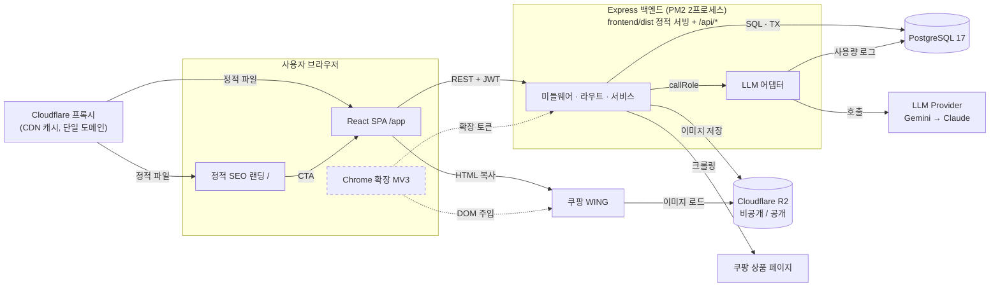
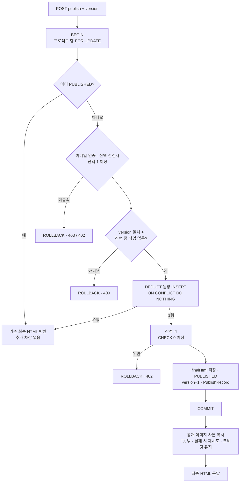
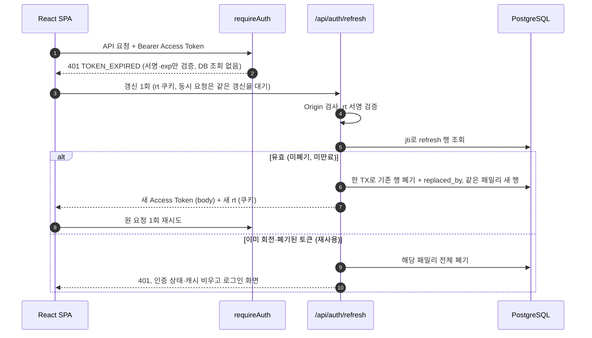
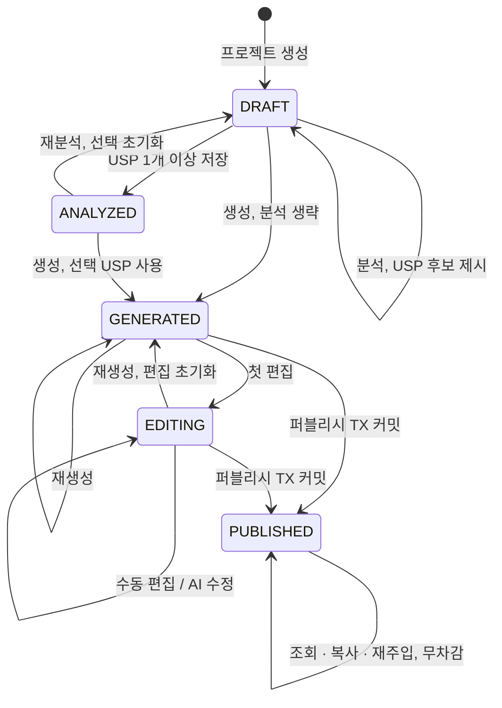
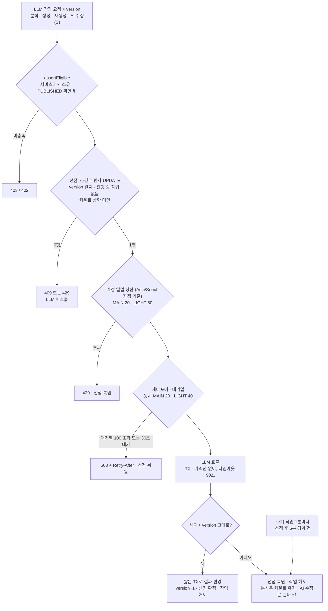
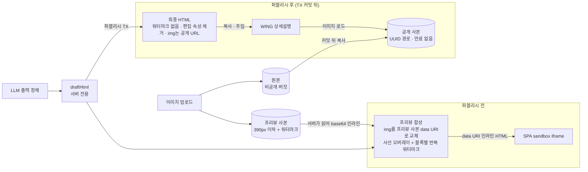

# Coupang AI Detail Maker - 기술 아키텍처 다이어그램 (v0.1.10 초안)

## 1. 문서 정보

| 항목 | 내용 |
|---|---|
| 문서 | Coupang AI Detail Maker 기술 아키텍처 다이어그램 |
| 버전 | v0.1.10 (초안) |
| 작성일 | 2026-09-30 |
| 작성자 | hyunboee (Claude 작성) |
| 기준 도메인 정의서 버전 | v0.3.10 (`docs/1-domain-definition.md`) |
| 기준 PRD 버전 | v0.3.9 (`docs/2-PRD.md`) |
| 기준 구조 원칙 버전 | v0.1.10 (`docs/5-project-principle.md`) |
| 범위 | 전체 구성 1장과 복잡한 비즈니스 로직 5장. 세부 API·테이블·라이브러리는 PRD와 구조 원칙을 따른다 |

**표기 규약**
- 점선 박스·점선 화살표는 S 단계(MVP 직후) 요소다.
- `확인 필요 (C-n)`은 구조 원칙 8.2절의 미결 항목이다. 다이어그램은 현재 문서 기준으로 그렸다.

### 문서 변경 이력

> 새 행은 표 맨 위에 추가한다.
> 기준 문서(도메인 정의서, PRD, 구조 원칙)가 갱신되면 이 문서도 갱신하고 기준 버전을 기록한다.

| 버전 | 일자 | 변경자 | 기준 도메인 | 기준 PRD | 기준 구조 원칙 | 변경내용 |
|---|---|---|---|---|---|---|
| v0.1.10 | 2026-10-01 | hyunboee (Claude 작성) | v0.3.10 | v0.3.9 | v0.1.10 | 백엔드 구현 [가정] 반영: 기준 문서 버전 갱신만(다이어그램 변경 없음) |
| v0.1.9 | 2026-09-30 | hyunboee (Claude 작성) | v0.3.9 | v0.3.8 | v0.1.9 | DB-01~03 구현 후속 정합화: 기준 문서 버전 갱신만(다이어그램 변경 없음) |
| v0.1.8 | 2026-09-30 | hyunboee (Claude 작성) | v0.3.8 | v0.3.7 | v0.1.8 | 기준 구조 원칙 버전 갱신만 반영 |
| v0.1.7 | 2026-09-30 | hyunboee (Claude 작성) | v0.3.8 | v0.3.7 | v0.1.7 | 권장안 반영: 자격 검사 서비스 내 판정, 퍼블리시 TX 잔액 선검사, PG Should 근거. 2장 설명, 3장 퍼블리시 TX 노드 라벨(순서는 기존과 일치), 4장 설명, 6장 LLM 작업 처리 B 노드 |
| v0.1.6 | 2026-09-30 | hyunboee (Claude 작성) | v0.3.7 | v0.3.6 | v0.1.6 | 문서 간 정합성 재점검 반영: 기준 문서 버전 갱신만(다이어그램 변경 없음) |
| v0.1.5 | 2026-09-30 | hyunboee (Claude 작성) | v0.3.6 | v0.3.5 | v0.1.5 | 기준 구조 원칙 버전 갱신만 반영 |
| v0.1.4 | 2026-09-30 | hyunboee (Claude 작성) | v0.3.6 | v0.3.5 | v0.1.4 | MVP 일정·범위 2단계(P1 2일 핵심 슬라이스, P2 MVP 완성) 재조정(Claude 위임 결정). 기준 문서 버전 갱신만(다이어그램 변경 없음) |
| v0.1.3 | 2026-09-30 | hyunboee (Claude 작성) | v0.3.5 | v0.3.4 | v0.1.3 | 권장안 반영: 폼 저장 version+1, 최종 HTML 편집 속성 제거. 7장 콘텐츠 보호 다이어그램 |
| v0.1.2 | 2026-09-30 | hyunboee (Claude 작성) | v0.3.4 | v0.3.3 | v0.1.2 | 미결 결정 DEC-01~10 반영(Claude 위임 결정): 2장 전체 구성도(Cloudflare 프록시 + Express 정적 서빙, R2), 4장 C-3(해소), 6장 일일 상한 기준 시각, 7장 콘텐츠 보호(프리뷰 이미지 data URI)와 C-1(해소) |
| v0.1.1 | 2026-09-30 | hyunboee (Claude 작성) | v0.3.3 | v0.3.2 | v0.1.1 | 문서 간 정합성 점검 반영: 3장 퍼블리시 TX 다이어그램(PUBLISHED 확인 뒤 자격 검사, BR-10·BR-13), 3장 C-5·6장 C-10 해소 표시, 4장의 절 참조(5장 → 6장), 4장 C-3·7장 C-1 교차 참조 |
| v0.1 | 2026-09-30 | hyunboee (Claude 작성) | v0.3.2 | v0.3.1 | v0.1 | 최초 작성. 메인 아키텍처 1장, 비즈니스 로직 다이어그램 5장 |

### 다이어그램 목록

| # | 제목 | 유형 | 근거 |
|---|---|---|---|
| 1 | 전체 아키텍처 | flowchart | PRD 7.1·7.5·7.6, P-1~8 |
| 2 | 퍼블리시 트랜잭션 | flowchart | FR-21, FR-22, BR-12~15, BR-48, P-5 |
| 3 | JWT 요청 인증과 토큰 회전·재사용 탐지 | sequence | FR-05, FR-37~40, BR-03, BR-06 |
| 4 | 프로젝트 상태 전이 | stateDiagram | DG-1, BR-24~27, BR-34, BR-46 |
| 5 | LLM 작업 처리 (선점·상한·동시성) | flowchart | FR-29, FR-34, FR-35, NFR-03, BR-47, BR-75, BR-76 |
| 6 | 콘텐츠 보호 (프리뷰 vs 최종 HTML) | flowchart | FR-16, FR-22, BR-50~54, BR-66, P-6 |

---

## 2. 전체 아키텍처

- 랜딩(정적 HTML)과 SPA는 Express가 `frontend/dist`로 서빙하고 앞단 Cloudflare 프록시가 캐시한다. 프론트와 API가 같은 출처라 CORS는 없다. 모든 비즈니스 규칙은 Express 백엔드 하나에서 판정한다(P-1, PP-02).
- 백엔드 안은 `requireAuth → 라우트 → 서비스` 한 줄이고 자격 검사(`assertEligible`)는 서비스가 프로젝트를 조회한 직후 한다. 프리뷰 합성·퍼블리시 TX·주기 작업도 여기에 있다. LLM 호출만 어댑터로 분리해 Role 매핑·세마포어·일일 상한을 모은다(LY-01, LY-04).
- 정합성은 PostgreSQL 제약과 TX가, 과부하는 어댑터의 동시성 한도가 막는다. LLM 대기 중에는 DB 커넥션을 잡지 않는다(P-5, P-7).
- 스토리지(Cloudflare R2)는 비공개(원본·프리뷰 사본)와 공개(퍼블리시 이미지)로 나뉘고, WING은 공개 사본만 읽는다(BR-66).
- S 단계 중 Google OAuth와 PG 충전 결제는 백엔드에 라우트가 추가되는 형태라 이 그림에서 생략했다.

---

## 3. 퍼블리시 트랜잭션

**왜 복잡한가**: 동시 요청·재요청·잔액 부족·진행 중 작업이 한 TX 안에서 모두 판정돼야 하고, 크레딧은 프로젝트당 정확히 1번만 차감돼야 한다. 공개 이미지 복사는 TX 밖이라 실패해도 크레딧은 유지된다.

그 밖의 오류는 모두 ROLLBACK(PublishFailed)이며 잔액·상태가 바뀌지 않는다.

근거: FR-21, FR-22, FR-34, FR-35, BR-12, BR-13, BR-14, BR-15, BR-39, BR-48, BR-52, BR-66, P-5

C-5 해소(도메인 v0.3.3 BR-10, PRD v0.3.2 FR-06): 자격 검사는 PUBLISHED 확인 뒤 TX 안에서 한다. 잔액 0인 사용자의 PUBLISHED 재요청도 기존 결과를 반환한다(BR-13).

---

## 4. JWT 요청 인증과 토큰 회전·재사용 탐지

**왜 복잡한가**: Access Token은 DB 없이 검증하고, 만료되면 프론트가 갱신을 한 번으로 합쳐 재시도해야 한다. Refresh Token은 쓸 때마다 회전하며, 이미 회전된 토큰이 오면 패밀리 전체를 폐기해야 한다.

토큰 검증을 통과한 요청은 자격 검사 대상 API에서만 서비스가 프로젝트 조회 직후(`POST /api/projects`는 라우트에서) `assertEligible`(DB 조회)을 호출한다(6장 B 노드).

근거: FR-05, FR-06, FR-36, FR-37, FR-38, FR-39, FR-40, BR-03, BR-06, P-3

C-3 해소(DEC-02): 프론트와 API가 단일 도메인·동일 출처라 `SameSite=Strict`인 `rt` 쿠키가 3번 단계에서 그대로 전송된다(PRD-D-2, D-31). 401 `TOKEN_INVALID`는 이 갱신 흐름을 타지 않고 곧바로 인증 상태를 비우고 로그인 화면으로 간다(FR-40).

---

## 5. 프로젝트 상태 전이

**왜 복잡한가**: 분석·USP 저장은 첫 생성 전에만, 재생성은 편집을 초기화하며, PUBLISHED는 읽기 전용이다. 모든 전이에 사용 자격·진행 중 작업 없음·version 일치가 공통으로 걸린다.

공통 조건: PUBLISHED 조회를 뺀 모든 전이는 사용 자격(BR-10), 진행 중 작업 없음(BR-39), version 일치(BR-48)를 요구한다. 실패한 LLM 작업은 상태를 바꾸지 않는다.

근거: DG-1, FR-10, FR-12, FR-13, FR-15, FR-20, BR-24, BR-25, BR-27, BR-34, BR-38, BR-46, BR-62

---

## 6. LLM 작업 처리 (선점·상한·동시성)

**왜 복잡한가**: 프로젝트 한도·계정 일일 상한·프로세스 동시성이 서로 다른 층에서 걸리고, 거절·실패·늦은 결과·서버 중단마다 선점을 복원해야 한다(분석과 AI 수정은 예외 규칙이 있다).

계정 상한과 세마포어는 LLM 어댑터 안(`callRole`)에서 판정하므로 서비스의 선점 뒤에 온다. 분석은 선점과 LLM 호출 사이에 휘발성 크롤링이 들어간다.

근거: FR-12, FR-15, FR-19, FR-27, FR-28, FR-29, FR-34, FR-35, NFR-03, NFR-05, BR-26, BR-39, BR-45, BR-47, BR-48, BR-75, BR-76, D-28, D-29, D-30, P-7

C-10 해소(도메인 v0.3.3 BR-47): 실행된 분석 시도는 실패해도 복원하지 않고, X3·X4처럼 LLM 미호출 거절은 선점을 복원한다. 순서 변경은 불필요하다.

---

## 7. 콘텐츠 보호 (프리뷰 vs 최종 HTML)

**왜 복잡한가**: 같은 draftHtml에서 두 가지 산출물을 만든다. 퍼블리시 전에는 워터마크 프리뷰만 나가고, 워터마크 없는 최종 HTML과 공개 이미지 사본은 TX 커밋 뒤에만 존재해야 한다.

퍼블리시 전 모든 API 응답에는 원본 경로, draftHtml, 최종 HTML, 공개 URL이 없다. 미퍼블리시 프로젝트의 최종 HTML 조회는 403이다.

근거: FR-11, FR-14, FR-16, FR-22, NFR-08, NFR-10, BR-32, BR-50, BR-51, BR-52, BR-53, BR-54, BR-66, P-6, PP-05

C-1 해소(DEC-01): 프리뷰 사본은 비공개 버킷에 있고 sandbox iframe의 ``는 Bearer 헤더를 보내지 못하므로, 서버가 390px 사본을 읽어 data URI로 프리뷰 HTML에 인라인한다. 서명 URL은 비공개 버킷 URL을 응답에 노출하므로 쓰지 않는다(D-21).
