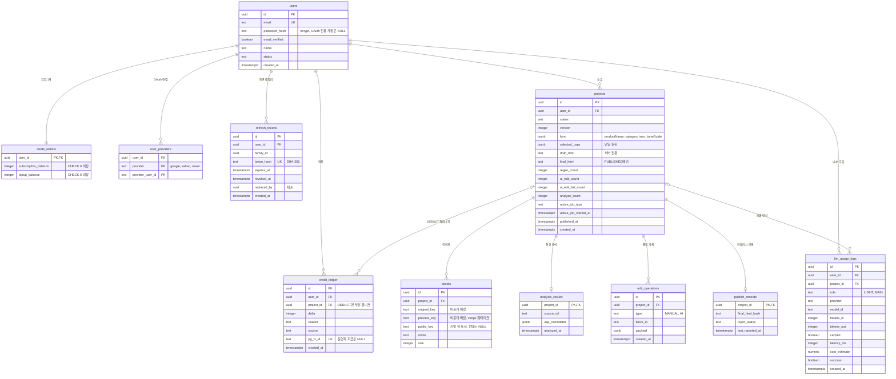
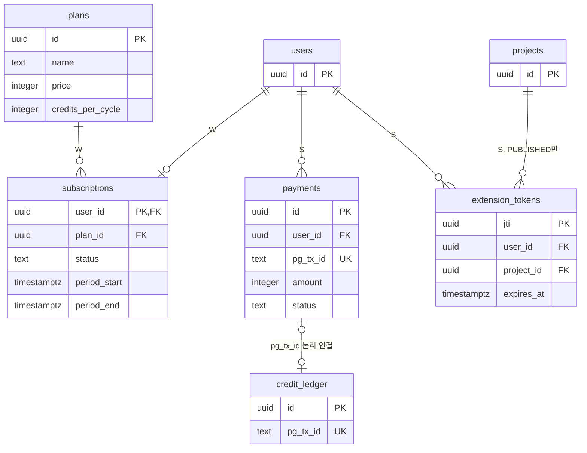

# Coupang AI Detail Maker - ERD (v0.1.7 초안)

## 1. 문서 정보

| 항목 | 내용 |
|---|---|
| 문서 | Coupang AI Detail Maker 데이터 모델(ERD) |
| 버전 | v0.1.7 (초안) |
| 작성일 | 2026-09-30 |
| 작성자 | hyunboee (Claude 작성) |
| 기준 문서 버전 | 도메인 v0.3.8, PRD v0.3.7, 시나리오 v0.1.6, 와이어프레임 v0.1.6, 구조 원칙 v0.1.7, 아키텍처 v0.1.7 |
| 범위 | PostgreSQL 17 논리·물리 모델. 물리 설계는 PRD 7.4를 기준으로 하고 도메인 엔티티·BR로 제약을 보강했다. SQL 파일은 만들지 않는다(마이그레이션은 OP-10) |

**표기 규약**
- `[가정]`: 문서 근거 없이 이 문서가 정한 것. `확인 필요`: 문서 간 차이나 미결 사항이며 번호(E-n)는 8장과 대응한다.
- 네이밍은 NM-07(snake_case, 복수형 테이블, `uuid DEFAULT gen_random_uuid()` PK, `timestamptz *_at`, 상태값은 `text + CHECK`)을 따른다.
- 우선순위 M/S/W는 PRD MoSCoW를 따른다.

### 문서 변경 이력

> 새 행은 표 맨 위에 추가한다.
> 기준 문서(도메인, PRD, 시나리오, 와이어프레임, 구조 원칙, 아키텍처)가 갱신되면 이 문서도 갱신하고 기준 버전을 기록한다.

| 버전 | 일자 | 변경자 | 기준 문서 버전 | 변경내용 |
|---|---|---|---|---|
| v0.1.7 | 2026-09-30 | hyunboee (Claude 작성) | 도메인 v0.3.8, PRD v0.3.7, 시나리오 v0.1.6, 와이어프레임 v0.1.6, 구조 원칙 v0.1.7, 아키텍처 v0.1.7 | 권장안 반영: 자격 검사 서비스 내 판정, 퍼블리시 TX 잔액 선검사, PG Should 근거. 기준 문서 버전 갱신만(본문 변경 없음). 스키마 변경 없음(`docs/schema.sql` 머리말의 근거 ERD 버전만 갱신) |
| v0.1.6 | 2026-09-30 | hyunboee (Claude 작성) | 도메인 v0.3.7, PRD v0.3.6, 시나리오 v0.1.5, 와이어프레임 v0.1.5, 구조 원칙 v0.1.6, 아키텍처 v0.1.6 | 문서 간 정합성 재점검 반영: 2장 제목(2일 MVP → MVP). 기준 문서 버전 갱신. 스키마 변경 없음(`docs/schema.sql` 머리말만 갱신) |
| v0.1.5 | 2026-09-30 | hyunboee (Claude 작성) | 도메인 v0.3.6, PRD v0.3.5, 시나리오 v0.1.4, 와이어프레임 v0.1.4, 구조 원칙 v0.1.5, 아키텍처 v0.1.5 | 기준 문서 버전 갱신만 반영 |
| v0.1.4 | 2026-09-30 | hyunboee (Claude 작성) | 도메인 v0.3.6, PRD v0.3.5, 시나리오 v0.1.4, 와이어프레임 v0.1.4, 구조 원칙 v0.1.4, 아키텍처 v0.1.4 | MVP 일정·범위 2단계(P1 2일 핵심 슬라이스, P2 MVP 완성) 재조정(Claude 위임 결정). 기준 문서 버전 갱신만(본문·스키마 변경 없음) |
| v0.1.3 | 2026-09-30 | hyunboee (Claude 작성) | 도메인 v0.3.5, PRD v0.3.4, 시나리오 v0.1.3, 와이어프레임 v0.1.3, 구조 원칙 v0.1.3, 아키텍처 v0.1.3 | 권장안 반영: 폼 저장 version+1, 최종 HTML 편집 속성 제거. 기준 문서 버전 갱신만(4.6 projects.version "변경 성공마다 +1"이 폼 저장을 이미 포함, 본문·스키마 변경 없음) |
| v0.1.2 | 2026-09-30 | hyunboee (Claude 작성) | 도메인 v0.3.4, PRD v0.3.3, 시나리오 v0.1.2, 와이어프레임 v0.1.2, 구조 원칙 v0.1.2, 아키텍처 v0.1.2 | 미결 결정 DEC-01~10 반영(Claude 위임 결정): 4.6 form, 4.7 preview_key, 4.9 payload(editId), 5.2 projects 카운트 CHECK(하한 >= 0만, E-1), 7.1, 8장 E-1·E-5·E-8·E-14(해소). `docs/schema.sql` 카운트 CHECK 4개 동기화 |
| v0.1.1 | 2026-09-30 | hyunboee (Claude 작성) | 도메인 v0.3.3, PRD v0.3.2, 시나리오 v0.1.1, 와이어프레임 v0.1.1, 구조 원칙 v0.1.1, 아키텍처 v0.1.1 | 문서 간 정합성 점검 반영: 4.1 users.email_verified(OAuth), 4.6 projects.created_at, 7.1(created_at, 화면용 카운트), 7.3(RefreshToken, Project, ExtensionToken), 8장 E-3(해소), E-8(D-21 교차 참조), E-9 |
| v0.1 | 2026-09-30 | hyunboee (Claude 작성) | 도메인 v0.3.2, PRD v0.3.1, 시나리오 v0.1, 와이어프레임 v0.1, 구조 원칙 v0.1, 아키텍처 v0.1 | 최초 작성. M 테이블 11개 메인 ERD, S/W 테이블 4개 ERD, 테이블 정의, 제약·인덱스, 열거 값, 문서 대조, 확인 필요 목록 |

---

## 2. 메인 ERD (M, MVP)

- 크레딧은 `credit_wallets`(현재 잔액)와 `credit_ledger`(불변 원장) 두 테이블로 둔다. 잔액 = 원장 합계(BR-15)는 일 1회 대사로 확인한다(NFR-14, OP-13).
- `refresh_tokens.replaced_by`는 같은 테이블의 `jti`를 가리키지만 FK를 걸지 않는다 `[가정]`(만료 행 일 1회 삭제와 충돌 방지).

---

## 3. S/W 단계 ERD

- 도입 시점: `payments`는 FR-08(S), `extension_tokens`는 FR-24(S), `plans`·`subscriptions`는 FR-09(W). 구조 원칙 PP-10에 따라 해당 기능 구현 때 새 마이그레이션으로 추가한다.
- M 테이블 중 S를 위해 미리 둔 컬럼: `projects.ai_edit_count`·`ai_edit_fail_count`(FR-19), `credit_wallets.subscription_balance`, `credit_ledger.source`(PRD 4.2, PP-10).
- `payments`와 `credit_ledger`는 `pg_tx_id`로 연결하되 FK는 두지 않는다 `[가정]`(운영자 지급·구독 EXPIRE는 결제 행이 없다).

---

## 4. 테이블 정의

> NULL 열: N = NOT NULL, Y = NULL 허용. 기본값이 없으면 `-`.

### 4.1 users (M)

| 컬럼 | 타입 | NULL | 기본값 | 설명 | 근거 |
|---|---|---|---|---|---|
| id | uuid | N | gen_random_uuid() | PK | NM-07 |
| email | text | N | - | 로그인 ID, UNIQUE | PRD 7.4, BR-02 |
| password_hash | text | Y | - | bcrypt. OAuth 전용 계정은 NULL `[가정]` | FR-01 |
| email_verified | boolean | N | false | 계정 요건. MVP는 FR-07이 true로 설정, OAuth 가입은 가입 시 true | BR-04, FR-02, FR-06, PRD-D-7 |
| name | text | Y | - | 표시 이름. 가입 폼에 입력란 없음 | 도메인 3.1, PRD 7.4 |
| status | text | N | 'ACTIVE' `[가정]` | 계정 상태. 정지 시 모든 패밀리 폐기 | FR-39, BR-06 |
| created_at | timestamptz | N | now() | 가입 시각 | KPI-1 |

### 4.2 user_providers (M, 실사용은 FR-02 S)

| 컬럼 | 타입 | NULL | 기본값 | 설명 | 근거 |
|---|---|---|---|---|---|
| user_id | uuid | N | - | FK users.id | PRD 7.4 |
| provider | text | N | - | google·kakao·naver. PK(provider, provider_user_id) `[가정]` | BR-01, BR-02 |
| provider_user_id | text | N | - | Provider 쪽 사용자 ID | PRD 7.4 |

### 4.3 refresh_tokens (M)

| 컬럼 | 타입 | NULL | 기본값 | 설명 | 근거 |
|---|---|---|---|---|---|
| jti | uuid `[가정]` | N | - | PK. JWT `jti` 클레임 | PRD 5.8 |
| user_id | uuid | N | - | FK users.id | PRD 5.8 |
| family_id | uuid | N | - | 로그인 1회 = 패밀리 1개, 재사용 탐지 시 일괄 폐기 | FR-36, FR-38 |
| token_hash | text | N | - | SHA-256, UNIQUE | PRD 5.8, OP-03 |
| expires_at | timestamptz | N | - | 14일, 회전 시 새로 계산 | PRD 5.8 |
| revoked_at | timestamptz | Y | - | 회전·로그아웃·재사용 탐지 시 기록 | FR-37~39 |
| replaced_by | uuid | Y | - | 회전으로 만든 새 행의 jti | FR-37 |
| created_at | timestamptz | N | now() | 발급 시각. 패밀리 최대 30일은 같은 family의 최소 created_at으로 판정 `[가정]` | PRD 5.8 |

### 4.4 credit_wallets (M)

| 컬럼 | 타입 | NULL | 기본값 | 설명 | 근거 |
|---|---|---|---|---|---|
| user_id | uuid | N | - | PK, FK users.id. 가입 TX에서 생성 | BR-05 |
| subscription_balance | integer | N | 0 | 구독 크레딧. MVP는 항상 0 | BR-14, BR-16 |
| topup_balance | integer | N | 0 | 충전 크레딧. 퍼블리시 TX에서 -1 | BR-14, FR-21 |

### 4.5 credit_ledger (M)

| 컬럼 | 타입 | NULL | 기본값 | 설명 | 근거 |
|---|---|---|---|---|---|
| id | uuid | N | gen_random_uuid() | PK | NM-07 |
| user_id | uuid | N | - | FK users.id | 도메인 3.2 |
| project_id | uuid | Y | - | FK projects.id. DEDUCT에만 채움 | BR-13 |
| delta | integer | N | - | 증감(DEDUCT -1, PURCHASE +n) | FR-07, PRD 7.3 |
| reason | text | N | - | 6장 열거 값 | 도메인 3.2 |
| source | text | N | - | SUBSCRIPTION·TOPUP. MVP는 TOPUP만 | BR-16, PRD 7.3 |
| pg_tx_id | text | Y | - | PG 거래 ID, UNIQUE. 운영자 지급은 NULL | BR-17, FR-07 |
| created_at | timestamptz | N | now() | 기록 시각 | KPI-1 |

### 4.6 projects (M)

| 컬럼 | 타입 | NULL | 기본값 | 설명 | 근거 |
|---|---|---|---|---|---|
| id | uuid | N | gen_random_uuid() | PK | NM-07 |
| user_id | uuid | N | - | FK users.id | PRD 7.4 |
| status | text | N | 'DRAFT' | 6장 열거 값 | BR-38, 도메인 5장 |
| version | integer | N | 1 | 낙관적 잠금, 변경 성공마다 +1 | BR-48, FR-34 |
| form | jsonb | N | '{}' `[가정]` | 제품명·카테고리·소개글·톤앤매너. `POST /api/projects`(선택)와 `PUT /api/projects/:id/form`으로 저장(E-5 해소) | BR-35, D-18 |
| selected_usps | jsonb | N | '[]' | 선택 USP 배열, 단일 원천 | BR-24, BR-25 |
| draft_html | text | Y | - | 생성 전 NULL. 클라이언트에 보내지 않음 | BR-32 |
| final_html | text | Y | - | 퍼블리시 TX에서만 저장 | BR-52, FR-21 |
| regen_count | integer | N | 0 | 재생성 선점 카운트, 상한 3 | BR-34, D-5 |
| ai_edit_count | integer | N | 0 | AI 수정 성공, 상한 3 (S 선반영) | BR-41 |
| ai_edit_fail_count | integer | N | 0 | AI 수정 실패, 상한 6 (S 선반영) | BR-45, D-20 |
| analyze_count | integer | N | 0 | 분석 시도(실패 포함, 복원 없음), 상한 3 | BR-26, D-27 |
| active_job_type | text | Y | - | 진행 중 LLM 작업. NULL = 없음 | BR-39, FR-35 |
| active_job_started_at | timestamptz | Y | - | 선점 시각. 5분 경과 시 주기 작업이 복원 | BR-47, D-30 |
| published_at | timestamptz | Y | - | 퍼블리시 시각 | PRD 7.3, KPI-2 |
| created_at | timestamptz | N | now() | 생성 시각(PRD v0.3.2 7.4 반영) | KPI-2, N-3 |

### 4.7 assets (M)

| 컬럼 | 타입 | NULL | 기본값 | 설명 | 근거 |
|---|---|---|---|---|---|
| id | uuid | N | gen_random_uuid() | PK | NM-07 |
| project_id | uuid | N | - | FK projects.id. 프로젝트당 10개는 앱 검증 | PRD 7.4, D-19 |
| original_key | text | N | - | 비공개 버킷 원본 키. 응답 금지 | BR-32, PP-05 |
| preview_key | text | N | - | 비공개 버킷 프리뷰 사본 키(390px 이하, 워터마크). 서버가 읽어 data URI로 프리뷰 HTML에 인라인(E-8) | BR-50, FR-11 |
| public_key | text | Y | - | 공개 사본 키. 커밋 뒤 복사, NULL이면 복사 미완료 | BR-66, FR-22 |
| mime | text | N | - | image/jpeg·png·webp(앱 검증) | D-19 |
| size | integer | N | - | 바이트, 10MB 이하(앱 검증) | D-19 |

### 4.8 analysis_results (M)

| 컬럼 | 타입 | NULL | 기본값 | 설명 | 근거 |
|---|---|---|---|---|---|
| project_id | uuid | N | - | PK, FK projects.id. 재분석 시 행을 덮어씀 `[가정]` | BR-27 |
| source_url | text | N | - | 쿼리 제거한 쿠팡 상품 URL | BR-20 |
| usp_candidates | jsonb | N | - | USP 후보 배열. 크롤링 원문 컬럼 없음 | BR-22, BR-24 |
| analyzed_at | timestamptz | N | now() | 분석 시각 | 도메인 3.3 |

### 4.9 edit_operations (M)

| 컬럼 | 타입 | NULL | 기본값 | 설명 | 근거 |
|---|---|---|---|---|---|
| id | uuid | N | gen_random_uuid() | PK | NM-07 |
| project_id | uuid | N | - | FK projects.id | BR-44 |
| type | text | N | - | MANUAL(M), AI(S) | 도메인 3.5 |
| block_id | text | N | - | `data-block-id` 값 | FR-17 |
| payload | jsonb | N | - | `{editId, text}` 등 편집 내용. HTML 금지 | FR-17, BR-44 |
| created_at | timestamptz | N | now() | 기록 시각 | 도메인 3.5 |

### 4.10 publish_records (M)

| 컬럼 | 타입 | NULL | 기본값 | 설명 | 근거 |
|---|---|---|---|---|---|
| project_id | uuid | N | - | PK, FK projects.id | PRD 7.4, BR-12 |
| final_html_hash | text | N | - | 최종 HTML 해시(SHA-256 hex `[가정]`). 동시 퍼블리시 응답 동일성 검증 | AC-BR13 |
| inject_status | text | N | 'PENDING' | PENDING·INJECTED·FAILED. 확장(S) 전까지 PENDING | BR-64 |
| last_reported_at | timestamptz | Y | - | 마지막 주입 보고 시각 | FR-25 |

### 4.11 llm_usage_logs (M)

| 컬럼 | 타입 | NULL | 기본값 | 설명 | 근거 |
|---|---|---|---|---|---|
| id | uuid | N | gen_random_uuid() | PK | NM-07 |
| user_id | uuid | N | - | FK users.id. 일일 상한 집계 기준 | BR-75, FR-29 |
| project_id | uuid | Y | - | FK projects.id | BR-73 |
| role | text | N | - | LIGHT·MAIN | BR-23, BR-31 |
| provider | text | N | - | google·anthropic·mock(환경변수 값) | FR-27, 6.1절(구조 원칙) |
| model_id | text | N | - | 호출한 모델 ID | FR-28 |
| tokens_in | integer | Y | - | 입력 토큰. 실패 시 NULL `[가정]` | FR-28 |
| tokens_out | integer | Y | - | 출력 토큰. 실패 시 NULL `[가정]` | FR-28 |
| cached | boolean | N | false | Prompt Caching 적중(C) | FR-30 |
| latency_ms | integer | N | - | 지연 시간 | KPI-7 |
| cost_estimate | numeric `[가정]` | Y | - | 추정 원가 | KPI-4 |
| success | boolean | N | - | 성공 여부. 실패도 기록 | FR-28 |
| created_at | timestamptz | N | now() | 호출 시각 | FR-29 |

### 4.12 S/W 테이블 요약

| 테이블 | 컬럼(도메인 3.2·3.7 그대로) | 비고 | 근거 |
|---|---|---|---|
| plans (W) | id, name, price(integer `[가정]`), credits_per_cycle | - | FR-09 |
| subscriptions (W) | user_id(PK `[가정]`), plan_id, status, period_start, period_end | 사용자당 1건 `[가정]` | BR-18 |
| payments (S) | id, user_id, pg_tx_id(UNIQUE), amount(integer 원 `[가정]`), status | status 값 미정(E-12) | FR-08, BR-17 |
| extension_tokens (S) | jti(PK), user_id, project_id, expires_at | 발급 기록용, 검증은 무상태 JWT | FR-24, BR-60 |

---

## 5. 제약·인덱스

### 5.1 유니크

| 대상 | 정의 | 근거 |
|---|---|---|
| users | UNIQUE(email) | PRD 7.4, BR-02 |
| user_providers | PRIMARY KEY(provider, provider_user_id) | PRD 7.4 |
| refresh_tokens | UNIQUE(token_hash) | PRD 7.4 |
| credit_ledger | `credit_ledger_project_deduct_uq`: UNIQUE(project_id) WHERE reason = 'DEDUCT' | BR-13, FR-21, NM-08 |
| credit_ledger | UNIQUE(pg_tx_id) (NULL은 중복 허용) | BR-17, FR-08 |
| publish_records, analysis_results, credit_wallets | PK가 곧 1:1 보장 | PRD 7.4 |
| payments (S) | UNIQUE(pg_tx_id) | BR-17 |

### 5.2 CHECK

| 테이블 | 조건 | 근거 |
|---|---|---|
| credit_wallets | subscription_balance >= 0, topup_balance >= 0 | BR-14, PRD 7.3 |
| credit_ledger | reason IN (6장), source IN (6장) | 도메인 3.2 |
| credit_ledger | reason <> 'DEDUCT' OR project_id IS NOT NULL `[가정]` | BR-13 |
| projects | status IN (6장), active_job_type IS NULL OR IN (6장) | PRD 7.4, NM-07 |
| projects | version >= 1 | BR-48 |
| projects | regen_count >= 0, analyze_count >= 0, ai_edit_count >= 0, ai_edit_fail_count >= 0 (하한만. 상한 3·3·3·6은 config 값(PP-09)으로 조건부 UPDATE `< $max`가 강제, E-1 해소) | PRD 7.4, D-5, D-20, D-27 |
| projects | (active_job_type IS NULL) = (active_job_started_at IS NULL) `[가정]` | FR-35 |
| projects | status <> 'PUBLISHED' OR (final_html IS NOT NULL AND published_at IS NOT NULL) `[가정]` | BR-12 |
| edit_operations | type IN ('MANUAL', 'AI') | 도메인 3.5 |
| publish_records | inject_status IN (6장) | 도메인 3.7 |
| llm_usage_logs | role IN ('LIGHT', 'MAIN') | BR-70 |
| user_providers | provider IN ('google', 'kakao', 'naver') `[가정]` | BR-01 |
| users | status IN (6장) `[가정]` | FR-39 |

### 5.3 인덱스

| 인덱스 | 용도 | 근거 |
|---|---|---|
| llm_usage_logs(user_id, created_at) | 계정 일일 상한 집계 | PRD 7.4, FR-29 |
| refresh_tokens(user_id) | 사용자 전체 패밀리 폐기(비밀번호 변경·정지) | PRD 7.4, FR-39 |
| refresh_tokens(family_id) | 재사용 탐지 시 패밀리 폐기 | PRD 7.4, FR-38 |
| projects(user_id) `[가정]` | 내 프로젝트 목록 | FR-10, WF-03 |
| assets(project_id) `[가정]` | 프로젝트당 10장 검사, 프리뷰 합성 | FR-11 |
| 그 외 FK | 인덱스 없음(MVP 규모). 필요 시 새 마이그레이션 | PP-01 |

### 5.4 FK ON DELETE 정책 `[가정]`

- 모든 FK는 기본값(`NO ACTION`, 사실상 RESTRICT)으로 둔다. 문서에 사용자·프로젝트·이미지 삭제 API가 없다(I-9, N-3).
- CASCADE를 쓰지 않는 이유: `credit_ledger`는 불변 원장이라 연쇄 삭제되면 BR-15 대사가 깨진다. `llm_usage_logs`는 KPI-4 원가 근거다.
- `refresh_tokens`의 만료 행은 일 1회 job이 삭제한다(PRD 7.4, LY-07). 이 테이블을 참조하는 FK는 없다.

---

## 6. 상태·열거 값

| 컬럼 | 값 | M에서 쓰는 값 | 근거 |
|---|---|---|---|
| projects.status | DRAFT, ANALYZED, GENERATED, EDITING, PUBLISHED | 전부 | 도메인 5장(DG-1), 아키텍처 5장 |
| projects.active_job_type | NULL, ANALYZE, GENERATE, REGEN, AI_EDIT | AI_EDIT 제외 | REGEN은 PRD 7.2. 나머지 이름은 `[가정]`(작업 종류는 FR-35) |
| credit_ledger.reason | PURCHASE, GRANT, EXPIRE, DEDUCT, REFUND | PURCHASE, DEDUCT | 도메인 3.2, FR-07, FR-21. REFUND는 D-32 미결 |
| credit_ledger.source | SUBSCRIPTION, TOPUP | TOPUP | 도메인 3.2, PRD 7.3 |
| publish_records.inject_status | PENDING, INJECTED, FAILED | PENDING | 도메인 3.7, BR-64 |
| edit_operations.type | MANUAL, AI | MANUAL | 도메인 3.5, 구조 원칙 4.3 |
| llm_usage_logs.role | LIGHT, MAIN | 전부 | BR-70, FR-27 |
| user_providers.provider | google, kakao, naver `[가정]` | 없음(S) | BR-01. credentials는 password_hash로 표현 |
| users.status | ACTIVE, SUSPENDED `[가정]` | ACTIVE | 값 정의 없음. FR-39의 "계정 정지"에서 추론 |
| subscriptions.status (W) | ACTIVE, CANCELED, PAST_DUE, ENDED | - | BR-18 |
| payments.status (S) | 정의 없음 | - | E-12 |

**진행 중 작업과 선점 복원 대응** (주기 작업이 `active_job_type`으로 복원 대상 카운트를 고른다, BR-47)

| active_job_type | 선점 카운트 | 5분 경과·실패 시 |
|---|---|---|
| ANALYZE | analyze_count | 복원하지 않음(BR-26) |
| GENERATE | 없음 | 작업 표시만 해제 |
| REGEN | regen_count | -1 |
| AI_EDIT (S) | ai_edit_count | -1, LLM 실패면 ai_edit_fail_count +1(BR-45) |

---

## 7. 문서 대조 결과

### 7.1 다른 문서가 요구하지만 PRD 7.4에 없는 것

| 요구 | 출처 | 처리 |
|---|---|---|
| projects.created_at | 도메인 KPI-2(Project.createdAt), WF-03 목록 일자·정렬(N-3) | 추가(4.6). PRD v0.3.2 7.4에 반영(E-3) |
| 폼 값(제품명 등) 저장 위치 | 시나리오 I-8, 구조 원칙 C-9, WF-04 "DRAFT 이어서 작성" | PRD의 `projects.form` jsonb로 수용. 저장은 `PUT /api/projects/:id/form`(E-5 해소) |
| 화면용 카운트·version·active_job | WF-05·06·09(N-5), 구조 원칙 C-8 | 컬럼은 모두 있음. API 응답 필드(`toProject`)는 PRD v0.3.2 8장에 반영, 스키마 변경 없음 |
| 프리뷰 이미지 전달 | 구조 원칙 C-1, 아키텍처 7장 | `assets.preview_key`로 충분. data URI 인라인으로 확정, 새 컬럼 불필요(E-8) |
| 공개 사본 복사 재시도 상태 | FR-22, 시나리오 I-16 | `assets.public_key IS NULL`로 미완료 판정. 별도 상태 컬럼 없음 `[가정]` |
| 409·429 오류 원인 구분 | 시나리오 I-7, 구조 원칙 C-2 | 응답 코드(4.2절) 영역이라 DB 컬럼 불필요. 판정 재료(status, version, active_job_type, 각 카운트)는 이미 있음 |
| WING 주입 성공률(시도 단위) | 도메인 KPI-5 | `publish_records`는 마지막 상태만 보관해 시도 단위 집계 불가(E-10) |
| 확장 결과 화면 표시 | WF-10(N-13) | `publish_records.inject_status`로 조회 가능. API만 미정 |
| AI 수정 대화 내역 | WF-09(N-12) | 테이블 없음. S 단계 결정(E-11) |
| 마이그레이션 기록 테이블 `schema_migrations` | 구조 원칙 OP-10 | 도구 테이블이라 ERD에서 제외 |

### 7.2 PRD에 있지만 쓰는 곳이 없는 것

| 항목 | 상태 |
|---|---|
| users.name | 가입 화면(WF-02)·API에 입력·표시 없음. NULL 허용으로 둠 |
| users.status | 값 정의·정지 기능 FR 없음. FR-39의 폐기 조건으로만 등장 |
| edit_operations | 기록(US-13)만 하고 읽는 API·화면 없음. 감사 기록 용도 |
| analysis_results.source_url | 화면(WF-05)에 표시 근거 없음. 재분석 입력 복원용으로 추정 |
| credit_wallets.subscription_balance, credit_ledger.source | 구독(W) 전까지 0·TOPUP 고정. PRD 4.2 선반영 |
| projects.ai_edit_count, ai_edit_fail_count | AI 수정(S) 전까지 0. PRD 4.2 선반영 |
| publish_records.inject_status, last_reported_at | 확장(S) 전까지 PENDING·NULL |
| llm_usage_logs.cached | Prompt Caching(C) 전까지 false |
| user_providers | Google OAuth(S) 전까지 행 없음. PP-10과 충돌 소지(E-4) |

### 7.3 도메인 엔티티 ↔ 테이블 매핑

| 도메인 엔티티 | 테이블 | 차이·이유 |
|---|---|---|
| User | users + user_providers | `providers[]` 배열을 행으로 분리. credentials는 행 대신 password_hash `[가정]`(E-4) |
| RefreshToken | refresh_tokens | 일치. createdAt은 도메인 v0.3.3에 반영 |
| Plan, Subscription, Payment | plans, subscriptions, payments | S/W. Subscription PK 없음 → user_id PK `[가정]` |
| CreditWallet | credit_wallets | 일치 |
| CreditLedger | credit_ledger | 일치 |
| AnalysisResult | analysis_results | 일치. 프로젝트당 1행 `[가정]` |
| Project | projects | `activeJob{type, startedAt}` → 컬럼 2개, `form{}` → jsonb. createdAt은 도메인 v0.3.3에 반영(KPI-2) |
| Asset | assets | `originalPath/previewPath/publicPath` → `*_key`(구조 원칙 4.3) |
| EditOperation | edit_operations | 도메인에 id 없음 → PRD의 id 사용 |
| PublishRecord | publish_records | 도메인 `publishedAt`은 projects.published_at에만 둠(중복 제거) |
| ExtensionToken | extension_tokens (S) | 도메인 v0.3.3이 PRD의 `jti` PK로 맞춤(E-9) |
| ModelRoute | 테이블 아님 | 환경변수 `LLM_MAIN`·`LLM_LIGHT`로 대체(FR-27, PRD 7.2) |
| LlmUsageLog | llm_usage_logs | 일치. id 추가(PRD) |
| 크롤링 원문, 프리뷰 HTML | 테이블 아님 | 저장 금지·응답 시 생성(BR-22, 도메인 6장 데이터 소유 표) |
| Access Token | 테이블 아님 | 무상태 검증(BR-06) |

---

## 8. 확인 필요

| # | 항목 | 내용 / 제안 | 관련 |
|---|---|---|---|
| E-1 | 카운트 상한 CHECK | 해소(DEC-04, 하한만 CHECK). 상한(3, 6)은 `config.js` 한 곳(PP-09)의 값으로 조건부 원자 UPDATE(`< $max`)가 강제한다. D-5·20·27 값이 바뀌어도 마이그레이션이 필요 없고 수치 원천이 하나다. `docs/schema.sql`의 CHECK 4개를 `>= 0`으로 바꿨다(제약 이름 유지) | PRD 7.4, PP-09, BR-47 |
| E-2 | PK 타입 | NM-07에 따라 전부 uuid로 했다. PRD는 타입을 정하지 않았다. 원장·로그처럼 외부에 노출되지 않고 행이 많은 테이블은 bigint identity도 가능. `jti` uuid는 `[가정]` | NM-07, PRD 7.4 |
| E-3 | projects.created_at | PRD 7.4에 없으나 KPI-2와 WF-03 목록 정렬이 필요로 한다. 해소: PRD v0.3.2 7.4에 반영 | KPI-2, N-3 |
| E-4 | user_providers 단계와 credentials 표현 | PRD 7.4는 M 테이블로 두지만 OAuth는 S라 MVP에서 행이 없다(PP-10은 S 테이블을 미리 만들지 말라고 함). 또 BR-01 AC는 credentials도 providers에 기록한다고 하나 PRD는 password_hash로 표현한다. OAuth 전용 계정의 password_hash NULL 허용도 `[가정]` | BR-01, PP-10, FR-02 |
| E-5 | form jsonb 저장 시점 | 해소(DEC-05, 별도 저장 API). `PUT /api/projects/:id/form`으로 저장하고 `POST /api/projects`는 선택적으로 받는다. 기본값 `'{}'`이라 스키마 변경 없음. D-18 필수값은 DB CHECK 없이 생성 요청(generate) 시점 앱 검증 | I-8, C-9, BR-35 |
| E-6 | 삭제 정책 | 사용자 탈퇴·프로젝트·이미지 삭제 API가 문서에 없어 모든 FK를 NO ACTION으로 두었다. 탈퇴 시 개인정보 처리와 원장 보존 정책 결정 필요 | I-9, N-3 |
| E-7 | 크롤링 원문 미저장(BR-22) | `analysis_results`에 원문 컬럼 없음을 확인했다. 단 `usp_candidates`에 LLM이 리뷰 문장을 그대로 옮기면 AC-BR22(DB 검색 0건)가 깨질 수 있다. 저장 전 검사 여부 결정 필요 | BR-22, AC-BR22 |
| E-8 | 프리뷰 이미지 전달과 assets | 해소(DEC-01, data URI 인라인). `preview_key`는 서버가 읽는 키로만 쓰이며 응답에 비공개 버킷 URL이 나가지 않는다. 컬럼 추가 없음 | C-1, BR-50, D-21 |
| E-9 | extension_tokens 식별자 | 도메인 v0.3.3이 PRD의 `jti` PK로 맞췄다. 발급 기록만 하고 검증은 무상태라 테이블 자체가 필요한지도 S 착수 때 판단 | BR-60, FR-24 |
| E-10 | 주입 시도 기록 | KPI-5는 시도 단위 성공률인데 `publish_records`는 프로젝트당 마지막 상태 1행이다. 제안: 로그(NFR-18)로 집계하고 테이블은 추가하지 않음 | KPI-5, BR-64 |
| E-11 | AI 수정 대화 보관 | 서버 보관이면 `edit_operations.payload`(type=AI)에 지시문을 담을지 결정 필요(S) | N-12, FR-19 |
| E-12 | payments.status·구독 원장 | payments.status 값 정의가 없다. 또 BR-17은 갱신 시 EXPIRE와 GRANT를 같은 TX로 기록하는데 둘 다 pg_tx_id를 가지면 `UNIQUE(pg_tx_id)`에 걸린다. EXPIRE는 pg_tx_id NULL로 둘지 결정 필요(W) | BR-17, FR-08 |
| E-13 | 재생성과 edit_operations | BR-34는 재생성 시 수동 편집을 초기화한다. draft_html 교체만 할지 edit_operations 행도 지울지 정해져 있지 않다. 제안: 행은 기록으로 남김 | BR-34, I-14 |
| E-14 | 계정 일일 상한 기준 시각 | 해소(DEC-10, Asia/Seoul 자정 기준). 집계는 `created_at >= date_trunc('day', now() AT TIME ZONE 'Asia/Seoul') AT TIME ZONE 'Asia/Seoul'`. 인덱스 변경 없음 | I-20, FR-29 |
