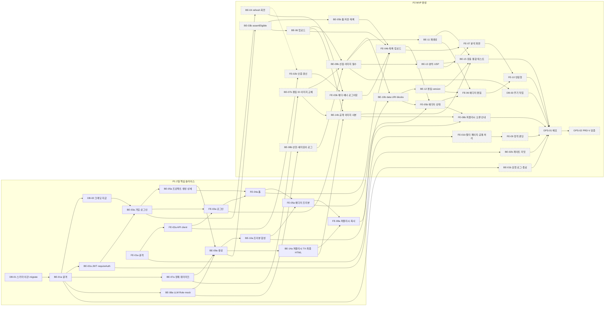

# Coupang AI Detail Maker - 작업 실행 계획 (v0.1.6 초안)

## 1. 문서 정보

| 항목 | 내용 |
|---|---|
| 문서 | Coupang AI Detail Maker 작업 실행 계획(WBS) |
| 버전 | v0.1.6 (초안) |
| 작성일 | 2026-09-30 |
| 작성자 | hyunboee (Claude 작성) |
| 기준 문서 버전 | 도메인 v0.3.8, PRD v0.3.7, 시나리오 v0.1.6, 와이어프레임 v0.1.6, 구조 원칙 v0.1.7, 아키텍처 v0.1.7, ERD v0.1.7, `docs/schema.sql`(MVP 11개 테이블, PGlite 실행 검증. DEC-04로 카운트 CHECK 4개를 `>= 0`으로 바꾼 뒤 PGlite 재실행 검증 완료: 테이블 11개 생성, 음수 거절) |
| 범위 | MVP(M) Task 분해·의존·일정. M은 P1(2일 핵심 슬라이스)과 P2(MVP 완성)로 나눈다. S/C는 8장에 요약 |

### 문서 변경 이력

> 새 행은 표 맨 위에 추가한다.
> 기준 문서가 갱신되면 이 문서도 갱신하고 기준 문서 버전을 기록한다.

| 버전 | 일자 | 변경자 | 기준 문서 버전 | 변경내용 |
|---|---|---|---|---|
| v0.1.6 | 2026-09-30 | hyunboee (Claude 작성) | 도메인 v0.3.8, PRD v0.3.7, 시나리오 v0.1.6, 와이어프레임 v0.1.6, 구조 원칙 v0.1.7, 아키텍처 v0.1.7, ERD v0.1.7 | 권장안 반영: 자격 검사 서비스 내 판정, 퍼블리시 TX 잔액 선검사, PG Should 근거. DEC-05, 4장 BE-03b 행, 5장 그래프 노드, BE-03b(미들웨어 → `assertEligible`), BE-05a, BE-05b, BE-06, BE-09a, BE-11, BE-12, BE-13, BE-14a(402 선검사, 완료 조건 1개 추가), 7장 마일스톤의 P1 제외 목록 |
| v0.1.5 | 2026-09-30 | hyunboee (Claude 작성) | 도메인 v0.3.7, PRD v0.3.6, 시나리오 v0.1.5, 와이어프레임 v0.1.5, 구조 원칙 v0.1.6, 아키텍처 v0.1.6, ERD v0.1.6 | 문서 간 정합성 재점검 반영: 3장 DEC-02·DEC-08 기한(옛 구간 표기 → 단계 표기), OPS-02 수행 작업, 9.2 순서 2·3(테스트 P1·P2 수식어). 기준 문서 버전 갱신 |
| v0.1.4 | 2026-09-30 | hyunboee (Claude 작성) | 도메인 v0.3.6, PRD v0.3.5, 시나리오 v0.1.4, 와이어프레임 v0.1.4, 구조 원칙 v0.1.5, 아키텍처 v0.1.5, ERD v0.1.5 | 기준 문서 버전 갱신만 반영 |
| v0.1.3 | 2026-09-30 | hyunboee (Claude 작성) | 도메인 v0.3.6, PRD v0.3.5, 시나리오 v0.1.4, 와이어프레임 v0.1.4, 구조 원칙 v0.1.4, 아키텍처 v0.1.4, ERD v0.1.4 | MVP 일정·범위 2단계(P1 2일 핵심 슬라이스, P2 MVP 완성) 재조정(Claude 위임 결정). 1장 범위, 2.1, 2.2(단계 표기), 2.3, 4장(단계 열, 구간), 5장 그래프·임계 경로, 6장 모든 Task의 단계·구간. Task 분할: BE-01 → BE-01a/BE-01b, BE-02 → BE-02a/BE-02b, BE-03 → BE-03a/BE-03b, BE-05 → BE-05a/BE-05b, BE-07 → BE-07a/BE-07b, BE-08 → BE-08a/BE-08b, BE-09 → BE-09a/BE-09b, BE-10 → BE-10a/BE-10b, BE-14 → BE-14a/BE-14b, FE-01 → FE-01a/FE-01b, FE-02 → FE-02a/FE-02b, FE-03 → FE-03a/FE-03b, FE-04 → FE-04a/FE-04b, FE-05 → FE-05a/FE-05b, FE-08 → FE-08a/FE-08b(추정 합계는 원래와 같음). 선행 변경: DB-02, DB-03, BE-04, BE-06, BE-11, BE-12, BE-13, BE-15, FE-06, FE-07, FE-09, OPS-01. 7장 일정(P1·P2 표), 마일스톤 M1~M3 재정의(기존 M3·M4 → M4·M5), 8.1 제목, 9장 PRD-R-1·PRD-R-2·축소 순서 |
| v0.1.2 | 2026-09-30 | hyunboee (Claude 작성) | 도메인 v0.3.5, PRD v0.3.4, 시나리오 v0.1.3, 와이어프레임 v0.1.3, 구조 원칙 v0.1.3, 아키텍처 v0.1.3, ERD v0.1.3 | 권장안 반영: 폼 저장 version+1, 최종 HTML 편집 속성 제거. BE-05, BE-14, FE-04 |
| v0.1.1 | 2026-09-30 | hyunboee (Claude 작성) | 도메인 v0.3.4, PRD v0.3.3, 시나리오 v0.1.2, 와이어프레임 v0.1.2, 구조 원칙 v0.1.2, 아키텍처 v0.1.2, ERD v0.1.2 | 미결 결정 DEC-01~10 반영(Claude 위임 결정): 3장 DEC 표(결정됨), 4장 선행 표시, 5장 임계 경로, DB-01, BE-01, BE-02, BE-03, BE-05, BE-06, BE-07, BE-08, BE-09, BE-10, BE-12, BE-14, BE-15, FE-02, FE-04, FE-05, FE-06, OPS-01, OPS-02, 7장 일정, 9장 PRD-R-2·C-3·DEC 대기 리스크 |
| v0.1 | 2026-09-30 | hyunboee (Claude 작성) | 도메인 v0.3.3, PRD v0.3.2, 시나리오 v0.1.1, 와이어프레임 v0.1.1, 구조 원칙 v0.1.1, 아키텍처 v0.1.1, ERD v0.1.1 | 최초 작성. M Task 30개(DB 3, BE 15, FE 10, OPS 2), 결정 Task 10개, S 12개, C 8개 |

---

## 2. 개요

### 2.1 범위
- M(PRD 4.1 Must)을 PRD 9장 일정에 배치한다. S/C는 8장에 요약만 둔다.
- M은 두 단계로 진행한다(2026-09-30 Claude 위임 결정). M 추정 합계 49.5h가 2일(16h)을 넘기 때문에 2일 목표는 유지하되 범위를 나눴다. 추정치는 줄이지 않았다.
  - **P1 "2일 핵심 슬라이스"**(2일 = 16h, 그중 Task 14h + 예비 2h): 가입·로그인 → 폼 입력 → 생성 → 워터마크 프리뷰 → 퍼블리시(크레딧 1 원자 차감) → 최종 HTML 복사가 로컬(또는 단일 서버)에서 한 번 끝까지 동작하는 가장 얇은 세로 슬라이스. 공개 출시는 아니다. 이미지 없이 텍스트 중심으로 생성한다.
  - **P2 "MVP 완성"**(P1 이후 5일, 35.5h): 나머지 M 전부. 공개 출시(OPS-01 배포, OPS-02 PRD-V-1~7 검증)는 P2 끝. 전체 MVP = 7일.
  - P1에서 깎지 않는 불변식: LLM·스토리지 키는 서버에만(NFR-07), 퍼블리시 전 응답에 원본·최종 HTML 없음(BR-32, NFR-08), 서버 워터마크 프리뷰(BR-50, BR-51), 퍼블리시 TX 원자성·멱등(BR-12, BR-13)과 그 P0 테스트, 로그인한 사용자만 사용(Access Token 검증), LLM 어댑터 Role 추상화와 mock(BR-70).
- 단위: **DB**(스키마·마이그레이션·운영 스크립트·정리 작업), **BE**(Express API), **FE**(정적 랜딩 + React SPA), **OPS**(배포·검증), **EXT**(Chrome 확장, S), **DEC**(착수 전 결정).

### 2.2 Task 표기 규칙
- ID: `{단위}-{2자리}`. 번호는 M → S → C 순으로 이어서 매긴다. P1·P2로 나눈 Task는 기존 ID에 `a`(P1 부분)·`b`(P2 부분)를 붙이고, 원래 추정을 두 부분에 나눠 적는다(합계는 원래와 같음).
- 단계: `P1`(2일 핵심 슬라이스), `P2`(MVP 완성). 테스트 우선순위 표기 `[P0]`·`[P1]`·`[P2]`(대괄호)와는 다른 표기다.
- 우선순위: PRD MoSCoW(M/S/C). 추정은 1인·AI 보조 기준 시간(h), 반나절 = 4h 이하.
- 선행: **직접 선행만** 적는다(전이 선행 생략). `(통합 확인)` 표시는 API 계약(PRD 8장)만으로 착수 가능하고 완료 확인에만 필요한 선행이다.
- 관련 ID: FR/NFR/BR/AC/US/WF/PRD-V와 구조 원칙(PP/LY/NM/QA/OP), 확인 필요(C/E/I/N).
- 모든 DB·BE Task 완료 조건에는 구조 원칙 5.3 DoD가 포함된다(각 Task의 마지막 체크 항목). FE Task는 `tsc --noEmit` 통과를 포함한다(QA-05).
- 구조 원칙 5.2 필수 테스트는 `[P0]`·`[P1]`·`[P2]`로 표시해 해당 기능 Task에 배치했다.

### 2.3 상태 관리
- Task 완료 = 해당 Task의 완료 조건 체크박스가 모두 `[x]`.
- 완료되면 4장 요약 표의 상태 열을 `[x]`로 바꾼다. 축소(9장)로 뺀 항목은 P1이면 `[-] P2로 이관`, P2면 `[-] M4로 이관`으로 표기한다.
- DEC는 결정되면 3장 표의 상태 열에 `결정: {내용} ({일자})`를 적고, 결정 결과가 기준 문서에 반영되면 이 문서 기준 버전을 갱신한다.

---

## 3. 착수 전 결정 (모두 결정됨)

> 결정은 2026-09-30 Claude 위임 결정으로 확정됨(결정자: hyunboee의 위임). 선택지는 원문서의 제안을 옮긴 것이며 `결정:` 뒤가 확정 내용이다.

| ID | 결정 항목 | 출처 | 문서의 제안·선택지 → 결정 | 기한 | 막던 Task | 상태 |
|---|---|---|---|---|---|---|
| DEC-01 | 프리뷰 이미지 전달 방식 | C-1, D-21, E-8, FR-16 | data URI 인라인 / 단기 서명 URL. **결정: data URI 인라인.** 서버가 비공개 버킷의 390px 워터마크 사본(`preview_key`)을 읽어 `data:image/webp;base64,...`로 프리뷰 HTML에 넣는다. 서명 URL은 쓰지 않는다 | 1일 차 오후 전 | BE-10b | 결정됨 |
| DEC-02 | 프론트·API 도메인 배치(SameSite=Strict 쿠키 전송) | C-3, PRD-D-2, D-31 | 커스텀 도메인 서브도메인 2개 / 같은 출처 프록시. **결정: 단일 도메인·동일 출처.** Express가 `frontend/dist`를 서빙하고 `/api/*`를 처리, 앞단 Cloudflare 프록시(무료 CDN 캐시). CORS 미사용(Origin 검사 유지), 별도 정적 호스팅 미사용 | P2 5일 차 전 | OPS-01 | 결정됨 |
| DEC-03 | 신규 라이브러리 승인 | C-4, LY-17, 구조 원칙 3.5 | `multer`, `@aws-sdk/client-s3`, `cheerio`, `express-rate-limit`, `react-router`, `prettier`. **결정: 6개 모두 승인**(`prettier`는 개발용) | 1일 차 착수 전 | BE-02a, BE-06, BE-07a, FE-01a | 결정됨 |
| DEC-04 | 카운트 상한 CHECK 유지 여부 | E-1, PRD 7.4, PP-09 | CHECK에 상한 박제 / 하한만 CHECK, 상한은 조건부 UPDATE. **결정: DB CHECK는 하한(`>= 0`)만.** 상한(3, 6)은 config(PP-09)의 값으로 조건부 원자 UPDATE(`< $max`)가 강제. `docs/schema.sql` 반영 완료 | 1일 차 착수 전 | DB-01 | 결정됨 |
| DEC-05 | 폼(제품명 등) 저장 API·시점 | C-9, E-5, I-8 | `POST /api/projects` body / 생성 요청 body / 별도 저장 API. **결정: 별도 저장 API `PUT /api/projects/:id/form`**(body `{form, version}`, 자격 FR-06, version 확인, DRAFT·ANALYZED만 허용·그 외 409). `POST /api/projects`는 form을 선택적으로 받고, 필수값 검증(BR-35)은 생성 요청 시점 | 1일 차 오후 전 | BE-05a, BE-05b, FE-04a, FE-04b | 결정됨 |
| DEC-06 | WING 출력 규격 실측(인라인 style·태그·외부 이미지 URL) | PRD-R-2, PRD-V-7, PRD-D-4, D-12, D-16 | 샘플 HTML 수동 붙여넣기 → 인라인 CSS·공개 URL 유지 / 규격 변경. **결정: 현재 규격 확정**(인라인 CSS 전용 + 만료 없는 공개 이미지 URL). 1일 차 오전 실측(PRD-V-7)은 검증 Task로 유지하되 블로커가 아니다. 인라인 style이나 외부 이미지가 막히면 그때 D-16/D-12를 재결정 | 1일 차 오전(실측) | 없음(블로커 해제) | 결정됨 |
| DEC-07 | 오브젝트 스토리지 선택 | PRD-D-3, D-31 | S3 호환(R2 등), 비공개·공개 버킷 분리. **결정: Cloudflare R2**(`@aws-sdk/client-s3`). 버킷 2개: 비공개(원본·프리뷰 사본), 공개(퍼블리시 이미지, R2 공개 도메인) | 1일 차 오후 전 | BE-06 | 결정됨 |
| DEC-08 | 블록 선택·편집 방식(`path` 의미, 블록 목록·현재 텍스트 출처) | N-6, FR-17 | 문서 제안 없음(WF-06은 패널 목록 방식으로 그림). **결정: 서버가 편집 대상 텍스트 요소에 블록 내 고유 `data-edit-id`를 부여**(생성 결과 정제 시). 프리뷰 응답에 `blocks: [{blockId, fields: [{editId, text}]}]`를 함께 반환, 에디터는 우측 패널 목록에서 선택(iframe 안 클릭 없음). 편집 요청 `{blockId, editId, text, version}`(FR-17의 `path`를 `editId`로 대체), 서버는 해당 요소의 텍스트 노드만 교체 | P2 2일 차 전 | BE-10b, BE-12, FE-06 | 결정됨 |
| DEC-09 | 오류 코드 채택과 403·402 우선순위 | C-2, I-2, I-4, I-7 | 구조 원칙 4.2절 제안 코드 채택 여부, 동시 해당 시 403/402 순서. **결정: 4.2절 코드 전부 채택**(502 `UPSTREAM_FAILED` 포함, 새 코드 없음). 판정 순서 401 → 409(PUBLISHED 대상) → 403 → 402 → 409(version·진행 중 작업) → 429 → 503. 프론트는 `TOKEN_INVALID`를 갱신 시도 없이 인증 상태 비우고 로그인 화면으로 | 1일 차 오전(BE-03a 전) | BE-03a, BE-08a, BE-13 | 결정됨 |
| DEC-10 | 계정 일일 LLM 상한 기준 시각 | E-14, I-20, FR-29 | 자정 기준(Asia/Seoul) / 24시간 롤링. **결정: Asia/Seoul 자정 기준.** 집계 `created_at >= date_trunc('day', now() AT TIME ZONE 'Asia/Seoul') AT TIME ZONE 'Asia/Seoul'`, 429 응답에서 초기화 시각 안내 가능 | 1일 차 오후 전 | BE-08b | 결정됨 |

**블로커가 아닌 미정 사항** (문서 현재안으로 구현하고, 확정되면 해당 Task를 수정한다)

| 항목 | 문서 현재안 | 영향 Task |
|---|---|---|
| C-6 업로드 요청 단위 | 요청당 1장(구조 원칙 제안) | BE-06, FE-04b |
| C-7 생성 API 응답 방식 | 동기 응답(최대 90초) 전제 | BE-09a, FE-05a |
| PRD-D-6, PRD-D-7 | 관리자 수동 지급만, 지급 시 `email_verified=true` | DB-02 |
| E-13 재생성 시 edit_operations | 행은 기록으로 남김(제안) | BE-11 |
| E-7 USP 후보에 리뷰 원문 포함 | 저장 전 검사 여부 미정 | BE-13 |
| I-10 USP 0개 저장, I-12 중복 이메일, N-10 가입 입력 규칙 | 문서 현재안 없음. 최소 동작으로 구현 후 문서에 역반영 요청 | BE-03a, BE-13, FE-03a |
| I-16 공개 사본 준비 전 화면 | 문서 현재안 없음 | BE-14b, FE-08b |
| draftHtml의 이미지 참조 형식 | 문서에 없음. BE-07b에서 형식 1개를 정하고 문서에 역반영 요청(원본 키·URL을 draftHtml에 넣지 않음, BR-32) | BE-07b, BE-09b, BE-10b, BE-14b |
| N-1 랜딩 카피, N-3·N-4 목록 필드·카테고리, N-8·N-9 퍼블리시 문구·최종 HTML 표현, I-3 402·403 안내 문구 | 문서 현재안 없음. 자리 문구로 구현 | FE-03b, FE-04a, FE-04b, FE-08a, FE-08b, FE-09 |
| PRD-R-9 모델 ID | 착수 시 현행 모델 ID로 환경변수 설정 | BE-08a |

---

## 4. Task 목록 요약 (M)

P1 Task는 P1 Task만 선행으로 둔다(P2 역의존 없음). P2 Task의 선행은 P1 Task를 가리킬 수 있다. P1 합계 14h, P2 합계 35.5h, 전체 49.5h(분할 전과 같음).

| ID | 제목 | 단위 | 우선 | 단계 | 선행 | 구간 | 추정 | 상태 |
|---|---|---|---|---|---|---|---|---|
| DB-01 | 스키마 이관(001_init.sql)과 마이그레이션 스크립트 | DB | M | P1 | DEC-04(결정됨) | 1일 차 오전 | 1h | [ ] |
| DB-02 | 운영자 크레딧 지급 스크립트 | DB | M | P1 | BE-01a | 1일 차 오전 | 0.5h | [ ] |
| DB-03 | 주기 작업: 선점 만료 복원·refresh 만료 삭제·원장 대사 | DB | M | P2 | BE-09b | P2 3일 차 | 1h | [ ] |
| BE-01a | 백엔드 골격·설정·오류 처리·헬스체크 | BE | M | P1 | DB-01 | 1일 차 오전 | 1h | [ ] |
| BE-01b | 요청 로그·종료 처리 | BE | M | P2 | BE-01a | P2 1일 차 | 0.5h | [ ] |
| BE-02a | JWT 모듈·requireAuth | BE | M | P1 | BE-01a, DEC-03(결정됨) | 1일 차 오전 | 0.5h | [ ] |
| BE-02b | 레이트 리밋 | BE | M | P2 | BE-02a | P2 1일 차 | 0.5h | [ ] |
| BE-03a | 가입·로그인·`/api/me` | BE | M | P1 | BE-02a, DB-02, DEC-09(결정됨) | 1일 차 오전 | 1h | [ ] |
| BE-03b | assertEligible 자격 판정과 적용 | BE | M | P2 | BE-09a | P2 1일 차 | 0.5h | [ ] |
| BE-04 | Refresh 회전·재사용 탐지·로그아웃 | BE | M | P2 | BE-03a | P2 1일 차 | 1.5h | [ ] |
| BE-05a | 프로젝트 생성(form 포함)·상세 | BE | M | P1 | BE-03a, DEC-05(결정됨) | 1일 차 오후 | 0.5h | [ ] |
| BE-05b | 폼 저장·목록 | BE | M | P2 | BE-03b | P2 1일 차 | 0.5h | [ ] |
| BE-06 | 스토리지·이미지 업로드·프리뷰 사본 | BE | M | P2 | BE-03b, DEC-03(결정됨), DEC-07(결정됨) | P2 1일 차 | 2h | [ ] |
| BE-07a | HTML 모듈: 정제·워터마크 | BE | M | P1 | BE-01a, DEC-03(결정됨) | 1일 차 오후 | 1h | [ ] |
| BE-07b | HTML 모듈: 편집 ID·이미지 교체 | BE | M | P2 | BE-07a | P2 1일 차 | 1h | [ ] |
| BE-08a | LLM 어댑터: Role·mock·타임아웃 | BE | M | P1 | BE-01a, DEC-09(결정됨) | 1일 차 오후 | 1h | [ ] |
| BE-08b | LLM 어댑터: 상한·세마포어·사용량 로그 | BE | M | P2 | BE-08a, DEC-10(결정됨) | P2 1일 차 | 1.5h | [ ] |
| BE-09a | 생성(분석 생략, 텍스트 중심) | BE | M | P1 | BE-05a, BE-07a, BE-08a | 1일 차 오후 | 1h | [ ] |
| BE-09b | 진행 중 작업 선점·이미지 필수값 | BE | M | P2 | BE-06, BE-07b, BE-08b | P2 2일 차 | 1h | [ ] |
| BE-10a | 서버 프리뷰 합성(워터마크) | BE | M | P1 | BE-09a | 1일 차 오후 | 0.5h | [ ] |
| BE-10b | 프리뷰 이미지 data URI·편집 blocks | BE | M | P2 | BE-10a, BE-09b, DEC-01(결정됨), DEC-08(결정됨) | P2 2일 차 | 1h | [ ] |
| BE-11 | 재생성 | BE | M | P2 | BE-09b | P2 2일 차 | 1h | [ ] |
| BE-12 | 수동 편집·version 잠금·읽기 전용 | BE | M | P2 | BE-10b, DEC-08(결정됨) | P2 3일 차 | 1.5h | [ ] |
| BE-13 | 경쟁사 분석·USP 저장 | BE | M | P2 | BE-09b, DEC-09(결정됨) | P2 3일 차 | 2.5h | [ ] |
| BE-14a | 퍼블리시 TX·최종 HTML | BE | M | P1 | BE-09a | 2일 차 오전 | 2.5h | [ ] |
| BE-14b | 공개 이미지 사본 | BE | M | P2 | BE-14a, BE-06, BE-07b | P2 2일 차 | 1h | [ ] |
| BE-15 | 콘텐츠 유출·자격 통합 테스트 | BE | M | P2 | BE-11, BE-12, BE-13, BE-14b | P2 4일 차 | 1h | [ ] |
| FE-01a | 프론트 골격(SPA, 라우터, Query, 인증 스토어) | FE | M | P1 | DEC-03(결정됨) | 2일 차 오전 | 0.5h | [ ] |
| FE-01b | 멀티 페이지·noindex·Query 공통 처리 | FE | M | P2 | FE-01a | P2 2일 차 | 0.5h | [ ] |
| FE-02a | API client | FE | M | P1 | FE-01a | 2일 차 오전 | 0.5h | [ ] |
| FE-02b | 인증 갱신 흐름 | FE | M | P2 | FE-02a, BE-04(통합 확인) | P2 2일 차 | 1h | [ ] |
| FE-03a | WF-02 로그인·가입 | FE | M | P1 | FE-02a, BE-03a | 2일 차 오전 | 0.5h | [ ] |
| FE-03b | 공통 헤더·배너·토스트·로그아웃 | FE | M | P2 | FE-03a, FE-02b, BE-04 | P2 2일 차 | 1h | [ ] |
| FE-04a | WF-04 폼(텍스트 입력) | FE | M | P1 | FE-03a, BE-05a, DEC-05(결정됨) | 2일 차 오후 | 0.5h | [ ] |
| FE-04b | WF-03 목록, WF-04 업로드·폼 재저장 | FE | M | P2 | FE-04a, FE-03b, BE-05b, BE-06 | P2 2일 차 | 1.5h | [ ] |
| FE-05a | WF-06 에디터: 프리뷰·생성(기본) | FE | M | P1 | FE-04a, BE-10a | 2일 차 오후 | 1h | [ ] |
| FE-05b | WF-06 에디터: 진행·실패·재시도 상태 | FE | M | P2 | FE-05a, FE-04b, BE-10b | P2 3일 차 | 1.5h | [ ] |
| FE-06 | WF-06 에디터: 블록 편집·재생성 | FE | M | P2 | FE-05b, BE-11, BE-12, DEC-08(결정됨) | P2 4일 차 | 2h | [ ] |
| FE-07 | WF-05 경쟁사 분석·USP 선택 | FE | M | P2 | FE-04b, BE-13 | P2 4일 차 | 1.5h | [ ] |
| FE-08a | WF-07 퍼블리시 확인, WF-08 최종 HTML·복사(기본) | FE | M | P1 | FE-05a, BE-14a | 2일 차 오후 | 0.5h | [ ] |
| FE-08b | WF-07 오류 처리, WF-08 안내·재열람 | FE | M | P2 | FE-08a, FE-05b, BE-14b | P2 3일 차 | 1.5h | [ ] |
| FE-09 | WF-01 정적 랜딩·robots·sitemap | FE | M | P2 | FE-01b | P2 4일 차 | 1h | [ ] |
| FE-10 | 반응형 레이아웃 | FE | M | P2 | FE-06, FE-07 | P2 4일 차 | 1h | [ ] |
| OPS-01 | 배포 | OPS | M | P2 | DEC-02(결정됨), DB-03, BE-01b, BE-02b, BE-15, FE-08b, FE-09, FE-10 | P2 5일 차 | 2h | [ ] |
| OPS-02 | MVP 검증(PRD-V-1~7) | OPS | M | P2 | OPS-01 | P2 5일 차 | 3h | [ ] |

---

## 5. 의존 관계 그래프 (M)

실선은 선행, 점선은 통합 확인만 필요한 선행(API 계약으로 병렬 착수 가능)이다. 실선 테두리 노드는 P1, 점선 테두리·회색 노드는 P2다. P1 노드로 들어오는 화살표는 모두 P1에서 나온다. DEC는 3장 표를 본다.

**임계 경로**(추정 합계 최대, 결정이 모두 끝나 DEC 시작점은 뺐다)
- P1: DB-01 → BE-01a → BE-02a → BE-03a → BE-05a → BE-09a → BE-14a → FE-08a (8단계, 8h). 1인 작업이라 실제 기간은 합계 14h로 정해진다.
- P2(P1 완료 뒤): BE-04 → FE-02b → FE-03b → FE-04b → FE-05b → FE-06 → FE-10 → OPS-01 → OPS-02 (9단계, 14.5h).

---

## 6. 단위별 상세 Task (M)

### 6.1 DB

#### DB-01 스키마 이관(001_init.sql)과 마이그레이션 스크립트
- 우선순위: M · 단계: P1 · 추정: 1h · 구간: 1일 차 오전
- 선행: DEC-04(결정됨)
- 관련: OP-10, NM-13, QA-02, PRD 7.4, ERD 4~6장, E-1
- 수행 작업:
  - 로컬 Docker로 PostgreSQL 17 개발 DB와 테스트 DB를 띄운다(QA-02).
  - `backend/package.json` 생성(`pg` 의존성).
  - **이미 작성·검증된 `docs/schema.sql`을 그대로 옮겨** `backend/migrations/001_init.sql`을 만든다. `migrate.js`가 파일마다 TX로 감싸므로 `BEGIN;`·`COMMIT;` 두 줄만 뺀다. DEC-04(카운트 CHECK는 `>= 0` 하한만)는 `docs/schema.sql`에 이미 반영돼 있으므로 DDL은 바꾸지 않는다.
  - `backend/scripts/migrate.js`(pg만 사용): `schema_migrations` 테이블 생성, 미적용 파일을 이름순으로 파일마다 TX 실행·기록, 전진만.
- 완료 조건:
  - [ ] 빈 PG 17에서 `node --env-file=.env scripts/migrate.js` 실행 → 11개 테이블 + `schema_migrations` 생성
  - [ ] 두 번째 실행 시 적용 0건, 오류 없음
  - [ ] 오류가 있는 테스트용 SQL 파일 → 해당 파일 롤백, `schema_migrations` 미기록
  - [ ] `001_init.sql`과 `docs/schema.sql`의 diff가 `BEGIN`/`COMMIT`뿐
  - [ ] `credit_ledger_project_deduct_uq` 부분 유니크, `credit_wallets` CHECK(≥ 0) 존재(`\d` 확인)
  - [ ] `projects` 카운트 CHECK 4개가 `>= 0` 하한만(상한 값 3, 6이 DDL에 없음, DEC-04)
  - [ ] 구조 원칙 5.3 DoD 충족

#### DB-02 운영자 크레딧 지급 스크립트
- 우선순위: M · 단계: P1 · 추정: 0.5h · 구간: 1일 차 오전
- 선행: BE-01a
- 관련: FR-07, BR-14, BR-15, BR-17, US-06, AC-BR15, PRD-D-6, PRD-D-7, OP-14
- 수행 작업:
  - `services/credits.js`에 지급 함수: `withTx` 안에서 원장 INSERT(`reason=PURCHASE, source=TOPUP, pg_tx_id=NULL, delta=n`) → `topup_balance += n` → `email_verified=true`.
  - `scripts/grant.js <email> <n>`: 인자 검증(n 양의 정수) 후 서비스 함수 호출. 직접 SQL 없음(OP-14).
- 완료 조건:
  - [ ] [P1] 지급 후 잔액 = 원장 합계(AC-BR15)
  - [ ] 원장 행 `reason=PURCHASE, source=TOPUP, pg_tx_id IS NULL`, 사용자 `email_verified=true`
  - [ ] 없는 이메일 → 원장·잔액 변화 0건, 종료 코드 ≠ 0
  - [ ] 구조 원칙 5.3 DoD 충족

#### DB-03 주기 작업: 선점 만료 복원·refresh 만료 삭제·원장 대사
- 우선순위: M · 단계: P2 · 추정: 1h · 구간: P2 3일 차
- 선행: BE-09b
- 관련: FR-35, BR-26, BR-47, D-30, PRD-R-10, NFR-14, OP-13, LY-07, ERD 6장, AC-BR47, PRD 7.4
- 수행 작업:
  - `jobs/index.js` 1분 주기: `active_job_started_at < now() - 5분`(D-30) 행을 `active_job_type`별로 복원(ERD 6장 표: ANALYZE는 카운트 유지, GENERATE는 표시만 해제, REGEN은 `regen_count - 1`)하고 작업 표시 해제. 조건부 UPDATE로 멱등.
  - 1일 주기: 만료 `refresh_tokens` 삭제, 원장 대사(잔액 ≠ 원장 합계 건수) 불일치 시 `level=error` 로그.
  - `server.js`에서 시작, SIGTERM에서 해제.
- 완료 조건:
  - [ ] [P1] AC-BR47: `active_job_started_at`을 5분 전으로 둔 REGEN 행 → job 1회 → `regen_count - 1`, `active_job_type IS NULL`
  - [ ] ANALYZE 행은 `analyze_count` 유지, 표시만 해제(BR-26)
  - [ ] job 2회 동시 실행해도 `regen_count`는 1만 감소(PM2 2프로세스 안전)
  - [ ] 만료 refresh 행만 삭제, 유효 행 유지
  - [ ] 잔액을 일부러 어긋나게 한 행 → error 로그 1줄(NFR-14)
  - [ ] 구조 원칙 5.3 DoD 충족

### 6.2 BE

#### BE-01a 백엔드 골격·설정·오류 처리·헬스체크
- 우선순위: M · 단계: P1 · 추정: 1h · 구간: 1일 차 오전 (BE-01 1.5h 중 1h)
- 선행: DB-01
- 관련: NFR-05, NFR-07, NFR-12, NFR-18, OP-01, OP-02, OP-08, OP-12, LY-01~05, NM-11, QA-01, PP-09
- 수행 작업:
  - 의존성 `express`, `pg`, `jsonwebtoken`, `bcrypt`, `cookie-parser`(PRD 7.1). `start`·`test` 스크립트.
  - `config.js`: 필수 변수·JWT 키 32바이트 검사 후 실패 시 즉시 종료, D 수치 상수와 D-ID 주석. LLM·스토리지 키는 백엔드 환경변수에서만 읽는다(NFR-07).
  - `db.js`: Pool `max=20`, `statement_timeout` 5초, `query`, `withTx`.
  - `lib/errors.js`(AppError), 미들웨어 `error-handler`. CORS 미들웨어는 두지 않는다(단일 도메인·동일 출처, DEC-02).
  - `app.js`(LY-05 순서 조립) / `server.js`(listen), `GET /healthz`.
  - `.env.example`(6.1절 M 키), `.gitignore`.
- 완료 조건:
  - [ ] `npm test`: `app.listen(0)` 기반 `/healthz` 200, DB 중단 시 503
  - [ ] `JWT_ACCESS_SECRET` 31바이트로 시작 → 즉시 종료
  - [ ] 없는 경로 404 `{error:{code:"NOT_FOUND"}}`, 처리되지 않은 오류 500 `INTERNAL`(스택 미노출)
  - [ ] 어떤 Origin의 요청에도 CORS 허용 헤더(`Access-Control-Allow-*`) 없음
  - [ ] `config.js` 밖 `process.env` 0건(grep)
  - [ ] 구조 원칙 5.3 DoD 충족

#### BE-01b 요청 로그·종료 처리
- 우선순위: M · 단계: P2 · 추정: 0.5h · 구간: P2 1일 차 (BE-01 1.5h 중 0.5h)
- 선행: BE-01a
- 관련: NFR-09, OP-09, OP-12, LY-05, DEC-03
- 수행 작업:
  - 미들웨어 `request-log`(요청 ID, 한 줄 JSON)를 LY-05 순서에 끼운다.
  - `server.js`에 SIGTERM → `server.close()` → `pool.end()`.
  - 루트 `.prettierrc`(`prettier` 승인됨, DEC-03).
- 완료 조건:
  - [ ] 요청 로그 1줄에 `reqId`·`status`·`ms` 있고 Authorization·쿠키·본문 없음
  - [ ] 구조 원칙 5.3 DoD 충족

#### BE-02a JWT 모듈·requireAuth
- 우선순위: M · 단계: P1 · 추정: 0.5h · 구간: 1일 차 오전 (BE-02 1h 중 0.5h)
- 선행: BE-01a, DEC-03(결정됨)
- 관련: FR-05, PRD 5.8, NFR-04, OP-03, LY-06, BR-03, BR-06, AC-BR03
- 수행 작업:
  - `services/auth.js` 토큰 함수: Access(`typ=access`, `iss`, `aud`, `JWT_ACCESS_TTL_SEC`), Refresh(`jti`, `fam`), 검증(`algorithms: ['HS256']`, `iss`·`aud`·`typ`).
  - `middleware/require-auth.js`: Bearer 검증만, DB 조회 없음. `typ=access` 외 거절(확장 토큰 허용 라우트는 S).
- 완료 조건:
  - [ ] [P0] JWT 검증: 만료 → 401 `TOKEN_EXPIRED`, `alg: none`·다른 키·`typ` 불일치(refresh·ext 토큰) → 401 `TOKEN_INVALID`(AC-BR03)
  - [ ] requireAuth 통과 요청에서 DB 쿼리 0회
  - [ ] 토큰 클레임에 이메일 인증 여부·잔액 없음(BR-06)
  - [ ] 구조 원칙 5.3 DoD 충족

#### BE-02b 레이트 리밋
- 우선순위: M · 단계: P2 · 추정: 0.5h · 구간: P2 1일 차 (BE-02 1h 중 0.5h)
- 선행: BE-02a
- 관련: NFR-04, OP-03
- 수행 작업:
  - `middleware/rate-limit.js`: 일반 사용자당 60/분, 로그인 IP당 10/분, refresh IP당 30/분 → 429 `RATE_LIMITED`.
- 완료 조건:
  - [ ] 1분 안 11번째 로그인 → 429 `RATE_LIMITED`
  - [ ] 구조 원칙 5.3 DoD 충족

#### BE-03a 가입·로그인·`/api/me`
- 우선순위: M · 단계: P1 · 추정: 1h · 구간: 1일 차 오전 (BE-03 1.5h 중 1h)
- 선행: BE-02a, DB-02, DEC-09(결정됨)
- 관련: FR-01, FR-36, BR-01, BR-05, US-01, US-02, AC-BR05, LY-06
- 수행 작업:
  - `POST /api/auth/signup`: 입력 검증, `users` + `credit_wallets(0)` 한 TX, bcrypt. 성공 시 새 패밀리로 토큰 발급.
  - `POST /api/auth/login`: 실패 401 `INVALID_CREDENTIALS`, 성공 시 `refresh_tokens` 1행 + `rt` 쿠키 + body `{accessToken, expiresIn}`.
  - `GET /api/me`: `toMe` 매퍼(이메일, emailVerified, 잔액).
- 완료 조건:
  - [ ] [P1] AC-BR05: 가입 1회 → `users` 1행, `credit_wallets` 1행(잔액 0), `email_verified=false`
  - [ ] 틀린 비밀번호 401, `refresh_tokens` 행 증가 0건
  - [ ] FR-36: 로그인 응답에 accessToken, `rt` 쿠키 HttpOnly·Secure·SameSite=Strict·Path=/api/auth, DB 행 1건
  - [ ] **1일 차 오전 완료 기준**: 로그인 → `GET /api/me` 잔액 0, DB-02 지급 후 잔액 n·emailVerified true
  - [ ] 구조 원칙 5.3 DoD 충족

#### BE-03b assertEligible 자격 판정과 적용
- 우선순위: M · 단계: P2 · 추정: 0.5h · 구간: P2 1일 차 (BE-03 1.5h 중 0.5h)
- 선행: BE-09a
- 관련: FR-06, BR-04, BR-10, US-07, AC-BR04, AC-BR10, LY-06
- 수행 작업:
  - `services/eligibility.js`: `assertEligible(user)` 한 함수. `email_verified` 미충족 403 `EMAIL_NOT_VERIFIED`, 잔액 합계 < 1이면 402 `INSUFFICIENT_CREDIT`. 둘 다 미충족이면 403 우선(DEC-09). 미들웨어로 먼저 실행하지 않는다(LY-06).
  - 호출 위치: 프로젝트가 아직 없는 `POST /api/projects`(BE-05a)만 라우트에서 호출한다. 프로젝트 대상 API(`POST /api/projects/:id/generate`(BE-09a), P2의 BE-05b, BE-06, BE-11, BE-12, BE-13)는 서비스가 프로젝트를 조회한 직후 소유 404 → PUBLISHED 409 → `assertEligible`(403 → 402) → version·진행 중 작업 409 순으로 확인한다. 퍼블리시는 TX 안에서 같은 순서로 검사한다(BE-14a).
- 완료 조건:
  - [ ] [P1] 자격(`assertEligible` 단위 테스트): 미인증 403, 인증 + 잔액 0은 402, 미인증 + 잔액 0은 403(AC-BR04, AC-BR10, DEC-09)
  - [ ] 잔액 0 사용자: 프로젝트 생성·생성 요청 402
  - [ ] 구조 원칙 5.3 DoD 충족

#### BE-04 Refresh 회전·재사용 탐지·로그아웃
- 우선순위: M · 단계: P2 · 추정: 1.5h · 구간: P2 1일 차
- 선행: BE-03a
- 관련: FR-37, FR-38, FR-39, BR-03, BR-06, NFR-09, OP-04, US-02~05, AC-BR06, 아키텍처 4장
- 수행 작업:
  - `POST /api/auth/refresh`: `Origin ≠ FRONTEND_ORIGIN`이면 403 `ORIGIN_FORBIDDEN`. `rt` 검증 → DB 행(해시) 확인 → 한 TX에서 기존 행 `revoked_at`·`replaced_by` 기록, 같은 패밀리 새 행, 새 Access 반환. 패밀리 최초 발급 후 30일 초과 거절.
  - 재사용 탐지: 폐기된 `rt` 제출 → 패밀리 전체 폐기, 401 `REFRESH_INVALID`.
  - `POST /api/auth/logout`: 패밀리 폐기, `rt` `Max-Age=0`.
- 완료 조건:
  - [ ] [P0] 갱신 응답의 새 `rt` ≠ 이전 값, 이전 `rt`로 다시 갱신 → 401(FR-37)
  - [ ] [P0] 회전 전 토큰 재제출 → 같은 family 모든 행 `revoked_at` 기록, 최신 `rt`도 401(FR-38, AC-BR06)
  - [ ] [P0] 로그아웃 후 갱신 401, 응답 쿠키 `Max-Age=0`(FR-39)
  - [ ] 다른 Origin의 refresh·logout → 403 `ORIGIN_FORBIDDEN`
  - [ ] 패밀리 `created_at`을 31일 전으로 둔 뒤 갱신 → 401
  - [ ] 구조 원칙 5.3 DoD 충족

#### BE-05a 프로젝트 생성(form 포함)·상세
- 우선순위: M · 단계: P1 · 추정: 0.5h · 구간: 1일 차 오후 (BE-05 1h 중 0.5h)
- 선행: BE-03a, DEC-05(결정됨)
- 관련: FR-10, BR-32, BR-38, NFR-08, US-08, WF-04, AC-BR38, PP-05, NM-10, C-8, C-9
- 수행 작업:
  - `POST /api/projects`(P1은 requireAuth, `assertEligible` 호출은 BE-03b에서 추가): DRAFT, version 1. body `form`은 선택(DEC-05). P1 폼 입력은 이 body로 저장한다.
  - `GET /api/projects/:id`(남의 프로젝트는 404).
  - `toProject` 화이트리스트 매퍼.
- 완료 조건:
  - [ ] AC-BR38: 생성 응답 `status=DRAFT`, `version=1`
  - [ ] `GET /api/projects/:id` 응답에 `status`·`version`·`analyzeCount`·`regenCount`·`aiEditCount`·`aiEditFailCount`·`activeJobType` 포함
  - [ ] 응답에 `draftHtml`·`finalHtml`·`originalKey`·`previewKey` 키 0건
  - [ ] 다른 사용자 프로젝트 조회 → 404 `NOT_FOUND`
  - [ ] 구조 원칙 5.3 DoD 충족

#### BE-05b 폼 저장·목록
- 우선순위: M · 단계: P2 · 추정: 0.5h · 구간: P2 1일 차 (BE-05 1h 중 0.5h)
- 선행: BE-03b
- 관련: FR-06, FR-10, FR-34, BR-35, US-08, US-16, WF-03, WF-04, N-3
- 수행 작업:
  - `PUT /api/projects/:id/form`(자격 `assertEligible`, body `{form, version}`): version 확인 후 성공 시 version+1(FR-34), DRAFT·ANALYZED에서만 허용하고 그 외 409. 필수값 검증(BR-35)은 하지 않는다(생성 요청 BE-09a에서).
  - `GET /api/projects`(내 것만, `toProject`).
- 완료 조건:
  - [ ] 잔액 0 사용자: 생성·폼 저장 402, 목록·상세 200
  - [ ] 폼 저장: DRAFT에서 200 후 상세 조회에 저장한 `form` 반영, 필수값이 비어 있어도 저장됨(BR-35는 생성 요청 시점)
  - [ ] 폼 저장: GENERATED 프로젝트 409, version 불일치 409, 다른 사용자 프로젝트 404
  - [ ] 폼 저장 성공 응답의 version이 요청 version+1
  - [ ] 구조 원칙 5.3 DoD 충족

#### BE-06 스토리지·이미지 업로드·프리뷰 사본
- 우선순위: M · 단계: P2 · 추정: 2h · 구간: P2 1일 차
- 선행: BE-03b, DEC-03(결정됨), DEC-07(결정됨)
- 관련: FR-11, BR-36, BR-50, BR-66, D-19, OP-06, QA-04, C-6, US-08, WF-04, AC-BR36
- 수행 작업:
  - `lib/storage.js`(`@aws-sdk/client-s3`, Cloudflare R2: 엔드포인트는 R2 S3 API URL, region `auto`): 비공개·공개 버킷 put/get/copy. 테스트용 대체 함수 주입(QA-04).
  - `POST /api/projects/:id/assets`(자격 `assertEligible`): `multer` 메모리, 요청당 1장, 10MB, jpg/png/webp, `sharp`로 실제 이미지 확인, 프로젝트당 10장(DB 개수), PUBLISHED면 409.
  - 원본 → 비공개 `original_key`, `sharp`로 폭 390px 이하 + 워터마크 합성 → `preview_key`. 응답은 asset id만.
- 완료 조건:
  - [ ] AC-BR36: 11번째 이미지·10MB 초과·gif·확장자만 png인 텍스트 파일 → 각각 400
  - [ ] 저장된 프리뷰 사본 폭 ≤ 390px(`sharp` metadata)
  - [ ] 업로드 응답에 원본·프리뷰 키와 버킷 호스트 0건
  - [ ] 업로드 후 `public_key IS NULL`, 공개 버킷 객체 0건
  - [ ] 테스트 실행 중 외부 스토리지 호출 0건
  - [ ] 구조 원칙 5.3 DoD 충족

#### BE-07a HTML 모듈: 정제·워터마크
- 우선순위: M · 단계: P1 · 추정: 1h · 구간: 1일 차 오후 (BE-07 2h 중 1h)
- 선행: BE-01a, DEC-03(결정됨)
- 관련: FR-14, FR-16, NFR-10, OP-07, LY-18, DEC-06, BR-30, BR-51, BR-54, AC-BR30
- 수행 작업:
  - `lib/html.js`(`cheerio`) 정제: 태그 화이트리스트, 속성은 `style`·`src`·`alt`·`data-block-id`·`data-edit-id`만, `script`·`link`·`style`·`class`·`on*`·`javascript:` 제거, 루트 폭 780px, 누락된 최상위 섹션 `data-block-id` 부여. 허용 규격은 DEC-06 확정 규격(인라인 CSS 전용, 만료 없는 공개 이미지 URL). PRD-V-7 실측에서 막히면 D-16/D-12를 재결정하고 이 Task를 수정한다.
  - 워터마크 삽입(최상단 사선 오버레이 + 블록별 반복, 인라인 style).
- 완료 조건:
  - [ ] [P0] 악성 샘플 정제 결과에 `script`·`link`·`style`·`class`·`on*`·`javascript:` 0개, 모든 최상위 섹션에 `data-block-id`(중복 없음)
  - [ ] 정제를 두 번 적용한 결과가 한 번 적용한 결과와 같음
  - [ ] 워터마크 결과에 오버레이 1개 + 블록 수만큼 워터마크
  - [ ] 구조 원칙 5.3 DoD 충족

#### BE-07b HTML 모듈: 편집 ID·이미지 교체
- 우선순위: M · 단계: P2 · 추정: 1h · 구간: P2 1일 차 (BE-07 2h 중 1h)
- 선행: BE-07a
- 관련: FR-14, FR-16, FR-17, FR-22, DEC-08, BR-35
- 수행 작업:
  - 정제에 편집 대상 텍스트 요소의 블록 내 고유 `data-edit-id` 부여를 추가한다(DEC-08).
  - draftHtml 이미지 참조 형식 1개를 정한다(3장 미정 사항).
  - 이미지 참조 교체(프리뷰 사본 / 공개 URL).
- 완료 조건:
  - [ ] 편집 대상 텍스트 요소마다 `data-edit-id`가 있고 블록 안에서 중복 없음
  - [ ] 정제를 두 번 적용한 결과가 한 번 적용한 결과와 같음(`data-edit-id` 값도 유지)
  - [ ] 구조 원칙 5.3 DoD 충족

#### BE-08a LLM 어댑터: Role·mock·타임아웃
- 우선순위: M · 단계: P1 · 추정: 1h · 구간: 1일 차 오후 (BE-08 2.5h 중 1h)
- 선행: BE-01a, DEC-09(결정됨)
- 관련: FR-27, NFR-07, NFR-18, BR-70, BR-71, BR-73, QA-03, LY-04, PP-06, PP-08, PRD-R-9
- 수행 작업:
  - `llm/index.js` `callRole(role, input, {userId, projectId})`: `LLM_MAIN`·`LLM_LIGHT`(`provider:modelId`) 파싱, AI SDK `generateText`, `mock` provider(정상·지연·실패). 키는 백엔드 환경변수에서만 읽는다(NFR-07).
  - 타임아웃 90초(`AbortSignal.timeout`), 호출 실패·타임아웃은 502 `UPSTREAM_FAILED`(DEC-09).
  - `.env.example`에 현행 모델 ID 예시(PRD-R-9).
- 완료 조건:
  - [ ] `LLM_MAIN` 값만 바꿔 google ↔ anthropic 전환, 서비스 코드 수정 0줄(FR-27)
  - [ ] `services/`에 provider·모델명 문자열 0건(grep, PP-08)
  - [ ] 구조 원칙 5.3 DoD 충족

#### BE-08b LLM 어댑터: 상한·세마포어·사용량 로그
- 우선순위: M · 단계: P2 · 추정: 1.5h · 구간: P2 1일 차 (BE-08 2.5h 중 1.5h)
- 선행: BE-08a, DEC-10(결정됨)
- 관련: FR-28, FR-29, NFR-02, NFR-03, BR-75, BR-76, D-28, D-29, PRD-R-3
- 수행 작업:
  - 계정 일일 상한(MAIN 20, LIGHT 50, 실패 포함, "1일"은 Asia/Seoul 자정 기준: `created_at >= date_trunc('day', now() AT TIME ZONE 'Asia/Seoul') AT TIME ZONE 'Asia/Seoul'`, DEC-10) 초과 → 429 `DAILY_LLM_LIMIT`, LLM 미호출. 응답에 초기화 시각(다음 0시)을 넣을 수 있다.
  - 프로세스별 세마포어(MAIN 20, LIGHT 40), 대기열 100건·30초 → 503 `LLM_BUSY` + `Retry-After`. `// ponytail:` 한계 주석.
  - 모든 호출 `llm_usage_logs` 1행. 로그에 대기열 길이·실패 코드(입출력 제외).
- 완료 조건:
  - [ ] [P1] 21번째 MAIN 요청 → 429 `DAILY_LLM_LIMIT`, mock 호출 0회(AC-BR75)
  - [ ] [P1] 성공·실패를 섞어 N회 호출 → `llm_usage_logs` N행(FR-28)
  - [ ] [P1] 전날(Asia/Seoul) 23:59 로그는 집계에서 제외, 당일 0:00 이후 로그만 상한에 포함(DEC-10)
  - [ ] [P1] MAIN 동시 요청이 20 + 대기열 100을 넘으면 초과분 503 + `Retry-After`(NFR-03, AC-BR76)
  - [ ] 구조 원칙 5.3 DoD 충족

#### BE-09a 생성(분석 생략, 텍스트 중심)
- 우선순위: M · 단계: P1 · 추정: 1h · 구간: 1일 차 오후 (BE-09 2h 중 1h)
- 선행: BE-05a, BE-07a, BE-08a
- 관련: FR-13, FR-14, FR-34, BR-24, BR-25, BR-30, BR-31, BR-35, BR-48, C-7, US-10, WF-06, AC-BR25, AC-BR35
- 수행 작업:
  - `POST /api/projects/:id/generate`(P1은 requireAuth, `assertEligible` 호출은 BE-03b에서 추가, version): 텍스트 필수값(이미지 조건은 BE-09b), DRAFT·ANALYZED만, `selectedUsps=[]`면 분석 생략 → TX 밖 `callRole('MAIN')` → 정제 → 짧은 TX로 version 재확인 후 `draft_html` 저장·GENERATED·version+1. 동기 응답(C-7). 이미지 없이 텍스트 중심으로 생성한다.
- 완료 조건:
  - [ ] AC-BR25: `selectedUsps=[]`로 DRAFT → GENERATED
  - [ ] 텍스트 필수값 누락 → 400, LLM 호출 0회(AC-BR35)
  - [ ] 저장된 `draft_html`에 `script`·`link`·`style`·`class` 0개, 모든 섹션 `data-block-id`(FR-14)
  - [ ] `withTx` 안 `callRole` 호출 0건(코드 확인, LY-03)
  - [ ] 구조 원칙 5.3 DoD 충족

#### BE-09b 진행 중 작업 선점·이미지 필수값
- 우선순위: M · 단계: P2 · 추정: 1h · 구간: P2 2일 차 (BE-09 2h 중 1h)
- 선행: BE-06, BE-07b, BE-08b
- 관련: FR-13, FR-34, FR-35, BR-35, BR-39, BR-47, D-18, AC-BR35, AC-BR39, 아키텍처 6장
- 수행 작업:
  - 선점·해제 함수(생성·재생성·분석 공용): `version` 일치 + `active_job_type IS NULL` + 카운트 상한 조건부 UPDATE, 0행이면 원인별 409/429.
  - 생성(BE-09a)에 GENERATE 선점 → 저장 시 작업 해제, 실패·거절·version 변경 시 해제를 넣는다. D-18 필수값에 이미지 1장 이상을 추가하고 draftHtml에 이미지 참조(BE-07b 형식)를 넣는다.
- 완료 조건:
  - [ ] [P0] 동시 생성 2건 → mock LLM 호출 1회, 나머지 409(AC-BR39)
  - [ ] 이미지 0장 → 400, LLM 호출 0회(AC-BR35)
  - [ ] mock 실패(502 `UPSTREAM_FAILED`)·503 → `active_job_type IS NULL`, status·version 불변
  - [ ] LLM 대기 중 version을 바꾸면 결과 폐기·작업 해제(FR-34)
  - [ ] 구조 원칙 5.3 DoD 충족

#### BE-10a 서버 프리뷰 합성(워터마크)
- 우선순위: M · 단계: P1 · 추정: 0.5h · 구간: 1일 차 오후 (BE-10 1.5h 중 0.5h)
- 선행: BE-09a
- 관련: FR-16, BR-32, BR-50, BR-51, BR-53, BR-54, NFR-08, US-12, WF-06, AC-BR51, AC-BR54
- 수행 작업:
  - `GET /api/projects/:id/preview`(자격 무관): `draft_html` → 워터마크 삽입 → 응답(저장 안 함). 해제 파라미터 없음. P1은 텍스트 중심이라 이미지 교체가 없다(BE-10b).
- 완료 조건:
  - [ ] AC-BR51: 어떤 쿼리 파라미터를 줘도 워터마크 포함
  - [ ] AC-BR54: 오버레이 1개 + 블록별 워터마크
  - [ ] 프리뷰 응답에 공개·비공개 버킷 호스트·finalHtml 0건
  - [ ] 폼 → 생성 → preview API 스모크 테스트 통과(M1)
  - [ ] 구조 원칙 5.3 DoD 충족

#### BE-10b 프리뷰 이미지 data URI·편집 blocks
- 우선순위: M · 단계: P2 · 추정: 1h · 구간: P2 2일 차 (BE-10 1.5h 중 1h)
- 선행: BE-10a, BE-09b, DEC-01(결정됨), DEC-08(결정됨)
- 관련: FR-16, FR-17, BR-50, D-21, C-1, N-6, AC-BR50
- 수행 작업:
  - 프리뷰에서 이미지 참조를 비공개 버킷의 프리뷰 사본(`preview_key`)을 읽어 `data:image/webp;base64,...`로 인라인 교체(DEC-01)한 뒤 워터마크를 넣는다. 서명 URL은 쓰지 않는다.
  - 응답에 편집용 `blocks: [{blockId, fields: [{editId, text}]}]`를 함께 담는다(`lib/html.js`가 `data-block-id`·`data-edit-id`에서 추출, DEC-08).
- 완료 조건:
  - [ ] AC-BR50: 프리뷰의 모든 이미지가 data URI 프리뷰 사본(폭 ≤ 390px), 원본 키 0건, `http(s)` 이미지 URL 0건
  - [ ] `blocks`가 프리뷰 HTML의 `data-block-id`·`data-edit-id`와 일치하고 각 `text`가 현재 텍스트
  - [ ] 이미지 10장 프로젝트의 프리뷰 응답 크기를 측정해 기록
  - [ ] 폼 → 업로드 → 생성 → preview API 스모크 테스트 통과
  - [ ] 구조 원칙 5.3 DoD 충족

#### BE-11 재생성
- 우선순위: M · 단계: P2 · 추정: 1h · 구간: P2 2일 차
- 선행: BE-09b
- 관련: FR-15, FR-34, FR-35, BR-11, BR-34, BR-39, BR-47, BR-48, D-5, E-13, US-11, AC-BR34, AC-BR47
- 수행 작업:
  - `POST /api/projects/:id/regenerate`(자격 `assertEligible`, version): GENERATED·EDITING만, `regen_count < 3` + REGEN 선점 → MAIN → 반영 시 draft 교체(수동 편집 초기화, BR-34), GENERATED, version+1. 실패·429·503·version 변경 시 `regen_count - 1`·해제. 차감 없음.
- 완료 조건:
  - [ ] [P0] AC-BR34: 4번째 재생성 → 429 `REGEN_LIMIT`, mock 호출 0회
  - [ ] [P0] mock 실패 → `regen_count` 원복, `active_job_type IS NULL`(BR-47)
  - [ ] 503 `LLM_BUSY` → `regen_count` 원복(AC-BR76)
  - [ ] [P0] 동시 재생성 2건 → LLM 1회, 1건 409(AC-BR39)
  - [ ] 재생성 후 DEDUCT 0건, 잔액 불변(BR-11)
  - [ ] 구조 원칙 5.3 DoD 충족

#### BE-12 수동 편집·version 잠금·읽기 전용
- 우선순위: M · 단계: P2 · 추정: 1.5h · 구간: P2 3일 차
- 선행: BE-10b, DEC-08(결정됨)
- 관련: FR-17, FR-20, FR-34, FR-35, BR-10, BR-40, BR-44, BR-46, BR-48, N-6, US-13, US-16, WF-06, AC-BR40, AC-BR44, AC-BR46, AC-BR48
- 수행 작업:
  - `lib/html.js`에 블록 텍스트 적용 함수: `blockId` 안 `data-edit-id=editId` 요소의 텍스트 노드만 교체(HTML 금지, DEC-08).
  - `POST /api/projects/:id/edits`(자격 `assertEligible`, 프로젝트 조회 직후 소유 → PUBLISHED 409 → 자격 순): body `{blockId, editId, text, version}`만 허용, text에 태그 → 400, 블록에 없는 `editId` → 400.
  - 짧은 TX: PUBLISHED → 409 `INVALID_STATE`, 진행 중 작업 → 409, version 불일치 → 409. 적용 → `draft_html`, GENERATED → EDITING, version+1, `edit_operations`(MANUAL, payload `{editId, text}`) 1행. 응답은 새 version + 새 프리뷰(`blocks` 포함).
- 완료 조건:
  - [ ] [P0] AC-BR48: 같은 version 편집 2건 동시 → 1건 200, 1건 409 `VERSION_CONFLICT`
  - [ ] [P1] AC-BR44: text에 `<b>` 포함 → 400, `draft_html` 불변
  - [ ] [P1] AC-BR46: PUBLISHED 프로젝트 편집 → 409(잔액 0이어도 409)
  - [ ] AC-BR40: 지정 blockId·editId 요소의 텍스트만 변경, 다른 블록·다른 요소 동일
  - [ ] 응답 `blocks`에 변경된 `text` 반영, 없는 `editId` → 400
  - [ ] 생성 진행 중 편집 → 409 `JOB_IN_PROGRESS`
  - [ ] 구조 원칙 5.3 DoD 충족

#### BE-13 경쟁사 분석·USP 저장
- 우선순위: M · 단계: P2 · 추정: 2.5h · 구간: P2 3일 차
- 선행: BE-09b, DEC-09
- 관련: FR-12, FR-13, FR-29, FR-34, FR-35, NFR-11, BR-20~27, BR-47, D-15, D-27, E-7, I-10, US-09, WF-05, AC-BR20~27, PRD-R-5, PRD-R-11
- 수행 작업:
  - `lib/crawler.js`: fetch 10초, 텍스트·리뷰만 메모리에서 사용, 저장·로그 금지, 테스트 대체.
  - `POST /api/projects/:id/analyze`(자격 `assertEligible`, version): D-15 URL 검증(쿼리 제거, 실패 400·미소모), DRAFT·ANALYZED만, `analyze_count < 3` + ANALYZE 선점 → 크롤링 → LIGHT → `analysis_results` 덮어쓰기. 실행된 시도는 실패해도 카운트 유지, LLM 미호출 429·503은 복원. ANALYZED에서 재분석 → 선택 비우고 DRAFT.
  - `PUT /api/projects/:id/usps`(자격 `assertEligible`, version): 후보 안 값만, 1개 이상 → ANALYZED, version+1.
- 완료 조건:
  - [ ] [P0] AC-BR26: 실패 포함 3회 뒤 4번째 → 429 `ANALYZE_LIMIT`, 크롤링·LLM 0회
  - [ ] URL 형식 오류 → 400, `analyze_count` 불변
  - [ ] 503·일일 상한 429 → `analyze_count` 복원(BR-47)
  - [ ] GENERATED에서 analyze·usps → 409(BR-27)
  - [ ] AC-BR24: USP 저장 후 ANALYZED, `selected_usps` = 선택값
  - [ ] [P2] AC-BR22: 알려진 리뷰 문장이 DB 전 테이블·로그에 0건
  - [ ] 구조 원칙 5.3 DoD 충족

#### BE-14a 퍼블리시 TX·최종 HTML
- 우선순위: M · 단계: P1 · 추정: 2.5h · 구간: 2일 차 오전 (BE-14 3.5h 중 2.5h)
- 선행: BE-09a
- 관련: FR-06, FR-21, FR-22, FR-23, FR-34, DEC-06, BR-10~15, BR-48, BR-52, BR-62, P-5, LY-03, LY-06, US-14, US-15, WF-07, WF-08, AC-BR10~14, AC-BR52, PRD-V-3, 아키텍처 3장
- 수행 작업:
  - `POST /api/projects/:id/publish`(version, 자격은 TX 안에서 검사): PRD 7.3 순서대로 `withTx` — `FOR UPDATE` → PUBLISHED면 기존 결과 → 이메일 인증 403·잔액 선검사(`topup_balance + subscription_balance < 1`이면 402) → version·진행 중 작업 409 → DEDUCT `ON CONFLICT DO NOTHING` → 잔액 −1(CHECK 위반 402, 최후 방어선) → `final_html`(워터마크 없음, `data-edit-id`·`data-block-id` 제거. 규격은 DEC-06 확정, PRD-V-7 실측에서 막히면 재결정)·PUBLISHED·version+1·`published_at` → `publish_records`(SHA-256 해시). P1은 텍스트 중심이라 이미지 공개 URL 교체가 없다(BE-14b).
  - `GET /api/projects/:id/final`: PUBLISHED 아니면 403 `NOT_PUBLISHED`, 자격 무관, 재조회 무제한.
- 완료 조건:
  - [ ] [P0] PRD-V-3, AC-BR13: 동시 퍼블리시 2건 → DEDUCT 1건, 잔액 −1, 두 응답 finalHtml 해시 동일
  - [ ] [P0] AC-BR14: 잔액 0 → 402, DEDUCT 0건, 상태 불변
  - [ ] 잔액 0 + version 불일치 요청 → 402(409 아님)
  - [ ] [P0] AC-BR12: `publish_records` 선삽입으로 TX 중 실패 유발 → 롤백, 잔액·상태 불변, DEDUCT 0건
  - [ ] [P0] BR-13: PUBLISHED 재요청(틀린 version, 잔액 0) → 200 기존 결과, 추가 DEDUCT 0건
  - [ ] AC-BR52: 미퍼블리시 `GET /final` → 403. AC-BR10: 잔액 0에서 `GET /final` 200
  - [ ] `final_html`에 워터마크·비공개 키 0건, `withTx` 안 스토리지 호출 0건
  - [ ] 최종 HTML에 data-edit-id·data-block-id 0건 (`draft_html`에는 유지)
  - [ ] 구조 원칙 5.3 DoD 충족

#### BE-14b 공개 이미지 사본
- 우선순위: M · 단계: P2 · 추정: 1h · 구간: P2 2일 차 (BE-14 3.5h 중 1h)
- 선행: BE-14a, BE-06, BE-07b
- 관련: FR-22, FR-35, BR-39, BR-66, D-12, I-16, AC-BR66
- 수행 작업:
  - `final_html` 이미지를 `PUBLIC_IMAGE_BASE_URL`(R2 공개 도메인) + UUID 경로로 만든다.
  - COMMIT 뒤 원본 → 공개 버킷 UUID 키 복사, `assets.public_key` 기록. 실패 시 재시도, 크레딧 유지.
- 완료 조건:
  - [ ] 재생성 진행 중 퍼블리시 → 409, 차감 0건(FR-35)
  - [ ] AC-BR66: 퍼블리시 전 공개 버킷 객체 0건, 커밋 후 `final_html` 이미지가 서명 파라미터 없는 공개 URL
  - [ ] 복사 실패를 주입해도 크레딧 유지, 재시도 후 `public_key` 채워짐
  - [ ] 구조 원칙 5.3 DoD 충족

#### BE-15 콘텐츠 유출·자격 통합 테스트
- 우선순위: M · 단계: P2 · 추정: 1h · 구간: P2 4일 차
- 선행: BE-11, BE-12, BE-13, BE-14b
- 관련: PRD-V-4, NFR-08, BR-32, BR-50, BR-53, PP-05, FR-06, US-16, AC-BR32, AC-BR53
- 수행 작업:
  - `node:test` E2E 1개: 가입 → 지급 → 프로젝트 → 업로드 → 분석(대체 크롤러) → USP → 생성 → 프리뷰 → 편집 → 재생성 → 퍼블리시 → final. 퍼블리시 전 모든 응답 본문을 모아 검사.
- 완료 조건:
  - [ ] [P0] PRD-V-4: 퍼블리시 전 모든 응답 본문에 원본 키 접두어·공개·비공개 버킷 호스트·finalHtml 0건(프리뷰 이미지는 data URI만, AC-BR32, AC-BR53)
  - [ ] 퍼블리시 후 잔액 0: `/api/me`·목록·final 200, 편집 409, 퍼블리시 재요청 200(FR-06 수용 기준)
  - [ ] `node --test` 전체 통과(P0 전부)
  - [ ] 구조 원칙 5.3 DoD 충족

### 6.3 FE

#### FE-01a 프론트 골격(SPA, 라우터, Query, 인증 스토어)
- 우선순위: M · 단계: P1 · 추정: 0.5h · 구간: 2일 차 오전 (FE-01 1h 중 0.5h)
- 선행: DEC-03(결정됨)
- 관련: PRD 7.1, LY-08~12, NM-05, NM-06, N-2
- 수행 작업:
  - Vite + React 19 + TS. SPA 입력 `app/index.html`, 개발용 `/api` 프록시.
  - `react-router`로 `/app/login`, `/app`, `/app/projects/new`, `/app/projects/:id/analyze|edit|final`(N-2 제안 경로). P1은 `/app`에서 새 프로젝트 폼으로 보낸다(목록은 FE-04b).
  - QueryClient, `stores/auth.ts`(accessToken, 메모리만).
- 완료 조건:
  - [ ] `npm run build` → `dist/app/index.html` 생성
  - [ ] 개발 서버에서 `/api` 요청이 백엔드로 전달됨
  - [ ] `localStorage`·`sessionStorage` 사용 0건(grep, LY-11)
  - [ ] `tsc --noEmit` 통과

#### FE-01b 멀티 페이지·noindex·Query 공통 처리
- 우선순위: M · 단계: P2 · 추정: 0.5h · 구간: P2 2일 차 (FE-01 1h 중 0.5h)
- 선행: FE-01a
- 관련: FR-32, LY-10, LY-13, AC-BR81
- 수행 작업:
  - 멀티 페이지 입력(`index.html` 랜딩 추가), `app/index.html`에 noindex.
  - QueryClient 공통 처리(503 `Retry-After` 재시도, 409 프로젝트 쿼리 무효화, LY-10). `stores/ui.ts`. `styles.css`.
- 완료 조건:
  - [ ] `npm run build` → `dist/index.html`, `dist/app/index.html` 생성
  - [ ] `dist/app/index.html`에 `noindex` 메타(FR-32)
  - [ ] `tsc --noEmit` 통과

#### FE-02a API client
- 우선순위: M · 단계: P1 · 추정: 0.5h · 구간: 2일 차 오전 (FE-02 1.5h 중 0.5h)
- 선행: FE-01a
- 관련: LY-09, LY-11, NM-16
- 수행 작업:
  - `api/client.ts`: Bearer 주입, `ApiError(code)`. P1은 401이면 갱신 시도 없이 스토어·Query 캐시 초기화 후 `/app/login`(Access Token 만료 시 재로그인. 갱신은 FE-02b).
  - `api/types.ts`(toMe, toProject 필드), 리소스별 호출 함수.
- 완료 조건:
  - [ ] 변조한 Access Token → 로그인 화면, 캐시 비워짐
  - [ ] 컴포넌트의 직접 `fetch` 0건(grep, LY-09)
  - [ ] `tsc --noEmit` 통과

#### FE-02b 인증 갱신 흐름
- 우선순위: M · 단계: P2 · 추정: 1h · 구간: P2 2일 차 (FE-02 1.5h 중 1h)
- 선행: FE-02a, BE-04(통합 확인)
- 관련: FR-37, FR-40, US-02, US-03, US-04, QA-05, I-7
- 수행 작업:
  - `api/client.ts`: 401 `TOKEN_EXPIRED` → 공유 refresh Promise 1개 → 원 요청 1회 재시도, 갱신 실패 → 스토어·Query 캐시 초기화 → `/app/login`. 401 `TOKEN_INVALID` → 갱신 시도 없이 같은 초기화 후 `/app/login`(DEC-09).
  - 앱 시작 시 refresh 1회(`main.tsx`).
- 완료 조건:
  - [ ] FR-40: `JWT_ACCESS_TTL_SEC=30`에서 만료 후 동시 요청 5건 → refresh 호출 1회, 5건 모두 재시도 성공(수동, QA-05)
  - [ ] 새로고침 후 재로그인 없이 인증 복원
  - [ ] `rt` 쿠키 삭제 후 요청 → 로그인 화면, 캐시 비워짐(US-04)
  - [ ] 변조한 Access Token(`TOKEN_INVALID`) → refresh 호출 0회, 로그인 화면, 캐시 비워짐
  - [ ] `tsc --noEmit` 통과

#### FE-03a WF-02 로그인·가입
- 우선순위: M · 단계: P1 · 추정: 0.5h · 구간: 2일 차 오전 (FE-03 1.5h 중 0.5h)
- 선행: FE-02a, BE-03a
- 관련: FR-01, FR-36, US-01, US-02, WF-02, I-12, N-10
- 수행 작업:
  - `LoginPage`(로그인·가입), 오류 표시.
- 완료 조건:
  - [ ] 가입 → `/app` 진입(US-01)
  - [ ] 틀린 비밀번호 → 오류 표시, 화면 유지
  - [ ] `tsc --noEmit` 통과

#### FE-03b 공통 헤더·배너·토스트·로그아웃
- 우선순위: M · 단계: P2 · 추정: 1h · 구간: P2 2일 차 (FE-03 1.5h 중 1h)
- 선행: FE-03a, FE-02b, BE-04
- 관련: FR-06, FR-39, US-05, US-07, WF 5.1·5.2, I-2, I-3, I-13, N-11
- 수행 작업:
  - `Header`(잔액, 인증 여부, 로그아웃 → 스토어·캐시 초기화 → 로그인 화면), `Banner`(`me` 기반 402·403), `Toast`.
- 완료 조건:
  - [ ] 로그아웃 → 로그인 화면, 뒤로가기로 이전 데이터 안 보임(US-05)
  - [ ] 미인증·잔액 0 사용자에게 배너 표시(US-07)
  - [ ] `tsc --noEmit` 통과

#### FE-04a WF-04 폼(텍스트 입력)
- 우선순위: M · 단계: P1 · 추정: 0.5h · 구간: 2일 차 오후 (FE-04 2h 중 0.5h)
- 선행: FE-03a, BE-05a, DEC-05(결정됨)
- 관련: FR-10, US-08, WF-04, D-18, C-9
- 수행 작업:
  - `ProjectFormPage`: 제품명·카테고리·소개글·톤앤매너(D-18 힌트 검증). 제출 시 `POST /api/projects`(form 포함, DEC-05) 후 분석 생략 생성(에디터)으로 이동. 이미지 업로드·재저장은 FE-04b.
- 완료 조건:
  - [ ] 폼 제출 → form이 저장된 DRAFT 프로젝트 생성, 에디터로 이동
  - [ ] `tsc --noEmit` 통과

#### FE-04b WF-03 목록, WF-04 업로드·폼 재저장
- 우선순위: M · 단계: P2 · 추정: 1.5h · 구간: P2 2일 차 (FE-04 2h 중 1.5h)
- 선행: FE-04a, FE-03b, BE-05b, BE-06
- 관련: FR-10, FR-11, US-08, US-16, WF-03, WF-04, D-19, C-6, I-8, I-9, N-3, N-4
- 수행 작업:
  - `ProjectsPage`: 목록, 상태별 이동(DRAFT·ANALYZED → 폼/분석, GENERATED·EDITING → 에디터, PUBLISHED → WF-08), 새 프로젝트 버튼. `/app`을 목록으로 바꾼다.
  - `ProjectFormPage`: 이미지 1장씩 업로드와 진행·오류 표시, 분석 또는 분석 생략 생성으로 이동. 프로젝트가 있으면 `PUT /api/projects/:id/form`(version)으로 저장한다(DEC-05). 저장 성공 시 응답의 새 version을 프로젝트 쿼리에 반영한다.
- 완료 조건:
  - [ ] 폼 제출 → DRAFT 프로젝트 생성, 이미지 3장 업로드 → 업로드 수 3 표시
  - [ ] DRAFT 프로젝트를 다시 열어 값을 고치고 저장 → `PUT /form` 성공, 다시 열면 수정값 표시
  - [ ] 폼 저장 직후 연속으로 다시 저장해도 409 없음(새 version이 쿼리에 반영됨)
  - [ ] 11번째 이미지 → 오류 표시(AC-BR36)
  - [ ] 목록에서 상태별로 올바른 화면 이동(PUBLISHED → WF-08)
  - [ ] `tsc --noEmit` 통과

#### FE-05a WF-06 에디터: 프리뷰·생성(기본)
- 우선순위: M · 단계: P1 · 추정: 1h · 구간: 2일 차 오후 (FE-05 2.5h 중 1h)
- 선행: FE-04a, BE-10a
- 관련: FR-13, FR-16, US-10, US-12, WF-06, LY-12, C-7
- 수행 작업:
  - `EditorPage` + `PreviewFrame`(`sandbox` iframe `srcdoc`, 780px 비율 축소).
  - 생성 요청(version 포함), 응답 대기 중 버튼 비활성, 완료 후 프리뷰 표시, 오류 코드 표시.
- 완료 조건:
  - [ ] 폼 입력 → 생성 → 워터마크 프리뷰가 sandbox iframe에 표시(로컬, M2)
  - [ ] iframe `sandbox`에 `allow-scripts` 없음, `dangerouslySetInnerHTML` 0건(LY-12)
  - [ ] `tsc --noEmit` 통과

#### FE-05b WF-06 에디터: 진행·실패·재시도 상태
- 우선순위: M · 단계: P2 · 추정: 1.5h · 구간: P2 3일 차 (FE-05 2.5h 중 1.5h)
- 선행: FE-05a, FE-04b, BE-10b
- 관련: FR-14, FR-16, FR-35, NFR-03, WF-06, N-7
- 수행 작업:
  - 생성 중 배너(경과 시간), WF-06 버튼 활성 표, `activeJobType`으로 새로고침 복원, 503 대기 배너·자동 재시도, 실패 시 이전 상태. DRAFT·ANALYZED는 WF-05로.
- 완료 조건:
  - [ ] 프리뷰 이미지가 data URI로 표시되고 이미지 관련 추가 네트워크 요청 0건(DEC-01)
  - [ ] 생성 중 새로고침 → 진행 배너 복원
  - [ ] `mock` 실패 → 이전 상태, 버튼 재활성
  - [ ] `tsc --noEmit` 통과

#### FE-06 WF-06 에디터: 블록 편집·재생성
- 우선순위: M · 단계: P2 · 추정: 2h · 구간: P2 4일 차
- 선행: FE-05b, BE-11, BE-12, DEC-08(결정됨)
- 관련: FR-15, FR-17, FR-34, US-11, US-13, WF-06, N-6, I-14, I-15
- 수행 작업:
  - 우측 패널 목록에서 블록·필드 선택(프리뷰 응답의 `blocks`, iframe 안 클릭 선택 없음), 텍스트 편집·저장(`{blockId, editId, text, version}`, DEC-08), 재생성 버튼(남은 횟수 = 3 − regenCount), 409 → 프로젝트·프리뷰 재조회, 429 토스트, 재생성 시 편집 초기화 안내.
- 완료 조건:
  - [ ] 패널 목록의 블록·필드에 현재 텍스트가 채워지고, 저장 → 새 프리뷰에 반영, version +1 표시(US-13)
  - [ ] 두 탭에서 같은 version 저장 → 늦은 탭 409 후 최신 프리뷰로 갱신
  - [ ] 재생성 3회 후 버튼 비활성, 남은 0/3(AC-BR34)
  - [ ] 태그 포함 저장 → 400 오류 표시, 프리뷰 불변
  - [ ] `tsc --noEmit` 통과

#### FE-07 WF-05 경쟁사 분석·USP 선택
- 우선순위: M · 단계: P2 · 추정: 1.5h · 구간: P2 4일 차
- 선행: FE-04b, BE-13
- 관련: FR-12, FR-13, US-09, WF-05, PRD-R-5, I-10
- 수행 작업:
  - URL 입력, 분석 요청(시도 n/3 = analyzeCount), USP 후보 선택·저장, 분석 생략 링크, 크롤링 실패 시 분석 생략 안내.
- 완료 조건:
  - [ ] **P2 4일 차 완료 기준**: 분석 → USP 선택 → 생성 → 편집이 화면에서 끝까지 동작
  - [ ] 3회 소진 후 분석 버튼 비활성, 429 안내
  - [ ] URL 형식 오류 → 400 표시, 시도 횟수 불변
  - [ ] `tsc --noEmit` 통과

#### FE-08a WF-07 퍼블리시 확인, WF-08 최종 HTML·복사(기본)
- 우선순위: M · 단계: P1 · 추정: 0.5h · 구간: 2일 차 오후 (FE-08 2h 중 0.5h)
- 선행: FE-05a, BE-14a
- 관련: FR-21, FR-23, BR-62, BR-65, US-14, US-15, WF-07, WF-08
- 수행 작업:
  - `PublishModal`: 크레딧 1 차감 확인, 처리 중 버튼 비활성, 오류 코드 표시.
  - `FinalPage`: 읽기 전용 최종 HTML(`GET /final`), `navigator.clipboard` 복사.
- 완료 조건:
  - [ ] 퍼블리시 확정 → WF-08, `GET /api/me` 잔액 −1(US-14)
  - [ ] 복사한 클립보드 내용 = `GET /final` 응답, 잔액 불변, 재복사 가능(FR-23)
  - [ ] `tsc --noEmit` 통과

#### FE-08b WF-07 오류 처리, WF-08 안내·재열람
- 우선순위: M · 단계: P2 · 추정: 1.5h · 구간: P2 3일 차 (FE-08 2h 중 1.5h)
- 선행: FE-08a, FE-05b, BE-14b
- 관련: FR-20, FR-22, US-14, US-16, WF-07, WF-08, N-8, N-9, I-16
- 수행 작업:
  - `PublishModal`: 잔액 변화 안내, 402·403·409·503 처리.
  - `FinalPage`: 복사 토스트, WING 붙여넣기 안내 3단계, 미퍼블리시 접근 403 → 이동. 단일 열(반응형 포함).
- 완료 조건:
  - [ ] 퍼블리시 확정 → 헤더 잔액 −1(US-14)
  - [ ] 확정 버튼 빠른 2회 클릭 → 요청 1회
  - [ ] 목록에서 PUBLISHED 열기 → WF-08, 편집 UI 없음(US-16, FR-20)
  - [ ] 잔액 0에서도 WF-08 열람·복사(AC-BR10)
  - [ ] `tsc --noEmit` 통과

#### FE-09 WF-01 정적 랜딩·robots·sitemap
- 우선순위: M · 단계: P2 · 추정: 1h · 구간: P2 4일 차
- 선행: FE-01b
- 관련: FR-31, FR-32, BR-80~82, WF-01, NFR-06, LY-13, N-1, AC-BR80, AC-BR81, AC-BR82
- 수행 작업:
  - `frontend/index.html`: React 없는 HTML/CSS, title·description·본문, CTA → `/app/login`(시안 `TEST_IMAGES/` 참고, 카피는 N-1 미정).
  - `public/robots.txt`(`Disallow: /app`), `public/sitemap.xml`(`/`).
- 완료 조건:
  - [ ] AC-BR80: JS 비활성으로 `/` 열기 → 본문·title·description 표시
  - [ ] AC-BR81: robots.txt에 `Disallow: /app`
  - [ ] AC-BR82: sitemap.xml에 `/` 포함
  - [ ] `dist/index.html`에 `<script>` 0개(LY-13)
  - [ ] `tsc --noEmit` 통과

#### FE-10 반응형 레이아웃
- 우선순위: M · 단계: P2 · 추정: 1h · 구간: P2 4일 차
- 선행: FE-06, FE-07
- 관련: NFR-17, PRD 4.1, 4.3, WF-02~08 모바일
- 수행 작업:
  - 360px 이상: 에디터 편집 패널을 프리뷰 아래로, 프리뷰 780px 비율 축소, 퍼블리시 버튼 하단 고정, 헤더 메뉴.
- 완료 조건:
  - [ ] 360px·768px·1280px에서 WF-02~08 가로 스크롤 없음
  - [ ] 360px에서 프리뷰가 화면 폭에 맞게 축소 표시
  - [ ] 최신 Chrome·Edge·Safari에서 화면 깨짐 없음(NFR-17)
  - [ ] `tsc --noEmit` 통과

### 6.4 OPS

#### OPS-01 배포
- 우선순위: M · 단계: P2 · 추정: 2h · 구간: P2 5일 차
- 선행: DEC-02(결정됨), DB-03, BE-01b, BE-02b, BE-15, FE-08b, FE-09, FE-10
- 관련: OP-02, OP-09, OP-11, OP-12, OP-13, PRD 7.6, D-31, PRD-D-2, PRD-D-3, C-3, NFR-06, NFR-12, NFR-13, NFR-15, DEC-07
- 수행 작업:
  - `backend/Dockerfile`(PM2 2프로세스, `frontend/dist` 포함), VM 또는 PaaS, 관리형 PG 17(자동 백업 일 1회·7일), 운영 시크릿 주입, Cloudflare R2 버킷 2개(공개 버킷만 R2 공개 도메인으로 공개 읽기).
  - 단일 도메인·동일 출처(DEC-02): Express가 `frontend/dist`를 정적 서빙하고(`/app/*` → `app/index.html` 폴백) `/api/*`를 처리한다. 앞단에 Cloudflare 프록시(CDN 캐시, `/api/*`는 캐시하지 않음). 별도 정적 호스팅은 쓰지 않는다. 프록시·앱 요청 타임아웃은 90초 초과.
  - 배포 순서: 마이그레이션 → 프론트 빌드 → 백엔드.
- 완료 조건:
  - [ ] 운영 `/healthz` 200, 백엔드 프로세스 2개
  - [ ] 운영 도메인에서 로그인 → 새로고침 → 로그인 유지(`rt` 쿠키 전송, CORS 헤더 없이 동작, C-3)
  - [ ] `/`와 `/app/projects/{id}/edit` 직접 접근 → Express가 랜딩·SPA 폴백 200
  - [ ] 정적 파일이 Cloudflare 프록시를 거친다(응답 헤더로 확인)
  - [ ] 관리형 PG 자동 백업 설정 확인(NFR-13)
  - [ ] 85초 지연 mock 생성 요청이 Cloudflare 프록시 경유로도 타임아웃 없이 완료(OP-09)

#### OPS-02 MVP 검증(PRD-V-1~7)
- 우선순위: M · 단계: P2 · 추정: 3h · 구간: P2 5일 차
- 선행: OPS-01
- 관련: PRD-V-1~7, NFR-01~03, NFR-06, NFR-07, QA-06, BR-37, KPI-7, AC-BR63, AC-BR71, AC-BR76
- 수행 작업:
  - k6 스크립트 2개(`backend/test/load/`): 비 LLM API 1,000 VU, LLM mock 동시 생성 200건(운영과 같은 구성, `LLM_MAIN=mock:ok`).
  - 운영 E2E 10회, 실 LLM 생성 10회 시간 측정, WING 붙여넣기 실측, 비밀값 스캔, 남은 테스트 P1 항목.
- 완료 조건:
  - [ ] PRD-V-1: E2E(가입 → 생성 → 편집 → 퍼블리시 → 복사) 10회 중 9회 이상 성공
  - [ ] PRD-V-2: 실 LLM 생성 10회 p90 ≤ 60초
  - [ ] PRD-V-3: 운영 환경 동시 퍼블리시 2건 → DEDUCT 1건, 잔액 −1
  - [ ] PRD-V-4: BE-15 테스트 통과 기록
  - [ ] PRD-V-5: k6 1,000 VU p95 ≤ 300ms, 오류율 < 1%
  - [ ] PRD-V-6: mock 동시 200건 → 초과분 503 + `Retry-After`, 서버 다운 0회, 종료 후 `active_job_type IS NOT NULL` 행 0건
  - [ ] PRD-V-7: 운영에서 퍼블리시한 최종 HTML을 WING 상세설명에 붙여 스타일·이미지 정상(1회 이상). 인라인 style이나 외부 이미지가 막히면 D-16/D-12 재결정(DEC-06)
  - [ ] [P2] `frontend/dist`에서 `sk-`·`AIza`·`DATABASE_URL` 0건(NFR-07)
  - [ ] 랜딩 LCP ≤ 2.5초(NFR-06)

---

## 7. 일정 배치

M 추정 합계 49.5h는 2일(16h)을 넘는다. 2026-09-30 Claude 위임 결정으로 2일 목표는 유지하되 범위를 P1(2일 핵심 슬라이스, 14h + 예비 2h)과 P2(MVP 완성, 35.5h)로 나눴다(2.1절). 추정치는 줄이지 않았고, 나눈 Task는 원래 추정을 두 부분에 나눠 적었다. 전체 MVP = P1 2일 + P2 5일 = 7일.

### 7.1 P1 2일 핵심 슬라이스 (반나절 = 4h 이하)

| 구간 | Task | 추정 합계 | 완료 기준 |
|---|---|---|---|
| 1일 차 착수 전 | DEC-01~10 결정 완료(2026-09-30) | - | - |
| 1일 차 오전 | DB-01(1h), BE-01a(1h), DB-02(0.5h), BE-02a(0.5h), BE-03a(1h). WING 샘플 실측(PRD-V-7 사전 확인, 블로커 아님)은 예비 시간에서 | 4h | 로그인 후 `/api/me`에 잔액 표시(BE-03a) |
| 1일 차 오후 | BE-05a(0.5h), BE-07a(1h), BE-08a(1h), BE-09a(1h), BE-10a(0.5h) | 4h | API로 폼 → 생성(mock) → 워터마크 프리뷰(BE-10a, M1) |
| 2일 차 오전 | BE-14a(2.5h), FE-01a(0.5h), FE-02a(0.5h), FE-03a(0.5h) | 4h | 퍼블리시 TX P0 테스트 통과(BE-14a), 화면 로그인 |
| 2일 차 오후 | FE-04a(0.5h), FE-05a(1h), FE-08a(0.5h) + 예비 2h | 2h + 예비 2h | 화면에서 슬라이스 끝까지 동작(M2) |
| **P1 합계** | 17개 | **14h** + 예비 2h = 16h | |

**P1 검증** (4장 선행 열 기준)
- 반나절 합계: 4h, 4h, 4h, 2h로 모두 4h 이하. 합계 14h ≤ 14h.
- P1 Task 17개의 선행은 DEC와 P1 Task(DB-01, DB-02, BE-01a, BE-02a, BE-03a, BE-05a, BE-07a, BE-08a, BE-09a, BE-10a, BE-14a, FE-01a~FE-05a)뿐이다. P2 Task 의존 0건. 같은 구간 안에서는 표에 적은 순서대로 진행하면 선행이 먼저 끝난다.

### 7.2 P2 MVP 완성 (하루 8h, 35.5h ÷ 8h = 4.4 → 5일)

| 구간 | Task | 추정 합계 | 완료 기준 |
|---|---|---|---|
| P2 1일 차 | BE-01b(0.5h), BE-02b(0.5h), BE-03b(0.5h), BE-04(1.5h), BE-05b(0.5h), BE-06(2h), BE-07b(1h), BE-08b(1.5h) | 8h | refresh 회전·자격·업로드·LLM 상한 API 테스트 통과 |
| P2 2일 차 | BE-09b(1h), BE-10b(1h), BE-11(1h), BE-14b(1h), FE-01b(0.5h), FE-02b(1h), FE-03b(1h), FE-04b(1.5h) | 8h | 이미지 포함 생성 → data URI 프리뷰 → 퍼블리시 공개 이미지(BE-14b) |
| P2 3일 차 | BE-12(1.5h), BE-13(2.5h), DB-03(1h), FE-05b(1.5h), FE-08b(1.5h) | 8h | 편집·분석 API, 에디터 상태·퍼블리시 오류 처리 |
| P2 4일 차 | BE-15(1h), FE-06(2h), FE-07(1.5h), FE-09(1h), FE-10(1h) | 6.5h | 분석 → USP 선택 → 생성 → 편집 흐름 동작(FE-07), 유출 통합 테스트(BE-15) |
| P2 5일 차 | OPS-01(2h), OPS-02(3h). 시간이 남으면 S 확장(BE-20, EXT-01) | 5h | MVP 검증 지표 통과, 운영 URL 공개(OPS-02, M3) |
| **P2 합계** | 28개 | **35.5h** | |

**분할 검증**: 나눈 15개 Task의 a + b = 원래 추정(BE-01 1 + 0.5 = 1.5h, BE-02 0.5 + 0.5 = 1h, BE-03 1 + 0.5 = 1.5h, BE-05 0.5 + 0.5 = 1h, BE-07 1 + 1 = 2h, BE-08 1 + 1.5 = 2.5h, BE-09 1 + 1 = 2h, BE-10 0.5 + 1 = 1.5h, BE-14 2.5 + 1 = 3.5h, FE-01 0.5 + 0.5 = 1h, FE-02 0.5 + 1 = 1.5h, FE-03 0.5 + 1 = 1.5h, FE-04 0.5 + 1.5 = 2h, FE-05 1 + 1.5 = 2.5h, FE-08 0.5 + 1.5 = 2h). P1 14h + P2 35.5h = 49.5h로 분할 전 합계와 같다.

**마일스톤 M1 (P1 1일 차 종료)**: 백엔드 슬라이스가 로컬에서 동작
- [ ] DB-01, DB-02, BE-01a, BE-02a, BE-03a, BE-05a, BE-07a, BE-08a, BE-09a, BE-10a 완료
- [ ] BE-10a 스모크 테스트(로그인 → 폼 포함 프로젝트 생성 → mock 생성 → 워터마크 프리뷰) 통과
- [ ] 해당 구간 P0 테스트 통과(JWT 검증, HTML 정제)

**마일스톤 M2 (P1 종료, 2일 차 종료)**: 2일 핵심 슬라이스 완료(로컬 또는 단일 서버, 공개 출시 아님)
- [ ] P1 Task 17개 완료
- [ ] 화면에서 가입 → (DB-02 지급) → 로그인 → 폼 입력 → 생성 → sandbox iframe 워터마크 프리뷰 → 퍼블리시(잔액 −1) → 최종 HTML 복사를 1회 끝까지 수행
- [ ] 퍼블리시 TX P0 테스트 4건 통과(BE-14a: 동시 퍼블리시, 잔액 0, TX 중 실패 롤백, PUBLISHED 재요청 멱등)
- [ ] 퍼블리시 전 프로젝트·프리뷰 응답에 `draftHtml`·`finalHtml`·원본 키 0건(BE-05a, BE-10a)
- [ ] LLM·스토리지 키가 백엔드 `.env`에만 있고 `frontend/`에서 grep 0건(NFR-07)
- [ ] P1에서 빠진 것(P2에서 처리): 이미지 업로드·이미지 포함 생성·프리뷰 이미지·공개 이미지 사본(P1은 텍스트 중심 생성), 경쟁사 분석, 재생성, 수동 편집, refresh 회전·로그아웃(Access Token 만료 시 재로그인), `assertEligible` 자격 판정(퍼블리시 TX 안의 403·402 검사는 P1에 있음), 진행 중 작업 선점, 레이트 리밋·계정 일일 상한·세마포어·사용량 로그, 주기 작업, 목록·폼 재저장, 헤더·배너, 랜딩·반응형, 배포·PRD-V 검증

**마일스톤 M3 (P2 종료, P2 5일 차 종료)**: MVP 완성·공개 출시
- [ ] M Task 45개(P1 17 + P2 28) 완료(9장 축소 항목은 `[-] M4로 이관` 표기)
- [ ] 구조 원칙 5.2 P0 테스트 전부 통과(축소 대상 아님)
- [ ] OPS-02 PRD-V-1~7 체크 완료
- [ ] 운영 URL 공개

---

## 8. S/C 단계 Task (MVP 이후)

### 8.1 S (M4, MVP 이후 1주)

| ID | 제목 | 단위 | 선행 | 관련 | 착수 전 결정 |
|---|---|---|---|---|---|
| DB-04 | `payments` 테이블 마이그레이션(002) | DB | DB-01 | FR-08, BR-17, ERD 3장 | E-12(payments.status) |
| DB-05 | `extension_tokens` 테이블 마이그레이션 | DB | DB-01 | FR-24, E-9 | E-9(테이블 필요 여부) |
| BE-16 | Google OAuth(Passport `session: false`) | BE | BE-04 | FR-02, FR-36, BR-01, BR-02, BR-04, US-17, AC-BR02 | E-4 |
| BE-17 | 이메일 인증 메일 발송·확인 | BE | BE-03b | FR-04, BR-04, US-18, AC-BR04 | 메일 발송 서비스 선택, I-19(FR-08과 도입 순서) |
| BE-18 | PG 충전 결제·서명 웹훅 | BE | DB-04 | FR-08, BR-17, US-21, AC-BR17 | D-3(PG), I-19(충전 상품) |
| BE-19 | AI 부분 수정 | BE | BE-12 | FR-19, BR-41~45, BR-47, US-19, AC-BR41, AC-BR43, AC-BR45 | E-11, N-12 |
| BE-20 | 확장 토큰 발급·ext 허용 라우트·주입 결과 보고 | BE | BE-14b, DB-05 | FR-24, FR-25, BR-60, BR-64, AC-BR60 | N-13 |
| FE-11 | WF-02 Google 버튼, WF-12 이메일 인증 안내 | FE | BE-16, BE-17 | US-17, US-18, WF-02, WF-12 | - |
| FE-12 | WF-11 충전 결제 | FE | BE-18 | US-21, WF-11 | N-14 |
| FE-13 | WF-09 AI 부분 수정 패널 | FE | BE-19 | US-19, WF-09 | N-12 |
| FE-14 | WF-10 확장 전송 버튼·결과 | FE | BE-20, EXT-01 | US-20, WF-10 | I-18, N-13 |
| EXT-01 | Chrome 확장(MV3) 주입·결과 보고·폴백 | EXT | BE-20 | FR-25, BR-61~65, LY-14~16, US-20, AC-BR61, AC-BR63~65 | D-23 |

**핵심 완료 조건**
- BE-16
  - [ ] AC-BR02: 검증된 같은 이메일이면 기존 계정 연결, 콜백 리다이렉트 URL에 토큰 문자열 0건
- BE-17
  - [ ] AC-BR04: 인증 전 자격 대상 API 403, 인증 후 `email_verified=true`
- BE-18
  - [ ] 같은 웹훅 2회 수신 → PURCHASE 1건, 잔액 = 원장 합계
- BE-19
  - [ ] 성공 4번째 429 `AI_EDIT_LIMIT`, 실패 7번째 429, 지정 블록 외 변경 0(AC-BR41, AC-BR43, AC-BR45)
- BE-20
  - [ ] AC-BR60: ext 토큰은 해당 프로젝트 `GET /final`·`POST /publish-report`만 200, 다른 API 401, 10분 뒤 401
- FE-11~14
  - [ ] 해당 WF 흐름 수동 확인, `tsc --noEmit` 통과
- EXT-01
  - [ ] WING 상품등록 에디터에만 주입, 실패 시 클립보드 폴백, 확장 패키지 비밀값 스캔 0건(AC-BR63)

### 8.2 C

| ID | 제목 | 단위 | 선행 | 관련 | 핵심 완료 조건 |
|---|---|---|---|---|---|
| BE-21 | Kakao·Naver OAuth | BE | BE-16 | FR-03, I-17 | 이메일 미제공 시 자동 연결 0건 |
| BE-22 | 드래그·리사이즈 편집 서버 적용 | BE | BE-12 | FR-18, US-22 | 변경이 style 속성에만 반영 |
| FE-15 | 드래그·리사이즈 편집 화면 | FE | BE-22, FE-06 | FR-18, US-22 | 위치·크기 변경이 새 프리뷰에 반영 |
| BE-23 | WING 셀렉터 원격 설정 API | BE | BE-20 | FR-26, D-7 | 서버 값 변경 후 확장 재배포 없이 반영 |
| EXT-02 | 확장의 원격 셀렉터 사용 | EXT | BE-23, EXT-01 | FR-26 | 위와 같음 |
| BE-24 | Prompt Caching(Anthropic) | BE | BE-08b | FR-30, BR-72 | TTL 안 두 번째 호출 `cached=true` |
| FE-16 | `/pricing`, `/guide` 정적 페이지 | FE | FE-09 | FR-33, AC-BR80 | JS 없이 본문 표시 |
| BE-25 | PG 기반 LLM 작업 큐 | BE | BE-08b | PRD-R-4, D-29 | 인스턴스 3대 이상에서 전체 동시성 한도 유지 |

---

## 9. 리스크와 일정 초과 시 축소 순서

### 9.1 리스크

| ID | 리스크 | 대응 | 관련 Task |
|---|---|---|---|
| PRD-R-1 | M 추정 합계 49.5h가 2일(16h)을 넘는다 | P1(2일 핵심 슬라이스 14h + 예비 2h)과 P2(MVP 완성 35.5h, 5일)로 나눴다(2026-09-30 Claude 위임 결정). P1은 반나절마다, P2는 하루마다 4장 상태를 점검하고 밀리면 9.2 순서로 축소한다. 남은 위험: P1 FE Task(0.5~1h)는 분할 배분이 빠듯해 예비 2h로 흡수한다 | 전체 |
| PRD-R-2 | WING이 인라인 style·외부 이미지를 제한하면 최종 산출물이 쓸모없어짐 | DEC-06으로 현재 규격을 확정했다. WING 샘플 실측은 P1 1일 차 오전에 먼저 하고(PRD-V-7 최종 확인은 OPS-02), 막히면 D-16/D-12를 재결정한다 | BE-07a, BE-07b, BE-14a, BE-14b, OPS-02 |
| C-3 | 해소(DEC-02, 단일 도메인·동일 출처). 남는 위험은 Cloudflare 프록시 경유 시 쿠키·긴 요청 동작 | OPS-01에서 로그인 유지와 85초 요청으로 확인 | OPS-01 |
| PRD-R-3 | LLM Provider 레이트 리밋이 부하를 못 버팀 | BE-08b 세마포어·상한, 유료 티어 한도 사전 확인 | BE-08b, OPS-02 |
| PRD-R-5 | 서버 IP 크롤링 차단 | 분석 생략 경로 안내(FE-07), 분석은 축소 1순위 | BE-13, FE-07 |
| - | `docs/schema.sql`과 `001_init.sql` 두 벌이 어긋남 | 이관 뒤 스키마 변경은 새 마이그레이션 파일로만(OP-10) | DB-01 |
| - | 1인 작업이라 DEC 결정 대기가 곧 일정 지연 | DEC-01~10 결정 완료로 해소. PRD-V-7 실측 결과로 재결정이 생기면 해당 Task를 수정 | DEC-06 |

### 9.2 축소 순서 (PRD-R-1)

**절대 빼지 않음**: 구조 원칙 5.2 P0 테스트, BE-14a·BE-14b 퍼블리시 TX, BE-10a·BE-10b 워터마크 프리뷰, BE-15 유출 검사, BE-02a·BE-04 JWT(PRD-R-1, 구조 원칙 5.2 배치 규칙). P1 불변식 Task(BE-01a의 키 서버 보관, BE-02a, BE-05a, BE-07a, BE-08a, BE-10a, BE-14a)도 뺄 수 없다.

**P1이 밀릴 때**(마지막 수단, 이 순서로): 예비 2h 사용 → FE-04a·FE-05a·FE-08a 화면을 `[-] P2로 이관`하고 M2를 API 스모크 테스트(BE-10a + BE-14a, 가입 → 생성 → 프리뷰 → 퍼블리시 → `GET /final`)로 판정 → 그래도 넘치면 M2를 P2 1일 차로 연기(불변식 Task는 빼지 않음).

**P2가 밀릴 때** (M3 조건에서 빼는 항목은 `[-] M4로 이관`)

| 순서 | 축소 대상 | 효과 | 근거 | 영향 |
|---|---|---|---|---|
| 1 | BE-13, FE-07 경쟁사 분석(FR-12) | 약 −4h | PRD-R-1 명시. 분석 생략 경로(FR-13)로 E2E 유지 | BE-15·FE-10 선행에서 제외, BE-15 E2E에서 분석 단계 생략 |
| 2 | 테스트 P2(AC-BR22). 비밀값 스캔은 grep 한 줄이라 유지 | 소폭 | 구조 원칙 5.2 배치 규칙(테스트 P2 → 테스트 P1 순으로 이관) | 1순위 적용 시 AC-BR22는 자동 소멸 |
| 3 | 테스트 P1(BE-03b·BE-08b·BE-12·DB-03의 `[P1]` 항목) | 약 −2h | 구조 원칙 5.2 배치 규칙 | 해당 체크 항목을 `[-] M4로 이관` 표기 |
| 4 | DB-03 중 refresh 만료 삭제·원장 대사(선점 만료 복원은 유지) | 약 −0.5h | PRD 7.4·NFR-14는 일 1회 작업이라 출시 첫날 영향 작음 | 이해관계자 확인 필요 |
| 5 | 그 이상(FE-10 반응형 세부, BE-11 재생성, PRD-V-5·6 부하 범위) | - | 문서 근거 없음 | M3 조건 변경이므로 이해관계자 결정 필요 |
